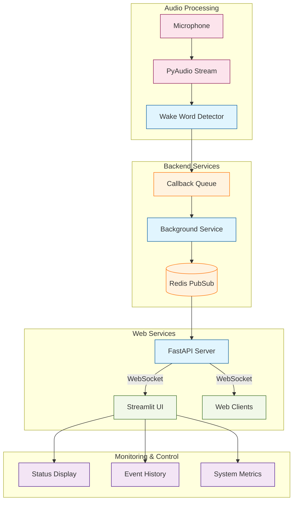

To use the system:

1. Install dependencies:
```bash
pip install -r requirements.txt
```

2. Start Redis server:
```bash
redis-server
```

3. Run the entire system:
```bash
python run.py
```

Or start components individually:
```bash
# Terminal 1: Background Service
python background_service.py

# Terminal 2: FastAPI Server
python fastapi_server.py

# Terminal 3: Streamlit App
streamlit run streamlit_app.py
```

The system provides:
1. Wake word detection using OpenWakeWord
2. Real-time updates via WebSocket
3. Web interface with Streamlit
4. System monitoring and metrics
5. Event history
6. Configuration management
