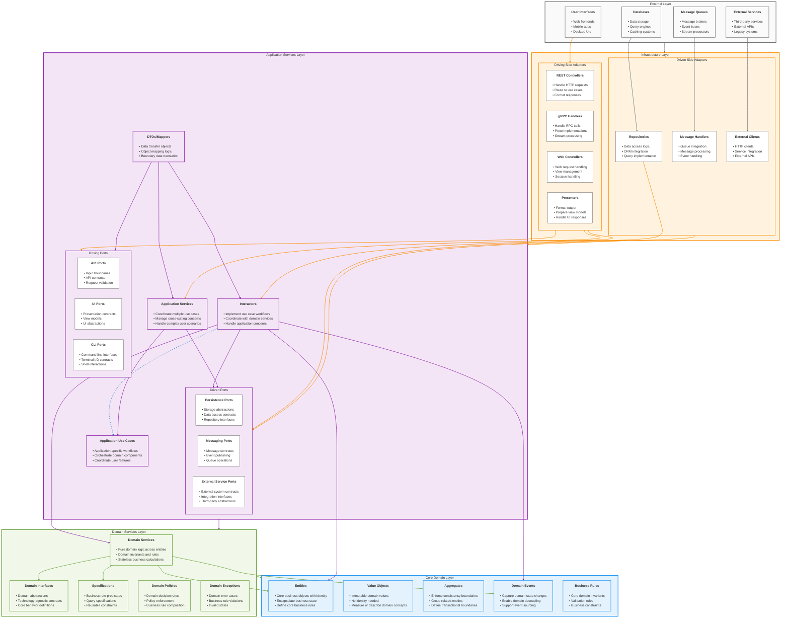

```mermaid
graph TD
    %% Core Domain Layer
    subgraph CoreDomain[Core Domain Layer]
        E["`
            <b>Entities</b>
            <div style='text-align:left; white-space:nowrap;'>
            • Core business objects with identity
            • Encapsulate business state
            • Define core business rules
            </div>
        `"]
        VO["`
            <b>Value Objects</b>
            <div style='text-align:left; white-space:nowrap;'>
            • Immutable domain values
            • No identity needed
            • Measure or describe domain concepts
            </div>
        `"]
        AGG["`
            <b>Aggregates</b>
            <div style='text-align:left; white-space:nowrap;'>
            • Enforce consistency boundaries
            • Group related entities
            • Define transactional boundaries
            </div>
        `"]
        EP["`
            <b>Domain Events</b>
            <div style='text-align:left; white-space:nowrap;'>
            • Capture domain state changes
            • Enable domain decoupling
            • Support event sourcing
            </div>
        `"]
        BR["`
            <b>Business Rules</b>
            <div style='text-align:left; white-space:nowrap;'>
            • Core domain invariants
            • Validation rules
            • Business constraints
            </div>
        `"]
    end

    %% Domain Services Layer
    subgraph DomainServices[Domain Services Layer]
        DS["`
            <b>Domain Services</b>
            <div style='text-align:left; white-space:nowrap;'>
            • Pure domain logic across entities
            • Domain invariants and rules
            • Stateless business calculations
            </div>
        `"]
        DI["`
            <b>Domain Interfaces</b>
            <div style='text-align:left; white-space:nowrap;'>
            • Domain abstractions
            • Technology-agnostic contracts
            • Core behavior definitions
            </div>
        `"]
        SPEC["`
            <b>Specifications</b>
            <div style='text-align:left; white-space:nowrap;'>
            • Business rule predicates
            • Query specifications
            • Reusable constraints
            </div>
        `"]
        DP["`
            <b>Domain Policies</b>
            <div style='text-align:left; white-space:nowrap;'>
            • Domain decision rules
            • Policy enforcement
            • Business rule composition
            </div>
        `"]
        DEx["`
            <b>Domain Exceptions</b>
            <div style='text-align:left; white-space:nowrap;'>
            • Domain error cases
            • Business rule violations
            • Invalid states
            </div>
        `"]
    end

    %% Application Services Layer
    subgraph Application[Application Services Layer]
        UC["`
            <b>Application Use Cases</b>
            <div style='text-align:left; white-space:nowrap;'>
            • Application-specific workflows
            • Orchestrate domain components
            • Coordinate user features
            </div>
        `"]
        INT["`
            <b>Interactors</b>
            <div style='text-align:left; white-space:nowrap;'>
            • Implement use case workflows
            • Coordinate with domain services
            • Handle application concerns
            </div>
        `"]
        AS["`
            <b>Application Services</b>
            <div style='text-align:left; white-space:nowrap;'>
            • Coordinate multiple use cases
            • Manage cross-cutting concerns
            • Handle complex user scenarios
            </div>
        `"]
        DTO["`
            <b>DTOs/Mappers</b>
            <div style='text-align:left; white-space:nowrap;'>
            • Data transfer objects
            • Object mapping logic
            • Boundary data translation
            </div>
        `"]

        %% Ports Layer
        subgraph DrivingPorts[Driving Ports]
            APIP["`
                <b>API Ports</b>
                <div style='text-align:left; white-space:nowrap;'>
                • Input boundaries
                • API contracts
                • Request validation
                </div>
            `"]
            GUIP["`
                <b>UI Ports</b>
                <div style='text-align:left; white-space:nowrap;'>
                • Presentation contracts
                • View models
                • UI abstractions
                </div>
            `"]
            CLIP["`
                <b>CLI Ports</b>
                <div style='text-align:left; white-space:nowrap;'>
                • Command line interfaces
                • Terminal I/O contracts
                • Shell interactions
                </div>
            `"]
        end

        subgraph DrivenPorts[Driven Ports]
            DBIP["`
                <b>Persistence Ports</b>
                <div style='text-align:left; white-space:nowrap;'>
                • Storage abstractions
                • Data access contracts
                • Repository interfaces
                </div>
            `"]
            MSGP["`
                <b>Messaging Ports</b>
                <div style='text-align:left; white-space:nowrap;'>
                • Message contracts
                • Event publishing
                • Queue operations
                </div>
            `"]
            EXTP["`
                <b>External Service Ports</b>
                <div style='text-align:left; white-space:nowrap;'>
                • External system contracts
                • Integration interfaces
                • Third-party abstractions
                </div>
            `"]
        end
    end

    %% Infrastructure Layer
    subgraph Infrastructure[Infrastructure Layer]
        %% Driving Side Adapters
        subgraph DrivingAdapters[Driving Side Adapters]
            REST["`
                <b>REST Controllers</b>
                <div style='text-align:left; white-space:nowrap;'>
                • Handle HTTP requests
                • Route to use cases
                • Format responses
                </div>
            `"]
            GRPC["`
                <b>gRPC Handlers</b>
                <div style='text-align:left; white-space:nowrap;'>
                • Handle RPC calls
                • Proto implementations
                • Stream processing
                </div>
            `"]
            WEB["`
                <b>Web Controllers</b>
                <div style='text-align:left; white-space:nowrap;'>
                • Web request handling
                • View management
                • Session handling
                </div>
            `"]
            PRES["`
                <b>Presenters</b>
                <div style='text-align:left; white-space:nowrap;'>
                • Format output
                • Prepare view models
                • Handle UI responses
                </div>
            `"]
        end

        %% Driven Side Adapters
        subgraph DrivenAdapters[Driven Side Adapters]
            REPO["`
                <b>Repositories</b>
                <div style='text-align:left; white-space:nowrap;'>
                • Data access logic
                • ORM integration
                • Query implementation
                </div>
            `"]
            QUEUE["`
                <b>Message Handlers</b>
                <div style='text-align:left; white-space:nowrap;'>
                • Queue integration
                • Message processing
                • Event handling
                </div>
            `"]
            CLIENT["`
                <b>External Clients</b>
                <div style='text-align:left; white-space:nowrap;'>
                • HTTP clients
                • Service integration
                • External APIs
                </div>
            `"]
        end
    end

    %% External Layer
    subgraph External[External Layer]
        UI["`
            <b>User Interfaces</b>
            <div style='text-align:left; white-space:nowrap;'>
            • Web frontends
            • Mobile apps
            • Desktop UIs
            </div>
        `"]
        DB["`
            <b>Databases</b>
            <div style='text-align:left; white-space:nowrap;'>
            • Data storage
            • Query engines
            • Caching systems
            </div>
        `"]
        MQ["`
            <b>Message Queues</b>
            <div style='text-align:left; white-space:nowrap;'>
            • Message brokers
            • Event buses
            • Stream processors
            </div>
        `"]
        EXT["`
            <b>External Services</b>
            <div style='text-align:left; white-space:nowrap;'>
            • Third-party services
            • External APIs
            • Legacy systems
            </div>
        `"]
    end

    %% Core Dependencies
    External --> Infrastructure
    Infrastructure --> Application
    Application --> DomainServices
    DomainServices --> CoreDomain

    %% Driving Side Flow
    UI --> DrivingAdapters
    DrivingAdapters --> INT
    DrivingAdapters --> AS
    DrivingAdapters --> DrivingPorts
    INT -.-> UC
    AS --> UC

    %% Domain Layer Access
    INT --> E
    INT --> EP
    INT --> DS
    DS --> E
    DS --> EP
    DS --> DI
    DS --> SPEC

    %% Port Access
    INT --> DrivenPorts
    AS --> DrivenPorts
    REPO --> DrivenPorts
    DrivenAdapters --> DrivenPorts

    %% DTO Flows
    DTO --> INT
    DTO --> AS
    DTO --> DrivingPorts

    %% Infrastructure Dependencies
    DB --> REPO
    MQ --> QUEUE
    EXT --> CLIENT

    %% Styling with lighter colors
    classDef default fill:#ffffff,stroke:#333,stroke-width:1px
    classDef core fill:#e3f2fd,stroke:#2196f3,stroke-width:2px
    classDef domain fill:#f1f8e9,stroke:#689f38,stroke-width:2px
    classDef application fill:#f3e5f5,stroke:#8e24aa,stroke-width:2px
    classDef infrastructure fill:#fff3e0,stroke:#fb8c00,stroke-width:2px
    classDef external fill:#fafafa,stroke:#757575,stroke-width:2px

    %% Apply styles
    class CoreDomain,E,VO,AGG,EP,BR core
    class DomainServices,DI,DS,SPEC,DP,DEx domain
    class Application,INT,UC,AS,DTO,DrivingPorts,DrivenPorts application
    class Infrastructure,DrivingAdapters,DrivenAdapters infrastructure
    class External,UI,DB,MQ,EXT external

    %% Layer boundaries
    style CoreDomain fill:#e3f2fd,stroke:#2196f3,stroke-width:3px
    style DomainServices fill:#f1f8e9,stroke:#689f38,stroke-width:3px
    style Application fill:#f3e5f5,stroke:#8e24aa,stroke-width:3px
    style Infrastructure fill:#fff3e0,stroke:#fb8c00,stroke-width:3px
    style External fill:#fafafa,stroke:#757575,stroke-width:3px

    %% Arrow Styles by Source Layer Color
    %% External -> Infrastructure
    linkStyle 0 stroke:#757575,stroke-width:2px
    
    %% Infrastructure -> Application
    linkStyle 1,4,5,6,7,19,20 stroke:#fb8c00,stroke-width:2px
    
    %% Application -> Domain
    linkStyle 2,9,10,11,12,17,18,21,22,23 stroke:#8e24aa,stroke-width:2px
    
    %% Domain -> Core
    linkStyle 3,13,14,15,16 stroke:#689f38,stroke-width:2px
    
    %% Implementation Relationship
    linkStyle 8 stroke:#1976d2,stroke-width:2px,stroke-dasharray:5
    
    %% Infrastructure Dependencies
    linkStyle 24,25,26 stroke:#757575,stroke-width:2px
```