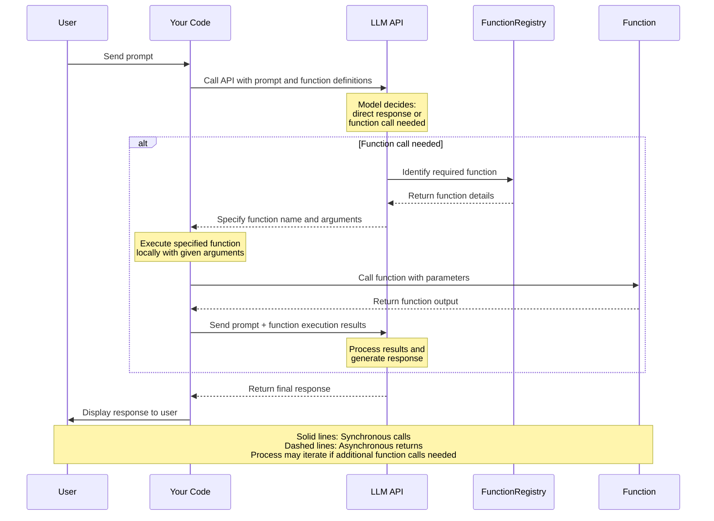
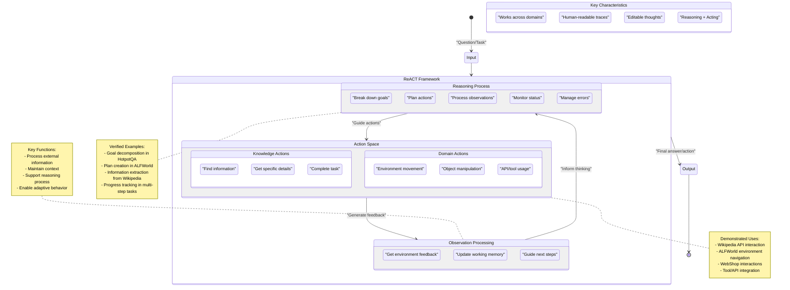

# Funciton Calling

```mermaid
sequenceDiagram
    participant U as User
    participant App as Your Code
    participant L as LLM API
    participant R as FunctionRegistry
    participant F as Function

    %% Step 1: Initial prompt and function definitions
    U->>App: Send prompt
    App->>L: Call API with prompt and function definitions
    
    %% Step 2: LLM Processing
    Note over L: Model decides:<br/>direct response or<br/>function call needed
    
    alt Function call needed
        L->>R: Identify required function
        R-->>L: Return function details
        
        %% Step 3: Return function details to application
        L-->>App: Specify function name and arguments
        
        %% Step 4: Local function execution
        Note over App: Execute specified function<br/>locally with given arguments
        App->>F: Call function with parameters
        F-->>App: Return function output
        
        %% Step 5: Send results back to LLM
        App->>L: Send prompt + function execution results
        
        Note over L: Process results and<br/>generate response
    end
    
    L-->>App: Return final response
    App->>U: Display response to user

    Note over U,F: Solid lines: Synchronous calls<br/>Dashed lines: Asynchronous returns<br/>Process may iterate if additional function calls needed
```

```mermaid
stateDiagram-v2
    [*] --> Input: "Question/Task"
    
    state "ReACT Framework" as react {
        state "Reasoning Process" as reasoning {
            DecomposeTask: "Break down goals"
            CreatePlan: "Plan actions"
            ExtractInfo: "Process observations"
            TrackProgress: "Monitor status"
            HandleExceptions: "Manage errors"
        }
        
        state "Action Space" as actions {
            state "Knowledge Actions" as knowledge {
                Search: "Find information"
                Lookup: "Get specific details"
                Finish: "Complete task"
            }
            
            state "Domain Actions" as domain {
                Navigation: "Environment movement"
                Interaction: "Object manipulation"
                ToolUse: "API/tool usage"
            }
        }
        
        state "Observation Processing" as obs {
            ReceiveInfo: "Get environment feedback"
            UpdateContext: "Update working memory"
            InformReasoning: "Guide next steps"
        }
    }

    state "Key Characteristics" as features {
        Flexibility: "Works across domains"
        Interpretability: "Human-readable traces"
        Controllability: "Editable thoughts"
        Synergy: "Reasoning + Acting"
    }

    Input --> react
    reasoning --> actions: "Guide actions"
    actions --> obs: "Generate feedback"
    obs --> reasoning: "Inform thinking"
    react --> Output: "Final answer/action"
    Output --> [*]

    note right of reasoning
        Verified Examples:
        - Goal decomposition in HotpotQA
        - Plan creation in ALFWorld
        - Information extraction from Wikipedia
        - Progress tracking in multi-step tasks
    end note

    note right of actions
        Demonstrated Uses:
        - Wikipedia API interaction
        - ALFWorld environment navigation
        - WebShop interactions
        - Tool/API integration
    end note

    note left of obs
        Key Functions:
        - Process external information
        - Maintain context
        - Support reasoning process
        - Enable adaptive behavior
    end note
```