# Complete Design Patterns Guide

## Table of Contents
1. Understanding Design Patterns
   - Categories Overview
   - Pattern Relationships
   - When to Use Each Pattern

2. Pattern Implementation Guide
   - Creational Patterns
   - Structural Patterns
   - Behavioral Patterns

3. Pattern Selection Process
   - Decision Trees
   - Selection Criteria
   - Use Case Analysis

4. Pattern Combinations
   - Common Combinations
   - Integration Strategies
   - Real-world Examples

5. Best Practices and Common Pitfalls
   - Implementation Guidelines
   - Anti-patterns
   - Testing Strategies

## Understanding Design Patterns

### Complete Pattern Overview
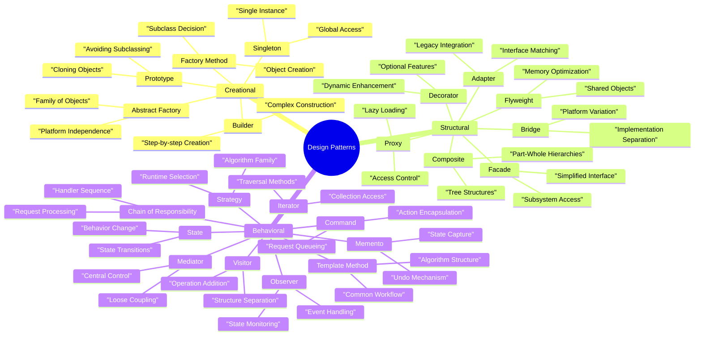
```mermaid
mindmap
    root((Design Patterns))
        Creational
            Singleton
                "Single Instance"
                "Global Access"
            Factory Method
                "Object Creation"
                "Subclass Decision"
            Abstract Factory
                "Family of Objects"
                "Platform Independence"
            Builder
                "Complex Construction"
                "Step-by-step Creation"
            Prototype
                "Cloning Objects"
                "Avoiding Subclassing"
        Structural
            Adapter
                "Interface Matching"
                "Legacy Integration"
            Bridge
                "Implementation Separation"
                "Platform Variation"
            Composite
                "Tree Structures"
                "Part-Whole Hierarchies"
            Decorator
                "Dynamic Enhancement"
                "Optional Features"
            Facade
                "Simplified Interface"
                "Subsystem Access"
            Flyweight
                "Shared Objects"
                "Memory Optimization"
            Proxy
                "Access Control"
                "Lazy Loading"
        Behavioral
            Chain of Responsibility
                "Request Processing"
                "Handler Sequence"
            Command
                "Action Encapsulation"
                "Request Queueing"
            Iterator
                "Collection Access"
                "Traversal Methods"
            Mediator
                "Loose Coupling"
                "Central Control"
            Memento
                "State Capture"
                "Undo Mechanism"
            Observer
                "Event Handling"
                "State Monitoring"
            State
                "Behavior Change"
                "State Transitions"
            Strategy
                "Algorithm Family"
                "Runtime Selection"
            Template Method
                "Algorithm Structure"
                "Common Workflow"
            Visitor
                "Operation Addition"
                "Structure Separation"
```

## Pattern Implementation Guide

### 1. Creational Patterns

#### 1.1 Overview
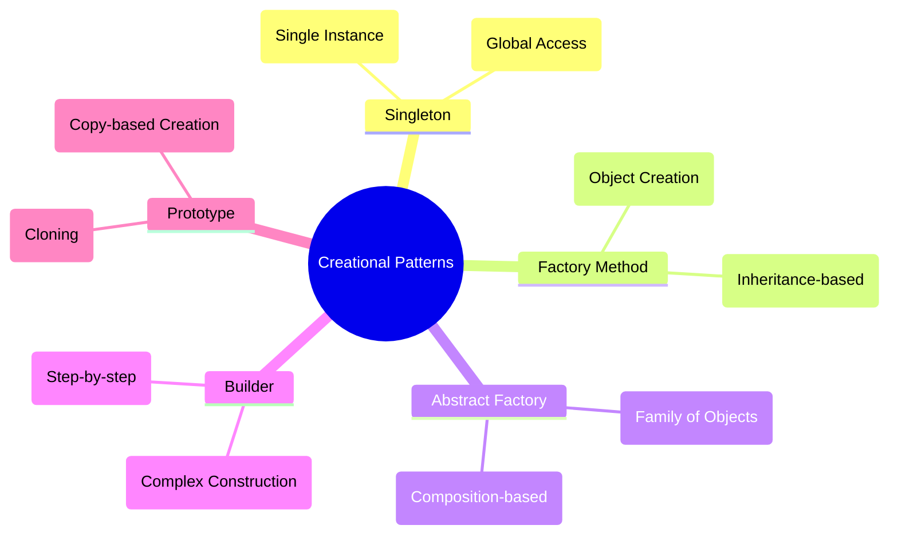
```mermaid
mindmap
    root((Creational Patterns))
        Singleton
            ("Single Instance")
            ("Global Access")
        Factory Method
            ("Object Creation")
            ("Inheritance-based")
        Abstract Factory
            ("Family of Objects")
            ("Composition-based")
        Builder
            ("Complex Construction")
            ("Step-by-step")
        Prototype
            ("Cloning")
            ("Copy-based Creation")
```

#### 1.2 Singleton Pattern

##### Purpose
- Ensures a class has only one instance
- Provides global access point to that instance
- Controls shared resources

##### Use Cases
1. **Database Connection Pools**
   - Managing database connections
   - Connection resource sharing
   - Transaction management

2. **Configuration Settings**
   - Application configurations
   - System preferences
   - Runtime settings

3. **Cache Management**
   - Memory cache
   - Resource cache
   - Results cache

##### Implementation
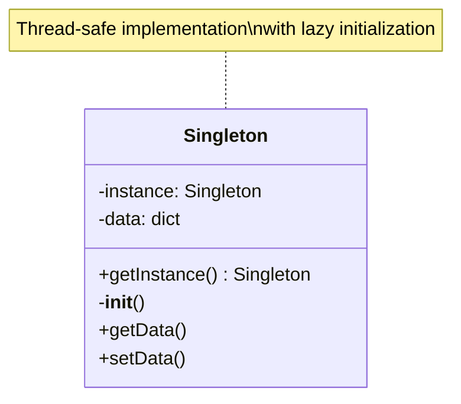
```mermaid
classDiagram
    class Singleton {
        -instance: Singleton
        -data: dict
        +getInstance() Singleton
        -__init__()
        +getData()
        +setData()
    }
    note for Singleton "Thread-safe implementation\nwith lazy initialization"
```

```python
from threading import Lock
from typing import Optional, Dict, Any

class Singleton:
    _instance: Optional['Singleton'] = None
    _lock: Lock = Lock()
    _initialized: bool = False
    
    def __new__(cls) -> 'Singleton':
        with cls._lock:
            if cls._instance is None:
                cls._instance = super().__new__(cls)
            return cls._instance
    
    def __init__(self) -> None:
        with self._lock:
            if not self._initialized:
                self._initialized = True
                self._data: Dict[str, Any] = {}
    
    def set_data(self, key: str, value: Any) -> None:
        with self._lock:
            self._data[key] = value
    
    def get_data(self, key: str) -> Optional[Any]:
        return self._data.get(key)

# Usage Example
def database_example():
    db = Singleton()
    db.set_data("connection", "mysql://localhost:3306")
    db.set_data("max_connections", 100)
    
    # Another part of the application
    db2 = Singleton()
    assert db is db2  # Same instance
    assert db2.get_data("connection") == "mysql://localhost:3306"
```

##### Pros & Cons
✅ **Advantages**
- Guaranteed single instance
- Lazy initialization
- Thread-safe access
- Global state management

❌ **Disadvantages**
- Global state can be dangerous
- Makes unit testing difficult
- Violates Single Responsibility Principle
- Can mask bad design

##### Testing
```python
import unittest
from threading import Thread

class SingletonTests(unittest.TestCase):
    def test_singleton_instance(self):
        s1 = Singleton()
        s2 = Singleton()
        self.assertIs(s1, s2)
    
    def test_singleton_data(self):
        s1 = Singleton()
        s1.set_data("test", "value")
        
        s2 = Singleton()
        self.assertEqual(s2.get_data("test"), "value")
    
    def test_thread_safety(self):
        instances = []
        def create_instance():
            instances.append(Singleton())
        
        threads = [Thread(target=create_instance) for _ in range(10)]
        [t.start() for t in threads]
        [t.join() for t in threads]
        
        for inst in instances[1:]:
            self.assertIs(inst, instances[0])
```

##### Common Pitfalls
1. **Not Thread-Safe**
```python
# Bad
class UnsafeSingleton:
    _instance = None
    
    def __new__(cls):
        if cls._instance is None:  # Race condition!
            cls._instance = super().__new__(cls)
        return cls._instance

# Good
class SafeSingleton:
    _instance = None
    _lock = Lock()
    
    def __new__(cls):
        with cls._lock:
            if cls._instance is None:
                cls._instance = super().__new__(cls)
            return cls._instance
```

2. **Serialization Issues**
```python
# Bad
def __reduce__(self):
    return (self.__class__, ())  # Creates new instance

# Good
def __reduce__(self):
    return (self.__class__.get_instance, ())  # Returns existing instance
```

##### Related Patterns
- Works with Abstract Factory for creating families of objects
- Can be used with Builder to ensure single builder instance
- Often used with Facade to provide single access point

I'll continue with the Factory Method pattern while maintaining the same detailed structure.

#### 1.3 Factory Method Pattern

##### Purpose
- Defines an interface for creating objects
- Lets subclasses decide which class to instantiate
- Promotes loose coupling through inheritance

##### Use Cases
1. **Document Creation**
   - PDF, Word, Excel document generators
   - Custom file format handlers
   - Report generators

2. **UI Element Creation**
   - Cross-platform UI components
   - Dynamic widget creation
   - Theme-based elements

3. **Database Connections**
   - Multiple database type support
   - Connection strategy selection
   - Driver management

##### Implementation
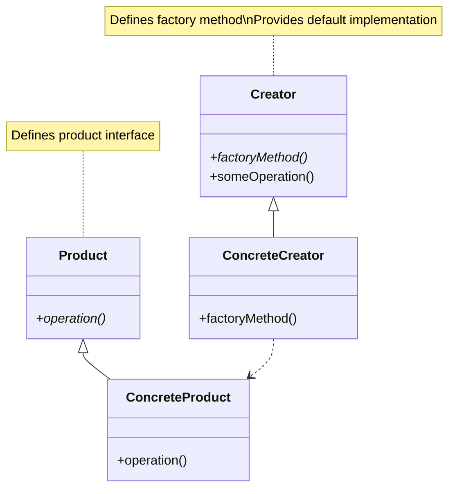
```mermaid
classDiagram
    class Creator {
        +factoryMethod()*
        +someOperation()
    }
    class Product {
        +operation()*
    }
    class ConcreteCreator {
        +factoryMethod()
    }
    class ConcreteProduct {
        +operation()
    }
    Creator <|-- ConcreteCreator
    Product <|-- ConcreteProduct
    ConcreteCreator ..> ConcreteProduct
    note for Creator "Defines factory method\nProvides default implementation"
    note for Product "Defines product interface"
```

```python
from abc import ABC, abstractmethod
from typing import Dict, Type

# Product interface
class Document(ABC):
    @abstractmethod
    def create(self) -> str:
        pass

# Concrete products
class PDFDocument(Document):
    def create(self) -> str:
        return "Creating PDF document"

class WordDocument(Document):
    def create(self) -> str:
        return "Creating Word document"

# Creator interface
class DocumentCreator(ABC):
    @abstractmethod
    def factory_method(self) -> Document:
        pass
    
    def operation(self) -> str:
        document = self.factory_method()
        return f"Creator: {document.create()}"

# Concrete creators
class PDFCreator(DocumentCreator):
    def factory_method(self) -> Document:
        return PDFDocument()

class WordCreator(DocumentCreator):
    def factory_method(self) -> Document:
        return WordDocument()

# Enhanced usage with registry
class DocumentFactory:
    _creators: Dict[str, Type[DocumentCreator]] = {
        'pdf': PDFCreator,
        'word': WordCreator
    }
    
    @classmethod
    def get_creator(cls, doc_type: str) -> DocumentCreator:
        creator = cls._creators.get(doc_type)
        if not creator:
            raise ValueError(f"Invalid document type: {doc_type}")
        return creator()
    
    @classmethod
    def register_creator(cls, doc_type: str, creator: Type[DocumentCreator]) -> None:
        cls._creators[doc_type] = creator

# Usage Example
def document_creation_example():
    # Using specific creators
    pdf_creator = PDFCreator()
    word_creator = WordCreator()
    
    print(pdf_creator.operation())   # "Creator: Creating PDF document"
    print(word_creator.operation())  # "Creator: Creating Word document"
    
    # Using factory with registry
    pdf_doc = DocumentFactory.get_creator('pdf')
    print(pdf_doc.operation())
    
    # Adding new document type
    class ExcelDocument(Document):
        def create(self) -> str:
            return "Creating Excel document"
    
    class ExcelCreator(DocumentCreator):
        def factory_method(self) -> Document:
            return ExcelDocument()
    
    DocumentFactory.register_creator('excel', ExcelCreator)
    excel_doc = DocumentFactory.get_creator('excel')
    print(excel_doc.operation())
```

##### Pros & Cons
✅ **Advantages**
- Loose coupling between creator and products
- Single Responsibility Principle
- Open/Closed Principle
- Flexible product creation
- Easy extension

❌ **Disadvantages**
- Can lead to many subclasses
- Code complexity increases
- Must create Creator class hierarchy
- Parallel inheritance hierarchies

##### Testing
```python
import unittest

class FactoryMethodTests(unittest.TestCase):
    def setUp(self):
        self.factory = DocumentFactory()
    
    def test_pdf_creation(self):
        creator = self.factory.get_creator('pdf')
        result = creator.operation()
        self.assertEqual(result, "Creator: Creating PDF document")
    
    def test_word_creation(self):
        creator = self.factory.get_creator('word')
        result = creator.operation()
        self.assertEqual(result, "Creator: Creating Word document")
    
    def test_invalid_type(self):
        with self.assertRaises(ValueError):
            self.factory.get_creator('invalid')
    
    def test_creator_registration(self):
        # Test adding new creator type
        class HTMLDocument(Document):
            def create(self) -> str:
                return "Creating HTML document"
        
        class HTMLCreator(DocumentCreator):
            def factory_method(self) -> Document:
                return HTMLDocument()
        
        DocumentFactory.register_creator('html', HTMLCreator)
        creator = self.factory.get_creator('html')
        result = creator.operation()
        self.assertEqual(result, "Creator: Creating HTML document")
```

##### Common Pitfalls
1. **Overcomplicating Simple Creation**
```python
# Bad - Overengineering
class SimpleDocument:
    def create(self):
        return "Simple document"

class SimpleDocumentCreator(DocumentCreator):  # Unnecessary complexity
    def factory_method(self):
        return SimpleDocument()

# Good - Direct creation when appropriate
class SimpleDocument:
    @staticmethod
    def create():
        return "Simple document"
```

2. **Ignoring Factory Registration**
```python
# Bad - Hard-coded factory decisions
def get_document(type):
    if type == 'pdf':
        return PDFCreator()
    elif type == 'word':
        return WordCreator()
    # Adding new types requires modifying code

# Good - Using registry pattern
class DocumentFactory:
    _creators = {}
    
    @classmethod
    def register(cls, type, creator):
        cls._creators[type] = creator
    
    @classmethod
    def get_creator(cls, type):
        return cls._creators[type]()
```

##### Related Patterns
- Abstract Factory often uses multiple Factory Methods
- Template Method can be used to define a factory method
- Prototype can be used with Factory Method to create products
- Singleton can ensure single factory instance

#### 1.4 Abstract Factory Pattern

##### Purpose
- Creates families of related objects
- Provides interface for creating object families
- Ensures cross-product compatibility
- Supports product family variation

##### Use Cases
1. **UI Component Creation**
   - Cross-platform GUI elements (Windows/Mac/Linux)
   - Theme-based components (Light/Dark)
   - Style-specific widgets

2. **Database Access Layer**
   - Multiple database support (MySQL/PostgreSQL/MongoDB)
   - Query builders
   - Connection managers

3. **Cross-Platform Systems**
   - Operating system specific components
   - Hardware abstraction layers
   - Device drivers

##### Implementation
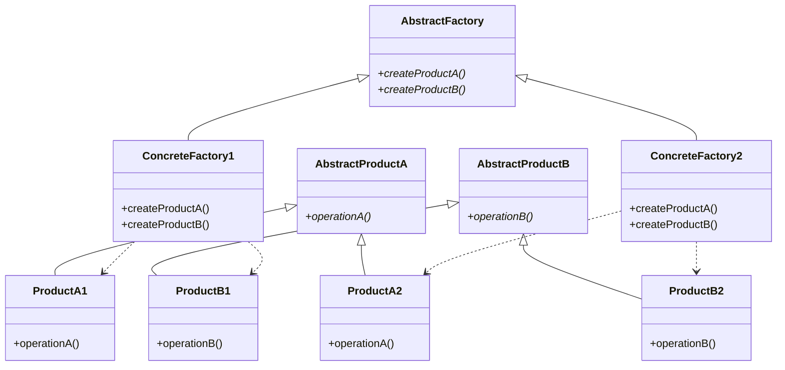
```mermaid
classDiagram
    class AbstractFactory {
        +createProductA()*
        +createProductB()*
    }
    class ConcreteFactory1 {
        +createProductA()
        +createProductB()
    }
    class ConcreteFactory2 {
        +createProductA()
        +createProductB()
    }
    class AbstractProductA {
        +operationA()*
    }
    class AbstractProductB {
        +operationB()*
    }
    class ProductA1 {
        +operationA()
    }
    class ProductA2 {
        +operationA()
    }
    class ProductB1 {
        +operationB()
    }
    class ProductB2 {
        +operationB()
    }
    AbstractFactory <|-- ConcreteFactory1
    AbstractFactory <|-- ConcreteFactory2
    AbstractProductA <|-- ProductA1
    AbstractProductA <|-- ProductA2
    AbstractProductB <|-- ProductB1
    AbstractProductB <|-- ProductB2
    ConcreteFactory1 ..> ProductA1
    ConcreteFactory1 ..> ProductB1
    ConcreteFactory2 ..> ProductA2
    ConcreteFactory2 ..> ProductB2
```

```python
from abc import ABC, abstractmethod
from enum import Enum, auto

# Abstract Products
class Button(ABC):
    @abstractmethod
    def paint(self) -> str:
        pass

class Checkbox(ABC):
    @abstractmethod
    def paint(self) -> str:
        pass

# Concrete Products - Light Theme
class LightButton(Button):
    def paint(self) -> str:
        return "Rendering light button"

class LightCheckbox(Checkbox):
    def paint(self) -> str:
        return "Rendering light checkbox"

# Concrete Products - Dark Theme
class DarkButton(Button):
    def paint(self) -> str:
        return "Rendering dark button"

class DarkCheckbox(Checkbox):
    def paint(self) -> str:
        return "Rendering dark checkbox"

# Abstract Factory
class UIFactory(ABC):
    @abstractmethod
    def create_button(self) -> Button:
        pass

    @abstractmethod
    def create_checkbox(self) -> Checkbox:
        pass

# Concrete Factories
class LightThemeFactory(UIFactory):
    def create_button(self) -> Button:
        return LightButton()

    def create_checkbox(self) -> Checkbox:
        return LightCheckbox()

class DarkThemeFactory(UIFactory):
    def create_button(self) -> Button:
        return DarkButton()

    def create_checkbox(self) -> Checkbox:
        return DarkCheckbox()

# Theme Registry
class Theme(Enum):
    LIGHT = auto()
    DARK = auto()

class UIFactoryRegistry:
    _factories = {
        Theme.LIGHT: LightThemeFactory,
        Theme.DARK: DarkThemeFactory
    }

    @classmethod
    def get_factory(cls, theme: Theme) -> UIFactory:
        factory_class = cls._factories.get(theme)
        if not factory_class:
            raise ValueError(f"Invalid theme: {theme}")
        return factory_class()

    @classmethod
    def register_factory(cls, theme: Theme, factory_class: type) -> None:
        cls._factories[theme] = factory_class

# Application
class Application:
    def __init__(self, factory: UIFactory):
        self.factory = factory
        self.button = None
        self.checkbox = None

    def create_ui(self) -> None:
        self.button = self.factory.create_button()
        self.checkbox = self.factory.create_checkbox()

    def paint(self) -> list[str]:
        return [
            self.button.paint(),
            self.checkbox.paint()
        ]

# Usage Example
def ui_example():
    # Using Light Theme
    light_factory = UIFactoryRegistry.get_factory(Theme.LIGHT)
    app = Application(light_factory)
    app.create_ui()
    print("Light Theme:", app.paint())

    # Switch to Dark Theme
    dark_factory = UIFactoryRegistry.get_factory(Theme.DARK)
    app = Application(dark_factory)
    app.create_ui()
    print("Dark Theme:", app.paint())
```

##### Pros & Cons
✅ **Advantages**
- Ensures product compatibility
- Encapsulates product creation
- Promotes consistency
- Easy product family switching
- Single Responsibility Principle
- Open/Closed Principle

❌ **Disadvantages**
- Complex class hierarchy
- Many interfaces and classes
- Difficult to add new product types
- All factories must support all products

##### Testing
```python
import unittest

class AbstractFactoryTests(unittest.TestCase):
    def test_light_theme(self):
        factory = UIFactoryRegistry.get_factory(Theme.LIGHT)
        app = Application(factory)
        app.create_ui()
        results = app.paint()
        
        self.assertEqual(results[0], "Rendering light button")
        self.assertEqual(results[1], "Rendering light checkbox")

    def test_dark_theme(self):
        factory = UIFactoryRegistry.get_factory(Theme.DARK)
        app = Application(factory)
        app.create_ui()
        results = app.paint()
        
        self.assertEqual(results[0], "Rendering dark button")
        self.assertEqual(results[1], "Rendering dark checkbox")

    def test_invalid_theme(self):
        with self.assertRaises(ValueError):
            UIFactoryRegistry.get_factory("invalid_theme")

    def test_factory_registration(self):
        # Test adding new theme
        class CustomButton(Button):
            def paint(self) -> str:
                return "Rendering custom button"

        class CustomCheckbox(Checkbox):
            def paint(self) -> str:
                return "Rendering custom checkbox"

        class CustomThemeFactory(UIFactory):
            def create_button(self) -> Button:
                return CustomButton()

            def create_checkbox(self) -> Checkbox:
                return CustomCheckbox()

        # Register new theme
        custom_theme = Theme('CUSTOM')
        UIFactoryRegistry.register_factory(custom_theme, CustomThemeFactory)
        
        # Test new theme
        factory = UIFactoryRegistry.get_factory(custom_theme)
        app = Application(factory)
        app.create_ui()
        results = app.paint()
        
        self.assertEqual(results[0], "Rendering custom button")
        self.assertEqual(results[1], "Rendering custom checkbox")
```

##### Common Pitfalls
1. **Not Using Registry Pattern**
```python
# Bad - Direct factory instantiation
def get_ui_factory(theme: str) -> UIFactory:
    if theme == "light":
        return LightThemeFactory()
    elif theme == "dark":
        return DarkThemeFactory()
    raise ValueError("Invalid theme")

# Good - Using registry pattern
class UIFactoryRegistry:
    _factories = {}
    
    @classmethod
    def register(cls, theme: Theme, factory: type):
        cls._factories[theme] = factory
    
    @classmethod
    def get_factory(cls, theme: Theme) -> UIFactory:
        return cls._factories[theme]()
```

2. **Breaking Product Family Compatibility**
```python
# Bad - Mixing themes
class InvalidApplication:
    def __init__(self):
        self.button = LightButton()  # Direct instantiation
        self.checkbox = DarkCheckbox()  # Mixing themes!

# Good - Using factory to ensure compatibility
class ValidApplication:
    def __init__(self, factory: UIFactory):
        self.button = factory.create_button()
        self.checkbox = factory.create_checkbox()
```

##### Related Patterns
- Factory Method is often used to implement Abstract Factory
- Singleton can ensure single factory instance per product family
- Prototype can be used to create products in Abstract Factory
- Builder can be used to create complex products within the factory

#### 1.5 Builder Pattern

##### Purpose
- Constructs complex objects step by step
- Allows different representations of same construction process
- Separates construction from representation
- Provides fine control over construction process

##### Use Cases
1. **Complex Object Construction**
   - Building custom computers
   - Creating SQL queries
   - Configuring network requests

2. **Object Assembly**
   - Document generators (HTML, PDF)
   - Menu builders
   - Form constructors

3. **Configuration Objects**
   - Application settings
   - API request builders
   - Test data builders

##### Implementation
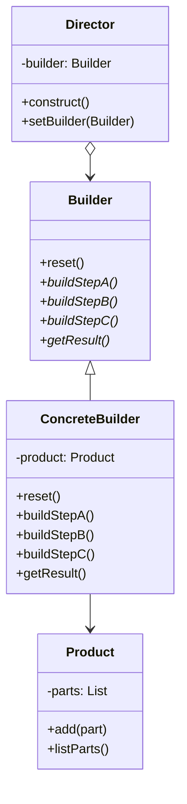
```mermaid
classDiagram
    class Director {
        -builder: Builder
        +construct()
        +setBuilder(Builder)
    }
    class Builder {
        +reset()
        +buildStepA()*
        +buildStepB()*
        +buildStepC()*
        +getResult()*
    }
    class ConcreteBuilder {
        -product: Product
        +reset()
        +buildStepA()
        +buildStepB()
        +buildStepC()
        +getResult()
    }
    class Product {
        -parts: List
        +add(part)
        +listParts()
    }
    Director o--> Builder
    Builder <|-- ConcreteBuilder
    ConcreteBuilder --> Product
```

```python
from abc import ABC, abstractmethod
from typing import Any, List, Optional

# Product
class Computer:
    def __init__(self) -> None:
        self.parts: List[str] = []
    
    def add(self, part: str) -> None:
        self.parts.append(part)
    
    def list_parts(self) -> str:
        return f"Computer parts: {', '.join(self.parts)}"

# Builder Interface
class ComputerBuilder(ABC):
    @abstractmethod
    def reset(self) -> None:
        pass
    
    @abstractmethod
    def add_motherboard(self, motherboard: str) -> None:
        pass
    
    @abstractmethod
    def add_processor(self, processor: str) -> None:
        pass
    
    @abstractmethod
    def add_memory(self, memory: str) -> None:
        pass
    
    @abstractmethod
    def add_storage(self, storage: str) -> None:
        pass
    
    @abstractmethod
    def get_result(self) -> Computer:
        pass

# Concrete Builder
class GamingComputerBuilder(ComputerBuilder):
    def __init__(self) -> None:
        self.reset()
    
    def reset(self) -> None:
        self._computer = Computer()
    
    def add_motherboard(self, motherboard: str) -> None:
        self._computer.add(f"Gaming Motherboard: {motherboard}")
    
    def add_processor(self, processor: str) -> None:
        self._computer.add(f"Gaming Processor: {processor}")
    
    def add_memory(self, memory: str) -> None:
        self._computer.add(f"Gaming Memory: {memory}")
    
    def add_storage(self, storage: str) -> None:
        self._computer.add(f"Gaming Storage: {storage}")
    
    def get_result(self) -> Computer:
        computer = self._computer
        self.reset()
        return computer

class OfficeComputerBuilder(ComputerBuilder):
    def __init__(self) -> None:
        self.reset()
    
    def reset(self) -> None:
        self._computer = Computer()
    
    def add_motherboard(self, motherboard: str) -> None:
        self._computer.add(f"Office Motherboard: {motherboard}")
    
    def add_processor(self, processor: str) -> None:
        self._computer.add(f"Office Processor: {processor}")
    
    def add_memory(self, memory: str) -> None:
        self._computer.add(f"Office Memory: {memory}")
    
    def add_storage(self, storage: str) -> None:
        self._computer.add(f"Office Storage: {storage}")
    
    def get_result(self) -> Computer:
        computer = self._computer
        self.reset()
        return computer

# Director
class ComputerAssembler:
    def __init__(self) -> None:
        self._builder: Optional[ComputerBuilder] = None
    
    @property
    def builder(self) -> ComputerBuilder:
        if self._builder is None:
            raise ValueError("Builder not set")
        return self._builder
    
    @builder.setter
    def builder(self, builder: ComputerBuilder) -> None:
        self._builder = builder
    
    def construct_basic_computer(self) -> None:
        self.builder.add_motherboard("Basic")
        self.builder.add_processor("i3")
        self.builder.add_memory("8GB")
        self.builder.add_storage("256GB SSD")
    
    def construct_premium_computer(self) -> None:
        self.builder.add_motherboard("Premium")
        self.builder.add_processor("i9")
        self.builder.add_memory("32GB")
        self.builder.add_storage("2TB NVMe SSD")

# Usage Example
def computer_building_example():
    # Create director and builders
    assembler = ComputerAssembler()
    gaming_builder = GamingComputerBuilder()
    office_builder = OfficeComputerBuilder()
    
    # Build gaming computer
    assembler.builder = gaming_builder
    assembler.construct_premium_computer()
    gaming_computer = gaming_builder.get_result()
    print(gaming_computer.list_parts())
    
    # Build office computer
    assembler.builder = office_builder
    assembler.construct_basic_computer()
    office_computer = office_builder.get_result()
    print(office_computer.list_parts())

# Fluent Builder Example
class FluentComputerBuilder:
    def __init__(self) -> None:
        self.reset()
    
    def reset(self) -> None:
        self._computer = Computer()
        return self
    
    def with_motherboard(self, motherboard: str) -> 'FluentComputerBuilder':
        self._computer.add(f"Motherboard: {motherboard}")
        return self
    
    def with_processor(self, processor: str) -> 'FluentComputerBuilder':
        self._computer.add(f"Processor: {processor}")
        return self
    
    def with_memory(self, memory: str) -> 'FluentComputerBuilder':
        self._computer.add(f"Memory: {memory}")
        return self
    
    def with_storage(self, storage: str) -> 'FluentComputerBuilder':
        self._computer.add(f"Storage: {storage}")
        return self
    
    def build(self) -> Computer:
        computer = self._computer
        self.reset()
        return computer
```

##### Pros & Cons
✅ **Advantages**
- Step-by-step construction
- Reuse of construction code
- Single Responsibility Principle
- Flexible object configuration
- Fine control over process
- Isolation of complex construction

❌ **Disadvantages**
- More complex code
- Additional classes needed
- Must create separate builder for each type
- Might be overkill for simple objects

##### Testing
```python
import unittest

class BuilderTests(unittest.TestCase):
    def setUp(self):
        self.assembler = ComputerAssembler()
        self.gaming_builder = GamingComputerBuilder()
        self.office_builder = OfficeComputerBuilder()
    
    def test_gaming_computer_construction(self):
        self.assembler.builder = self.gaming_builder
        self.assembler.construct_premium_computer()
        computer = self.gaming_builder.get_result()
        parts = computer.list_parts()
        
        self.assertIn("Gaming Motherboard: Premium", parts)
        self.assertIn("Gaming Processor: i9", parts)
        self.assertIn("Gaming Memory: 32GB", parts)
        self.assertIn("Gaming Storage: 2TB NVMe SSD", parts)
    
    def test_office_computer_construction(self):
        self.assembler.builder = self.office_builder
        self.assembler.construct_basic_computer()
        computer = self.office_builder.get_result()
        parts = computer.list_parts()
        
        self.assertIn("Office Motherboard: Basic", parts)
        self.assertIn("Office Processor: i3", parts)
        self.assertIn("Office Memory: 8GB", parts)
        self.assertIn("Office Storage: 256GB SSD", parts)
    
    def test_fluent_builder(self):
        computer = (FluentComputerBuilder()
                   .with_motherboard("Gaming")
                   .with_processor("i7")
                   .with_memory("16GB")
                   .with_storage("1TB SSD")
                   .build())
        
        parts = computer.list_parts()
        self.assertIn("Motherboard: Gaming", parts)
        self.assertIn("Processor: i7", parts)
        self.assertIn("Memory: 16GB", parts)
        self.assertIn("Storage: 1TB SSD", parts)
```

##### Common Pitfalls
1. **Not Using Director When Needed**
```python
# Bad - Repetitive construction code
def build_gaming_computer(builder):
    builder.add_motherboard("Gaming")
    builder.add_processor("i9")
    builder.add_memory("32GB")
    builder.add_storage("2TB")

def build_office_computer(builder):
    builder.add_motherboard("Office")
    builder.add_processor("i3")
    builder.add_memory("8GB")
    builder.add_storage("256GB")

# Good - Using Director
class ComputerAssembler:
    def construct_gaming_computer(self):
        self.builder.add_motherboard("Gaming")
        self.builder.add_processor("i9")
        self.builder.add_memory("32GB")
        self.builder.add_storage("2TB")
```

2. **Forgetting to Reset Builder**
```python
# Bad - No reset between builds
class BadBuilder:
    def get_result(self):
        return self._product  # Previous parts remain!

# Good - Reset on each build
class GoodBuilder:
    def get_result(self):
        product = self._product
        self.reset()  # Clear for next build
        return product
```

##### Related Patterns
- Abstract Factory can create complex objects using Builder
- Composite is often built using Builder pattern
- Factory Method can return different builders
- Singleton can ensure single builder instance when needed

#### 1.6 Prototype Pattern

##### Purpose
- Creates new objects by cloning an existing object (prototype)
- Avoids expensive object creation
- Provides alternative to multiple subclasses
- Reduces subclassing by hiding complexities of object creation

##### Use Cases
1. **Document Copying**
   - Template documents
   - Form duplication
   - Document versioning

2. **Object Caching**
   - Expensive database objects
   - Configuration templates
   - Complex object initialization

3. **Gaming Objects**
   - Character creation
   - Object spawning
   - Game state copies

##### Implementation
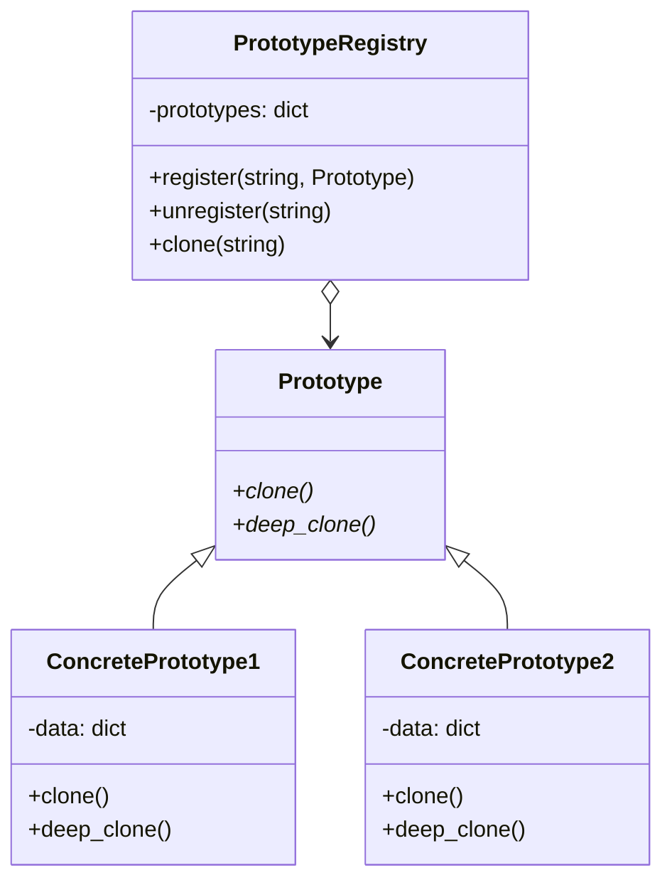
```mermaid
classDiagram
    class Prototype {
        +clone()*
        +deep_clone()*
    }
    class ConcretePrototype1 {
        -data: dict
        +clone()
        +deep_clone()
    }
    class ConcretePrototype2 {
        -data: dict
        +clone()
        +deep_clone()
    }
    class PrototypeRegistry {
        -prototypes: dict
        +register(string, Prototype)
        +unregister(string)
        +clone(string)
    }
    Prototype <|-- ConcretePrototype1
    Prototype <|-- ConcretePrototype2
    PrototypeRegistry o--> Prototype
```

```python
from __future__ import annotations
from abc import ABC, abstractmethod
import copy
from typing import Dict, Any

class Prototype(ABC):
    @abstractmethod
    def clone(self) -> Prototype:
        pass
    
    @abstractmethod
    def deep_clone(self) -> Prototype:
        pass

class Document(Prototype):
    def __init__(self, name: str, content: Dict[str, Any]) -> None:
        self.name = name
        self.content = content
    
    def clone(self) -> Document:
        """Shallow copy"""
        return copy.copy(self)
    
    def deep_clone(self) -> Document:
        """Deep copy"""
        return copy.deepcopy(self)
    
    def __str__(self) -> str:
        return f"Document(name={self.name}, content={self.content})"

class DocumentRegistry:
    def __init__(self) -> None:
        self._prototypes: Dict[str, Document] = {}
    
    def register(self, name: str, prototype: Document) -> None:
        self._prototypes[name] = prototype
    
    def unregister(self, name: str) -> None:
        del self._prototypes[name]
    
    def clone(self, name: str, deep: bool = False) -> Document:
        prototype = self._prototypes.get(name)
        if not prototype:
            raise ValueError(f"Prototype not found: {name}")
        return prototype.deep_clone() if deep else prototype.clone()

# Complex Object Example
class ComplexDocument(Prototype):
    def __init__(self, 
                 template: str, 
                 styles: Dict[str, str],
                 metadata: Dict[str, Any],
                 content: Dict[str, Any]) -> None:
        self.template = template
        self.styles = styles
        self.metadata = metadata
        self.content = content
        # Simulate expensive initialization
        self._initialize_resources()
    
    def _initialize_resources(self) -> None:
        """Simulate expensive initialization"""
        print(f"Initializing resources for {self.template}")
    
    def clone(self) -> ComplexDocument:
        """Shallow copy - might not be suitable for complex objects"""
        return copy.copy(self)
    
    def deep_clone(self) -> ComplexDocument:
        """Deep copy - safer for complex objects"""
        clone = copy.deepcopy(self)
        # Skip expensive initialization for clones
        clone._initialize_resources = lambda: None
        return clone

# Usage Example
def document_prototype_example():
    # Create prototype registry
    registry = DocumentRegistry()
    
    # Register template documents
    template_doc = Document(
        name="template",
        content={
            "header": "Company Header",
            "footer": "Company Footer",
            "style": {"font": "Arial", "size": 12}
        }
    )
    registry.register("template", template_doc)
    
    # Create complex document prototype
    complex_template = ComplexDocument(
        template="report",
        styles={"header": "bold", "body": "normal"},
        metadata={"author": "John Doe", "version": "1.0"},
        content={"title": "Report Template", "sections": []}
    )
    registry.register("complex_template", complex_template)
    
    # Clone and modify documents
    doc1 = registry.clone("template")
    doc1.name = "Document 1"
    doc1.content["title"] = "Custom Document 1"
    
    doc2 = registry.clone("template", deep=True)
    doc2.name = "Document 2"
    doc2.content["title"] = "Custom Document 2"
    
    # Clone complex document
    complex_doc = registry.clone("complex_template", deep=True)
    complex_doc.content["title"] = "Custom Report"
    
    return doc1, doc2, complex_doc

# Enhanced Prototype with Registry
class PrototypeManager:
    _instance = None
    
    def __new__(cls) -> PrototypeManager:
        if cls._instance is None:
            cls._instance = super().__new__(cls)
            cls._instance._prototypes = {}
        return cls._instance
    
    def register_prototype(self, key: str, prototype: Prototype) -> None:
        self._prototypes[key] = prototype
    
    def unregister_prototype(self, key: str) -> None:
        self._prototypes.pop(key, None)
    
    def clone(self, key: str, **customizations) -> Prototype:
        prototype = self._prototypes.get(key)
        if not prototype:
            raise ValueError(f"Prototype not found: {key}")
        
        clone = prototype.deep_clone()
        # Apply customizations
        for attr, value in customizations.items():
            if hasattr(clone, attr):
                setattr(clone, attr, value)
        return clone
```

##### Pros & Cons
✅ **Advantages**
- Reduces object creation cost
- Avoids subclass proliferation
- Configurable at runtime
- Reduces initialization code
- Dynamic object creation
- Provides fine control over cloning process

❌ **Disadvantages**
- Cloning complex objects can be tricky
- Circular references need special handling
- Deep vs shallow copy decisions
- Managing clone customization
- Potential memory issues with large objects

##### Testing
```python
import unittest

class PrototypeTests(unittest.TestCase):
    def setUp(self):
        self.registry = DocumentRegistry()
        self.template = Document("template", {
            "header": "Header",
            "content": ["Section 1", "Section 2"]
        })
        self.registry.register("template", self.template)
    
    def test_shallow_clone(self):
        clone = self.registry.clone("template")
        self.assertIsNot(clone, self.template)
        self.assertIs(clone.content, self.template.content)
    
    def test_deep_clone(self):
        clone = self.registry.clone("template", deep=True)
        self.assertIsNot(clone, self.template)
        self.assertIsNot(clone.content, self.template.content)
        
        # Modify clone's content
        clone.content["header"] = "Modified Header"
        self.assertNotEqual(clone.content["header"], 
                          self.template.content["header"])
    
    def test_complex_document_clone(self):
        complex_doc = ComplexDocument(
            template="report",
            styles={"header": "bold"},
            metadata={"author": "John"},
            content={"title": "Report"}
        )
        
        clone = complex_doc.deep_clone()
        clone.content["title"] = "Modified Report"
        
        self.assertNotEqual(clone.content["title"], 
                          complex_doc.content["title"])
        
    def test_prototype_manager(self):
        manager = PrototypeManager()
        manager.register_prototype("template", self.template)
        
        clone = manager.clone("template", 
                            name="Custom Doc",
                            content={"header": "Custom Header"})
        
        self.assertEqual(clone.name, "Custom Doc")
        self.assertEqual(clone.content["header"], "Custom Header")
```

##### Common Pitfalls
1. **Incorrect Copy Implementation**
```python
# Bad - Shallow copy when deep copy needed
def clone(self):
    return copy.copy(self)  # Might share mutable state!

# Good - Proper deep copy
def clone(self):
    return copy.deepcopy(self)
```

2. **Circular Reference Handling**
```python
# Bad - No circular reference handling
class Node:
    def __init__(self):
        self.next = None
    
    def clone(self):
        return copy.deepcopy(self)  # May fail with circular refs

# Good - Custom circular reference handling
def __deepcopy__(self, memo):
    clone = Node()
    memo[id(self)] = clone
    if self.next is not None:
        clone.next = copy.deepcopy(self.next, memo)
    return clone
```

##### Related Patterns
- Abstract Factory can use Prototype to create objects
- Composite objects can be cloned using Prototype
- Command can store command history using Prototype
- Memento can use Prototype for storing states

### 2. Structural Patterns

#### 2.1 Overview
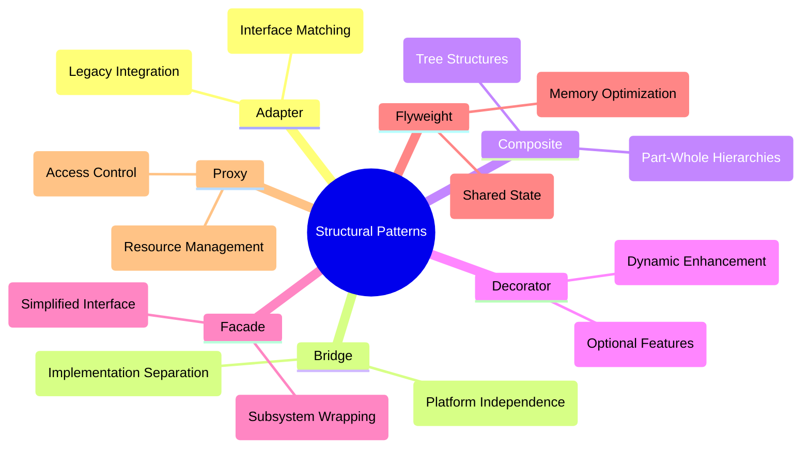
```mermaid
mindmap
    root((Structural Patterns))
        Adapter
            ("Interface Matching")
            ("Legacy Integration")
        Bridge
            ("Implementation Separation")
            ("Platform Independence")
        Composite
            ("Tree Structures")
            ("Part-Whole Hierarchies")
        Decorator
            ("Dynamic Enhancement")
            ("Optional Features")
        Facade
            ("Simplified Interface")
            ("Subsystem Wrapping")
        Flyweight
            ("Shared State")
            ("Memory Optimization")
        Proxy
            ("Access Control")
            ("Resource Management")
```

#### 2.2 Adapter Pattern

##### Purpose
- Converts interface of one class to match another expected interface
- Enables incompatible classes to work together
- Acts as a wrapper between incompatible interfaces
- Provides reusability of existing code

##### Use Cases
1. **Legacy System Integration**
   - Converting old API to new API
   - Third-party library integration
   - Database adapters

2. **Multi-platform Support**
   - Different file formats
   - Payment gateway integration
   - Communication protocols

3. **Framework Compatibility**
   - ORM adapters
   - Logging system adapters
   - Authentication adapters

##### Implementation
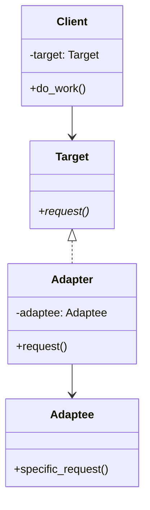
```mermaid
classDiagram
    class Target {
        +request()*
    }
    class Adaptee {
        +specific_request()
    }
    class Adapter {
        -adaptee: Adaptee
        +request()
    }
    class Client {
        -target: Target
        +do_work()
    }
    Target <|.. Adapter
    Adapter --> Adaptee
    Client --> Target
```

```python
from abc import ABC, abstractmethod
from typing import Dict, Any, List

# Target Interface
class DataAnalyzer(ABC):
    @abstractmethod
    def process_data(self, data: List[Dict[str, Any]]) -> List[Dict[str, Any]]:
        pass

# Legacy System (Adaptee)
class LegacyDataProcessor:
    def process_xml_data(self, xml_string: str) -> str:
        """Process data in legacy XML format"""
        print(f"Processing XML data: {xml_string}")
        # Simulate XML processing
        return f"Processed {xml_string}"

# Adapter
class LegacyDataAdapter(DataAnalyzer):
    def __init__(self, legacy_processor: LegacyDataProcessor):
        self.legacy_processor = legacy_processor
    
    def process_data(self, data: List[Dict[str, Any]]) -> List[Dict[str, Any]]:
        # Convert modern data format to legacy XML
        xml_string = self._convert_to_xml(data)
        # Process using legacy system
        processed_xml = self.legacy_processor.process_xml_data(xml_string)
        # Convert back to modern format
        return self._convert_from_xml(processed_xml)
    
    def _convert_to_xml(self, data: List[Dict[str, Any]]) -> str:
        # Simplified XML conversion
        return f"<data>{str(data)}</data>"
    
    def _convert_from_xml(self, xml_string: str) -> List[Dict[str, Any]]:
        # Simplified XML parsing
        return [{"processed": xml_string}]

# Modern System Using Target Interface
class ModernDataAnalyzer(DataAnalyzer):
    def process_data(self, data: List[Dict[str, Any]]) -> List[Dict[str, Any]]:
        return [{"result": f"Processed {item}"} for item in data]

# Client Code
class DataAnalysisApp:
    def __init__(self, analyzer: DataAnalyzer):
        self.analyzer = analyzer
    
    def analyze_data(self, data: List[Dict[str, Any]]) -> List[Dict[str, Any]]:
        return self.analyzer.process_data(data)

# Object Adapter Example (Using Composition)
class ObjectAdapter(DataAnalyzer):
    def __init__(self, adaptee: LegacyDataProcessor):
        self.adaptee = adaptee
    
    def process_data(self, data: List[Dict[str, Any]]) -> List[Dict[str, Any]]:
        # Adapt the interface
        xml = self._convert_to_xml(data)
        result = self.adaptee.process_xml_data(xml)
        return self._convert_from_xml(result)
    
    def _convert_to_xml(self, data: List[Dict[str, Any]]) -> str:
        return f"<data>{str(data)}</data>"
    
    def _convert_from_xml(self, xml_string: str) -> List[Dict[str, Any]]:
        return [{"processed": xml_string}]

# Class Adapter Example (Using Multiple Inheritance)
class ClassAdapter(DataAnalyzer, LegacyDataProcessor):
    def process_data(self, data: List[Dict[str, Any]]) -> List[Dict[str, Any]]:
        xml = self._convert_to_xml(data)
        result = self.process_xml_data(xml)  # Using inherited method
        return self._convert_from_xml(result)
    
    def _convert_to_xml(self, data: List[Dict[str, Any]]) -> str:
        return f"<data>{str(data)}</data>"
    
    def _convert_from_xml(self, xml_string: str) -> List[Dict[str, Any]]:
        return [{"processed": xml_string}]

# Usage Example
def adapter_example():
    # Sample data
    data = [{"id": 1, "value": "test"}]
    
    # Using modern analyzer
    modern_analyzer = ModernDataAnalyzer()
    modern_app = DataAnalysisApp(modern_analyzer)
    modern_result = modern_app.analyze_data(data)
    
    # Using legacy system through adapter
    legacy_processor = LegacyDataProcessor()
    adapter = LegacyDataAdapter(legacy_processor)
    legacy_app = DataAnalysisApp(adapter)
    legacy_result = legacy_app.analyze_data(data)
    
    return modern_result, legacy_result
```

##### Pros & Cons
✅ **Advantages**
- Enables incompatible interfaces to work together
- Enhances reusability of existing code
- Provides flexibility in using different implementations
- Single Responsibility Principle
- Open/Closed Principle
- Separates interface conversion from business logic

❌ **Disadvantages**
- Increases complexity
- Can be confusing to maintain
- May need multiple adapters
- Potential performance overhead
- Can hide underlying implementation details

##### Testing
```python
import unittest

class AdapterTests(unittest.TestCase):
    def setUp(self):
        self.data = [{"id": 1, "value": "test"}]
        self.legacy_processor = LegacyDataProcessor()
        self.adapter = LegacyDataAdapter(self.legacy_processor)
        self.app = DataAnalysisApp(self.adapter)
    
    def test_adapter_process_data(self):
        result = self.app.analyze_data(self.data)
        self.assertTrue(isinstance(result, list))
        self.assertTrue(all(isinstance(item, dict) for item in result))
    
    def test_object_adapter(self):
        object_adapter = ObjectAdapter(self.legacy_processor)
        result = object_adapter.process_data(self.data)
        self.assertTrue(isinstance(result, list))
        self.assertTrue("processed" in result[0])
    
    def test_class_adapter(self):
        class_adapter = ClassAdapter()
        result = class_adapter.process_data(self.data)
        self.assertTrue(isinstance(result, list))
        self.assertTrue("processed" in result[0])
    
    def test_modern_and_legacy_compatibility(self):
        modern_analyzer = ModernDataAnalyzer()
        legacy_adapter = LegacyDataAdapter(self.legacy_processor)
        
        modern_app = DataAnalysisApp(modern_analyzer)
        legacy_app = DataAnalysisApp(legacy_adapter)
        
        modern_result = modern_app.analyze_data(self.data)
        legacy_result = legacy_app.analyze_data(self.data)
        
        self.assertTrue(isinstance(modern_result, list))
        self.assertTrue(isinstance(legacy_result, list))
```

##### Common Pitfalls
1. **Overcomplicating the Adapter**
```python
# Bad - Too much responsibility
class ComplexAdapter(DataAnalyzer):
    def process_data(self, data):
        # Doing too much: validation, transformation, business logic
        self.validate_data(data)
        self.transform_data(data)
        self.process_business_logic(data)
        return self.adaptee.process(data)

# Good - Single responsibility
class SimpleAdapter(DataAnalyzer):
    def process_data(self, data):
        # Only handle interface adaptation
        converted_data = self._convert_format(data)
        return self.adaptee.process(converted_data)
```

2. **Not Preserving Interface Segregation**
```python
# Bad - Exposing too much
class LeakyAdapter(DataAnalyzer):
    def process_data(self, data):
        return self.adaptee.specific_implementation_detail(data)

# Good - Clean interface
class CleanAdapter(DataAnalyzer):
    def process_data(self, data):
        return self._adapt_and_process(data)
```

##### Related Patterns
- Bridge separates interface from implementation
- Decorator enhances object behavior without changing interface
- Proxy provides same interface while controlling access
- Facade simplifies complex subsystem interfaces

#### 2.3 Bridge Pattern

##### Purpose
- Separates abstraction from implementation
- Allows both to vary independently
- Enables platform independence
- Prevents explosion of inheritance hierarchies

##### Use Cases
1. **Cross-Platform GUI**
   - Window systems
   - Rendering engines
   - Theme implementations

2. **Device Drivers**
   - Printer drivers
   - Display drivers
   - Storage devices

3. **Database Abstraction**
   - Multiple database support
   - Storage implementations
   - Caching strategies

##### Implementation
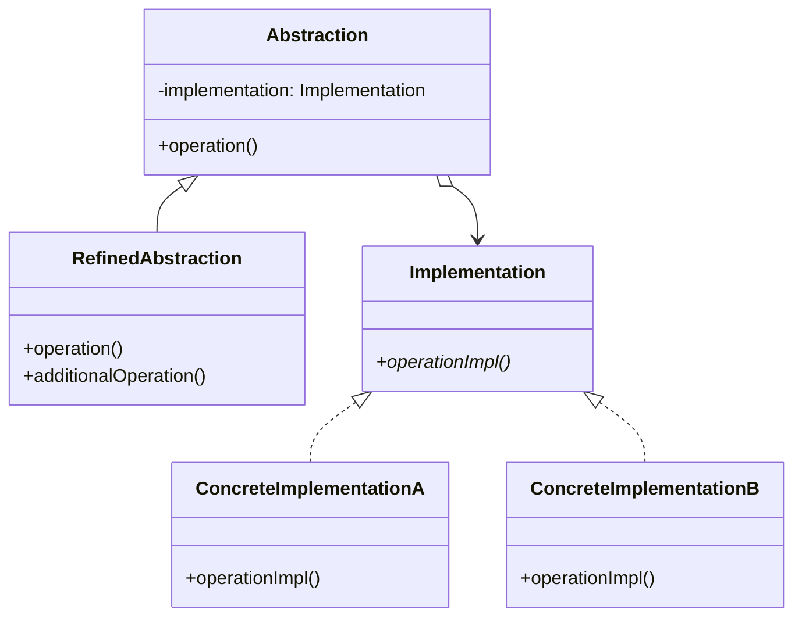
```mermaid
classDiagram
    class Abstraction {
        -implementation: Implementation
        +operation()
    }
    class RefinedAbstraction {
        +operation()
        +additionalOperation()
    }
    class Implementation {
        +operationImpl()*
    }
    class ConcreteImplementationA {
        +operationImpl()
    }
    class ConcreteImplementationB {
        +operationImpl()
    }
    Abstraction <|-- RefinedAbstraction
    Abstraction o--> Implementation
    Implementation <|.. ConcreteImplementationA
    Implementation <|.. ConcreteImplementationB
```

```python
from abc import ABC, abstractmethod
from typing import Optional, List

# Implementation Interface
class DeviceImplementation(ABC):
    @abstractmethod
    def list_features(self) -> List[str]:
        pass
    
    @abstractmethod
    def power_on(self) -> str:
        pass
    
    @abstractmethod
    def power_off(self) -> str:
        pass

# Concrete Implementations
class TVImplementation(DeviceImplementation):
    def list_features(self) -> List[str]:
        return ["Display", "Sound", "Smart TV"]
    
    def power_on(self) -> str:
        return "TV: powering on, initializing display..."
    
    def power_off(self) -> str:
        return "TV: saving settings, powering off..."

class SmartSpeakerImplementation(DeviceImplementation):
    def list_features(self) -> List[str]:
        return ["Sound", "Voice Control", "Smart Home Hub"]
    
    def power_on(self) -> str:
        return "Speaker: starting up, connecting to network..."
    
    def power_off(self) -> str:
        return "Speaker: disconnecting, powering down..."

# Abstraction
class Device:
    def __init__(self, implementation: DeviceImplementation):
        self.implementation = implementation
    
    def power_on(self) -> str:
        return self.implementation.power_on()
    
    def power_off(self) -> str:
        return self.implementation.power_off()
    
    def get_features(self) -> List[str]:
        return self.implementation.list_features()

# Refined Abstractions
class SmartDevice(Device):
    def __init__(self, implementation: DeviceImplementation, network: str):
        super().__init__(implementation)
        self.network = network
        self._connected: bool = False
    
    def connect_to_network(self) -> str:
        self._connected = True
        return f"Connected to {self.network}"
    
    def disconnect_from_network(self) -> str:
        self._connected = False
        return f"Disconnected from {self.network}"
    
    def power_on(self) -> str:
        result = super().power_on()
        if not self._connected:
            result += f"\n{self.connect_to_network()}"
        return result

class PremiumDevice(SmartDevice):
    def __init__(self, implementation: DeviceImplementation, network: str):
        super().__init__(implementation, network)
        self._eco_mode: bool = False
    
    def toggle_eco_mode(self) -> str:
        self._eco_mode = not self._eco_mode
        status = "enabled" if self._eco_mode else "disabled"
        return f"Eco mode {status}"
    
    def get_features(self) -> List[str]:
        features = super().get_features()
        return features + ["Eco Mode", "Premium Support"]

# Enhanced Implementation with State
class AdvancedTVImplementation(TVImplementation):
    def __init__(self):
        self._volume = 50
        self._channel = 1
    
    def adjust_volume(self, value: int) -> str:
        self._volume = max(0, min(100, value))
        return f"Volume set to {self._volume}%"
    
    def change_channel(self, channel: int) -> str:
        self._channel = channel
        return f"Changed to channel {self._channel}"

# Usage Example
def bridge_example():
    # Basic device
    tv_impl = TVImplementation()
    basic_tv = Device(tv_impl)
    print(basic_tv.power_on())
    print(basic_tv.get_features())
    
    # Smart device
    speaker_impl = SmartSpeakerImplementation()
    smart_speaker = SmartDevice(speaker_impl, "Home WiFi")
    print(smart_speaker.power_on())  # Includes network connection
    print(smart_speaker.get_features())
    
    # Premium device with advanced implementation
    advanced_tv_impl = AdvancedTVImplementation()
    premium_tv = PremiumDevice(advanced_tv_impl, "Premium Network")
    print(premium_tv.power_on())
    print(premium_tv.get_features())
    print(premium_tv.toggle_eco_mode())
    
    # Using advanced implementation features
    if isinstance(advanced_tv_impl, AdvancedTVImplementation):
        print(advanced_tv_impl.adjust_volume(75))
        print(advanced_tv_impl.change_channel(5))

```

##### Pros & Cons
✅ **Advantages**
- Decouples abstraction from implementation
- Improves extensibility
- Hides implementation details from clients
- Single Responsibility Principle
- Open/Closed Principle
- Platform independence

❌ **Disadvantages**
- Increased complexity
- More difficult to understand
- Slightly harder to debug
- Needs careful planning
- May be overkill for simple scenarios

##### Testing
```python
import unittest

class BridgePatternTests(unittest.TestCase):
    def setUp(self):
        self.tv_impl = TVImplementation()
        self.speaker_impl = SmartSpeakerImplementation()
        self.advanced_tv_impl = AdvancedTVImplementation()
    
    def test_basic_device(self):
        device = Device(self.tv_impl)
        self.assertIn("Display", device.get_features())
        self.assertIn("powering on", device.power_on())
        self.assertIn("powering off", device.power_off())
    
    def test_smart_device(self):
        smart_device = SmartDevice(self.speaker_impl, "Test Network")
        power_result = smart_device.power_on()
        
        self.assertIn("starting up", power_result)
        self.assertIn("Connected to Test Network", power_result)
        self.assertIn("Voice Control", smart_device.get_features())
    
    def test_premium_device(self):
        premium_device = PremiumDevice(self.advanced_tv_impl, "Premium Net")
        
        self.assertIn("Eco Mode", premium_device.get_features())
        self.assertIn("enabled", premium_device.toggle_eco_mode())
        self.assertIn("disabled", premium_device.toggle_eco_mode())
    
    def test_advanced_implementation(self):
        # Test advanced TV-specific features
        self.assertEqual(
            "Volume set to 75%",
            self.advanced_tv_impl.adjust_volume(75)
        )
        self.assertEqual(
            "Changed to channel 5",
            self.advanced_tv_impl.change_channel(5)
        )
```

##### Common Pitfalls
1. **Mixing Implementation Details in Abstraction**
```python
# Bad - Abstraction knows too much about implementation
class BadDevice:
    def power_on(self):
        if isinstance(self.implementation, TVImplementation):
            return "TV specific logic"  # Wrong!

# Good - Implementation independent
class GoodDevice:
    def power_on(self):
        return self.implementation.power_on()  # Generic
```

2. **Not Using Interface Segregation**
```python
# Bad - Too many methods in implementation interface
class BadImplementation(ABC):
    @abstractmethod
    def do_everything(self): pass
    
# Good - Segregated interfaces
class GoodImplementation(ABC):
    @abstractmethod
    def basic_operation(self): pass

class ExtendedImplementation(GoodImplementation):
    def extended_operation(self): pass
```

##### Related Patterns
- Abstract Factory can create and configure Bridge
- Adapter works with existing classes, Bridge designs for separation
- State pattern can be used within Bridge implementations
- Strategy pattern is similar but focuses on algorithms rather than implementation

#### 2.4 Composite Pattern

##### Purpose
- Composes objects into tree structures
- Lets clients treat individual objects and compositions uniformly
- Creates part-whole hierarchies
- Enables recursive composition

##### Use Cases
1. **File System Management**
   - Files and directories
   - Document structures
   - ZIP archives

2. **GUI Components**
   - Window elements
   - Form components
   - Menu systems

3. **Organization Structures**
   - Company hierarchies
   - Department trees
   - Task management

##### Implementation
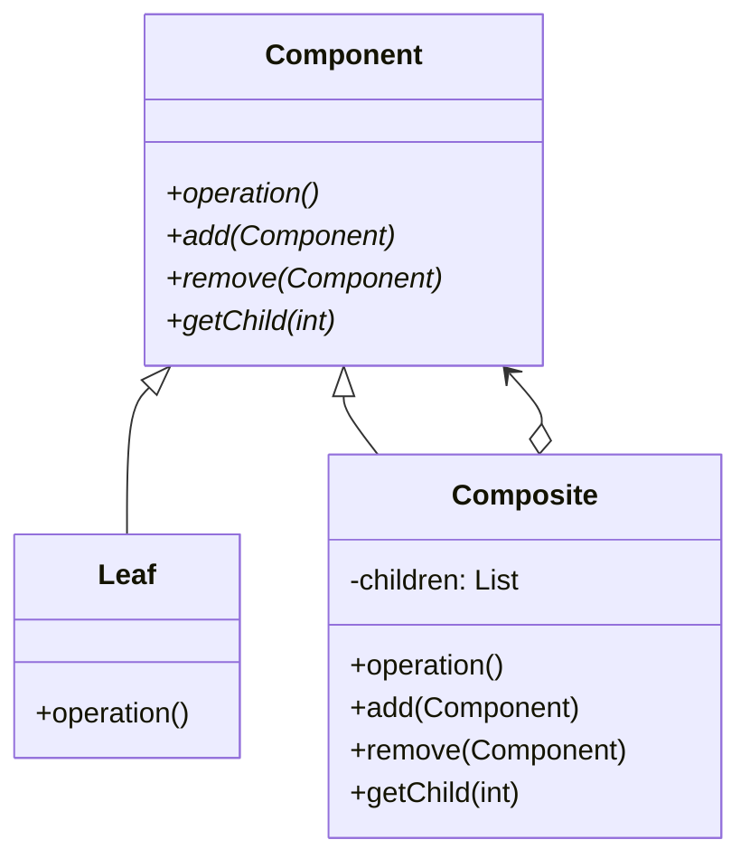
```mermaid
classDiagram
    class Component {
        +operation()*
        +add(Component)*
        +remove(Component)*
        +getChild(int)*
    }
    class Leaf {
        +operation()
    }
    class Composite {
        -children: List
        +operation()
        +add(Component)
        +remove(Component)
        +getChild(int)
    }
    Component <|-- Leaf
    Component <|-- Composite
    Composite o--> Component
```

```python
from abc import ABC, abstractmethod
from typing import List, Optional

class FileSystemComponent(ABC):
    def __init__(self, name: str):
        self.name = name
        self._parent: Optional['FileSystemComponent'] = None
    
    @property
    def parent(self) -> Optional['FileSystemComponent']:
        return self._parent
    
    @parent.setter
    def parent(self, parent: 'FileSystemComponent') -> None:
        self._parent = parent
    
    @abstractmethod
    def size(self) -> int:
        pass
    
    @abstractmethod
    def display(self, indent: str = "") -> str:
        pass
    
    def get_path(self) -> str:
        if self.parent:
            return f"{self.parent.get_path()}/{self.name}"
        return self.name

class File(FileSystemComponent):
    def __init__(self, name: str, size: int):
        super().__init__(name)
        self._size = size
    
    def size(self) -> int:
        return self._size
    
    def display(self, indent: str = "") -> str:
        return f"{indent}File: {self.name} ({self.size()} bytes)"

class Directory(FileSystemComponent):
    def __init__(self, name: str):
        super().__init__(name)
        self._children: List[FileSystemComponent] = []
    
    def add(self, component: FileSystemComponent) -> None:
        self._children.append(component)
        component.parent = self
    
    def remove(self, component: FileSystemComponent) -> None:
        self._children.remove(component)
        component.parent = None
    
    def size(self) -> int:
        return sum(child.size() for child in self._children)
    
    def display(self, indent: str = "") -> str:
        output = [f"{indent}Directory: {self.name} ({self.size()} bytes)"]
        for child in self._children:
            output.append(child.display(indent + "  "))
        return "\n".join(output)
    
    def find(self, name: str) -> Optional[FileSystemComponent]:
        if self.name == name:
            return self
        for child in self._children:
            if isinstance(child, Directory):
                found = child.find(name)
                if found:
                    return found
            elif child.name == name:
                return child
        return None

# Enhanced Composite with Operations
class FileSystemOperation:
    @staticmethod
    def copy(source: FileSystemComponent, target_dir: 'Directory') -> None:
        if isinstance(source, File):
            new_file = File(source.name, source.size())
            target_dir.add(new_file)
        elif isinstance(source, Directory):
            new_dir = Directory(source.name)
            target_dir.add(new_dir)
            for child in source._children:
                FileSystemOperation.copy(child, new_dir)

# Usage Example
def file_system_example():
    # Create root directory
    root = Directory("root")
    
    # Create subdirectories
    docs = Directory("documents")
    pics = Directory("pictures")
    root.add(docs)
    root.add(pics)
    
    # Add files
    docs.add(File("resume.doc", 1000))
    docs.add(File("letter.doc", 500))
    pics.add(File("photo1.jpg", 2000))
    pics.add(File("photo2.jpg", 3000))
    
    # Create nested structure
    work = Directory("work")
    docs.add(work)
    work.add(File("project.doc", 1500))
    
    # Display structure
    print(root.display())
    
    # Perform operations
    backup = Directory("backup")
    FileSystemOperation.copy(docs, backup)
    print("\nBackup created:")
    print(backup.display())
    
    return root, backup

class SafeDirectory(Directory):
    """Enhanced Directory with safety checks"""
    def add(self, component: FileSystemComponent) -> None:
        if any(child.name == component.name for child in self._children):
            raise ValueError(f"Component with name '{component.name}' already exists")
        super().add(component)
    
    def remove(self, component: FileSystemComponent) -> None:
        if component not in self._children:
            raise ValueError("Component not found in directory")
        super().remove(component)

```

##### Pros & Cons
✅ **Advantages**
- Uniform treatment of objects
- Natural recursive structure
- Easy to add new component types
- Simplifies client code
- Flexible structure modification
- Open/Closed Principle

❌ **Disadvantages**
- Can make design overly general
- Difficult to restrict component types
- May need additional safety checks
- Complex recursive operations
- Potential performance issues with deep structures

##### Testing
```python
import unittest

class CompositeTests(unittest.TestCase):
    def setUp(self):
        self.root = Directory("root")
        self.docs = Directory("documents")
        self.file1 = File("test.doc", 100)
        self.root.add(self.docs)
        self.docs.add(self.file1)
    
    def test_file_size(self):
        self.assertEqual(self.file1.size(), 100)
    
    def test_directory_size(self):
        self.docs.add(File("another.doc", 200))
        self.assertEqual(self.docs.size(), 300)
        self.assertEqual(self.root.size(), 300)
    
    def test_path(self):
        self.assertEqual(self.file1.get_path(), "root/documents/test.doc")
    
    def test_find(self):
        found = self.root.find("test.doc")
        self.assertIs(found, self.file1)
    
    def test_safe_directory(self):
        safe_dir = SafeDirectory("safe")
        safe_dir.add(File("unique.doc", 100))
        
        with self.assertRaises(ValueError):
            safe_dir.add(File("unique.doc", 200))
    
    def test_copy_operation(self):
        backup = Directory("backup")
        FileSystemOperation.copy(self.docs, backup)
        
        self.assertEqual(backup.size(), self.docs.size())
        self.assertIsNotNone(backup.find("test.doc"))
```

##### Common Pitfalls
1. **Not Handling Parent References**
```python
# Bad - No parent tracking
class BadComponent:
    def add(self, child):
        self.children.append(child)  # No parent reference

# Good - Proper parent tracking
class GoodComponent:
    def add(self, child):
        self.children.append(child)
        child.parent = self  # Maintain parent reference
```

2. **Unsafe Component Operations**
```python
# Bad - No type checking
class UnsafeDirectory:
    def add(self, component):
        self.children.append(component)  # Could be anything!

# Good - Type safety
class SafeDirectory:
    def add(self, component: FileSystemComponent):
        if not isinstance(component, FileSystemComponent):
            raise TypeError("Invalid component type")
        self.children.append(component)
```

##### Related Patterns
- Decorator often used with Composite
- Iterator can traverse Composite structures
- Visitor can apply operations to Composite structures
- Chain of Responsibility often uses Composite structures

#### 2.5 Decorator Pattern

##### Purpose
- Adds behavior to objects dynamically
- Provides flexible alternative to subclassing
- Supports Single Responsibility Principle
- Enables runtime behavior modification

##### Use Cases
1. **UI Component Enhancement**
   - Adding borders
   - Scrolling functionality
   - Visual effects

2. **Data Stream Handling**
   - Compression
   - Encryption
   - Buffering
   - Logging

3. **Service Enhancement**
   - Caching
   - Authentication
   - Logging
   - Transaction management

##### Implementation
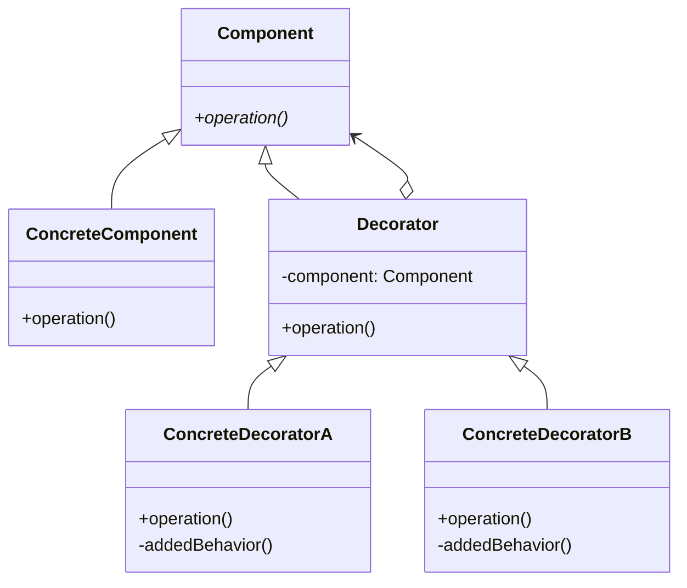
```mermaid
classDiagram
    class Component {
        +operation()*
    }
    class ConcreteComponent {
        +operation()
    }
    class Decorator {
        -component: Component
        +operation()
    }
    class ConcreteDecoratorA {
        +operation()
        -addedBehavior()
    }
    class ConcreteDecoratorB {
        +operation()
        -addedBehavior()
    }
    Component <|-- ConcreteComponent
    Component <|-- Decorator
    Decorator <|-- ConcreteDecoratorA
    Decorator <|-- ConcreteDecoratorB
    Decorator o--> Component
```

```python
from abc import ABC, abstractmethod
from typing import Optional, List, Dict, Any
from functools import wraps
import time

# Base Component
class DataSource(ABC):
    @abstractmethod
    def write_data(self, data: Any) -> None:
        pass
    
    @abstractmethod
    def read_data(self) -> Any:
        pass

# Concrete Component
class FileDataSource(DataSource):
    def __init__(self, filename: str):
        self.filename = filename
        self._data: Any = None
    
    def write_data(self, data: Any) -> None:
        print(f"Writing data to {self.filename}")
        self._data = data
    
    def read_data(self) -> Any:
        print(f"Reading data from {self.filename}")
        return self._data

# Base Decorator
class DataSourceDecorator(DataSource):
    def __init__(self, source: DataSource):
        self._wrapped = source
    
    def write_data(self, data: Any) -> None:
        self._wrapped.write_data(data)
    
    def read_data(self) -> Any:
        return self._wrapped.read_data()

# Concrete Decorators
class EncryptionDecorator(DataSourceDecorator):
    def write_data(self, data: Any) -> None:
        encrypted = self._encrypt(data)
        super().write_data(encrypted)
    
    def read_data(self) -> Any:
        data = super().read_data()
        return self._decrypt(data)
    
    def _encrypt(self, data: Any) -> str:
        return f"ENCRYPTED({data})"
    
    def _decrypt(self, data: str) -> Any:
        return data.replace("ENCRYPTED(", "").replace(")", "")

class CompressionDecorator(DataSourceDecorator):
    def write_data(self, data: Any) -> None:
        compressed = self._compress(data)
        super().write_data(compressed)
    
    def read_data(self) -> Any:
        data = super().read_data()
        return self._decompress(data)
    
    def _compress(self, data: Any) -> str:
        return f"COMPRESSED({data})"
    
    def _decompress(self, data: str) -> Any:
        return data.replace("COMPRESSED(", "").replace(")", "")

class LoggingDecorator(DataSourceDecorator):
    def write_data(self, data: Any) -> None:
        print(f"Log: Writing data: {data}")
        super().write_data(data)
    
    def read_data(self) -> Any:
        print("Log: Reading data")
        return super().read_data()

# Method Decorator Example
def timing_decorator(method):
    @wraps(method)
    def wrapper(*args, **kwargs):
        start_time = time.time()
        result = method(*args, **kwargs)
        end_time = time.time()
        print(f"{method.__name__} took {end_time - start_time:.2f} seconds")
        return result
    return wrapper

# Enhanced Decorator with State
class CachingDecorator(DataSourceDecorator):
    def __init__(self, source: DataSource):
        super().__init__(source)
        self._cache: Dict[str, Any] = {}
    
    def write_data(self, data: Any) -> None:
        super().write_data(data)
        self._cache.clear()  # Invalidate cache
    
    def read_data(self) -> Any:
        if not self._cache:
            self._cache['data'] = super().read_data()
        return self._cache['data']

# Usage Example
def decorator_example():
    # Basic file source
    source = FileDataSource("data.txt")
    
    # Add encryption
    encrypted_source = EncryptionDecorator(source)
    
    # Add compression
    compressed_encrypted_source = CompressionDecorator(encrypted_source)
    
    # Add logging
    logged_compressed_encrypted_source = LoggingDecorator(compressed_encrypted_source)
    
    # Write and read data through all decorators
    data = "Hello, World!"
    logged_compressed_encrypted_source.write_data(data)
    result = logged_compressed_encrypted_source.read_data()
    
    return result

# Example with Method Decorator
class DataProcessor:
    @timing_decorator
    def process_data(self, data: List[int]) -> List[int]:
        return sorted(data)
```

##### Pros & Cons
✅ **Advantages**
- Dynamic behavior addition
- Single Responsibility Principle
- Flexible alternative to subclassing
- Runtime behavior modification
- Composition over inheritance
- Easy to combine behaviors

❌ **Disadvantages**
- Many small decorator classes
- Order of decorators matters
- Complex instantiation code
- Hard to debug decorated chains
- Possible performance impact

##### Testing
```python
import unittest

class DecoratorTests(unittest.TestCase):
    def setUp(self):
        self.source = FileDataSource("test.txt")
    
    def test_basic_source(self):
        data = "test data"
        self.source.write_data(data)
        self.assertEqual(self.source.read_data(), data)
    
    def test_encryption_decorator(self):
        encrypted_source = EncryptionDecorator(self.source)
        data = "secret"
        encrypted_source.write_data(data)
        
        # Check internal data is encrypted
        encrypted_data = self.source.read_data()
        self.assertIn("ENCRYPTED", encrypted_data)
        
        # Check decryption works
        decrypted_data = encrypted_source.read_data()
        self.assertEqual(decrypted_data, data)
    
    def test_multiple_decorators(self):
        decorated_source = LoggingDecorator(
            CompressionDecorator(
                EncryptionDecorator(self.source)
            )
        )
        
        data = "test data"
        decorated_source.write_data(data)
        result = decorated_source.read_data()
        
        self.assertEqual(result, data)
    
    def test_caching_decorator(self):
        cached_source = CachingDecorator(self.source)
        data = "cached data"
        
        cached_source.write_data(data)
        first_read = cached_source.read_data()
        second_read = cached_source.read_data()
        
        self.assertEqual(first_read, second_read)
```

##### Common Pitfalls
1. **Incorrect Decorator Ordering**
```python
# Bad - Wrong order can affect functionality
source = CompressionDecorator(  # Compress encrypted data
    EncryptionDecorator(source)
)

# Good - Logical order
source = EncryptionDecorator(    # Encrypt compressed data
    CompressionDecorator(source)
)
```

2. **Not Preserving Interface**
```python
# Bad - Breaking interface
class BadDecorator(DataSource):
    def new_method(self):  # Adds method not in interface
        pass

# Good - Maintaining interface
class GoodDecorator(DataSource):
    def __init__(self, wrapped: DataSource):
        self._wrapped = wrapped
```

##### Related Patterns
- Adapter changes interface, Decorator enhances it
- Composite can be decorated
- Strategy changes algorithm, Decorator adds behavior
- Chain of Responsibility can use Decorator

#### 2.5 Decorator Pattern

##### Purpose
- Adds behavior to objects dynamically
- Provides flexible alternative to subclassing
- Supports Single Responsibility Principle
- Enables runtime behavior modification

##### Use Cases
1. **UI Component Enhancement**
   - Adding borders
   - Scrolling functionality
   - Visual effects

2. **Data Stream Handling**
   - Compression
   - Encryption
   - Buffering
   - Logging

3. **Service Enhancement**
   - Caching
   - Authentication
   - Logging
   - Transaction management

##### Implementation

```mermaid
classDiagram
    class Component {
        +operation()*
    }
    class ConcreteComponent {
        +operation()
    }
    class Decorator {
        -component: Component
        +operation()
    }
    class ConcreteDecoratorA {
        +operation()
        -addedBehavior()
    }
    class ConcreteDecoratorB {
        +operation()
        -addedBehavior()
    }
    Component <|-- ConcreteComponent
    Component <|-- Decorator
    Decorator <|-- ConcreteDecoratorA
    Decorator <|-- ConcreteDecoratorB
    Decorator o--> Component
```

```python
from abc import ABC, abstractmethod
from typing import Optional, List, Dict, Any
from functools import wraps
import time

# Base Component
class DataSource(ABC):
    @abstractmethod
    def write_data(self, data: Any) -> None:
        pass
    
    @abstractmethod
    def read_data(self) -> Any:
        pass

# Concrete Component
class FileDataSource(DataSource):
    def __init__(self, filename: str):
        self.filename = filename
        self._data: Any = None
    
    def write_data(self, data: Any) -> None:
        print(f"Writing data to {self.filename}")
        self._data = data
    
    def read_data(self) -> Any:
        print(f"Reading data from {self.filename}")
        return self._data

# Base Decorator
class DataSourceDecorator(DataSource):
    def __init__(self, source: DataSource):
        self._wrapped = source
    
    def write_data(self, data: Any) -> None:
        self._wrapped.write_data(data)
    
    def read_data(self) -> Any:
        return self._wrapped.read_data()

# Concrete Decorators
class EncryptionDecorator(DataSourceDecorator):
    def write_data(self, data: Any) -> None:
        encrypted = self._encrypt(data)
        super().write_data(encrypted)
    
    def read_data(self) -> Any:
        data = super().read_data()
        return self._decrypt(data)
    
    def _encrypt(self, data: Any) -> str:
        return f"ENCRYPTED({data})"
    
    def _decrypt(self, data: str) -> Any:
        return data.replace("ENCRYPTED(", "").replace(")", "")

class CompressionDecorator(DataSourceDecorator):
    def write_data(self, data: Any) -> None:
        compressed = self._compress(data)
        super().write_data(compressed)
    
    def read_data(self) -> Any:
        data = super().read_data()
        return self._decompress(data)
    
    def _compress(self, data: Any) -> str:
        return f"COMPRESSED({data})"
    
    def _decompress(self, data: str) -> Any:
        return data.replace("COMPRESSED(", "").replace(")", "")

class LoggingDecorator(DataSourceDecorator):
    def write_data(self, data: Any) -> None:
        print(f"Log: Writing data: {data}")
        super().write_data(data)
    
    def read_data(self) -> Any:
        print("Log: Reading data")
        return super().read_data()

# Method Decorator Example
def timing_decorator(method):
    @wraps(method)
    def wrapper(*args, **kwargs):
        start_time = time.time()
        result = method(*args, **kwargs)
        end_time = time.time()
        print(f"{method.__name__} took {end_time - start_time:.2f} seconds")
        return result
    return wrapper

# Enhanced Decorator with State
class CachingDecorator(DataSourceDecorator):
    def __init__(self, source: DataSource):
        super().__init__(source)
        self._cache: Dict[str, Any] = {}
    
    def write_data(self, data: Any) -> None:
        super().write_data(data)
        self._cache.clear()  # Invalidate cache
    
    def read_data(self) -> Any:
        if not self._cache:
            self._cache['data'] = super().read_data()
        return self._cache['data']

# Usage Example
def decorator_example():
    # Basic file source
    source = FileDataSource("data.txt")
    
    # Add encryption
    encrypted_source = EncryptionDecorator(source)
    
    # Add compression
    compressed_encrypted_source = CompressionDecorator(encrypted_source)
    
    # Add logging
    logged_compressed_encrypted_source = LoggingDecorator(compressed_encrypted_source)
    
    # Write and read data through all decorators
    data = "Hello, World!"
    logged_compressed_encrypted_source.write_data(data)
    result = logged_compressed_encrypted_source.read_data()
    
    return result

# Example with Method Decorator
class DataProcessor:
    @timing_decorator
    def process_data(self, data: List[int]) -> List[int]:
        return sorted(data)
```

##### Pros & Cons
✅ **Advantages**
- Dynamic behavior addition
- Single Responsibility Principle
- Flexible alternative to subclassing
- Runtime behavior modification
- Composition over inheritance
- Easy to combine behaviors

❌ **Disadvantages**
- Many small decorator classes
- Order of decorators matters
- Complex instantiation code
- Hard to debug decorated chains
- Possible performance impact

##### Testing
```python
import unittest

class DecoratorTests(unittest.TestCase):
    def setUp(self):
        self.source = FileDataSource("test.txt")
    
    def test_basic_source(self):
        data = "test data"
        self.source.write_data(data)
        self.assertEqual(self.source.read_data(), data)
    
    def test_encryption_decorator(self):
        encrypted_source = EncryptionDecorator(self.source)
        data = "secret"
        encrypted_source.write_data(data)
        
        # Check internal data is encrypted
        encrypted_data = self.source.read_data()
        self.assertIn("ENCRYPTED", encrypted_data)
        
        # Check decryption works
        decrypted_data = encrypted_source.read_data()
        self.assertEqual(decrypted_data, data)
    
    def test_multiple_decorators(self):
        decorated_source = LoggingDecorator(
            CompressionDecorator(
                EncryptionDecorator(self.source)
            )
        )
        
        data = "test data"
        decorated_source.write_data(data)
        result = decorated_source.read_data()
        
        self.assertEqual(result, data)
    
    def test_caching_decorator(self):
        cached_source = CachingDecorator(self.source)
        data = "cached data"
        
        cached_source.write_data(data)
        first_read = cached_source.read_data()
        second_read = cached_source.read_data()
        
        self.assertEqual(first_read, second_read)
```

##### Common Pitfalls
1. **Incorrect Decorator Ordering**
```python
# Bad - Wrong order can affect functionality
source = CompressionDecorator(  # Compress encrypted data
    EncryptionDecorator(source)
)

# Good - Logical order
source = EncryptionDecorator(    # Encrypt compressed data
    CompressionDecorator(source)
)
```

2. **Not Preserving Interface**
```python
# Bad - Breaking interface
class BadDecorator(DataSource):
    def new_method(self):  # Adds method not in interface
        pass

# Good - Maintaining interface
class GoodDecorator(DataSource):
    def __init__(self, wrapped: DataSource):
        self._wrapped = wrapped
```

##### Related Patterns
- Adapter changes interface, Decorator enhances it
- Composite can be decorated
- Strategy changes algorithm, Decorator adds behavior
- Chain of Responsibility can use Decorator

#### 2.7 Flyweight Pattern

##### Purpose
- Reduces memory usage by sharing common object data
- Supports large numbers of fine-grained objects
- Separates intrinsic and extrinsic state
- Optimizes memory intensive applications

##### Use Cases
1. **Document Processing**
   - Character/font rendering
   - Text formatting
   - Document styling

2. **Game Development**
   - Particle systems
   - Terrain tiles
   - Game objects

3. **UI Components**
   - Icon libraries
   - Style sheets
   - Shared resources

##### Implementation
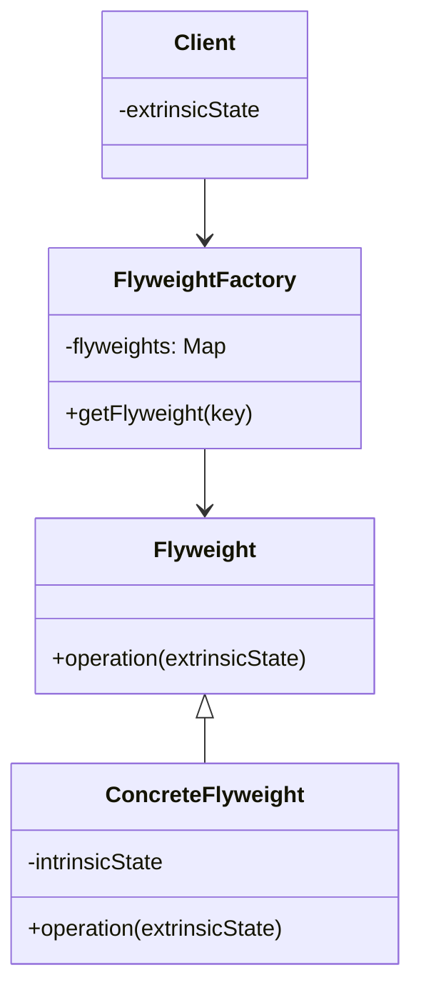
```mermaid
classDiagram
    class Flyweight {
        +operation(extrinsicState)
    }
    class ConcreteFlyweight {
        -intrinsicState
        +operation(extrinsicState)
    }
    class FlyweightFactory {
        -flyweights: Map
        +getFlyweight(key)
    }
    class Client {
        -extrinsicState
    }
    Flyweight <|-- ConcreteFlyweight
    FlyweightFactory --> Flyweight
    Client --> FlyweightFactory
```

```python
from abc import ABC, abstractmethod
from typing import Dict, Any, Tuple
import json

# Flyweight
class TextCharacter:
    def __init__(self, symbol: str, font: str, size: int):
        self.symbol = symbol
        self.font = font
        self.size = size
    
    def render(self, x: int, y: int, color: str) -> str:
        return (f"Rendering {self.symbol} at ({x},{y}) "
                f"in {self.font} {self.size}pt {color}")
    
    def __str__(self) -> str:
        return f"{self.symbol}({self.font}, {self.size})"

# Flyweight Factory
class CharacterFactory:
    _characters: Dict[str, TextCharacter] = {}
    
    @classmethod
    def get_character(cls, symbol: str, font: str = "Arial", size: int = 12) -> TextCharacter:
        key = f"{symbol}-{font}-{size}"
        if key not in cls._characters:
            cls._characters[key] = TextCharacter(symbol, font, size)
        return cls._characters[key]
    
    @classmethod
    def character_count(cls) -> int:
        return len(cls._characters)

# Context
class TextEditor:
    def __init__(self):
        self.characters: List[Tuple[TextCharacter, Dict[str, Any]]] = []
    
    def add_character(self, symbol: str, x: int, y: int, color: str,
                     font: str = "Arial", size: int = 12):
        character = CharacterFactory.get_character(symbol, font, size)
        self.characters.append((character, {"x": x, "y": y, "color": color}))
    
    def render(self) -> str:
        return "\n".join(
            char.render(**state) for char, state in self.characters
        )

# Enhanced Flyweight for Game Objects
class GameObjectFlyweight:
    def __init__(self, mesh: str, texture: str, animations: Dict[str, str]):
        self.mesh = mesh
        self.texture = texture
        self.animations = animations
    
    def render(self, position: Tuple[float, float, float], 
               rotation: float, scale: float) -> str:
        return (f"Rendering {self.mesh} at {position} "
                f"rotation: {rotation} scale: {scale}")

class GameObjectFactory:
    _objects: Dict[str, GameObjectFlyweight] = {}
    
    @classmethod
    def get_game_object(cls, object_type: str) -> GameObjectFlyweight:
        if object_type not in cls._objects:
            # Simulate loading resource-heavy assets
            mesh = f"{object_type}_mesh"
            texture = f"{object_type}_texture"
            animations = {
                "idle": f"{object_type}_idle",
                "walk": f"{object_type}_walk"
            }
            cls._objects[object_type] = GameObjectFlyweight(
                mesh, texture, animations
            )
        return cls._objects[object_type]

# Usage Example
def text_editor_example():
    editor = TextEditor()
    
    # Add text with various styles
    text = "Hello, World!"
    x = 0
    for char in text:
        editor.add_character(char, x, 0, "black")
        x += 10
    
    # Add styled text
    editor.add_character("A", 100, 20, "red", "Times", 14)
    editor.add_character("A", 120, 20, "blue", "Times", 14)
    
    print(f"Total character objects created: {CharacterFactory.character_count()}")
    return editor.render()

def game_example():
    # Create multiple game objects sharing same assets
    tree = GameObjectFactory.get_game_object("tree")
    positions = [
        (0.0, 0.0, 0.0),
        (10.0, 0.0, 0.0),
        (20.0, 0.0, 0.0)
    ]
    
    renders = []
    for pos in positions:
        renders.append(tree.render(pos, 0.0, 1.0))
    
    return renders
```

##### Pros & Cons
✅ **Advantages**
- Reduces memory usage
- Improves performance
- Centralizes state management
- Supports large object quantities
- Efficient resource sharing
- Cache-friendly

❌ **Disadvantages**
- Increased complexity
- State separation challenges
- Thread safety concerns
- Factory management overhead
- Potential context overhead

##### Testing
```python
import unittest

class FlyweightTests(unittest.TestCase):
    def setUp(self):
        CharacterFactory._characters.clear()
    
    def test_character_reuse(self):
        char1 = CharacterFactory.get_character("A")
        char2 = CharacterFactory.get_character("A")
        self.assertIs(char1, char2)
    
    def test_different_characters(self):
        char1 = CharacterFactory.get_character("A")
        char2 = CharacterFactory.get_character("B")
        self.assertIsNot(char1, char2)
    
    def test_character_with_style(self):
        char1 = CharacterFactory.get_character("A", "Arial", 12)
        char2 = CharacterFactory.get_character("A", "Times", 12)
        self.assertIsNot(char1, char2)
    
    def test_text_editor(self):
        editor = TextEditor()
        editor.add_character("A", 0, 0, "black")
        editor.add_character("A", 10, 0, "red")
        
        # Should only create one flyweight
        self.assertEqual(CharacterFactory.character_count(), 1)
    
    def test_game_object_sharing(self):
        tree1 = GameObjectFactory.get_game_object("tree")
        tree2 = GameObjectFactory.get_game_object("tree")
        rock = GameObjectFactory.get_game_object("rock")
        
        self.assertIs(tree1, tree2)
        self.assertIsNot(tree1, rock)
```

##### Common Pitfalls
1. **Incorrect State Separation**
```python
# Bad - Mixing intrinsic and extrinsic state
class BadCharacter:
    def __init__(self, symbol, x, y):  # Position should be extrinsic!
        self.symbol = symbol
        self.x = x
        self.y = y

# Good - Proper state separation
class GoodCharacter:
    def __init__(self, symbol):  # Only intrinsic state
        self.symbol = symbol
    
    def render(self, x, y):  # Extrinsic state as parameters
        pass
```

2. **Not Using Factory**
```python
# Bad - Direct flyweight creation
class Client:
    def add_character(self, symbol):
        character = TextCharacter(symbol)  # Direct instantiation!

# Good - Using factory
class Client:
    def add_character(self, symbol):
        character = CharacterFactory.get_character(symbol)
```

##### Related Patterns
- Factory Method creates flyweights
- Composite can use flyweight children
- State can use flyweight for shared state
- Strategy can use flyweight for shared strategies

#### 2.8 Proxy Pattern

##### Purpose
- Controls access to an object
- Provides a surrogate or placeholder
- Adds additional behavior to object access
- Delays expensive object creation

##### Use Cases
1. **Resource Access Control**
   - Authentication/Authorization
   - Access logging
   - Rate limiting

2. **Lazy Loading**
   - Database queries
   - Large image loading
   - Heavy object initialization

3. **Remote Resource Access**
   - Web services
   - Remote file systems
   - Distributed objects

##### Implementation
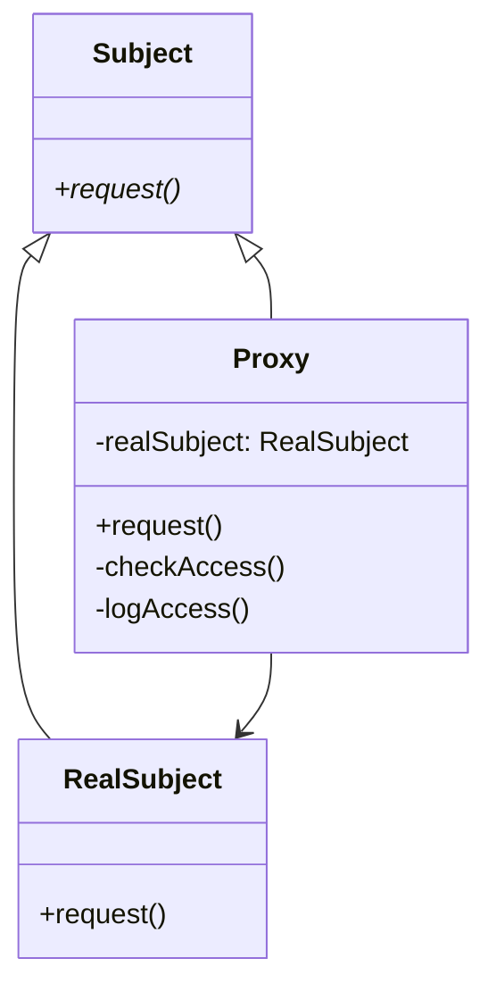
```mermaid
classDiagram
    class Subject {
        +request()*
    }
    class RealSubject {
        +request()
    }
    class Proxy {
        -realSubject: RealSubject
        +request()
        -checkAccess()
        -logAccess()
    }
    Subject <|-- RealSubject
    Subject <|-- Proxy
    Proxy --> RealSubject
```

```python
from abc import ABC, abstractmethod
from typing import Optional, Dict, Any
import time
from functools import wraps

# Subject Interface
class Resource(ABC):
    @abstractmethod
    def operation(self, user: str) -> str:
        pass

# Real Subject
class ExpensiveResource(Resource):
    def __init__(self, resource_id: str):
        self.resource_id = resource_id
        # Simulate expensive initialization
        time.sleep(0.1)
    
    def operation(self, user: str) -> str:
        return f"Resource {self.resource_id} operation for user {user}"

# Protection Proxy
class ProtectionProxy(Resource):
    def __init__(self, resource_id: str):
        self._resource: Optional[ExpensiveResource] = None
        self.resource_id = resource_id
        self._authorized_users = {"admin", "superuser"}
    
    def operation(self, user: str) -> str:
        if not self._check_access(user):
            raise PermissionError(f"User {user} not authorized")
        
        if self._resource is None:
            self._resource = ExpensiveResource(self.resource_id)
        
        self._log_access(user)
        return self._resource.operation(user)
    
    def _check_access(self, user: str) -> bool:
        return user in self._authorized_users
    
    def _log_access(self, user: str) -> None:
        print(f"Access log: User {user} accessed resource {self.resource_id}")

# Virtual Proxy (Lazy Loading)
class LazyLoadingProxy(Resource):
    def __init__(self, resource_id: str):
        self.resource_id = resource_id
        self._resource: Optional[ExpensiveResource] = None
    
    def operation(self, user: str) -> str:
        if self._resource is None:
            print(f"Lazy loading resource {self.resource_id}")
            self._resource = ExpensiveResource(self.resource_id)
        return self._resource.operation(user)

# Caching Proxy
class CachingProxy(Resource):
    def __init__(self, resource_id: str):
        self.resource_id = resource_id
        self._resource: Optional[ExpensiveResource] = None
        self._cache: Dict[str, str] = {}
    
    def operation(self, user: str) -> str:
        cache_key = f"{user}:{self.resource_id}"
        
        if cache_key in self._cache:
            print(f"Returning cached result for {cache_key}")
            return self._cache[cache_key]
        
        if self._resource is None:
            self._resource = ExpensiveResource(self.resource_id)
        
        result = self._resource.operation(user)
        self._cache[cache_key] = result
        return result

# Remote Proxy
class RemoteResourceProxy(Resource):
    def __init__(self, resource_id: str):
        self.resource_id = resource_id
    
    def operation(self, user: str) -> str:
        # Simulate remote call
        print(f"Making remote call for resource {self.resource_id}")
        time.sleep(0.1)  # Simulate network delay
        return f"Remote resource {self.resource_id} operation for user {user}"

# Smart Reference Proxy
class SmartReferenceProxy(Resource):
    def __init__(self, resource_id: str):
        self.resource_id = resource_id
        self._resource: Optional[ExpensiveResource] = None
        self._reference_count = 0
    
    def operation(self, user: str) -> str:
        self._reference_count += 1
        if self._resource is None:
            self._resource = ExpensiveResource(self.resource_id)
        result = self._resource.operation(user)
        print(f"Reference count: {self._reference_count}")
        return result
    
    def get_reference_count(self) -> int:
        return self._reference_count

# Usage Example
def proxy_example():
    # Protection Proxy
    protected_resource = ProtectionProxy("sensitive_data")
    try:
        # This will raise PermissionError
        protected_resource.operation("guest")
    except PermissionError:
        print("Access denied for guest")
    
    # This will succeed
    result = protected_resource.operation("admin")
    
    # Lazy Loading Proxy
    lazy_resource = LazyLoadingProxy("large_dataset")
    # Resource is not loaded until first use
    result = lazy_resource.operation("user")
    
    # Caching Proxy
    cached_resource = CachingProxy("frequently_accessed")
    result1 = cached_resource.operation("user")  # Will load resource
    result2 = cached_resource.operation("user")  # Will use cache
    
    return result

# Decorator for proxy pattern
def proxy_decorator(cls):
    class ProxyDecorator:
        def __init__(self, *args, **kwargs):
            self._instance = None
            self._args = args
            self._kwargs = kwargs
        
        def __getattr__(self, name):
            if self._instance is None:
                self._instance = cls(*self._args, **self._kwargs)
            return getattr(self._instance, name)
    
    return ProxyDecorator
```

##### Pros & Cons
✅ **Advantages**
- Controls access to original object
- Manages lifecycle of expensive objects
- Adds security and logging
- Improves performance through caching
- Handles remote resources
- Transparent to clients

❌ **Disadvantages**
- Increases complexity
- Potential performance impact
- Response time might increase
- Can violate Single Responsibility
- Complex error handling

##### Testing
```python
import unittest

class ProxyTests(unittest.TestCase):
    def test_protection_proxy(self):
        proxy = ProtectionProxy("test_resource")
        
        # Test unauthorized access
        with self.assertRaises(PermissionError):
            proxy.operation("guest")
        
        # Test authorized access
        result = proxy.operation("admin")
        self.assertIn("test_resource", result)
        self.assertIn("admin", result)
    
    def test_lazy_loading_proxy(self):
        proxy = LazyLoadingProxy("lazy_resource")
        
        # Resource should not be loaded yet
        self.assertIsNone(proxy._resource)
        
        # Access should trigger loading
        result = proxy.operation("user")
        self.assertIsNotNone(proxy._resource)
    
    def test_caching_proxy(self):
        proxy = CachingProxy("cached_resource")
        
        # First call should cache
        result1 = proxy.operation("user")
        
        # Second call should use cache
        result2 = proxy.operation("user")
        
        self.assertEqual(result1, result2)
        self.assertIn("user:cached_resource", proxy._cache)
    
    def test_smart_reference_proxy(self):
        proxy = SmartReferenceProxy("smart_resource")
        
        proxy.operation("user")
        proxy.operation("user")
        
        self.assertEqual(proxy.get_reference_count(), 2)
```

##### Common Pitfalls
1. **Overcomplicating Proxy**
```python
# Bad - Too many responsibilities
class ComplexProxy(Resource):
    def operation(self, user):
        self.validate()
        self.authenticate()
        self.authorize()
        self.cache()
        self.log()
        return self.resource.operation(user)

# Good - Single responsibility
class SimpleProxy(Resource):
    def operation(self, user):
        self._check_access(user)
        return self.resource.operation(user)
```

2. **Tight Coupling**
```python
# Bad - Tightly coupled
class BadProxy:
    def __init__(self):
        self.resource = SpecificResource()  # Hard-coded dependency

# Good - Loosely coupled
class GoodProxy:
    def __init__(self, resource: Resource):
        self.resource = resource  # Dependency injection
```

##### Related Patterns
- Adapter provides different interface, Proxy same interface
- Decorator adds responsibilities, Proxy controls access
- Facade simplifies interface, Proxy controls access
- Singleton often used with Proxy pattern

### 3. Behavioral Patterns

#### 3.1 Overview
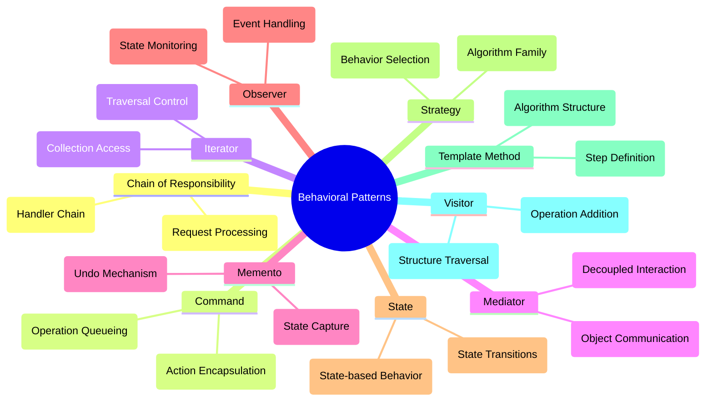
```mermaid
mindmap
    root((Behavioral Patterns))
        Chain of Responsibility
            ("Request Processing")
            ("Handler Chain")
        Command
            ("Action Encapsulation")
            ("Operation Queueing")
        Iterator
            ("Collection Access")
            ("Traversal Control")
        Mediator
            ("Object Communication")
            ("Decoupled Interaction")
        Memento
            ("State Capture")
            ("Undo Mechanism")
        Observer
            ("Event Handling")
            ("State Monitoring")
        State
            ("State-based Behavior")
            ("State Transitions")
        Strategy
            ("Algorithm Family")
            ("Behavior Selection")
        Template Method
            ("Algorithm Structure")
            ("Step Definition")
        Visitor
            ("Operation Addition")
            ("Structure Traversal")
```

#### 3.2 Chain of Responsibility Pattern

##### Purpose
- Passes requests along a chain of handlers
- Decouples senders and receivers
- Allows dynamic handler chain configuration
- Promotes loose coupling

##### Use Cases
1. **Request Processing**
   - Logging systems
   - Error handling
   - Authentication/Authorization

2. **Event Handling**
   - GUI event processing
   - Middleware chains
   - Filter chains

3. **Approval Workflows**
   - Document approval
   - Purchase orders
   - Request validation

##### Implementation
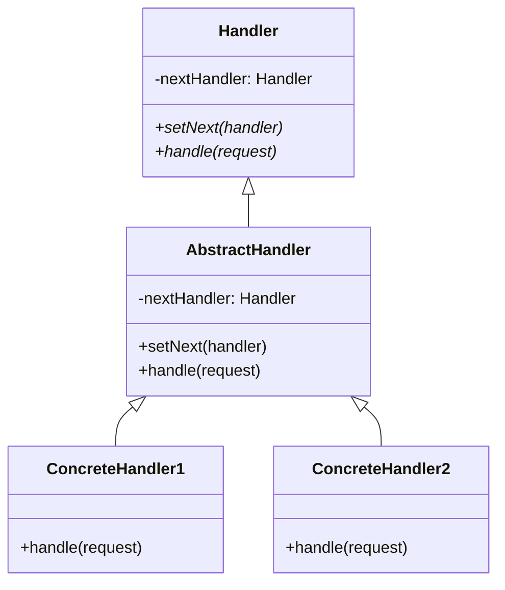
```mermaid
classDiagram
    class Handler {
        +setNext(handler)*
        +handle(request)*
        -nextHandler: Handler
    }
    class AbstractHandler {
        +setNext(handler)
        +handle(request)
        -nextHandler: Handler
    }
    class ConcreteHandler1 {
        +handle(request)
    }
    class ConcreteHandler2 {
        +handle(request)
    }
    Handler <|-- AbstractHandler
    AbstractHandler <|-- ConcreteHandler1
    AbstractHandler <|-- ConcreteHandler2
```

```python
from abc import ABC, abstractmethod
from typing import Optional, Any, Dict

# Base Handler
class Handler(ABC):
    @abstractmethod
    def set_next(self, handler: 'Handler') -> 'Handler':
        pass
    
    @abstractmethod
    def handle(self, request: Any) -> Optional[str]:
        pass

# Abstract Handler
class AbstractHandler(Handler):
    def __init__(self):
        self._next_handler: Optional[Handler] = None
    
    def set_next(self, handler: Handler) -> Handler:
        self._next_handler = handler
        return handler
    
    def handle(self, request: Any) -> Optional[str]:
        if self._next_handler:
            return self._next_handler.handle(request)
        return None

# Concrete Handlers
class AuthenticationHandler(AbstractHandler):
    def handle(self, request: Dict[str, Any]) -> Optional[str]:
        if not request.get("authenticated"):
            return "Authentication failed"
        
        print("Authentication passed")
        return super().handle(request)

class AuthorizationHandler(AbstractHandler):
    def handle(self, request: Dict[str, Any]) -> Optional[str]:
        if request.get("user_role") not in ["admin", "manager"]:
            return "Authorization failed: insufficient privileges"
        
        print("Authorization passed")
        return super().handle(request)

class ValidationHandler(AbstractHandler):
    def handle(self, request: Dict[str, Any]) -> Optional[str]:
        if not all(key in request for key in ["user_id", "action"]):
            return "Validation failed: missing required fields"
        
        print("Validation passed")
        return super().handle(request)

# Enhanced Chain Builder
class RequestChainBuilder:
    def __init__(self):
        self.first_handler: Optional[Handler] = None
        self.last_handler: Optional[Handler] = None
    
    def add_handler(self, handler: Handler) -> 'RequestChainBuilder':
        if not self.first_handler:
            self.first_handler = handler
            self.last_handler = handler
        else:
            self.last_handler.set_next(handler)
            self.last_handler = handler
        return self
    
    def build(self) -> Handler:
        if not self.first_handler:
            raise ValueError("Chain must have at least one handler")
        return self.first_handler

# Usage Example
def chain_example():
    # Build chain using builder
    chain = (RequestChainBuilder()
             .add_handler(AuthenticationHandler())
             .add_handler(AuthorizationHandler())
             .add_handler(ValidationHandler())
             .build())
    
    # Valid request
    valid_request = {
        "authenticated": True,
        "user_role": "admin",
        "user_id": "123",
        "action": "delete"
    }
    
    # Invalid request
    invalid_request = {
        "authenticated": True,
        "user_role": "guest",
        "user_id": "123"
    }
    
    # Process requests
    result1 = chain.handle(valid_request)
    result2 = chain.handle(invalid_request)
    
    return result1, result2

# Middleware-style Chain
class Middleware(Handler):
    def __init__(self, get_response):
        self.get_response = get_response
        super().__init__()
    
    def set_next(self, handler: Handler) -> Handler:
        self.get_response = handler.handle
        return handler
    
    def handle(self, request: Any) -> Optional[str]:
        return self.get_response(request)

class LoggingMiddleware(Middleware):
    def handle(self, request: Any) -> Optional[str]:
        print(f"Logging request: {request}")
        return self.get_response(request)

class TimingMiddleware(Middleware):
    def handle(self, request: Any) -> Optional[str]:
        import time
        start = time.time()
        response = self.get_response(request)
        print(f"Request took {time.time() - start:.2f} seconds")
        return response
```

##### Pros & Cons
✅ **Advantages**
- Decouples senders from receivers
- Single Responsibility Principle
- Open/Closed Principle
- Dynamic chain configuration
- Flexible request handling
- Easy to add new handlers

❌ **Disadvantages**
- No guarantee of handling
- Potential chain breaks
- Debug complexity
- Performance impact
- Order dependency

##### Testing
```python
import unittest

class ChainOfResponsibilityTests(unittest.TestCase):
    def setUp(self):
        self.chain = (RequestChainBuilder()
                     .add_handler(AuthenticationHandler())
                     .add_handler(AuthorizationHandler())
                     .add_handler(ValidationHandler())
                     .build())
    
    def test_valid_request(self):
        request = {
            "authenticated": True,
            "user_role": "admin",
            "user_id": "123",
            "action": "read"
        }
        result = self.chain.handle(request)
        self.assertIsNone(result)  # Chain completed successfully
    
    def test_authentication_failure(self):
        request = {
            "authenticated": False,
            "user_role": "admin",
            "user_id": "123",
            "action": "read"
        }
        result = self.chain.handle(request)
        self.assertIn("Authentication failed", result)
    
    def test_authorization_failure(self):
        request = {
            "authenticated": True,
            "user_role": "guest",
            "user_id": "123",
            "action": "read"
        }
        result = self.chain.handle(request)
        self.assertIn("Authorization failed", result)
    
    def test_validation_failure(self):
        request = {
            "authenticated": True,
            "user_role": "admin",
            "user_id": "123"
            # Missing 'action' field
        }
        result = self.chain.handle(request)
        self.assertIn("Validation failed", result)
```

##### Common Pitfalls
1. **Not Handling Chain Breaks**
```python
# Bad - No error handling
class BadHandler(AbstractHandler):
    def handle(self, request):
        # Might raise exception
        process_request(request)
        return super().handle(request)

# Good - Proper error handling
class GoodHandler(AbstractHandler):
    def handle(self, request):
        try:
            process_request(request)
            return super().handle(request)
        except Exception as e:
            return f"Error: {str(e)}"
```

2. **Tight Coupling to Chain Order**
```python
# Bad - Assumes specific chain order
class BadHandler(AbstractHandler):
    def handle(self, request):
        if not request.get("validated"):  # Depends on previous handler
            return "Error"

# Good - Independent handling
class GoodHandler(AbstractHandler):
    def handle(self, request):
        if not self.validate(request):
            return "Error"
```

##### Related Patterns
- Command can use Chain of Responsibility for command processing
- Composite can be used to build handler hierarchies
- Decorator adds responsibilities while Chain handles requests
- Observer provides alternative to Chain for event handling

#### 3.3 Command Pattern

##### Purpose
- Encapsulates a request as an object
- Decouples sender from receiver
- Enables operation queueing and logging
- Supports undo/redo functionality

##### Use Cases
1. **GUI Applications**
   - Menu items
   - Button clicks
   - Keyboard shortcuts

2. **Transaction Management**
   - Database operations
   - File system operations
   - Multi-step processes

3. **Task Scheduling**
   - Job queues
   - Batch processing
   - Remote execution

##### Implementation
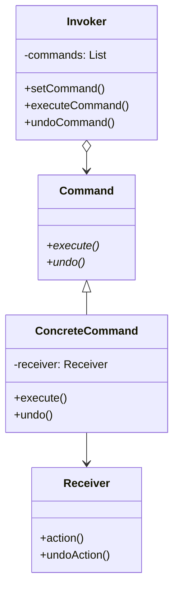
```mermaid
classDiagram
    class Command {
        +execute()*
        +undo()*
    }
    class ConcreteCommand {
        -receiver: Receiver
        +execute()
        +undo()
    }
    class Invoker {
        -commands: List
        +setCommand()
        +executeCommand()
        +undoCommand()
    }
    class Receiver {
        +action()
        +undoAction()
    }
    Command <|-- ConcreteCommand
    ConcreteCommand --> Receiver
    Invoker o--> Command
```

```python
from abc import ABC, abstractmethod
from typing import List, Dict, Optional
from datetime import datetime
import json

# Command Interface
class Command(ABC):
    @abstractmethod
    def execute(self) -> bool:
        pass
    
    @abstractmethod
    def undo(self) -> bool:
        pass

# Receiver
class Document:
    def __init__(self):
        self.content = ""
    
    def insert_text(self, text: str) -> None:
        self.content += text
    
    def delete_text(self, length: int) -> str:
        if length <= 0:
            return ""
        deleted_text = self.content[-length:]
        self.content = self.content[:-length]
        return deleted_text
    
    def get_content(self) -> str:
        return self.content

# Concrete Commands
class InsertTextCommand(Command):
    def __init__(self, document: Document, text: str):
        self.document = document
        self.text = text
    
    def execute(self) -> bool:
        self.document.insert_text(self.text)
        return True
    
    def undo(self) -> bool:
        self.document.delete_text(len(self.text))
        return True

class DeleteTextCommand(Command):
    def __init__(self, document: Document, length: int):
        self.document = document
        self.length = length
        self.deleted_text: str = ""
    
    def execute(self) -> bool:
        self.deleted_text = self.document.delete_text(self.length)
        return bool(self.deleted_text)
    
    def undo(self) -> bool:
        self.document.insert_text(self.deleted_text)
        return True

# Command Invoker with History
class TextEditor:
    def __init__(self):
        self.document = Document()
        self.command_history: List[Command] = []
        self.undo_history: List[Command] = []
    
    def execute_command(self, command: Command) -> bool:
        if command.execute():
            self.command_history.append(command)
            self.undo_history.clear()  # Clear redo stack
            return True
        return False
    
    def undo(self) -> bool:
        if not self.command_history:
            return False
        
        command = self.command_history.pop()
        if command.undo():
            self.undo_history.append(command)
            return True
        return False
    
    def redo(self) -> bool:
        if not self.undo_history:
            return False
        
        command = self.undo_history.pop()
        if command.execute():
            self.command_history.append(command)
            return True
        return False

# Composite Command
class CompositeCommand(Command):
    def __init__(self, commands: List[Command]):
        self.commands = commands
    
    def execute(self) -> bool:
        for command in self.commands:
            if not command.execute():
                # Rollback previously executed commands
                for cmd in reversed(self.commands[:self.commands.index(command)]):
                    cmd.undo()
                return False
        return True
    
    def undo(self) -> bool:
        for command in reversed(self.commands):
            if not command.undo():
                return False
        return True

# Macro Command (Recording)
class MacroCommand(Command):
    def __init__(self, name: str):
        self.name = name
        self.commands: List[Command] = []
    
    def add_command(self, command: Command) -> None:
        self.commands.append(command)
    
    def execute(self) -> bool:
        return CompositeCommand(self.commands).execute()
    
    def undo(self) -> bool:
        return CompositeCommand(self.commands).undo()

# Command Factory
class CommandFactory:
    @staticmethod
    def create_command(command_type: str, document: Document, **kwargs) -> Command:
        commands = {
            'insert': lambda: InsertTextCommand(document, kwargs.get('text', '')),
            'delete': lambda: DeleteTextCommand(document, kwargs.get('length', 0)),
        }
        return commands.get(command_type, lambda: None)()

# Usage Example
def command_example():
    editor = TextEditor()
    
    # Execute commands
    editor.execute_command(InsertTextCommand(editor.document, "Hello "))
    editor.execute_command(InsertTextCommand(editor.document, "World!"))
    print(f"Current text: {editor.document.get_content()}")
    
    # Undo last command
    editor.undo()
    print(f"After undo: {editor.document.get_content()}")
    
    # Redo last command
    editor.redo()
    print(f"After redo: {editor.document.get_content()}")
    
    # Create and execute macro
    macro = MacroCommand("format_text")
    macro.add_command(InsertTextCommand(editor.document, "\n"))
    macro.add_command(InsertTextCommand(editor.document, "New line"))
    editor.execute_command(macro)
    
    return editor.document.get_content()
```

##### Pros & Cons
✅ **Advantages**
- Decouples sender and receiver
- Supports undo/redo
- Enables command queueing
- Extensible command set
- Composite commands
- Transaction support

❌ **Disadvantages**
- Increased number of classes
- Complex command tracking
- Memory usage for history
- Potential state conflicts
- Synchronization challenges

##### Testing
```python
import unittest

class CommandTests(unittest.TestCase):
    def setUp(self):
        self.editor = TextEditor()
    
    def test_insert_command(self):
        cmd = InsertTextCommand(self.editor.document, "Hello")
        self.editor.execute_command(cmd)
        self.assertEqual(self.editor.document.get_content(), "Hello")
    
    def test_delete_command(self):
        self.editor.execute_command(InsertTextCommand(self.editor.document, "Hello"))
        self.editor.execute_command(DeleteTextCommand(self.editor.document, 2))
        self.assertEqual(self.editor.document.get_content(), "Hel")
    
    def test_undo_redo(self):
        cmd = InsertTextCommand(self.editor.document, "Hello")
        self.editor.execute_command(cmd)
        self.editor.undo()
        self.assertEqual(self.editor.document.get_content(), "")
        self.editor.redo()
        self.assertEqual(self.editor.document.get_content(), "Hello")
    
    def test_macro_command(self):
        macro = MacroCommand("test_macro")
        macro.add_command(InsertTextCommand(self.editor.document, "Hello"))
        macro.add_command(InsertTextCommand(self.editor.document, " World"))
        
        self.editor.execute_command(macro)
        self.assertEqual(self.editor.document.get_content(), "Hello World")
        
        self.editor.undo()
        self.assertEqual(self.editor.document.get_content(), "")
```

##### Common Pitfalls
1. **Not Handling Command Failure**
```python
# Bad - No error handling
class BadCommand(Command):
    def execute(self):
        self.receiver.risky_operation()  # Might fail!

# Good - Proper error handling
class GoodCommand(Command):
    def execute(self):
        try:
            return self.receiver.risky_operation()
        except Exception:
            return False
```

2. **Inappropriate Command State**
```python
# Bad - Mutable command state
class BadDeleteCommand(Command):
    def execute(self):
        self.deleted_text = self.document.delete_text()  # State changes!

# Good - Immutable command design
class GoodDeleteCommand(Command):
    def __init__(self, document, length):
        self.document = document
        self.length = length
        self.deleted_text = None  # Only for undo
```

##### Related Patterns
- Memento stores command state for undo
- Composite creates complex commands
- Iterator can traverse command history
- Strategy focuses on algorithm, Command on operation

#### 3.4 Iterator Pattern

##### Purpose
- Provides sequential access to elements
- Hides collection implementation details
- Supports multiple traversal methods
- Enables uniform collection access

##### Use Cases
1. **Collection Traversal**
   - Custom data structures
   - Complex object hierarchies
   - Database result sets

2. **Filtered Access**
   - Conditional iteration
   - Subset traversal
   - Access control

3. **Parallel Iteration**
   - Multiple cursors
   - Synchronized traversal
   - Stateful iteration

##### Implementation
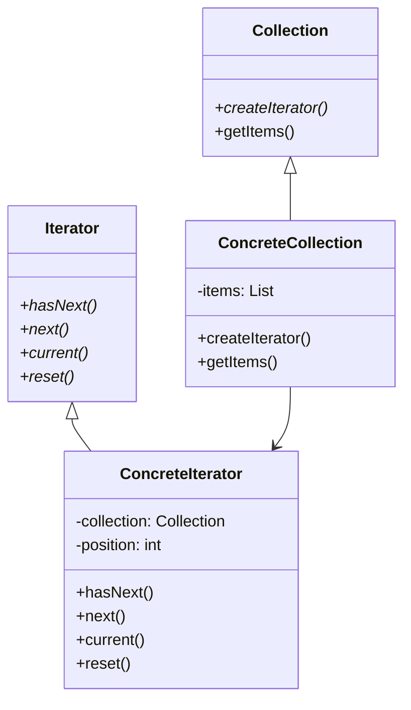
```mermaid
classDiagram
    class Iterator {
        +hasNext()*
        +next()*
        +current()*
        +reset()*
    }
    class ConcreteIterator {
        -collection: Collection
        -position: int
        +hasNext()
        +next()
        +current()
        +reset()
    }
    class Collection {
        +createIterator()*
        +getItems()
    }
    class ConcreteCollection {
        -items: List
        +createIterator()
        +getItems()
    }
    Iterator <|-- ConcreteIterator
    Collection <|-- ConcreteCollection
    ConcreteCollection --> ConcreteIterator
```

```python
from abc import ABC, abstractmethod
from typing import List, Any, Optional, Iterator as PyIterator
from collections.abc import Iterable

# Iterator Interface
class Iterator(ABC):
    @abstractmethod
    def has_next(self) -> bool:
        pass
    
    @abstractmethod
    def next(self) -> Any:
        pass
    
    @abstractmethod
    def current(self) -> Any:
        pass
    
    @abstractmethod
    def reset(self) -> None:
        pass

# Collection Interface
class Collection(ABC):
    @abstractmethod
    def create_iterator(self) -> Iterator:
        pass
    
    @abstractmethod
    def get_items(self) -> List[Any]:
        pass

# Concrete Iterator
class ListIterator(Iterator):
    def __init__(self, collection: List[Any]):
        self._collection = collection
        self._position = 0
    
    def has_next(self) -> bool:
        return self._position < len(self._collection)
    
    def next(self) -> Any:
        if self.has_next():
            item = self._collection[self._position]
            self._position += 1
            return item
        raise StopIteration()
    
    def current(self) -> Any:
        if 0 <= self._position < len(self._collection):
            return self._collection[self._position]
        raise IndexError("No current item")
    
    def reset(self) -> None:
        self._position = 0

# Concrete Collection
class ListCollection(Collection, Iterable):
    def __init__(self, items: List[Any]):
        self._items = items
    
    def create_iterator(self) -> Iterator:
        return ListIterator(self._items)
    
    def get_items(self) -> List[Any]:
        return self._items
    
    def __iter__(self) -> PyIterator[Any]:
        return iter(self._items)

# Filtered Iterator
class FilteredIterator(Iterator):
    def __init__(self, collection: List[Any], predicate):
        self._collection = collection
        self._predicate = predicate
        self._position = 0
    
    def has_next(self) -> bool:
        while self._position < len(self._collection):
            if self._predicate(self._collection[self._position]):
                return True
            self._position += 1
        return False
    
    def next(self) -> Any:
        if self.has_next():
            item = self._collection[self._position]
            self._position += 1
            return item
        raise StopIteration()
    
    def current(self) -> Any:
        if 0 <= self._position < len(self._collection):
            return self._collection[self._position]
        raise IndexError("No current item")
    
    def reset(self) -> None:
        self._position = 0

# Paginated Iterator
class PaginatedIterator(Iterator):
    def __init__(self, collection: List[Any], page_size: int):
        self._collection = collection
        self._page_size = page_size
        self._position = 0
    
    def has_next(self) -> bool:
        return self._position < len(self._collection)
    
    def next(self) -> List[Any]:
        if self.has_next():
            start = self._position
            end = min(start + self._page_size, len(self._collection))
            self._position = end
            return self._collection[start:end]
        raise StopIteration()
    
    def current(self) -> List[Any]:
        if 0 <= self._position < len(self._collection):
            start = self._position - self._page_size
            return self._collection[start:self._position]
        raise IndexError("No current page")
    
    def reset(self) -> None:
        self._position = 0

# Enhanced Collection with Multiple Iterators
class EnhancedCollection(Collection):
    def __init__(self, items: List[Any]):
        self._items = items
    
    def create_iterator(self) -> Iterator:
        return ListIterator(self._items)
    
    def create_filtered_iterator(self, predicate) -> Iterator:
        return FilteredIterator(self._items, predicate)
    
    def create_paginated_iterator(self, page_size: int) -> Iterator:
        return PaginatedIterator(self._items, page_size)
    
    def get_items(self) -> List[Any]:
        return self._items

# Usage Example
def iterator_example():
    # Create collection with items
    numbers = EnhancedCollection([1, 2, 3, 4, 5, 6, 7, 8, 9, 10])
    
    # Basic iteration
    iterator = numbers.create_iterator()
    result1 = []
    while iterator.has_next():
        result1.append(iterator.next())
    
    # Filtered iteration (even numbers)
    filtered = numbers.create_filtered_iterator(lambda x: x % 2 == 0)
    result2 = []
    while filtered.has_next():
        result2.append(filtered.next())
    
    # Paginated iteration
    paginated = numbers.create_paginated_iterator(3)
    result3 = []
    while paginated.has_next():
        result3.append(paginated.next())
    
    return result1, result2, result3
```

##### Pros & Cons
✅ **Advantages**
- Encapsulates traversal logic
- Supports multiple iteration types
- Single Responsibility Principle
- Clean collection interface
- Parallel iteration support
- Lazy evaluation possible

❌ **Disadvantages**
- Additional classes needed
- Complexity for simple cases
- State management overhead
- Memory usage for complex iterations
- Potential performance impact

##### Testing
```python
import unittest

class IteratorTests(unittest.TestCase):
    def setUp(self):
        self.numbers = EnhancedCollection([1, 2, 3, 4, 5])
    
    def test_basic_iteration(self):
        iterator = self.numbers.create_iterator()
        result = []
        while iterator.has_next():
            result.append(iterator.next())
        self.assertEqual(result, [1, 2, 3, 4, 5])
    
    def test_filtered_iteration(self):
        filtered = self.numbers.create_filtered_iterator(lambda x: x % 2 == 0)
        result = []
        while filtered.has_next():
            result.append(filtered.next())
        self.assertEqual(result, [2, 4])
    
    def test_paginated_iteration(self):
        paginated = self.numbers.create_paginated_iterator(2)
        result = []
        while paginated.has_next():
            result.append(paginated.next())
        self.assertEqual(result, [[1, 2], [3, 4], [5]])
    
    def test_iterator_reset(self):
        iterator = self.numbers.create_iterator()
        # Consume all items
        while iterator.has_next():
            iterator.next()
        iterator.reset()
        self.assertTrue(iterator.has_next())
        self.assertEqual(iterator.next(), 1)
```

##### Common Pitfalls
1. **Not Handling Collection Modifications**
```python
# Bad - No modification checks
class UnsafeIterator(Iterator):
    def next(self):
        return self._collection[self._position]  # Collection might change!

# Good - Modification detection
class SafeIterator(Iterator):
    def __init__(self, collection):
        self._collection = collection
        self._version = collection.version
    
    def next(self):
        if self._version != self._collection.version:
            raise RuntimeError("Collection modified during iteration")
```

2. **Incorrect State Management**
```python
# Bad - Poor state management
class BadIterator(Iterator):
    def next(self):
        self._position += 1  # Increment before check!
        return self._collection[self._position]

# Good - Proper state management
class GoodIterator(Iterator):
    def next(self):
        if not self.has_next():
            raise StopIteration()
        item = self._collection[self._position]
        self._position += 1
        return item
```

##### Related Patterns
- Composite uses Iterator to traverse structures
- Factory Method creates appropriate iterators
- Memento can store iterator state
- Visitor uses Iterator for traversal

[Should I continue with the Mediator pattern next?]

### Creational Patterns: Use Cases and Relationships

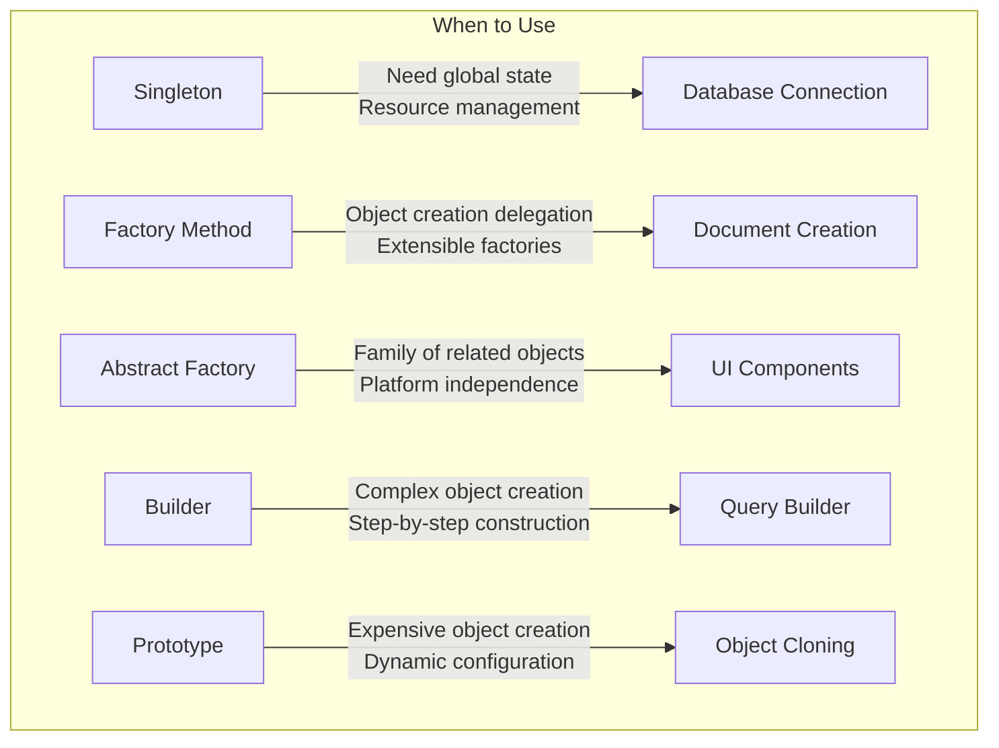
```mermaid
graph TD
    subgraph When to Use
        S[Singleton] -->|"Need global state<br/>Resource management"| S1[Database Connection]
        FM[Factory Method] -->|"Object creation delegation<br/>Extensible factories"| FM1[Document Creation]
        AF[Abstract Factory] -->|"Family of related objects<br/>Platform independence"| AF1[UI Components]
        B[Builder] -->|"Complex object creation<br/>Step-by-step construction"| B1[Query Builder]
        P[Prototype] -->|"Expensive object creation<br/>Dynamic configuration"| P1[Object Cloning]
    end
```

### Pattern Relationships - Creational
```mermaid
graph LR
    subgraph Creational Patterns
        S[Singleton] -->|"can use"| FM[Factory Method]
        FM -->|"leads to"| AF[Abstract Factory]
        AF -->|"can use"| B[Builder]
        B -->|"can use"| P[Prototype]
        P -->|"can implement"| S
    end
```

### Implementation Considerations
1. **Singleton**
   - Thread safety consideration
   - Lazy vs eager initialization
   - Global state management

2. **Factory Method**
   - Extensibility
   - Separation of concerns
   - Dependency management

3. **Abstract Factory**
   - Family consistency
   - Platform independence
   - Product variations

4. **Builder**
   - Complex construction
   - Parameter management
   - Immutable objects

5. **Prototype**
   - Deep vs shallow copy
   - Clone consistency
   - Performance optimization

#### 2. Bridge
```mermaid
classDiagram
    class Abstraction {
        -implementation: Implementation
        +operation()
    }
    class RefinedAbstraction {
        +operation()
    }
    class Implementation {
        +operationImplementation()*
    }
    class ConcreteImplementationA {
        +operationImplementation()
    }
    class ConcreteImplementationB {
        +operationImplementation()
    }
    Abstraction <|-- RefinedAbstraction
    Abstraction o--> Implementation
    Implementation <|.. ConcreteImplementationA
    Implementation <|.. ConcreteImplementationB
```

```python
from abc import ABC, abstractmethod

class Implementation(ABC):
    @abstractmethod
    def operation_implementation(self) -> str:
        pass

class ConcreteImplementationA(Implementation):
    def operation_implementation(self) -> str:
        return "ConcreteImplementationA: Result"

class ConcreteImplementationB(Implementation):
    def operation_implementation(self) -> str:
        return "ConcreteImplementationB: Result"

class Abstraction:
    def __init__(self, implementation: Implementation) -> None:
        self.implementation = implementation

    def operation(self) -> str:
        return f"Abstraction: {self.implementation.operation_implementation()}"

class RefinedAbstraction(Abstraction):
    def operation(self) -> str:
        return f"RefinedAbstraction: {self.implementation.operation_implementation()}"

# Usage
implementation = ConcreteImplementationA()
abstraction = Abstraction(implementation)
result = abstraction.operation()
```

#### 3. Composite
```mermaid
classDiagram
    class Component {
        +operation()*
        +add(Component)*
        +remove(Component)*
        +getChild(int)*
    }
    class Leaf {
        +operation()
    }
    class Composite {
        -children: List
        +operation()
        +add(Component)
        +remove(Component)
        +getChild(int)
    }
    Component <|-- Leaf
    Component <|-- Composite
    Composite o--> Component
```

```python
from abc import ABC, abstractmethod
from typing import List

class Component(ABC):
    @property
    def parent(self) -> 'Component':
        return self._parent

    @parent.setter
    def parent(self, parent: 'Component'):
        self._parent = parent

    def add(self, component: 'Component') -> None:
        pass

    def remove(self, component: 'Component') -> None:
        pass

    def is_composite(self) -> bool:
        return False

    @abstractmethod
    def operation(self) -> str:
        pass

class Leaf(Component):
    def operation(self) -> str:
        return "Leaf"

class Composite(Component):
    def __init__(self) -> None:
        self._children: List[Component] = []

    def add(self, component: Component) -> None:
        self._children.append(component)
        component.parent = self

    def remove(self, component: Component) -> None:
        self._children.remove(component)
        component.parent = None

    def is_composite(self) -> bool:
        return True

    def operation(self) -> str:
        results = []
        for child in self._children:
            results.append(child.operation())
        return f"Branch({'+'.join(results)})"

# Usage
tree = Composite()
branch1 = Composite()
branch2 = Composite()
leaf1 = Leaf()
leaf2 = Leaf()

branch1.add(leaf1)
branch2.add(leaf2)
tree.add(branch1)
tree.add(branch2)
```

#### 4. Decorator
```mermaid
classDiagram
    class Component {
        +operation()*
    }
    class Decorator {
        -component: Component
        +operation()
    }
    class ConcreteComponent {
        +operation()
    }
    class ConcreteDecoratorA {
        +operation()
        -addedBehavior()
    }
    class ConcreteDecoratorB {
        +operation()
        -addedBehavior()
    }
    Component <|-- ConcreteComponent
    Component <|-- Decorator
    Decorator <|-- ConcreteDecoratorA
    Decorator <|-- ConcreteDecoratorB
    Decorator o--> Component
```

```python
from abc import ABC, abstractmethod

class Component(ABC):
    @abstractmethod
    def operation(self) -> str:
        pass

class ConcreteComponent(Component):
    def operation(self) -> str:
        return "ConcreteComponent"

class Decorator(Component):
    def __init__(self, component: Component) -> None:
        self._component = component

    @property
    def component(self) -> Component:
        return self._component

    def operation(self) -> str:
        return self._component.operation()

class ConcreteDecoratorA(Decorator):
    def operation(self) -> str:
        return f"ConcreteDecoratorA({self.component.operation()})"

class ConcreteDecoratorB(Decorator):
    def operation(self) -> str:
        return f"ConcreteDecoratorB({self.component.operation()})"

# Usage
simple = ConcreteComponent()
decorator1 = ConcreteDecoratorA(simple)
decorator2 = ConcreteDecoratorB(decorator1)
result = decorator2.operation()
```

#### 5. Facade
```mermaid
classDiagram
    class Facade {
        -subsystem1: Subsystem1
        -subsystem2: Subsystem2
        -subsystem3: Subsystem3
        +operation()
    }
    class Subsystem1 {
        +operation1()
    }
    class Subsystem2 {
        +operation2()
    }
    class Subsystem3 {
        +operation3()
    }
    Facade --> Subsystem1
    Facade --> Subsystem2
    Facade --> Subsystem3
```

```python
class Subsystem1:
    def operation1(self) -> str:
        return "Subsystem1: Ready!"

    def operation_n(self) -> str:
        return "Subsystem1: Go!"

class Subsystem2:
    def operation1(self) -> str:
        return "Subsystem2: Get ready!"

    def operation_z(self) -> str:
        return "Subsystem2: Fire!"

class Facade:
    def __init__(self, subsystem1: Subsystem1 = None, subsystem2: Subsystem2 = None) -> None:
        self._subsystem1 = subsystem1 or Subsystem1()
        self._subsystem2 = subsystem2 or Subsystem2()

    def operation(self) -> str:
        results = []
        results.append("Facade initializes subsystems:")
        results.append(self._subsystem1.operation1())
        results.append(self._subsystem2.operation1())
        results.append("Facade orders subsystems to perform the action:")
        results.append(self._subsystem1.operation_n())
        results.append(self._subsystem2.operation_z())
        return "\n".join(results)

# Usage
facade = Facade()
result = facade.operation()
```

#### 6. Flyweight
```mermaid
classDiagram
    class FlyweightFactory {
        -flyweights: dict
        +getFlyweight(state)
        +listFlyweights()
    }
    class Flyweight {
        -sharedState: dict
        +operation(uniqueState)
    }
    class Context {
        -uniqueState: dict
        -flyweight: Flyweight
        +operation()
    }
    FlyweightFactory --> Flyweight
    Context --> Flyweight
```

```python
from typing import Dict

class Flyweight:
    def __init__(self, shared_state: Dict) -> None:
        self._shared_state = shared_state

    def operation(self, unique_state: Dict) -> None:
        print(f"Flyweight: Shared ({self._shared_state}) and unique ({unique_state}) state.")

class FlyweightFactory:
    _flyweights: Dict[str, Flyweight] = {}

    def __init__(self, initial_flyweights: Dict) -> None:
        for state in initial_flyweights:
            self._flyweights[self.get_key(state)] = Flyweight(state)

    def get_key(self, state: Dict) -> str:
        return "_".join(sorted(state))

    def get_flyweight(self, shared_state: Dict) -> Flyweight:
        key = self.get_key(shared_state)

        if not self._flyweights.get(key):
            print("FlyweightFactory: Can't find a flyweight, creating new one.")
            self._flyweights[key] = Flyweight(shared_state)
        else:
            print("FlyweightFactory: Reusing existing flyweight.")

        return self._flyweights[key]

    def list_flyweights(self) -> None:
        count = len(self._flyweights)
        print(f"FlyweightFactory: I have {count} flyweights:")
        print("\n".join(map(str, self._flyweights.keys())))

# Usage
factory = FlyweightFactory([
    {"brand": "BMW", "model": "M5", "color": "red"},
    {"brand": "BMW", "model": "X5", "color": "black"}
])

factory.list_flyweights()

flyweight = factory.get_flyweight({
    "brand": "BMW",
    "model": "M5",
    "color": "red"
})
```

#### 7. Proxy
```mermaid
classDiagram
    class Subject {
        +request()*
    }
    class RealSubject {
        +request()
    }
    class Proxy {
        -realSubject: RealSubject
        +request()
        -checkAccess()
        -logAccess()
    }
    Subject <|-- RealSubject
    Subject <|-- Proxy
    Proxy --> RealSubject
```

```python
from abc import ABC, abstractmethod

class Subject(ABC):
    @abstractmethod
    def request(self) -> None:
        pass

class RealSubject(Subject):
    def request(self) -> None:
        print("RealSubject: Handling request.")

class Proxy(Subject):
    def __init__(self, real_subject: RealSubject) -> None:
        self._real_subject = real_subject

    def request(self) -> None:
        if self.check_access():
            self._real_subject.request()
            self.log_access()

    def check_access(self) -> bool:
        print("Proxy: Checking access prior to firing a real request.")
        return True

    def log_access(self) -> None:
        print("Proxy: Logging the time of request.")

# Usage
real_subject = RealSubject()
proxy = Proxy(real_subject)
proxy.request()
```

### Structural Patterns: Relationships and Use Cases

```mermaid
graph TD
    subgraph Use Cases
        A[Adapter] -->|"Interface Incompatibility"| A1[Legacy Integration]
        B[Bridge] -->|"Platform Variations"| B1[Cross-platform UI]
        C[Composite] -->|"Tree Structures"| C1[File Systems]
        D[Decorator] -->|"Dynamic Features"| D1[UI Components]
        F[Facade] -->|"Complex Subsystems"| F1[Library Wrapper]
        FW[Flyweight] -->|"Memory Optimization"| FW1[Text Formatting]
        P[Proxy] -->|"Access Control"| P1[Resource Management]
    end
```

### Pattern Relationships - Structural
```mermaid
graph LR
    subgraph Structural Patterns
        A[Adapter] -->|"works with"| F[Facade]
        B[Bridge] -->|"combines with"| D[Decorator]
        C[Composite] -->|"uses"| D
        F -->|"uses"| P[Proxy]
        FW[Flyweight] -->|"optimizes"| C
    end
```

### Implementation Considerations
1. **Adapter**
   - Interface translation
   - Legacy code integration
   - Type conversion

2. **Bridge**
   - Platform independence
   - Implementation separation
   - Feature variations

3. **Composite**
   - Tree structure management
   - Child-parent relationships
   - Recursive operations

4. **Decorator**
   - Dynamic behavior addition
   - Single Responsibility Principle
   - Feature combination

5. **Facade**
   - Subsystem simplification
   - Dependency management
   - Interface unification

6. **Flyweight**
   - Memory optimization
   - State sharing
   - Performance improvement

7. **Proxy**
   - Access control
   - Lazy initialization
   - Resource management

### Behavioral Patterns

#### 1. Chain of Responsibility
```mermaid
classDiagram
    class Handler {
        +setNext(handler)*
        +handle(request)*
        -nextHandler: Handler
    }
    class BaseHandler {
        +setNext(handler)
        +handle(request)
    }
    class ConcreteHandler1 {
        +handle(request)
    }
    class ConcreteHandler2 {
        +handle(request)
    }
    Handler <|-- BaseHandler
    BaseHandler <|-- ConcreteHandler1
    BaseHandler <|-- ConcreteHandler2
```

```python
from abc import ABC, abstractmethod
from typing import Optional, Any

class Handler(ABC):
    @abstractmethod
    def set_next(self, handler: 'Handler') -> 'Handler':
        pass

    @abstractmethod
    def handle(self, request: Any) -> Optional[str]:
        pass

class AbstractHandler(Handler):
    _next_handler: Optional[Handler] = None

    def set_next(self, handler: Handler) -> Handler:
        self._next_handler = handler
        return handler

    @abstractmethod
    def handle(self, request: Any) -> Optional[str]:
        if self._next_handler:
            return self._next_handler.handle(request)
        return None

class MonkeyHandler(AbstractHandler):
    def handle(self, request: Any) -> Optional[str]:
        if request == "Banana":
            return f"Monkey: I'll eat the {request}"
        return super().handle(request)

class SquirrelHandler(AbstractHandler):
    def handle(self, request: Any) -> Optional[str]:
        if request == "Nut":
            return f"Squirrel: I'll eat the {request}"
        return super().handle(request)

# Usage
monkey = MonkeyHandler()
squirrel = SquirrelHandler()
monkey.set_next(squirrel)

print(monkey.handle("Nut"))  # Squirrel handles
print(monkey.handle("Banana"))  # Monkey handles
```

#### 2. Command
```mermaid
classDiagram
    class Command {
        +execute()*
        +undo()*
    }
    class Invoker {
        -command: Command
        +setCommand(command)
        +executeCommand()
    }
    class Receiver {
        +action()
    }
    class ConcreteCommand {
        -receiver: Receiver
        +execute()
        +undo()
    }
    Command <|-- ConcreteCommand
    ConcreteCommand --> Receiver
    Invoker o--> Command
```

```python
from abc import ABC, abstractmethod
from typing import List

class Command(ABC):
    @abstractmethod
    def execute(self) -> None:
        pass

    @abstractmethod
    def undo(self) -> None:
        pass

class Receiver:
    def do_something(self, a: str) -> None:
        print(f"Receiver: Working on ({a})")

    def do_something_else(self, b: str) -> None:
        print(f"Receiver: Also working on ({b})")

class SimpleCommand(Command):
    def __init__(self, payload: str) -> None:
        self._payload = payload

    def execute(self) -> None:
        print(f"SimpleCommand: See, I can do simple things like printing ({self._payload})")

    def undo(self) -> None:
        print(f"SimpleCommand: Undoing ({self._payload})")

class ComplexCommand(Command):
    def __init__(self, receiver: Receiver, a: str, b: str) -> None:
        self._receiver = receiver
        self._a = a
        self._b = b

    def execute(self) -> None:
        print("ComplexCommand: Complex stuff should be done by a receiver object")
        self._receiver.do_something(self._a)
        self._receiver.do_something_else(self._b)

    def undo(self) -> None:
        print("ComplexCommand: Undoing complex stuff")

class Invoker:
    def __init__(self) -> None:
        self._commands: List[Command] = []
        self._history: List[Command] = []

    def add_command(self, command: Command) -> None:
        self._commands.append(command)

    def execute_commands(self) -> None:
        for command in self._commands:
            command.execute()
            self._history.append(command)

    def undo_last(self) -> None:
        if self._history:
            command = self._history.pop()
            command.undo()

# Usage
invoker = Invoker()
invoker.add_command(SimpleCommand("Hi!"))
receiver = Receiver()
invoker.add_command(ComplexCommand(receiver, "Send email", "Save report"))
invoker.execute_commands()
invoker.undo_last()
```

#### 3. Iterator
```mermaid
classDiagram
    class Iterator {
        +next()*
        +hasNext()*
        +current()*
    }
    class Container {
        +createIterator()*
    }
    class ConcreteIterator {
        -collection: Collection
        -position: int
        +next()
        +hasNext()
        +current()
    }
    class ConcreteContainer {
        -items: List
        +createIterator()
    }
    Iterator <|-- ConcreteIterator
    Container <|-- ConcreteContainer
    ConcreteContainer --> ConcreteIterator
```

```python
from abc import ABC, abstractmethod
from typing import Any, List

class Iterator(ABC):
    @abstractmethod
    def next(self) -> Any:
        pass

    @abstractmethod
    def has_next(self) -> bool:
        pass

    @abstractmethod
    def current(self) -> Any:
        pass

class Container(ABC):
    @abstractmethod
    def create_iterator(self) -> Iterator:
        pass

class ConcreteIterator(Iterator):
    def __init__(self, collection: List[Any]) -> None:
        self._collection = collection
        self._position = 0

    def next(self) -> Any:
        try:
            item = self._collection[self._position]
            self._position += 1
            return item
        except IndexError:
            return None

    def has_next(self) -> bool:
        return self._position < len(self._collection)

    def current(self) -> Any:
        try:
            return self._collection[self._position]
        except IndexError:
            return None

class ConcreteContainer(Container):
    def __init__(self) -> None:
        self._items: List[Any] = []

    def add_item(self, item: Any) -> None:
        self._items.append(item)

    def create_iterator(self) -> Iterator:
        return ConcreteIterator(self._items)

# Usage
container = ConcreteContainer()
container.add_item("First")
container.add_item("Second")
container.add_item("Third")

iterator = container.create_iterator()
while iterator.has_next():
    print(iterator.next())
```

#### 4. Mediator
```mermaid
classDiagram
    class Mediator {
        +notify(sender, event)*
    }
    class BaseComponent {
        -mediator: Mediator
        +setMediator(mediator)
    }
    class ConcreteMediator {
        -component1: Component1
        -component2: Component2
        +notify(sender, event)
    }
    class Component1 {
        +doA()
    }
    class Component2 {
        +doB()
    }
    Mediator <|-- ConcreteMediator
    BaseComponent <|-- Component1
    BaseComponent <|-- Component2
    ConcreteMediator --> Component1
    ConcreteMediator --> Component2
```

```python
from abc import ABC, abstractmethod

class Mediator(ABC):
    @abstractmethod
    def notify(self, sender: object, event: str) -> None:
        pass

class BaseComponent:
    def __init__(self, mediator: Mediator = None) -> None:
        self._mediator = mediator

    @property
    def mediator(self) -> Mediator:
        return self._mediator

    @mediator.setter
    def mediator(self, mediator: Mediator) -> None:
        self._mediator = mediator

class Component1(BaseComponent):
    def do_a(self) -> None:
        print("Component 1 does A")
        self.mediator.notify(self, "A")

class Component2(BaseComponent):
    def do_b(self) -> None:
        print("Component 2 does B")
        self.mediator.notify(self, "B")

class ConcreteMediator(Mediator):
    def __init__(self, component1: Component1, component2: Component2) -> None:
        self._component1 = component1
        self._component1.mediator = self
        self._component2 = component2
        self._component2.mediator = self

    def notify(self, sender: object, event: str) -> None:
        if event == "A":
            print("Mediator reacts on A and triggers following operations:")
            self._component2.do_b()
        elif event == "B":
            print("Mediator reacts on B and triggers following operations:")
            self._component1.do_a()

# Usage
c1 = Component1()
c2 = Component2()
mediator = ConcreteMediator(c1, c2)

c1.do_a()  # Triggers c2's do_b through mediator
```

#### 5. Memento
```mermaid
classDiagram
    class Originator {
        -state: string
        +save(): Memento
        +restore(memento)
    }
    class Memento {
        -state: string
        +getState()
    }
    class Caretaker {
        -mementos: List
        +backup()
        +undo()
    }
    Originator --> Memento
    Caretaker o--> Memento
```

```python
from __future__ import annotations
from abc import ABC, abstractmethod
from datetime import datetime
from random import sample
from string import ascii_letters, digits

class Originator:
    def __init__(self, state: str) -> None:
        self._state = state
        print(f"Originator: Initial state = {self._state}")

    def do_something(self) -> None:
        print("Originator: Doing something important.")
        self._state = self._generate_random_string(30)
        print(f"Originator: State has changed to {self._state}")

    def _generate_random_string(self, length: int = 10) -> str:
        return "".join(sample(ascii_letters + digits, length))

    def save(self) -> Memento:
        return ConcreteMemento(self._state)

    def restore(self, memento: Memento) -> None:
        self._state = memento.get_state()
        print(f"Originator: State after restore: {self._state}")

class Memento(ABC):
    @abstractmethod
    def get_name(self) -> str:
        pass

    @abstractmethod
    def get_date(self) -> str:
        pass

class ConcreteMemento(Memento):
    def __init__(self, state: str) -> None:
        self._state = state
        self._date = str(datetime.now())

    def get_state(self) -> str:
        return self._state

    def get_name(self) -> str:
        return f"{self._date} / ({self._state[0:9]}...)"

    def get_date(self) -> str:
        return self._date

class Caretaker:
    def __init__(self, originator: Originator) -> None:
        self._mementos = []
        self._originator = originator

    def backup(self) -> None:
        print("Caretaker: Saving Originator's state...")
        self._mementos.append(self._originator.save())

    def undo(self) -> None:
        if not len(self._mementos):
            return

        memento = self._mementos.pop()
        print(f"Caretaker: Restoring state to: {memento.get_name()}")
        try:
            self._originator.restore(memento)
        except Exception:
            self.undo()

    def show_history(self) -> None:
        print("Caretaker: Here's the list of mementos:")
        for memento in self._mementos:
            print(memento.get_name())

# Usage
originator = Originator("Super-duper-super-puper-super.")
caretaker = Caretaker(originator)

caretaker.backup()
originator.do_something()

caretaker.backup()
originator.do_something()

caretaker.backup()
originator.do_something()

print("\nClient: Now, let's see the history!")
caretaker.show_history()

print("\nClient: Roll back!")
caretaker.undo()

print("\nClient: Roll back again!")
caretaker.undo()
```

#### 6. State
```mermaid
classDiagram
    class Context {
        -state: State
        +setState(state)
        +request1()
        +request2()
    }
    class State {
        +handle1()*
        +handle2()*
    }
    class ConcreteStateA {
        +handle1()
        +handle2()
    }
    class ConcreteStateB {
        +handle1()
        +handle2()
    }
    Context o--> State
    State <|-- ConcreteStateA
    State <|-- ConcreteStateB
```

```python
from abc import ABC, abstractmethod

class State(ABC):
    @property
    def context(self) -> 'Context':
        return self._context

    @context.setter
    def context(self, context: 'Context') -> None:
        self._context = context

    @abstractmethod
    def handle1(self) -> None:
        pass

    @abstractmethod
    def handle2(self) -> None:
        pass

class Context:
    _state = None

    def __init__(self, state: State) -> None:
        self.transition_to(state)

    def transition_to(self, state: State):
        print(f"Context: Transition to {type(state).__name__}")
        self._state = state
        self._state.context = self

    def request1(self):
        self._state.handle1()

    def request2(self):
        self._state.handle2()

class ConcreteStateA(State):
    def handle1(self) -> None:
        print("ConcreteStateA handles request1.")
        print("ConcreteStateA wants to change the state of the context.")
        self.context.transition_to(ConcreteStateB())

    def handle2(self) -> None:
        print("ConcreteStateA handles request2.")

class ConcreteStateB(State):
    def handle1(self) -> None:
        print("ConcreteStateB handles request1.")

    def handle2(self) -> None:
        print("ConcreteStateB handles request2.")
        print("ConcreteStateB wants to change the state of the context.")
        self.context.transition_to(ConcreteStateA())

# Usage
context = Context(ConcreteStateA())
context.request1()
context.request2()
```

#### 7. Strategy
```mermaid
classDiagram
    class Context {
        -strategy: Strategy
        +setStrategy(Strategy)
        +doSomeBusinessLogic()
    }
    class Strategy {
        +doAlgorithm()*
    }
    class ConcreteStrategyA {
        +doAlgorithm()
    }
    class ConcreteStrategyB {
        +doAlgorithm()
    }
    Context o--> Strategy
    Strategy <|-- ConcreteStrategyA
    Strategy <|-- ConcreteStrategyB
```

```python
from abc import ABC, abstractmethod
from typing import List

class Strategy(ABC):
    @abstractmethod
    def do_algorithm(self, data: List) -> List:
        pass

class Context:
    def __init__(self, strategy: Strategy) -> None:
        self._strategy = strategy

    @property
    def strategy(self) -> Strategy:
        return self._strategy

    @strategy.setter
    def strategy(self, strategy: Strategy) -> None:
        self._strategy = strategy

    def do_some_business_logic(self) -> None:
        print("Context: Sorting data using the strategy")
        result = self._strategy.do_algorithm(["a", "b", "c", "d", "e"])
        print(",".join(result))

class ConcreteStrategyA(Strategy):
    def do_algorithm(self, data: List) -> List:
        return sorted(data)

class ConcreteStrategyB(Strategy):
    def do_algorithm(self, data: List) -> List:
        return reversed(sorted(data))

# Usage
context = Context(ConcreteStrategyA())
print("Client: Strategy is set to normal sorting")
context.do_some_business_logic()

print("Client: Strategy is set to reverse sorting")
context.strategy = ConcreteStrategyB()
context.do_some_business_logic()
```

#### 8. Template Method
```mermaid
classDiagram
    class AbstractClass {
        +templateMethod()
        #requiredOperation1()*
        #requiredOperation2()*
        #hook1()
        #hook2()
    }
    class ConcreteClass {
        #requiredOperation1()
        #requiredOperation2()
        #hook1()
    }
    AbstractClass <|-- ConcreteClass
```

```python
from abc import ABC, abstractmethod

class AbstractClass(ABC):
    def template_method(self) -> None:
        """
        The template method defines the skeleton of an algorithm.
        """
        self.base_operation1()
        self.required_operations1()
        self.base_operation2()
        self.hook1()
        self.required_operations2()
        self.base_operation3()
        self.hook2()

    def base_operation1(self) -> None:
        print("AbstractClass: I am doing the bulk of the work")

    def base_operation2(self) -> None:
        print("AbstractClass: But I let subclasses override some operations")

    def base_operation3(self) -> None:
        print("AbstractClass: But I am doing the bulk of the work anyway")

    @abstractmethod
    def required_operations1(self) -> None:
        pass

    @abstractmethod
    def required_operations2(self) -> None:
        pass

    def hook1(self) -> None:
        pass

    def hook2(self) -> None:
        pass

class ConcreteClass1(AbstractClass):
    def required_operations1(self) -> None:
        print("ConcreteClass1: Implemented Operation1")

    def required_operations2(self) -> None:
        print("ConcreteClass1: Implemented Operation2")

    def hook1(self) -> None:
        print("ConcreteClass1: Overridden Hook1")

# Usage
concrete_class = ConcreteClass1()
concrete_class.template_method()
```

#### 9. Visitor
```mermaid
classDiagram
    class Visitor {
        +visitConcreteComponentA()*
        +visitConcreteComponentB()*
    }
    class Component {
        +accept(visitor)*
    }
    class ConcreteVisitor1 {
        +visitConcreteComponentA()
        +visitConcreteComponentB()
    }
    class ConcreteComponentA {
        +accept(visitor)
        +exclusiveMethodA()
    }
    class ConcreteComponentB {
        +accept(visitor)
        +exclusiveMethodB()
    }
    Component <|-- ConcreteComponentA
    Component <|-- ConcreteComponentB
    Visitor <|-- ConcreteVisitor1
```

```python
from abc import ABC, abstractmethod
from typing import List

class Component(ABC):
    @abstractmethod
    def accept(self, visitor: 'Visitor') -> None:
        pass

class ConcreteComponentA(Component):
    def accept(self, visitor: 'Visitor') -> None:
        visitor.visit_concrete_component_a(self)

    def exclusive_method_of_concrete_component_a(self) -> str:
        return "A"

class ConcreteComponentB(Component):
    def accept(self, visitor: 'Visitor') -> None:
        visitor.visit_concrete_component_b(self)

    def special_method_of_concrete_component_b(self) -> str:
        return "B"

class Visitor(ABC):
    @abstractmethod
    def visit_concrete_component_a(self, element: ConcreteComponentA) -> None:
        pass

    @abstractmethod
    def visit_concrete_component_b(self, element: ConcreteComponentB) -> None:
        pass

class ConcreteVisitor1(Visitor):
    def visit_concrete_component_a(self, element: ConcreteComponentA) -> None:
        print(f"{element.exclusive_method_of_concrete_component_a()} + ConcreteVisitor1")

    def visit_concrete_component_b(self, element: ConcreteComponentB) -> None:
        print(f"{element.special_method_of_concrete_component_b()} + ConcreteVisitor1")

class ConcreteVisitor2(Visitor):
    def visit_concrete_component_a(self, element: ConcreteComponentA) -> None:
        print(f"{element.exclusive_method_of_concrete_component_a()} + ConcreteVisitor2")

    def visit_concrete_component_b(self, element: ConcreteComponentB) -> None:
        print(f"{element.special_method_of_concrete_component_b()} + ConcreteVisitor2")

# Usage
components = [ConcreteComponentA(), ConcreteComponentB()]
visitor1 = ConcreteVisitor1()
visitor2 = ConcreteVisitor2()

for component in components:
    component.accept(visitor1)
    component.accept(visitor2)
```

## Pattern Relationships and Selection Guide

### Complete Pattern Relationship Map
```mermaid
graph TB
    subgraph Creational
        S[Singleton]
        FM[Factory Method]
        AF[Abstract Factory]
        B[Builder]
        P[Prototype]
    end

    subgraph Structural
        A[Adapter]
        BR[Bridge]
        C[Composite]
        D[Decorator]
        F[Facade]
        FW[Flyweight]
        PR[Proxy]
    end

    subgraph Behavioral
        CoR[Chain of Resp]
        CM[Command]
        I[Iterator]
        M[Mediator]
        ME[Memento]
        O[Observer]
        ST[State]
        STR[Strategy]
        T[Template]
        V[Visitor]
    end

    %% Creational Relationships
    FM --> AF
    AF --> B
    B --> P
    P --> S

    %% Structural Relationships
    A --> F
    BR --> D
    C --> D
    F --> PR
    FW --> C

    %% Behavioral Relationships
    CoR --> CM
    M --> O
    ST --> STR
    T --> STR
    V --> I

    %% Cross-Category Relationships
    AF --> BR
    B --> C
    FM --> A
    D --> O
    PR --> CoR
```

### Pattern Selection Decision Tree
```mermaid
flowchart TD
    Start[Problem Analysis] --> Q1{What's the Main Concern?}
    
    Q1 -->|Object Creation| C[Creational Pattern Needed]
    Q1 -->|Object Structure| S[Structural Pattern Needed]
    Q1 -->|Object Behavior| B[Behavioral Pattern Needed]
    
    C --> C1{Creation Complexity?}
    C1 -->|Single Instance| C2[Singleton]
    C1 -->|Family of Objects| C3[Abstract Factory]
    C1 -->|Complex Object| C4[Builder]
    C1 -->|Clone Based| C5[Prototype]
    
    S --> S1{Structure Need?}
    S1 -->|Interface Adaptation| S2[Adapter]
    S1 -->|Platform Independence| S3[Bridge]
    S1 -->|Tree Structure| S4[Composite]
    S1 -->|Dynamic Enhancement| S5[Decorator]
    S1 -->|System Simplification| S6[Facade]
    
    B --> B1{Behavior Type?}
    B1 -->|Event Handling| B2[Observer]
    B1 -->|Algorithm Variation| B3[Strategy]
    B1 -->|Request Processing| B4[Chain of Responsibility]
    B1 -->|Undo Operations| B5[Command/Memento]
```

## Best Practices and Implementation Guidelines

### General Best Practices
```mermaid
mindmap
    root((Best Practices))
        Pattern Selection
            ("Start Simple")
            ("Consider Maintenance")
            ("Think About Future")
        Implementation
            ("SOLID Principles")
            ("Clear Interfaces")
            ("Documentation")
        Testing
            ("Unit Tests")
            ("Integration Tests")
            ("Edge Cases")
        Maintenance
            ("Code Reviews")
            ("Refactoring")
            ("Pattern Evolution")
```

### Common Anti-patterns to Avoid
1. **Pattern Overuse**
   - Forcing patterns where simple code would suffice
   - Using patterns for their own sake
   ```python
   # Bad - Overuse
   class SimpleSingleton:
       _instance = None
       
       @classmethod
       def get_instance(cls):
           if not cls._instance:
               cls._instance = cls()
           return cls._instance
   
   # Good - Simple solution
   config = Configuration()
   ```

2. **Pattern Misuse**
   - Using wrong patterns for the problem
   - Mixing pattern responsibilities
   ```python
   # Bad - Pattern misuse
   class UserFactory(Singleton):  # Mixing Singleton and Factory
       def create_user(self, type):
           pass
   
   # Good - Separate concerns
   class UserFactory:
       def create_user(self, type):
           pass
   ```

3. **Overengineering**
   - Adding unnecessary complexity
   - Creating too many abstractions
   ```python
   # Bad - Overengineering
   class StringDecorator(AbstractDecorator):
       def decorate(self, str):
           return f"<{str}>"
   
   # Good - Simple solution
   def format_string(str):
       return f"<{str}>"
   ```

### Implementation Checklist
```mermaid
graph TD
    Start[New Feature] --> A[Analyze Requirements]
    A --> B[Consider Patterns]
    B --> C[Select Pattern]
    C --> D[Implement Basic Version]
    D --> E[Add Tests]
    E --> F[Refactor if Needed]
    F --> G[Document]
    G --> H[Review]
```

### Testing Strategies
```python
# Pattern Testing Example
import unittest

class SingletonTest(unittest.TestCase):
    def test_singleton_instance(self):
        s1 = Singleton()
        s2 = Singleton()
        self.assertIs(s1, s2)
    
    def test_singleton_state(self):
        s1 = Singleton()
        s1.data = "test"
        s2 = Singleton()
        self.assertEqual(s2.data, "test")

class FactoryTest(unittest.TestCase):
    def test_factory_creates_correct_type(self):
        factory = ProductFactory()
        product = factory.create_product("A")
        self.assertIsInstance(product, ProductA)
```

### Pattern Combination Guidelines
```mermaid
graph TB
    subgraph Common Combinations
        F[Factory] -->|Creates| C[Components]
        C -->|Decorated by| D[Decorator]
        D -->|Observed by| O[Observer]
        O -->|Managed by| M[Mediator]
    end
```

### Real-World Implementation Examples
```python
# E-commerce System Example
class ProductFactory:
    @staticmethod
    def create_product(type: str) -> Product:
        if type == "digital":
            return DigitalProduct()
        return PhysicalProduct()

class ShoppingCartDecorator:
    def __init__(self, cart: ShoppingCart):
        self._cart = cart
    
    def add_item(self, item: Product):
        if self._validate_item(item):
            self._cart.add_item(item)
    
    def _validate_item(self, item: Product) -> bool:
        return True

class OrderObserver:
    def update(self, order: Order):
        self._notify_shipping(order)
        self._update_inventory(order)
```

### Performance Considerations
1. **Creation Patterns**
   - Lazy initialization for Singleton
   - Object pooling for expensive resources
   - Prototype for complex object creation

2. **Structural Patterns**
   - Flyweight for memory optimization
   - Proxy for lazy loading
   - Facade for API optimization

3. **Behavioral Patterns**
   - Observer for event-driven systems
   - Command for operation queuing
   - State for complex state management
