# Design Patterns Guide

- [Design Patterns Guide](#design-patterns-guide)
  - [1. Introduction to Design Patterns](#1-introduction-to-design-patterns)
    - [1.1 What are Design Patterns?](#11-what-are-design-patterns)
    - [1.2 Why Use Design Patterns?](#12-why-use-design-patterns)
    - [1.3 Cheat Sheet](#13-cheat-sheet)
    - [1.3 Design Patterns in E-commerce](#13-design-patterns-in-e-commerce)
  - [2. Types of Design Patterns](#2-types-of-design-patterns)
    - [2.1 Creational Patterns](#21-creational-patterns)
      - [2.1.1 Singleton](#211-singleton)
      - [2.1.2 Factory Method](#212-factory-method)
      - [2.1.3 Abstract Factory](#213-abstract-factory)
      - [2.1.4 Builder](#214-builder)
      - [2.1.5 Prototype](#215-prototype)
    - [2.2 Structural Patterns](#22-structural-patterns)
      - [2.2.1 Adapter](#221-adapter)
      - [2.2.2 Bridge](#222-bridge)
      - [2.2.3 Composite](#223-composite)
      - [2.2.4 Decorator](#224-decorator)
      - [2.2.5 Facade](#225-facade)
      - [2.2.6 Flyweight](#226-flyweight)
      - [2.2.7 Proxy](#227-proxy)
    - [2.3 Behavioral Patterns](#23-behavioral-patterns)
      - [2.3.1 Chain of Responsibility](#231-chain-of-responsibility)
      - [2.3.2 Command](#232-command)
      - [2.3.3 Iterator](#233-iterator)
      - [2.3.4 Mediator](#234-mediator)
      - [2.3.5 Memento](#235-memento)
      - [2.3.6 Observer](#236-observer)
      - [2.3.7 State](#237-state)
      - [2.3.8 Strategy](#238-strategy)
      - [2.3.9 Template Method](#239-template-method)
      - [2.3.10 Visitor](#2310-visitor)
  - [3. Design Patterns in the Software Development Lifecycle](#3-design-patterns-in-the-software-development-lifecycle)
    - [3.1 Analysis and Planning Phase](#31-analysis-and-planning-phase)
    - [3.2 Design Phase](#32-design-phase)
    - [3.3 Implementation Phase](#33-implementation-phase)
    - [3.4 Maintenance and Extension Phase](#34-maintenance-and-extension-phase)
  - [4. Implementing Design Patterns](#4-implementing-design-patterns)
  - [5. Advanced Pattern Usage and Considerations](#5-advanced-pattern-usage-and-considerations)
    - [5.1 Pattern Combinations](#51-pattern-combinations)
      - [5.1.1 Factory Method + Strategy](#511-factory-method--strategy)
      - [5.1.2 Observer + State](#512-observer--state)
      - [5.1.3 Decorator + Composite](#513-decorator--composite)
    - [5.2 When Not to Use Certain Patterns and Common Pitfalls](#52-when-not-to-use-certain-patterns-and-common-pitfalls)
      - [5.2.1 Singleton](#521-singleton)
      - [5.2.2 Factory Method](#522-factory-method)
      - [5.2.3 Observer](#523-observer)
      - [5.2.4 Decorator](#524-decorator)
      - [5.2.5 Strategy](#525-strategy)
    - [5.3 Balancing Pattern Usage](#53-balancing-pattern-usage)
  - [6. Design Patterns in Modern Architectures](#6-design-patterns-in-modern-architectures)
    - [6.1 Microservices and Design Patterns](#61-microservices-and-design-patterns)
      - [6.1.1 API Gateway Pattern](#611-api-gateway-pattern)
      - [6.1.2 Circuit Breaker Pattern](#612-circuit-breaker-pattern)
      - [6.1.3 Saga Pattern](#613-saga-pattern)
    - [6.2 Frontend Design Patterns](#62-frontend-design-patterns)
      - [6.2.1 Model-View-Controller (MVC)](#621-model-view-controller-mvc)
      - [6.2.2 Flux/Redux Pattern](#622-fluxredux-pattern)
  - [7. Refactoring to Patterns](#7-refactoring-to-patterns)
    - [7.1 Refactoring to Strategy Pattern](#71-refactoring-to-strategy-pattern)
    - [7.2 Refactoring to Observer Pattern](#72-refactoring-to-observer-pattern)
  - [8. Pattern Languages in E-commerce Systems](#8-pattern-languages-in-e-commerce-systems)
    - [8.1 Product Catalog Management](#81-product-catalog-management)
    - [8.2 Shopping Cart Management](#82-shopping-cart-management)
    - [8.3 Checkout Process](#83-checkout-process)
  - [9. Anti-Patterns and Best Practices](#9-anti-patterns-and-best-practices)
    - [9.1 Anti-Patterns](#91-anti-patterns)
    - [9.2 Best Practices](#92-best-practices)
  - [10. Glossary of Terms](#10-glossary-of-terms)


## 1. Introduction to Design Patterns

Design Patterns are reusable solutions to common problems in software design. They represent best practices evolved over time by experienced software developers. In the context of e-commerce systems, design patterns play a crucial role in creating scalable, maintainable, and robust applications.

### 1.1 What are Design Patterns?

Design patterns are templated solutions to common design problems. They are not finished designs that can be transformed directly into code but rather descriptions or templates for how to solve a problem that can be used in many different situations.

### 1.2 Why Use Design Patterns?

Using design patterns offers several benefits:

1. Proven Solutions: They provide tried and tested solutions to common design problems.
2. Reusability: Patterns promote reusable designs, leading to more robust and maintainable code.
3. Scalability: They often contribute to creating scalable applications.
4. Communication: Patterns establish a common vocabulary for developers.
5. Best Practices: They encapsulate best practices developed over time.

### 1.3 Cheat Sheet

```mermaid
%%{init: {'theme': 'neutral', 'themeVariables': { 'fontSize': '30px', 'fontFamily': 'Arial' }}}%%

graph 
    subgraph _
    DP[Design Patterns]
    
    DP --> C[🏗️ Creational]
    DP --> S[🧱 Structural]
    DP --> B[🔄 Behavioral]
    DP --> AP[⚠️ Anti-patterns]
    
    C --> C1[🔒 Singleton]
    C1 --> C1D["<div style='text-align:left; font-size: 30px; white-space: nowrap;'>
    Ensures a class has only one instance<br>
    <b>Pros</b>: Global access, controlled instance count<br>
    <b>Cons</b>: Can be overused, testing difficulties<br>
    <b>Mnemonic</b>: 'One and Only One'<br>
    <b>Tip</b>: Use lazy initialization for thread safety</div>"]
    
    C --> C2[🏭 Factory Method]
    C2 --> C2D["<div style='text-align:left; font-size: 30px; white-space: nowrap;'>
    Defines interface for creating an object<br>
    <b>Pros</b>: Flexibility in object creation, decouples code<br>
    <b>Cons</b>: Can lead to many subclasses<br>
    <b>Mnemonic</b>: 'Virtual Constructor'<br>
    <b>Tip</b>: Use when you don't know exact types you need</div>"]
    
    C --> C3[🏢 Abstract Factory]
    C3 --> C3D["<div style='text-align:left; font-size: 30px; white-space: nowrap;'>
    Creates families of related objects<br>
    <b>Pros</b>: Consistency among products, isolation of concrete classes<br>
    <b>Cons</b>: Complexity, difficulty to add new products<br>
    <b>Mnemonic</b>: 'Factory of Factories'<br>
    <b>Tip</b>: Use when you have multiple product families</div>"]
    
    C --> C4[👷 Builder]
    C4 --> C4D["<div style='text-align:left; font-size: 30px; white-space: nowrap;'>
    Separates construction from representation<br>
    <b>Pros</b>: Flexible construction process, reusable code<br>
    <b>Cons</b>: Can lead to many builder classes<br>
    <b>Mnemonic</b>: 'Constructor on steroids'<br>
    <b>Tip</b>: Use for objects with many optional parameters</div>"]
    
    C --> C5[🐑 Prototype]
    C5 --> C5D["<div style='text-align:left; font-size: 30px; white-space: nowrap;'>
    Creates new objects by cloning prototypes<br>
    <b>Pros</b>: Reduces subclassing, dynamic object creation<br>
    <b>Cons</b>: Cloning complex objects can be challenging<br>
    <b>Mnemonic</b>: 'Clone Wars'<br>
    <b>Tip</b>: Implement a clone() method in base class</div>"]
    
    S --> S1[🔌 Adapter]
    S1 --> S1D["<div style='text-align:left; font-size: 30px; white-space: nowrap;'>
    Allows incompatible interfaces to work together<br>
    <b>Pros</b>: Increases reusability, allows collaboration of incompatible classes<br>
    <b>Cons</b>: Can add complexity, multiple adaptations can be confusing<br>
    <b>Mnemonic</b>: 'Wrapper'<br>
    <b>Tip</b>: Use when you need to integrate legacy code</div>"]
    
    S --> S2[🌉 Bridge]
    S2 --> S2D["<div style='text-align:left; font-size: 30px; white-space: nowrap;'>
    Separates abstraction from implementation<br>
    <b>Pros</b>: Decouples abstraction and implementation, improves extensibility<br>
    <b>Cons</b>: Increased complexity, can be overkill for simple scenarios<br>
    <b>Mnemonic</b>: 'Interface-Implementation Separation'<br>
    <b>Tip</b>: Use when both interface and implementation may vary</div>"]
    
    S --> S3[🌳 Composite]
    S3 --> S3D["<div style='text-align:left; font-size: 30px; white-space: nowrap;'>
    Composes objects into tree structures<br>
    <b>Pros</b>: Uniform treatment of objects, ease of adding new components<br>
    <b>Cons</b>: Can make design overly general<br>
    <b>Mnemonic</b>: 'Tree Structure'<br>
    <b>Tip</b>: Ensure base component is abstract enough</div>"]
    
    S --> S4[🎭 Decorator]
    S4 --> S4D["<div style='text-align:left; font-size: 30px; white-space: nowrap;'>
    Adds responsibilities to objects dynamically<br>
    <b>Pros</b>: Flexible alternative to subclassing, dynamic behavior addition<br>
    <b>Cons</b>: Can result in many small objects, complex instantiation<br>
    <b>Mnemonic</b>: 'Wrapper++'<br>
    <b>Tip</b>: Use for adding optional behaviors at runtime</div>"]
    
    S --> S5[🏰 Facade]
    S5 --> S5D["<div style='text-align:left; font-size: 30px; white-space: nowrap;'>
    Provides a unified interface to a set of interfaces<br>
    <b>Pros</b>: Simplifies complex systems, promotes loose coupling<br>
    <b>Cons</b>: Can become a god object, may hide useful complexity<br>
    <b>Mnemonic</b>: 'Simplified Front'<br>
    <b>Tip</b>: Don't add new functionality in Facade</div>"]
    
    S --> S6[🪶 Flyweight]
    S6 --> S6D["<div style='text-align:left; font-size: 30px; white-space: nowrap;'>
    Supports many fine-grained objects efficiently<br>
    <b>Pros</b>: Reduces memory usage, improves performance<br>
    <b>Cons</b>: Can complicate code, may trade CPU cycles for memory<br>
    <b>Mnemonic</b>: 'Space Optimization'<br>
    <b>Tip</b>: Separate intrinsic and extrinsic state</div>"]
    
    S --> S7[🚪 Proxy]
    S7 --> S7D["<div style='text-align:left; font-size: 30px; white-space: nowrap;'>
    Provides a surrogate for another object<br>
    <b>Pros</b>: Controls access to object, allows for lazy loading<br>
    <b>Cons</b>: Can add a layer of complexity, may impact performance<br>
    <b>Mnemonic</b>: 'Stand-in'<br>
    <b>Tip</b>: Use for expensive object initialization</div>"]
    
    B --> B1[⛓️ Chain of Responsibility]
    B1 --> B1D["<div style='text-align:left; font-size: 30px; white-space: nowrap;'>
    Passes request along a chain of handlers<br>
    <b>Pros</b>: Decouples sender and receiver, dynamic chain composition<br>
    <b>Cons</b>: Request may go unhandled, can be hard to debug<br>
    <b>Mnemonic</b>: 'Hot Potato'<br>
    <b>Tip</b>: Ensure at least one handler can process the request</div>"]
    
    B --> B2[📜 Command]
    B2 --> B2D["<div style='text-align:left; font-size: 30px; white-space: nowrap;'>
    Encapsulates a request as an object<br>
    <b>Pros</b>: Decouples sender and receiver, allows for queueing and logging<br>
    <b>Cons</b>: Can lead to a large number of small classes<br>
    <b>Mnemonic</b>: 'Action Object'<br>
    <b>Tip</b>: Use for operations that need to be undone</div>"]
    
    B --> B3[🔄 Iterator]
    B3 --> B3D["<div style='text-align:left; font-size: 30px; white-space: nowrap;'>
    Accesses elements without exposing structure<br>
    <b>Pros</b>: Simplifies client code, allows for different traversal algorithms<br>
    <b>Cons</b>: Can be an overkill for simple collections<br>
    <b>Mnemonic</b>: 'Collection Walker'<br>
    <b>Tip</b>: Implement both internal and external iterators</div>"]
    
    B --> B4[💬 Mediator]
    B4 --> B4D["<div style='text-align:left; font-size: 30px; white-space: nowrap;'>
    Defines how objects interact<br>
    <b>Pros</b>: Reduces dependencies between objects, centralizes control<br>
    <b>Cons</b>: Mediator can become complex<br>
    <b>Mnemonic</b>: 'Air Traffic Controller'<br>
    <b>Tip</b>: Use when many objects interact in complex ways</div>"]
    
    B --> B5[💾 Memento]
    B5 --> B5D["<div style='text-align:left; font-size: 30px; white-space: nowrap;'>
    Captures and restores an object's state<br>
    <b>Pros</b>: Provides easy-to-implement recovery capability<br>
    <b>Cons</b>: Can be expensive if objects are large<br>
    <b>Mnemonic</b>: 'Time Machine'<br>
    <b>Tip</b>: Use serialization for storing state if possible</div>"]
    
    B --> B6[👀 Observer]
    B6 --> B6D["<div style='text-align:left; font-size: 30px; white-space: nowrap;'>
    Notifies dependents of state changes<br>
    <b>Pros</b>: Supports loose coupling, allows for broadcast communication<br>
    <b>Cons</b>: Unexpected updates, potential memory leaks<br>
    <b>Mnemonic</b>: 'Newsletter Subscription'<br>
    <b>Tip</b>: Consider using weak references to prevent memory leaks</div>"]
    
    B --> B7[🔀 State]
    B7 --> B7D["<div style='text-align:left; font-size: 30px; white-space: nowrap;'>
    Alters object behavior when state changes<br>
    <b>Pros</b>: Organizes state-specific code, simplifies state transitions<br>
    <b>Cons</b>: Can lead to a proliferation of classes<br>
    <b>Mnemonic</b>: 'Chameleon'<br>
    <b>Tip</b>: Use when an object's behavior depends on its state</div>"]
    
    B --> B8[🧩 Strategy]
    B8 --> B8D["<div style='text-align:left; font-size: 30px; white-space: nowrap;'>
    Defines a family of interchangeable algorithms<br>
    <b>Pros</b>: Provides alternatives to subclassing, allows runtime algorithm switching<br>
    <b>Cons</b>: Clients must be aware of different strategies<br>
    <b>Mnemonic</b>: 'Interchangeable Algorithms'<br>
    <b>Tip</b>: Use when you have multiple ways to perform an operation</div>"]
    
    B --> B9[📐 Template Method]
    B9 --> B9D["<div style='text-align:left; font-size: 30px; white-space: nowrap;'>
    Defines skeleton of an algorithm in an operation<br>
    <b>Pros</b>: Code reuse, allows fine-grained control over steps<br>
    <b>Cons</b>: Can lead to a complex class hierarchy<br>
    <b>Mnemonic</b>: 'Algorithm Skeleton'<br>
    <b>Tip</b>: Use when you have invariant parts of an algorithm</div>"]
    
    B --> B10[🏃 Visitor]
    B10 --> B10D["<div style='text-align:left; font-size: 30px; white-space: nowrap;'>
    Separates algorithm from object structure<br>
    <b>Pros</b>: Allows adding operations without modifying classes, gathers related operations<br>
    <b>Cons</b>: Hard to add new classes, can break encapsulation<br>
    <b>Mnemonic</b>: 'Operation Carrier'<br>
    <b>Tip</b>: Use when you need to perform operations on complex object structures</div>"]

    AP --> AP1[🦑 God Object]
    AP1 --> AP1D["<div style='text-align:left; font-size: 30px; white-space: nowrap;'>
    A class that does too much or knows too much<br>
    <b>Remedy</b>: Apply Single Responsibility Principle, break into smaller classes</div>"]
    
    AP --> AP2[🍝 Spaghetti Code]
    AP2 --> AP2D["<div style='text-align:left; font-size: 30px; white-space: nowrap;'>
    Code with complex and tangled control structure<br>
    <b>Remedy</b>: Refactor using design patterns, improve code organization</div>"]
    
    AP --> AP3[🔨 Golden Hammer]
    AP3 --> AP3D["<div style='text-align:left; font-size: 30px; white-space: nowrap;'>
    Assuming a familiar solution is universally applicable<br>
    <b>Remedy</b>: Learn and apply various design patterns appropriately</div>"]
    
    AP --> AP4[🏎️ Premature Optimization]
    AP4 --> AP4D["<div style='text-align:left; font-size: 30px; white-space: nowrap;'>
    Optimizing before it's necessary<br>
    <b>Remedy</b>: Focus on clean, readable code first; optimize only when needed</div>"]
    
    AP --> AP5[🔄 Reinventing the Wheel]
    AP5 --> AP5D["<div style='text-align:left; font-size: 30px; white-space: nowrap;'>
    Failing to adopt existing, adequate solutions<br>
    <b>Remedy</b>: Research existing solutions before implementing your own</div>"]

    %% Relationships with descriptions
    C2 -. "Creates specific factories" .-> C3
    C4 -. "Can use Prototype for complex parts" .-> C5
    S1 -. "Can be used to implement" .-> S5
    S2 -. "Both separate abstraction from implementation" .-> S4
    S3 -. "Often used with" .-> S4
    B1 -. "Can use Command objects" .-> B2
    B2 -. "Can store commands for undo in" .-> B5
    B6 -. "Can be implemented using" .-> B4
    B7 -. "Can be implemented using" .-> B8
    B9 -. "Can use different strategies in template steps" .-> B8

    %% Common pattern combinations
    C1 === C2
    S4 === S6
    B6 === B8

    classDef default fill:#f0f0f0,stroke:#333,stroke-width:1px;
    classDef category fill:#d1e8ff,stroke:#333,stroke-width:2px,font-weight:bold;
    classDef creational fill:#e6fff2,stroke:#333,stroke-width:1px;
    classDef structural fill:#fff0e6,stroke:#333,stroke-width:1px;
    classDef behavioral fill:#e6e6ff,stroke:#333,stroke-width:1px;
    classDef description fill:#fff,stroke:#333,stroke-width:1px,font-size:12px;
    classDef antipattern fill:#ffe6e6,stroke:#333,stroke-width:1px;

    class DP default;
    class C,S,B,AP category;
    class C1,C2,C3,C4,C5 creational;
    class S1,S2,S3,S4,S5,S6,S7 structural;
    class B1,B2,B3,B4,B5,B6,B7,B8,B9,B10 behavioral;
    class C1D,C2D,C3D,C4D,C5D,S1D,S2D,S3D,S4D,S5D,S6D,S7D,B1D,B2D,B3D,B4D,B5D,B6D,B7D,B8D,B9D,B10D description;
    class AP1,AP2,AP3,AP4,AP5 antipattern;
    class AP1D,AP2D,AP3D,AP4D,AP5D description;
    end
```




### 1.3 Design Patterns in E-commerce

E-commerce systems are complex and require robust, scalable, and maintainable software architecture. Design patterns are particularly valuable in this context. For example:

- Catalog Management: The Composite pattern can represent product categories and individual products uniformly.
- Shopping Cart: The Memento pattern can save and restore the state of a shopping cart.
- Payment Processing: The Strategy pattern allows for easy switching between different payment methods.
- Order Fulfillment: The State pattern can model the various stages of order processing.

## 2. Types of Design Patterns

Design patterns are typically categorized into three main types: Creational, Structural, and Behavioral.

### 2.1 Creational Patterns

Creational patterns deal with object creation mechanisms, trying to create objects in a manner suitable to the situation.

#### 2.1.1 Singleton

**Purpose**: Ensures a class has only one instance and provides a global point of access to it.

**E-commerce Example**: Managing a database connection pool or a configuration manager.

```python
class DatabaseConnection:
    _instance = None

    def __new__(cls):
        if cls._instance is None:
            cls._instance = super().__new__(cls)
            cls._instance.connect()
        return cls._instance

    def connect(self):
        print("Connecting to the database...")

    def query(self, sql):
        print(f"Executing query: {sql}")

# Usage
connection1 = DatabaseConnection()
connection2 = DatabaseConnection()

print(connection1 is connection2)  # True
```

#### 2.1.2 Factory Method

**Purpose**: Defines an interface for creating an object, but lets subclasses decide which class to instantiate.

**E-commerce Example**: Creating different types of products or payment methods.

```python
from abc import ABC, abstractmethod

class PaymentMethod(ABC):
    @abstractmethod
    def process_payment(self, amount):
        pass

class CreditCardPayment(PaymentMethod):
    def process_payment(self, amount):
        print(f"Processing credit card payment of ${amount}")

class PayPalPayment(PaymentMethod):
    def process_payment(self, amount):
        print(f"Processing PayPal payment of ${amount}")

class PaymentMethodFactory:
    @staticmethod
    def create_payment_method(method_type):
        if method_type == "credit_card":
            return CreditCardPayment()
        elif method_type == "paypal":
            return PayPalPayment()
        else:
            raise ValueError("Invalid payment method")

# Usage
factory = PaymentMethodFactory()
credit_card = factory.create_payment_method("credit_card")
credit_card.process_payment(100)
```

#### 2.1.3 Abstract Factory

**Purpose**: Provides an interface for creating families of related or dependent objects without specifying their concrete classes.

**E-commerce Example**: Creating different types of products with their variations.

```python
from abc import ABC, abstractmethod

class Chair(ABC):
    @abstractmethod
    def sit_on(self):
        pass

class Table(ABC):
    @abstractmethod
    def put_on(self):
        pass

class ModernChair(Chair):
    def sit_on(self):
        return "Sitting on a modern chair"

class ModernTable(Table):
    def put_on(self):
        return "Putting item on a modern table"

class VictorianChair(Chair):
    def sit_on(self):
        return "Sitting on a Victorian chair"

class VictorianTable(Table):
    def put_on(self):
        return "Putting item on a Victorian table"

class FurnitureFactory(ABC):
    @abstractmethod
    def create_chair(self):
        pass

    @abstractmethod
    def create_table(self):
        pass

class ModernFurnitureFactory(FurnitureFactory):
    def create_chair(self):
        return ModernChair()

    def create_table(self):
        return ModernTable()

class VictorianFurnitureFactory(FurnitureFactory):
    def create_chair(self):
        return VictorianChair()

    def create_table(self):
        return VictorianTable()

# Usage
def client_code(factory: FurnitureFactory):
    chair = factory.create_chair()
    table = factory.create_table()
    print(chair.sit_on())
    print(table.put_on())

modern_factory = ModernFurnitureFactory()
victorian_factory = VictorianFurnitureFactory()

print("Modern Furniture:")
client_code(modern_factory)

print("\nVictorian Furniture:")
client_code(victorian_factory)
```

#### 2.1.4 Builder

**Purpose**: Separates the construction of a complex object from its representation, allowing the same construction process to create various representations.

**E-commerce Example**: Creating customized products or complex order objects.

```python
class Computer:
    def __init__(self):
        self.cpu = None
        self.memory = None
        self.storage = None
        self.gpu = None

    def __str__(self):
        return f"Computer: CPU={self.cpu}, Memory={self.memory}GB, Storage={self.storage}GB, GPU={self.gpu}"

class ComputerBuilder:
    def __init__(self):
        self.computer = Computer()

    def add_cpu(self, cpu):
        self.computer.cpu = cpu
        return self

    def add_memory(self, memory):
        self.computer.memory = memory
        return self

    def add_storage(self, storage):
        self.computer.storage = storage
        return self

    def add_gpu(self, gpu):
        self.computer.gpu = gpu
        return self

    def build(self):
        return self.computer

class ComputerDirector:
    def __init__(self, builder):
        self.builder = builder

    def build_gaming_computer(self):
        return self.builder.add_cpu("Intel i9").add_memory(32).add_storage(1000).add_gpu("NVIDIA RTX 3080").build()

    def build_office_computer(self):
        return self.builder.add_cpu("Intel i5").add_memory(16).add_storage(512).build()

# Usage
builder = ComputerBuilder()
director = ComputerDirector(builder)

gaming_computer = director.build_gaming_computer()
print(gaming_computer)

office_computer = director.build_office_computer()
print(office_computer)
```

#### 2.1.5 Prototype

**Purpose**: Specifies the kinds of objects to create using a prototypical instance, and create new objects by copying this prototype.

**E-commerce Example**: Creating variations of products or duplicating complex objects like shopping carts.

```python
import copy

class ProductPrototype:
    def __init__(self, name, category, price):
        self.name = name
        self.category = category
        self.price = price

    def clone(self):
        return copy.deepcopy(self)

    def __str__(self):
        return f"Product: {self.name}, Category: {self.category}, Price: ${self.price}"

class ProductCatalog:
    def __init__(self):
        self.products = {}

    def add_product(self, key, product):
        self.products[key] = product

    def get_product(self, key):
        return self.products[key].clone()

# Usage
catalog = ProductCatalog()

base_laptop = ProductPrototype("Laptop", "Electronics", 1000)
base_smartphone = ProductPrototype("Smartphone", "Electronics", 500)

catalog.add_product("base_laptop", base_laptop)
catalog.add_product("base_smartphone", base_smartphone)

laptop_variant = catalog.get_product("base_laptop")
laptop_variant.name = "Gaming Laptop"
laptop_variant.price = 1500

smartphone_variant = catalog.get_product("base_smartphone")
smartphone_variant.name = "5G Smartphone"
smartphone_variant.price = 700

print(base_laptop)
print(laptop_variant)
print(base_smartphone)
print(smartphone_variant)
```

### 2.2 Structural Patterns

Structural patterns are concerned with how classes and objects are composed to form larger structures.

#### 2.2.1 Adapter

**Purpose**: Allows incompatible interfaces to work together.

**E-commerce Example**: Integrating a third-party payment gateway into our system.

```python
class OldPaymentGateway:
    def __init__(self):
        self.name = "OldPaymentGateway"

    def make_payment(self, amount):
        return f"Payment of ${amount} processed through {self.name}"

class NewPaymentInterface:
    def process_payment(self, amount):
        pass

class PaymentGatewayAdapter(NewPaymentInterface):
    def __init__(self, old_gateway):
        self.old_gateway = old_gateway

    def process_payment(self, amount):
        return self.old_gateway.make_payment(amount)

# Usage
old_gateway = OldPaymentGateway()
adapter = PaymentGatewayAdapter(old_gateway)

def client_code(payment_processor):
    return payment_processor.process_payment(100)

print(client_code(adapter))
```

#### 2.2.2 Bridge

**Purpose**: Decouples an abstraction from its implementation so that the two can vary independently.

**E-commerce Example**: Implementing different types of discounts for different types of products.

```python
from abc import ABC, abstractmethod

class Discount(ABC):
    @abstractmethod
    def apply(self, price):
        pass

class PercentageDiscount(Discount):
    def __init__(self, percentage):
        self.percentage = percentage

    def apply(self, price):
        return price * (1 - self.percentage / 100)

class FixedDiscount(Discount):
    def __init__(self, amount):
        self.amount = amount

    def apply(self, price):
        return max(0, price - self.amount)

class Product(ABC):
    def __init__(self, name, price, discount):
        self.name = name
        self.price = price
        self.discount = discount

    @abstractmethod
    def get_discounted_price(self):
        pass

class Electronics(Product):
    def get_discounted_price(self):
        return self.discount.apply(self.price)

class Clothing(Product):
    def get_discounted_price(self):
        return self.discount.apply(self.price) - 5  # Additional $5 off for clothing

# Usage
percentage_discount = PercentageDiscount(20)  # 20% off
fixed_discount = FixedDiscount(50)  # $50 off

laptop = Electronics("Laptop", 1000, percentage_discount)
print(f"{laptop.name} discounted price: ${laptop.get_discounted_price()}")

shirt = Clothing("T-Shirt", 30, fixed_discount)
print(f"{shirt.name} discounted price: ${shirt.get_discounted_price()}")
```

#### 2.2.3 Composite

**Purpose**: Composes objects into tree structures to represent part-whole hierarchies.

**E-commerce Example**: Representing a product catalog with categories and individual products.

```python
from abc import ABC, abstractmethod

class CatalogComponent(ABC):
    @abstractmethod
    def display(self):
        pass

    @abstractmethod
    def get_price(self):
        pass

class Product(CatalogComponent):
    def __init__(self, name, price):
        self.name = name
        self.price = price

    def display(self):
        print(f"Product: {self.name}, Price: ${self.price}")

    def get_price(self):
        return self.price

class Category(CatalogComponent):
    def __init__(self, name):
        self.name = name
        self.children = []

    def add(self, component):
        self.children.append(component)

    def remove(self, component):
        self.children.remove(component)

    def display(self):
        print(f"Category: {self.name}")
        for child in self.children:
            child.display()

    def get_price(self):
        return sum(child.get_price() for child in self.children)

# Usage
laptop = Product("Laptop", 1000)
smartphone = Product("Smartphone", 500)
headphones = Product("Headphones", 100)

electronics = Category("Electronics")
electronics.add(laptop)
electronics.add(smartphone)

accessories = Category("Accessories")
accessories.add(headphones)

main_catalog = Category("Main Catalog")
main_catalog.add(electronics)
main_catalog.add(accessories)

main_catalog.display()
print(f"Total catalog value: ${main_catalog.get_price()}")
```

#### 2.2.4 Decorator

**Purpose**: Attaches additional responsibilities to an object dynamically.

**E-commerce Example**: Adding features to a basic order, such as gift wrapping or express shipping.

```python
from abc import ABC, abstractmethod

class Order(ABC):
    @abstractmethod
    def get_description(self):
        pass

    @abstractmethod
    def get_cost(self):
        pass

class BasicOrder(Order):
    def get_description(self):
        return "Basic Order"

    def get_cost(self):
        return 10.0

class OrderDecorator(Order):
    def __init__(self, order):
        self.order = order

    def get_description(self):
        return self.order.get_description()

    def get_cost(self):
        return self.order.get_cost()

class ExpressShipping(OrderDecorator):
    def get_description(self):
        return f"{self.order.get_description()}, Express Shipping"

    def get_cost(self):
        return self.order.get_cost() + 5.0

class GiftWrap(OrderDecorator):
    def get_description(self):
        return f"{self.order.get_description()}, Gift Wrapped"

    def get_cost(self):
        return self.order.get_cost() + 3.0

class Insurance(OrderDecorator):
    def get_description(self):
        return f"{self.order.get_description()}, Insured"

    def get_cost(self):
        return self.order.get_cost() + 7.0

# Usage
order = BasicOrder()
print(f"{order.get_description()} costs ${order.get_cost()}")

express_order = ExpressShipping(order)
print(f"{express_order.get_description()} costs ${express_order.get_cost()}")

gift_order = GiftWrap(express_order)
print(f"{gift_order.get_description()} costs ${gift_order.get_cost()}")

insured_gift_order = Insurance(gift_order)
print(f"{insured_gift_order.get_description()} costs ${insured_gift_order.get_cost()}")
```

#### 2.2.5 Facade

**Purpose**: Provides a unified interface to a set of interfaces in a subsystem.

**E-commerce Example**: Simplifying the order processing system that coordinates between inventory, payment, and shipping subsystems.

```python
class Inventory:
    def check(self, item):
        print(f"Checking inventory for {item}")
        return True

class Payment:
    def process(self, amount):
        print(f"Processing payment of ${amount}")
        return True

class Shipping:
    def ship(self, address):
        print(f"Shipping to {address}")
        return True

class OrderFacade:
    def __init__(self):
        self.inventory = Inventory()
        self.payment = Payment()
        self.shipping = Shipping()

    def process_order(self, item, amount, address):
        if not self.inventory.check(item):
            return "Order failed: Item not in stock"
        if not self.payment.process(amount):
            return "Order failed: Payment unsuccessful"
        if not self.shipping.ship(address):
            return "Order failed: Shipping error"
        return "Order processed successfully"

# Usage
order_processor = OrderFacade()
result = order_processor.process_order("Laptop", 1000, "123 Main St, City, Country")
print(result)
```

#### 2.2.6 Flyweight

**Purpose**: Uses sharing to support large numbers of fine-grained objects efficiently.

**E-commerce Example**: Managing product attributes efficiently for a large catalog.

```python
class ProductAttribute:
    def __init__(self, name, value):
        self.name = name
        self.value = value

class ProductAttributeFactory:
    def __init__(self):
        self._attributes = {}

    def get_attribute(self, name, value):
        key = f"{name}:{value}"
        if key not in self._attributes:
            self._attributes[key] = ProductAttribute(name, value)
        return self._attributes[key]

class Product:
    def __init__(self, name, attribute_factory):
        self.name = name
        self.attributes = []
        self.attribute_factory = attribute_factory

    def add_attribute(self, name, value):
        self.attributes.append(self.attribute_factory.get_attribute(name, value))

# Usage
factory = ProductAttributeFactory()

laptop = Product("Laptop", factory)
laptop.add_attribute("Color", "Silver")
laptop.add_attribute("RAM", "8GB")

smartphone = Product("Smartphone", factory)
smartphone.add_attribute("Color", "Black")
smartphone.add_attribute("Storage", "64GB")

print(laptop.attributes[0] is smartphone.attributes[0])  # False
print(laptop.attributes[0].name, laptop.attributes[0].value)  # Color Silver
print(smartphone.attributes[0].name, smartphone.attributes[0].value)  # Color Black
```

#### 2.2.7 Proxy

**Purpose**: Provides a surrogate or placeholder for another object to control access to it.

**E-commerce Example**: Implementing lazy loading of product images.

```python
from abc import ABC, abstractmethod

class Image(ABC):
    @abstractmethod
    def display(self):
        pass

class RealImage(Image):
    def __init__(self, filename):
        self.filename = filename
        self._load_image_from_disk()

    def _load_image_from_disk(self):
        print(f"Loading image: {self.filename}")

    def display(self):
        print(f"Displaying image: {self.filename}")

class ImageProxy(Image):
    def __init__(self, filename):
        self.filename = filename
        self.real_image = None

    def display(self):
        if self.real_image is None:
            self.real_image = RealImage(self.filename)
        self.real_image.display()

# Usage
image1 = ImageProxy("product1.jpg")
image2 = ImageProxy("product2.jpg")

print("Application started. Images not loaded yet.")

print("Displaying image 1:")
image1.display()

print("Displaying image 1 again:")
image1.display()

print("Displaying image 2:")
image2.display()
```

### 2.3 Behavioral Patterns

Behavioral patterns are concerned with algorithms and the assignment of responsibilities between objects.

#### 2.3.1 Chain of Responsibility

**Purpose**: Passes requests along a chain of handlers. Upon receiving a request, each handler decides either to process the request or to pass it to the next handler in the chain.

**E-commerce Example**: Handling customer support requests.

```python
from abc import ABC, abstractmethod

class SupportHandler(ABC):
    def __init__(self):
        self._next_handler = None

    def set_next(self, handler):
        self._next_handler = handler
        return handler

    @abstractmethod
    def handle(self, request):
        if self._next_handler:
            return self._next_handler.handle(request)
        return None

class GeneralSupport(SupportHandler):
    def handle(self, request):
        if request == "general":
            return f"General Support: I can help with general inquiries."
        return super().handle(request)

class TechnicalSupport(SupportHandler):
    def handle(self, request):
        if request == "technical":
            return f"Technical Support: I can help with technical issues."
        return super().handle(request)

class BillingSupport(SupportHandler):
    def handle(self, request):
        if request == "billing":
            return f"Billing Support: I can help with billing questions."
        return super().handle(request)

# Usage
general = GeneralSupport()
technical = TechnicalSupport()
billing = BillingSupport()

general.set_next(technical).set_next(billing)

print(general.handle("general"))
print(general.handle("technical"))
print(general.handle("billing"))
print(general.handle("unknown"))
```

#### 2.3.2 Command

**Purpose**: Encapsulates a request as an object, thereby allowing for parameterization of clients with different requests, queue or log requests, and support undoable operations.

**E-commerce Example**: Managing shopping cart operations with undo functionality.

```python
from abc import ABC, abstractmethod

class Command(ABC):
    @abstractmethod
    def execute(self):
        pass

    @abstractmethod
    def undo(self):
        pass

class AddToCartCommand(Command):
    def __init__(self, cart, item):
        self.cart = cart
        self.item = item

    def execute(self):
        self.cart.add_item(self.item)

    def undo(self):
        self.cart.remove_item(self.item)

class RemoveFromCartCommand(Command):
    def __init__(self, cart, item):
        self.cart = cart
        self.item = item

    def execute(self):
        self.cart.remove_item(self.item)

    def undo(self):
        self.cart.add_item(self.item)

class ShoppingCart:
    def __init__(self):
        self.items = []

    def add_item(self, item):
        self.items.append(item)
        print(f"Added {item} to cart")

    def remove_item(self, item):
        if item in self.items:
            self.items.remove(item)
            print(f"Removed {item} from cart")
        else:
            print(f"{item} not in cart")

    def __str__(self):
        return f"Cart: {', '.join(self.items)}"

class OrderManager:
    def __init__(self):
        self.commands = []
        self.current_command = -1

    def execute(self, command):
        command.execute()
        self.commands = self.commands[:self.current_command + 1]
        self.commands.append(command)
        self.current_command += 1

    def undo(self):
        if self.current_command >= 0:
            command = self.commands[self.current_command]
            command.undo()
            self.current_command -= 1
        else:
            print("Nothing to undo")

    def redo(self):
        if self.current_command < len(self.commands) - 1:
            self.current_command += 1
            command = self.commands[self.current_command]
            command.execute()
        else:
            print("Nothing to redo")

# Usage
cart = ShoppingCart()
manager = OrderManager()

manager.execute(AddToCartCommand(cart, "Laptop"))
manager.execute(AddToCartCommand(cart, "Mouse"))
print(cart)

manager.undo()
print(cart)

manager.redo()
print(cart)

manager.execute(RemoveFromCartCommand(cart, "Laptop"))
print(cart)

manager.undo()
print(cart)
```

#### 2.3.3 Iterator

**Purpose**: Provides a way to access the elements of an aggregate object sequentially without exposing its underlying representation.

**E-commerce Example**: Traversing products in different categories.

```python
from collections.abc import Iterable, Iterator

class Product:
    def __init__(self, name, price):
        self.name = name
        self.price = price

    def __str__(self):
        return f"{self.name} (${self.price})"

class ProductCategory(Iterable):
    def __init__(self, name):
        self.name = name
        self.products = []

    def add_product(self, product):
        self.products.append(product)

    def __iter__(self):
        return ProductIterator(self.products)

class ProductIterator(Iterator):
    def __init__(self, products):
        self._products = products
        self._index = 0

    def __next__(self):
        try:
            product = self._products[self._index]
            self._index += 1
            return product
        except IndexError:
            raise StopIteration()

# Usage
electronics = ProductCategory("Electronics")
electronics.add_product(Product("Laptop", 1000))
electronics.add_product(Product("Smartphone", 500))
electronics.add_product(Product("Tablet", 300))

clothing = ProductCategory("Clothing")
clothing.add_product(Product("T-Shirt", 20))
clothing.add_product(Product("Jeans", 50))

for category in [electronics, clothing]:
    print(f"\nProducts in {category.name}:")
    for product in category:
        print(product)
```

#### 2.3.4 Mediator

**Purpose**: Defines an object that encapsulates how a set of objects interact.

**E-commerce Example**: Coordinating the checkout process between inventory, payment, and shipping components.

```python
from abc import ABC, abstractmethod

class CheckoutComponent(ABC):
    def __init__(self, mediator=None):
        self._mediator = mediator

    @property
    def mediator(self):
        return self._mediator

    @mediator.setter
    def mediator(self, mediator):
        self._mediator = mediator

class Inventory(CheckoutComponent):
    def check_availability(self, product):
        print(f"Checking availability of {product}")
        is_available = True  # Simulated check
        self.mediator.notify(self, f"{product}:{'available' if is_available else 'unavailable'}")
        return is_available

class Payment(CheckoutComponent):
    def process_payment(self, amount):
        print(f"Processing payment of ${amount}")
        is_successful = True  # Simulated payment
        self.mediator.notify(self, f"payment:{'successful' if is_successful else 'failed'}")
        return is_successful

class Shipping(CheckoutComponent):
    def ship_order(self, order):
        print(f"Shipping order {order}")
        is_shipped = True  # Simulated shipping
        self.mediator.notify(self, f"order:{order}:{'shipped' if is_shipped else 'shipping_failed'}")
        return is_shipped

class CheckoutMediator:
    def __init__(self):
        self._inventory = Inventory(self)
        self._payment = Payment(self)
        self._shipping = Shipping(self)
        self._order_status = {'inventory': False, 'payment': False, 'shipping': False}

    def notify(self, sender, event):
        if ':' in event:
            event_type, status = event.split(':')
            if sender == self._inventory:
                self._order_status['inventory'] = (status == 'available')
            elif sender == self._payment:
                self._order_status['payment'] = (status == 'successful')
            elif sender == self._shipping:
                self._order_status['shipping'] = (status == 'shipped')

        if all(self._order_status.values()):
            print("Order completed successfully!")
        elif not self._order_status['inventory']:
            print("Order failed: Product not available")
        elif not self._order_status['payment']:
            print("Order failed: Payment unsuccessful")
        elif not self._order_status['shipping']:
            print("Order failed: Shipping unsuccessful")

    def place_order(self, product, amount):
        if self._inventory.check_availability(product):
            if self._payment.process_payment(amount):
                self._shipping.ship_order(product)

# Usage
mediator = CheckoutMediator()
mediator.place_order("Laptop", 1000)
```

#### 2.3.5 Memento

**Purpose**: Captures and externalizes an object's internal state so that the object can be restored to this state later.

**E-commerce Example**: Saving and restoring shopping cart states.

```python
from copy import deepcopy

class CartItem:
    def __init__(self, name, price):
        self.name = name
        self.price = price

class ShoppingCartMemento:
    def __init__(self, items):
        self._items = deepcopy(items)

    def get_saved_state(self):
        return self._items

class ShoppingCart:
    def __init__(self):
        self._items = []

    def add_item(self, item):
        self._items.append(item)

    def remove_item(self, item):
        self._items.remove(item)

    def save(self):
        return ShoppingCartMemento(self._items)

    def restore(self, memento):
        self._items = memento.get_saved_state()

    def __str__(self):
        return f"Cart: {', '.join(item.name for item in self._items)}"

class ShoppingSession:
    def __init__(self):
        self._history = []

    def add_memento(self, memento):
        self._history.append(memento)

    def get_memento(self, index):
        return self._history[index]

# Usage
cart = ShoppingCart()
session = ShoppingSession()

# Add items and save state
cart.add_item(CartItem("Laptop", 1000))
session.add_memento(cart.save())

cart.add_item(CartItem("Mouse", 50))
session.add_memento(cart.save())

cart.add_item(CartItem("Keyboard", 100))
print(cart)  # Cart: Laptop, Mouse, Keyboard

# Restore to previous state
cart.restore(session.get_memento(1))
print(cart)  # Cart: Laptop, Mouse

# Restore to original state
cart.restore(session.get_memento(0))
print(cart)  # Cart: Laptop
```

#### 2.3.6 Observer

**Purpose**: Defines a one-to-many dependency between objects so that when one object changes state, all its dependents are notified and updated automatically.

**E-commerce Example**: Notifying customers about product price changes.

```python
from abc import ABC, abstractmethod

class Subject(ABC):
    @abstractmethod
    def attach(self, observer):
        pass

    @abstractmethod
    def detach(self, observer):
        pass

    @abstractmethod
    def notify(self):
        pass

class ProductCatalog(Subject):
    def __init__(self):
        self._observers = []
        self._products = {}

    def attach(self, observer):
        self._observers.append(observer)

    def detach(self, observer):
        self._observers.remove(observer)

    def notify(self):
        for observer in self._observers:
            observer.update(self)

    def add_product(self, name, price):
        self._products[name] = price
        self.notify()

    def update_price(self, name, price):
        self._products[name] = price
        self.notify()

    def get_price(self, name):
        return self._products.get(name)

class Observer(ABC):
    @abstractmethod
    def update(self, subject):
        pass

class Customer(Observer):
    def __init__(self, name):
        self.name = name

    def update(self, subject):
        print(f"{self.name} notified: Product catalog has been updated.")

# Usage
catalog = ProductCatalog()

alice = Customer("Alice")
bob = Customer("Bob")

catalog.attach(alice)
catalog.attach(bob)

catalog.add_product("Laptop", 1000)
catalog.update_price("Laptop", 900)

catalog.detach(bob)

catalog.add_product("Smartphone", 500)
```

#### 2.3.7 State

**Purpose**: Allows an object to alter its behavior when its internal state changes.

**E-commerce Example**: Managing order states.

```python
from abc import ABC, abstractmethod

class OrderState(ABC):
    @abstractmethod
    def process(self, order):
        pass

class NewOrder(OrderState):
    def process(self, order):
        print("Processing new order...")
        order.state = PaymentPending()

class PaymentPending(OrderState):
    def process(self, order):
        print("Processing payment...")
        order.state = Shipped()

class Shipped(OrderState):
    def process(self, order):
        print("Order shipped.")
        order.state = Delivered()

class Delivered(OrderState):
    def process(self, order):
        print("Order delivered.")

class Order:
    def __init__(self):
        self.state = NewOrder()

    def process(self):
        self.state.process(self)

# Usage
order = Order()

order.process()  # Output: Processing new order...
order.process()  # Output: Processing payment...
order.process()  # Output: Order shipped.
order.process()  # Output: Order delivered.
```

#### 2.3.8 Strategy

**Purpose**: Defines a family of algorithms, encapsulates each one, and makes them interchangeable.

**E-commerce Example**: Implementing different pricing strategies.

```python
from abc import ABC, abstractmethod

class PricingStrategy(ABC):
    @abstractmethod
    def calculate_price(self, base_price):
        pass

class RegularPricing(PricingStrategy):
    def calculate_price(self, base_price):
        return base_price

class DiscountPricing(PricingStrategy):
    def __init__(self, discount_percentage):
        self.discount_percentage = discount_percentage

    def calculate_price(self, base_price):
        return base_price * (1 - self.discount_percentage / 100)

class SalePricing(PricingStrategy):
    def __init__(self, sale_price):
        self.sale_price = sale_price

    def calculate_price(self, base_price):
        return min(base_price, self.sale_price)

class Product:
    def __init__(self, name, base_price):
        self.name = name
        self.base_price = base_price
        self.pricing_strategy = RegularPricing()

    def set_pricing_strategy(self, pricing_strategy):
        self.pricing_strategy = pricing_strategy

    def get_price(self):
        return self.pricing_strategy.calculate_price(self.base_price)

# Usage
laptop = Product("Laptop", 1000)

print(f"Regular price: ${laptop.get_price()}")

laptop.set_pricing_strategy(DiscountPricing(20))
print(f"20% discount price: ${laptop.get_price()}")

laptop.set_pricing_strategy(SalePricing(700))
print(f"Sale price: ${laptop.get_price()}")
```

#### 2.3.9 Template Method

**Purpose**: Defines the skeleton of an algorithm in the superclass but lets subclasses override specific steps of the algorithm without changing its structure.

**E-commerce Example**: Processing different types of orders.

```python
from abc import ABC, abstractmethod

class OrderProcessor(ABC):
    def process_order(self):
        self.validate_order()
        self.calculate_total()
        self.apply_discounts()
        self.charge_payment()
        self.send_confirmation()

    @abstractmethod
    def validate_order(self):
        pass

    @abstractmethod
    def calculate_total(self):
        pass

    def apply_discounts(self):
        print("Applying standard discounts")

    @abstractmethod
    def charge_payment(self):
        pass

    def send_confirmation(self):
        print("Sending order confirmation email")

class PhysicalProductOrder(OrderProcessor):
    def validate_order(self):
        print("Validating physical product order")

    def calculate_total(self):
        print("Calculating total (including shipping)")

    def charge_payment(self):
        print("Charging payment for physical product")

class DigitalProductOrder(OrderProcessor):
    def validate_order(self):
        print("Validating digital product order")

    def calculate_total(self):
        print("Calculating total (no shipping)")

    def charge_payment(self):
        print("Charging payment for digital product")

    def apply_discounts(self):
        print("Applying digital product discounts")

# Usage
physical_order = PhysicalProductOrder()
digital_order = DigitalProductOrder()

print("Processing physical product order:")
physical_order.process_order()

print("\nProcessing digital product order:")
digital_order.process_order()
```

#### 2.3.10 Visitor

**Purpose**: Represents an operation to be performed on the elements of an object structure.

**E-commerce Example**: Calculating shipping costs for different types of products.

```python
from abc import ABC, abstractmethod

class Product(ABC):
    def __init__(self, name, weight):
        self.name = name
        self.weight = weight

    @abstractmethod
    def accept(self, visitor):
        pass

class Book(Product):
    def accept(self, visitor):
        return visitor.visit_book(self)

class Electronics(Product):
    def accept(self, visitor):
        return visitor.visit_electronics(self)

class Clothing(Product):
    def accept(self, visitor):
        return visitor.visit_clothing(self)

class ShippingCostVisitor(ABC):
    @abstractmethod
    def visit_book(self, book):
        pass

    @abstractmethod
    def visit_electronics(self, electronics):
        pass

    @abstractmethod
    def visit_clothing(self, clothing):
        pass

class DomesticShippingVisitor(ShippingCostVisitor):
    def visit_book(self, book):
        return book.weight * 1

    def visit_electronics(self, electronics):
        return electronics.weight * 1.5

    def visit_clothing(self, clothing):
        return clothing.weight * 0.5

class InternationalShippingVisitor(ShippingCostVisitor):
    def visit_book(self, book):
        return book.weight * 5

    def visit_electronics(self, electronics):
        return electronics.weight * 7

    def visit_clothing(self, clothing):
        return clothing.weight * 3

# Usage
products = [
    Book("Python Design Patterns", 1),
    Electronics("Laptop", 3),
    Clothing("T-Shirt", 0.5)
]

domestic_visitor = DomesticShippingVisitor()
international_visitor = InternationalShippingVisitor()

print("Domestic Shipping Costs:")
for product in products:
    cost = product.accept(domestic_visitor)
    print(f"{product.name}: ${cost}")

print("\nInternational Shipping Costs:")
for product in products:
    cost = product.accept(international_visitor)
    print(f"{product.name}: ${cost}")
```

## 3. Design Patterns in the Software Development Lifecycle

Design patterns play crucial roles throughout the software development lifecycle. Let's explore how different patterns can be applied in various phases of development in an e-commerce context.

### 3.1 Analysis and Planning Phase

During this phase, we focus on understanding requirements and planning the system architecture. Relevant patterns include:

1. **Strategy**: For planning different algorithms or business rules that might change, such as pricing strategies or shipping cost calculations.

2. **Observer**: For planning how different parts of the system will react to changes, like updating the UI when the shopping cart changes.

3. **Factory Method**: For planning creation of different types of objects, such as various types of user accounts or product categories.

### 3.2 Design Phase

In the design phase, we create the blueprint for the system. Useful patterns include:

1. **Singleton**: For designing global objects like a database connection pool or a configuration manager.

2. **Facade**: For designing simplified interfaces to complex subsystems, such as an order processing system that coordinates multiple backend services.

3. **Composite**: For designing hierarchical structures like product categories or nested comments on product reviews.

### 3.3 Implementation Phase

During implementation, we turn our designs into code. Relevant patterns include:

1. **Builder**: For implementing complex object construction, like customizable product configurations.

2. **Decorator**: For adding features to objects dynamically, such as adding gift wrapping to an order.

3. **Chain of Responsibility**: For implementing sequences of handlers, like different stages of order processing.

### 3.4 Maintenance and Extension Phase

As the system evolves, we need to maintain and extend it. Useful patterns include:

1. **Adapter**: For integrating new components or third-party services without changing existing code.

2. **State**: For managing complex state transitions, like order status changes.

3. **Visitor**: For adding new operations to existing object structures without modifying them, such as new ways to calculate shipping costs.

## 4. Implementing Design Patterns

When implementing design patterns, consider the following steps:

1. **Identify the Problem**: Understand the design issue you're trying to solve. For example, in an e-commerce system, you might need to implement different payment methods.

2. **Choose the Appropriate Pattern**: Select a pattern that addresses your specific problem. In the payment method example, the Strategy pattern could be a good fit.

3. **Adapt the Pattern**: Modify the pattern to fit your specific use case. You might need to adjust the Strategy pattern to handle different payment gateways.

4. **Implement the Pattern**: Write the code, following the structure of the chosen pattern. Create interfaces and classes for different payment strategies.

5. **Test and Refine**: Ensure the implementation solves the problem and refine as needed. Test with different payment methods and refine the implementation based on real-world scenarios.

Remember, while design patterns are powerful tools, they should not be forced into situations where they're not needed. Always prioritize clean, readable, and maintainable code.

## 5. Advanced Pattern Usage and Considerations

### 5.1 Pattern Combinations

Design patterns are often more powerful when used in combination. Here are some common and effective pattern combinations in e-commerce systems:

#### 5.1.1 Factory Method + Strategy

**Use case:** Creating different payment processing strategies.

```python
class PaymentProcessorFactory:
    @staticmethod
    def create_processor(processor_type):
        if processor_type == "credit_card":
            return CreditCardProcessor()
        elif processor_type == "paypal":
            return PayPalProcessor()
        # ... other processor types

class PaymentProcessor(ABC):
    @abstractmethod
    def process(self, amount):
        pass

class CreditCardProcessor(PaymentProcessor):
    def process(self, amount):
        print(f"Processing ${amount} via Credit Card")

class PayPalProcessor(PaymentProcessor):
    def process(self, amount):
        print(f"Processing ${amount} via PayPal")

# Usage
factory = PaymentProcessorFactory()
processor = factory.create_processor("credit_card")
processor.process(100)
```

This combination allows for flexible creation and use of different payment strategies.

#### 5.1.2 Observer + State

**Use case:** Notifying system components about order status changes.

```python
class OrderState(ABC):
    @abstractmethod
    def next(self, order):
        pass

class NewOrder(OrderState):
    def next(self, order):
        order.set_state(Processing())

class Processing(OrderState):
    def next(self, order):
        order.set_state(Shipped())

class Shipped(OrderState):
    def next(self, order):
        order.set_state(Delivered())

class Delivered(OrderState):
    def next(self, order):
        print("Order is already delivered")

class Order(Subject):
    def __init__(self):
        super().__init__()
        self._state = NewOrder()

    def set_state(self, state):
        self._state = state
        self.notify()

    def next_state(self):
        self._state.next(self)

class InventoryObserver(Observer):
    def update(self, subject):
        print(f"Inventory updated due to order state change to {subject._state.__class__.__name__}")

# Usage
order = Order()
inventory = InventoryObserver()
order.attach(inventory)

order.next_state()  # Triggers notification
```

This combination allows for automatic notifications when an order's state changes.

#### 5.1.3 Decorator + Composite

**Use case:** Building customizable product bundles with add-ons.

```python
class Product(ABC):
    @abstractmethod
    def get_cost(self):
        pass

class SimpleProduct(Product):
    def __init__(self, name, cost):
        self.name = name
        self.cost = cost

    def get_cost(self):
        return self.cost

class ProductBundle(Product):
    def __init__(self, name, products):
        self.name = name
        self.products = products

    def get_cost(self):
        return sum(product.get_cost() for product in self.products)

class ProductDecorator(Product):
    def __init__(self, product):
        self.product = product

    def get_cost(self):
        return self.product.get_cost()

class GiftWrappingDecorator(ProductDecorator):
    def get_cost(self):
        return self.product.get_cost() + 5  # $5 for gift wrapping

# Usage
laptop = SimpleProduct("Laptop", 1000)
mouse = SimpleProduct("Mouse", 50)
bundle = ProductBundle("Laptop Bundle", [laptop, mouse])
gift_wrapped_bundle = GiftWrappingDecorator(bundle)

print(f"Total cost: ${gift_wrapped_bundle.get_cost()}")
```

This combination allows for flexible product bundling and customization.

### 5.2 When Not to Use Certain Patterns and Common Pitfalls

While design patterns are powerful tools, they're not always the right solution. Here are some patterns with notes on when to avoid them and common pitfalls:

#### 5.2.1 Singleton

**When to avoid:**
- When you need multiple instances in the future
- In multi-threaded applications where you need different instances for different threads
- When it makes unit testing difficult

**Common pitfalls:**
- Overuse, leading to global state and tight coupling
- Difficulty in subclassing
- Can hide dependencies, making the code harder to understand

#### 5.2.2 Factory Method

**When to avoid:**
- When the creation process is simple and unlikely to change
- When all possible types are known at compile time and won't change

**Common pitfalls:**
- Overcomplicating simple object creation
- Creating a "god" factory that creates too many different types

#### 5.2.3 Observer

**When to avoid:**
- In systems with many short-lived objects that are created and destroyed frequently
- When changes need to be communicated to a specific subset of observers, not all of them

**Common pitfalls:**
- Memory leaks if observers aren't properly removed
- Performance issues with a large number of observers
- Unexpected updates causing cascading changes

#### 5.2.4 Decorator

**When to avoid:**
- When the core component's interface is unstable and likely to change
- When the number of decorators becomes unmanageable

**Common pitfalls:**
- Overuse leading to "decorator hell" with many nested decorators
- Forgetting to delegate all methods of the interface
- Breaking the interface segregation principle

#### 5.2.5 Strategy

**When to avoid:**
- When the number of strategies is small and unlikely to change
- When strategies don't vary enough to warrant separate classes

**Common pitfalls:**
- Over-engineering when a simple conditional would suffice
- Creating too many fine-grained strategy classes

### 5.3 Balancing Pattern Usage

When implementing design patterns, it's crucial to strike a balance between solving design problems and maintaining code simplicity. Here are some guidelines:

1. **Start Simple**: Begin with the simplest solution that meets your needs. Only introduce patterns when the benefits clearly outweigh the added complexity.

2. **Consider Future Needs**: While you shouldn't over-engineer, do consider likely future requirements. Patterns can make it easier to adapt to change, but only if those changes align with the flexibility the pattern provides.

3. **Combine Judiciously**: While pattern combinations can be powerful, be cautious about creating overly complex structures. Ensure that each pattern in a combination serves a clear purpose.

4. **Document Your Decisions**: When you implement a pattern or a combination of patterns, document your reasoning. This helps future maintainers understand the design choices.

5. **Review and Refactor**: Periodically review your use of patterns. As the system evolves, a pattern that was once useful might become unnecessary or even problematic.

## 6. Design Patterns in Modern Architectures

### 6.1 Microservices and Design Patterns

Microservices architecture has become increasingly popular in large-scale e-commerce systems. Here's how some traditional design patterns apply in a microservices context:

#### 6.1.1 API Gateway Pattern

This pattern is similar to the Facade pattern but applied at the service level. It provides a single entry point for all clients, which can handle cross-cutting concerns like authentication, SSL termination, and routing.

```python
class APIGateway:
    def __init__(self):
        self.auth_service = AuthService()
        self.product_service = ProductService()
        self.order_service = OrderService()

    def handle_request(self, request):
        if not self.auth_service.authenticate(request):
            return "Authentication failed"
        
        if request.path.startswith("/products"):
            return self.product_service.handle(request)
        elif request.path.startswith("/orders"):
            return self.order_service.handle(request)
        else:
            return "Invalid path"
```

#### 6.1.2 Circuit Breaker Pattern

This pattern is crucial in microservices to prevent cascading failures. It's similar to the Proxy pattern, but with added fault tolerance.

```python
class CircuitBreaker:
    def __init__(self, service):
        self.service = service
        self.failures = 0
        self.threshold = 5
        self.is_open = False

    def call(self, *args, **kwargs):
        if self.is_open:
            raise Exception("Circuit is open")
        
        try:
            result = self.service.call(*args, **kwargs)
            self.failures = 0
            return result
        except Exception as e:
            self.failures += 1
            if self.failures > self.threshold:
                self.is_open = True
            raise e
```

#### 6.1.3 Saga Pattern

This pattern is used to manage distributed transactions in microservices. It's similar to the Command pattern, but distributed across services.

```python
class OrderSaga:
    def __init__(self):
        self.order_service = OrderService()
        self.payment_service = PaymentService()
        self.inventory_service = InventoryService()

    def create_order(self, order):
        try:
            self.order_service.create(order)
            self.payment_service.process(order.payment)
            self.inventory_service.update(order.items)
        except Exception as e:
            self.compensate(order)
            raise e

    def compensate(self, order):
        self.inventory_service.revert(order.items)
        self.payment_service.refund(order.payment)
        self.order_service.cancel(order)
```

### 6.2 Frontend Design Patterns

Modern e-commerce systems often have complex frontend applications. Here are some design patterns commonly used in frontend development:

#### 6.2.1 Model-View-Controller (MVC)

MVC is a classic pattern that separates the application logic into three interconnected components.

```javascript
// Model
class ProductModel {
    constructor(name, price) {
        this.name = name;
        this.price = price;
    }
}

// View
class ProductView {
    render(product) {
        return `<div>${product.name} - $${product.price}</div>`;
    }
}

// Controller
class ProductController {
    constructor(model, view) {
        this.model = model;
        this.view = view;
    }

    displayProduct() {
        return this.view.render(this.model);
    }
}

// Usage
const product = new ProductModel('Laptop', 999);
const view = new ProductView();
const controller = new ProductController(product, view);

console.log(controller.displayProduct());
```

#### 6.2.2 Flux/Redux Pattern

This pattern is commonly used in React applications for state management.

```javascript
// Action
const ADD_TO_CART = 'ADD_TO_CART';

function addToCart(product) {
    return { type: ADD_TO_CART, product };
}

// Reducer
function cartReducer(state = [], action) {
    switch (action.type) {
        case ADD_TO_CART:
            return [...state, action.product];
        default:
            return state;
    }
}

// Store
class Store {
    constructor(reducer) {
        this.reducer = reducer;
        this.state = [];
        this.listeners = [];
    }

    getState() {
        return this.state;
    }

    dispatch(action) {
        this.state = this.reducer(this.state, action);
        this.listeners.forEach(listener => listener());
    }

    subscribe(listener) {
        this.listeners.push(listener);
    }
}

// Usage
const store = new Store(cartReducer);

store.subscribe(() => {
    console.log('Cart updated:', store.getState());
});

store.dispatch(addToCart({ name: 'Laptop', price: 999 }));
```

## 7. Refactoring to Patterns

Refactoring to patterns involves restructuring existing code to use design patterns, improving its design without changing its external behavior. Here are some examples:

### 7.1 Refactoring to Strategy Pattern

Before:

```python
class Order:
    def __init__(self, amount):
        self.amount = amount

    def calculate_shipping(self, shipping_method):
        if shipping_method == "standard":
            return self.amount * 0.05
        elif shipping_method == "express":
            return self.amount * 0.1
        elif shipping_method == "overnight":
            return self.amount * 0.15
```

After:

```python
from abc import ABC, abstractmethod

class ShippingStrategy(ABC):
    @abstractmethod
    def calculate(self, amount):
        pass

class StandardShipping(ShippingStrategy):
    def calculate(self, amount):
        return amount * 0.05

class ExpressShipping(ShippingStrategy):
    def calculate(self, amount):
        return amount * 0.1

class OvernightShipping(ShippingStrategy):
    def calculate(self, amount):
        return amount * 0.15

class Order:
    def __init__(self, amount):
        self.amount = amount

    def calculate_shipping(self, shipping_strategy):
        return shipping_strategy.calculate(self.amount)
```

### 7.2 Refactoring to Observer Pattern

Before:

```python
class Inventory:
    def __init__(self):
        self.products = {}

    def update_stock(self, product, quantity):
        self.products[product] = quantity
        if quantity == 0:
            print(f"Product {product} is out of stock")
            # Notify purchasing department
            # Update website
            # Send notifications to interested customers
```

After:

```python
class Subject:
    def __init__(self):
        self._observers = []

    def attach(self, observer):
        self._observers.append(observer)

    def detach(self, observer):
        self._observers.remove(observer)

    def notify(self, product):
        for observer in self._observers:
            observer.update(product)

class Inventory(Subject):
    def __init__(self):
        super().__init__()
        self.products = {}

    def update_stock(self, product, quantity):
        self.products[product] = quantity
        if quantity == 0:
            self.notify(product)

class PurchasingDepartment:
    def update(self, product):
        print(f"Purchasing department notified about {product} being out of stock")

class Website:
    def update(self, product):
        print(f"Website updated to show {product} as out of stock")

class CustomerNotifier:
    def update(self, product):
        print(f"Customers interested in {product} notified about stock-out")

# Usage
inventory = Inventory()
inventory.attach(PurchasingDepartment())
inventory.attach(Website())
inventory.attach(CustomerNotifier())

inventory.update_stock("Laptop", 0)
```

## 8. Pattern Languages in E-commerce Systems

A pattern language is a structured method of describing good design practices within a particular domain. In the context of e-commerce, a pattern language can guide developers in creating robust, scalable, and user-friendly systems by combining various design patterns.

Let's explore how we can create a pattern language for an e-commerce system, focusing on the user's journey from browsing products to completing a purchase.

### 8.1 Product Catalog Management

**Patterns involved:**
- Composite (for category hierarchy)
- Flyweight (for shared product attributes)
- Iterator (for traversing products)

```python
class Category:
    def __init__(self, name):
        self.name = name
        self.products = []
        self.subcategories = []

    def add(self, item):
        if isinstance(item, Product):
            self.products.append(item)
        elif isinstance(item, Category):
            self.subcategories.append(item)

class Product:
    def __init__(self, name, attributes):
        self.name = name
        self.attributes = attributes

class AttributeFactory:
    _attributes = {}

    @classmethod
    def get_attribute(cls, name, value):
        key = f"{name}:{value}"
        if key not in cls._attributes:
            cls._attributes[key] = (name, value)
        return cls._attributes[key]

class CatalogIterator:
    def __init__(self, catalog):
        self.catalog = catalog
        self.stack = [iter(catalog.subcategories)]

    def __iter__(self):
        return self

    def __next__(self):
        while self.stack:
            try:
                item = next(self.stack[-1])
                if isinstance(item, Category):
                    self.stack.append(iter(item.subcategories))
                return item
            except StopIteration:
                self.stack.pop()
        raise StopIteration

# Usage
root = Category("Root")
electronics = Category("Electronics")
phones = Category("Phones")

attribute_factory = AttributeFactory()
phone1 = Product("Phone 1", [
    attribute_factory.get_attribute("color", "black"),
    attribute_factory.get_attribute("storage", "64GB")
])

electronics.add(phones)
phones.add(phone1)
root.add(electronics)

for item in CatalogIterator(root):
    if isinstance(item, Product):
        print(f"Product: {item.name}")
    else:
        print(f"Category: {item.name}")
```

### 8.2 Shopping Cart Management

**Patterns involved:**
- Memento (for saving cart state)
- Observer (for updating cart totals)
- Strategy (for pricing strategies)

```python
class CartMemento:
    def __init__(self, items):
        self._items = list(items)

    def get_saved_items(self):
        return list(self._items)

class ShoppingCart:
    def __init__(self):
        self._items = []
        self._observers = []

    def add_item(self, item):
        self._items.append(item)
        self._notify_observers()

    def remove_item(self, item):
        self._items.remove(item)
        self._notify_observers()

    def attach(self, observer):
        self._observers.append(observer)

    def _notify_observers(self):
        for observer in self._observers:
            observer.update(self)

    def save(self):
        return CartMemento(self._items)

    def restore(self, memento):
        self._items = memento.get_saved_items()
        self._notify_observers()

class PricingStrategy:
    def calculate_total(self, items):
        pass

class RegularPricing(PricingStrategy):
    def calculate_total(self, items):
        return sum(item.price for item in items)

class DiscountPricing(PricingStrategy):
    def __init__(self, discount_percentage):
        self.discount = discount_percentage

    def calculate_total(self, items):
        total = sum(item.price for item in items)
        return total * (1 - self.discount / 100)

class CartTotalObserver:
    def __init__(self, pricing_strategy):
        self.pricing_strategy = pricing_strategy

    def update(self, cart):
        total = self.pricing_strategy.calculate_total(cart._items)
        print(f"Cart total: ${total:.2f}")

# Usage
cart = ShoppingCart()
regular_pricing = RegularPricing()
discount_pricing = DiscountPricing(10)  # 10% discount

cart.attach(CartTotalObserver(regular_pricing))
cart.attach(CartTotalObserver(discount_pricing))

class Item:
    def __init__(self, name, price):
        self.name = name
        self.price = price

cart.add_item(Item("Phone", 500))
cart.add_item(Item("Case", 50))

saved_state = cart.save()
cart.add_item(Item("Charger", 20))
cart.restore(saved_state)
```

### 8.3 Checkout Process

**Patterns involved:**
- State (for order status)
- Command (for payment processing)
- Chain of Responsibility (for order validation)

```python
from abc import ABC, abstractmethod

class OrderState(ABC):
    @abstractmethod
    def next(self, order):
        pass

class NewOrder(OrderState):
    def next(self, order):
        order.set_state(Processing())

class Processing(OrderState):
    def next(self, order):
        order.set_state(Shipped())

class Shipped(OrderState):
    def next(self, order):
        order.set_state(Delivered())

class Delivered(OrderState):
    def next(self, order):
        print("Order is already delivered")

class Order:
    def __init__(self, items):
        self.items = items
        self.state = NewOrder()

    def set_state(self, state):
        self.state = state

    def next_state(self):
        self.state.next(self)

class PaymentCommand(ABC):
    @abstractmethod
    def execute(self):
        pass

class CreditCardPayment(PaymentCommand):
    def __init__(self, order, card_number):
        self.order = order
        self.card_number = card_number

    def execute(self):
        print(f"Processing credit card payment for order")
        self.order.next_state()

class PayPalPayment(PaymentCommand):
    def __init__(self, order, email):
        self.order = order
        self.email = email

    def execute(self):
        print(f"Processing PayPal payment for order")
        self.order.next_state()

class OrderValidator(ABC):
    def __init__(self, next_validator=None):
        self.next_validator = next_validator

    def validate(self, order):
        result = self._validate(order)
        if result and self.next_validator:
            return self.next_validator.validate(order)
        return result

    @abstractmethod
    def _validate(self, order):
        pass

class InventoryValidator(OrderValidator):
    def _validate(self, order):
        print("Validating inventory")
        return True  # Simplified, assume always in stock

class FraudValidator(OrderValidator):
    def _validate(self, order):
        print("Validating for fraud")
        return True  # Simplified, assume no fraud

class AddressValidator(OrderValidator):
    def _validate(self, order):
        print("Validating shipping address")
        return True  # Simplified, assume address is valid

# Usage
order = Order([Item("Phone", 500), Item("Case", 50)])

validator_chain = InventoryValidator(FraudValidator(AddressValidator()))
if validator_chain.validate(order):
    payment = CreditCardPayment(order, "1234-5678-9012-3456")
    payment.execute()

order.next_state()
order.next_state()
```

This pattern language for e-commerce demonstrates how different design patterns can work together to create a cohesive system. By combining patterns like Composite, Flyweight, and Iterator for catalog management; Memento, Observer, and Strategy for shopping cart functionality; and State, Command, and Chain of Responsibility for the checkout process, we've created a flexible and robust foundation for an e-commerce system.

## 9. Anti-Patterns and Best Practices

### 9.1 Anti-Patterns

Anti-patterns are common responses to recurring problems that are usually ineffective and risk being highly counterproductive. In e-commerce systems, some common anti-patterns include:

1. **God Object**: An object that knows about and does too much. For example, a single `EcommerceSystem` class that handles products, orders, users, and payments.

2. **Spaghetti Code**: Code with a complex and tangled control structure. This could happen in complex checkout processes with many interdependencies.

3. **Golden Hammer**: Assuming that a favorite solution is universally applicable. For instance, using a NoSQL database for all data storage needs in an e-commerce system, even when some data is highly relational.

4. **Premature Optimization**: Optimizing before you know that you need to. This could involve spending time optimizing product search algorithms before understanding actual usage patterns.

5. **Reinventing the Wheel**: Failing to adopt an existing, adequate solution. For example, building a custom payment processing system from scratch instead of using established and secure third-party solutions.

### 9.2 Best Practices

When working with design patterns in e-commerce systems, keep these best practices in mind:

1. **Understand the Problem**: Ensure you fully understand the problem before applying a pattern. For example, understand the complexities of your product catalog before deciding on a structure.

2. **Keep It Simple**: Don't over-engineer. Use the simplest solution that solves the problem. A simple list might be sufficient for a small number of products, rather than a complex Composite pattern.

3. **Consider Maintainability**: Choose patterns that make your code easier to maintain and understand. This is crucial in e-commerce systems that often require frequent updates.

4. **Document Your Patterns**: Clearly document which patterns you're using and why. This helps other developers (or future you) understand the system's architecture.

5. **Be Consistent**: Use patterns consistently throughout your codebase. If you use the Strategy pattern for payment methods, consider using it for shipping methods too.

6. **Stay Flexible**: Be prepared to change or remove a pattern if it no longer fits your needs. As your e-commerce system grows, your initial patterns might need to evolve.

7. **Learn from Others**: Study how experienced developers use patterns in real-world e-commerce projects. Many open-source e-commerce platforms can serve as excellent learning resources.

## 10. Glossary of Terms

- **Abstraction**: Hiding the complex reality while exposing only the necessary parts.

- **Coupling**: The degree of interdependence between software modules.

- **Cohesion**: The degree to which the elements of a module belong together.

- **SOLID Principles**: 
  - Single Responsibility: A class should have only one reason to change.
  - Open-Closed: Software entities should be open for extension, but closed for modification.
  - Liskov Substitution: Objects of a superclass should be replaceable with objects of its subclasses without breaking the application.
  - Interface Segregation: Many client-specific interfaces are better than one general-purpose interface.
  - Dependency Inversion: Depend on abstractions, not concretions.

- **Inheritance**: A mechanism where you can derive a class from another class for a hierarchy of classes that share a set of attributes and methods.

- **Polymorphism**: The provision of a single interface to entities of different types.

- **Encapsulation**: Bundling of data with the methods that operate on that data.

- **Composition**: A way to combine objects or data types into more complex ones.

- **Delegation**: An object handling a request by delegating operations to a second object (the delegate).

- **Loose Coupling**: A design goal that seeks to reduce the inter-dependencies between components of a system.

- **High Cohesion**: A measure of how strongly related and focused the various responsibilities of a software module are.

- **Inversion of Control**: A design principle in which custom-written portions of a computer program receive the flow of control from a generic framework.

- **Dependency Injection**: A technique whereby one object supplies the dependencies of another object.

This comprehensive guide covers the essential aspects of design patterns in the context of e-commerce systems, from basic concepts to advanced usage, including modern architectural considerations and best practices. It provides a solid foundation for developers to create robust, scalable, and maintainable e-commerce applications.