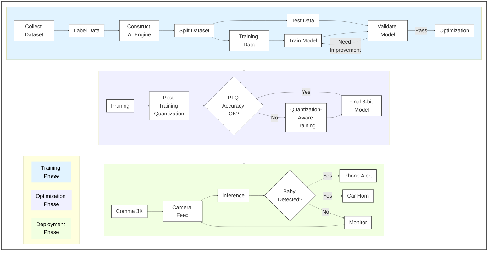

```mermaid
%%{init: {'theme': 'default', 'themeVariables': { 'fontSize': '35px', 'nodeFontSize': '35px', 'flowchartTitleFontSize': '35px' }}}%%
graph LR
    subgraph Main [" "]
        subgraph Phase1 [" "]
            CD[Collect Dataset] --> L[Label Data]
            L --> AI[Construct AI Engine]
            AI --> DS[Split Dataset]
            DS --> TD[Training Data]
            DS --> TS[Test Data]
            TD --> TM[Train Model]
            TS --> VM[Validate Model]
            TM --> VM
            VM -->|Need Improvement| TM
            VM -->|Pass| Optimization
        end

        subgraph Phase2 [" "]
            O1[Pruning] --> PTQ[Post-Training Quantization]
            PTQ --> PTQA{PTQ Accuracy OK?}
            PTQA -->|No| QAT[Quantization-Aware Training]
            PTQA -->|Yes| FQ[Final 8-bit Model]
            QAT --> FQ
        end

        subgraph Phase3 [" "]
            DM[Comma 3X] --> IC[Camera Feed]
            IC --> INF[Inference]
            INF --> DEC{Baby Detected?}
            DEC -->|Yes| A1[Phone Alert]
            DEC -->|Yes| A2[Car Horn]
            DEC -->|No| CONT[Monitor]
            CONT --> IC
        end

        Phase1 --> Phase2
        Phase2 --> Phase3

        subgraph Legend [" "]
            L1[Training Phase]:::legendClass
            L2[Optimization Phase]:::legendClass
            L3[Deployment Phase]:::legendClass
        end
    end

    style Main fill:transparent,stroke:#333,stroke-width:4px
    style Phase1 fill:#e1f3ff
    style Phase2 fill:#f0f0ff
    style Phase3 fill:#f1ffe1

    %% Add white background to all nodes
    classDef default fill:white,stroke:#333,stroke-width:2px
    classDef diamond fill:white,stroke:#333,stroke-width:2px
    class PTQA,DEC diamond
    
    classDef legendClass fill:none,stroke:none
    style L1 fill:#e1f3ff,color:black
    style L2 fill:#f0f0ff,color:black
    style L3 fill:#f1ffe1,color:black
```

