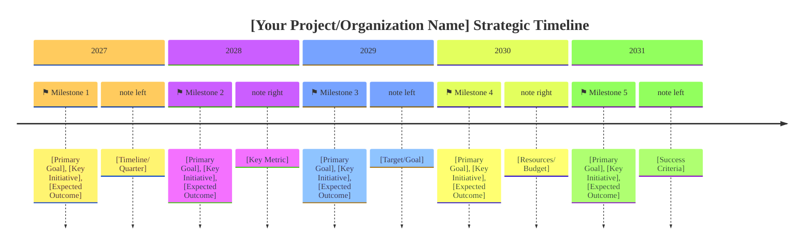
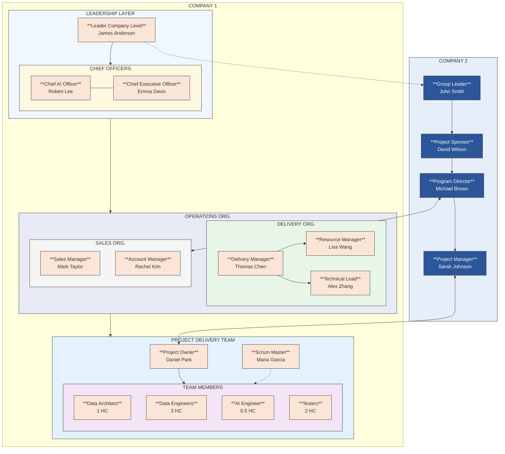

# Templates

## Master Schedule

```mermaid
%%{init: {
  'theme': 'base',
  'themeVariables': {
    'taskBkgColor': '#7BB2E5',
    'taskTextColor': '#000000',
    'taskBorderColor': '#534fbc',
    'sectionBkgColor': '#f4f4f4',
    'activeTaskBkgColor': '#B784ED',
    'activeTaskBorderColor': '#534fbc',
    'activeTaskTextColor': '#000000',
    'critBkgColor': '#FFE44D',
    'critBorderColor': '#534fbc',
    'critTextColor': '#000000',
    'fontSize': '16px',
    'headerFontSize': '20px'
  },
  'gantt': {
    'leftPadding': 100,
    'rightPadding': 20
  }
}}%%
gantt
    title     Project Schedule Template
    dateFormat  MM
    axisFormat  Month %m
    
    section Development
    Task 1 Name            :active, dev1, 01, 03
    Task 2 Name            :active, dev2, 02, 04
    Task 3 Name            :active, dev3, 03, 05
    
    section Testing
    Task 4 Name            :crit, test1, 02, 04
    Task 5 Name            :crit, test2, 03, 05
    Task 6 Name            :crit, test3, 04, 06
    
    section Deployment
    Task 7 Name            :deploy1, 05, 07
```

## Timeline

## Detailed Project Tasks Planning

| NO. | FEATURE CATEGORY | FEATURE (EPIC) | DETAIL (TASK) | DEFINITION OF DONE |
|-----|-----------------|----------------|---------------|-------------------|
| 1 | Category | Epic | - Task 1 - Task 2 | - DOD 1 - DOD 2  |

This template uses:
- Pipe characters (`|`) to separate columns
- Hyphens (`-`) in the header row separator
- ` ` for line breaks within cells
- Consistent spacing for readability

## Team Role and Responsibility

| No | Account | Role | Responsibility | Email |
|----|---------|------|----------------|-------|
| 1 | John Smith | Sales Manager | Manage customer relationships and sales pipeline | john.smith@company.com |
| 2 | Jane Doe | Account Manager | Handle client accounts and contract negotiations | jane.doe@company.com |

The structure uses:
- Pipes (`|`) to separate columns
- Hyphens (`-`) in the second row to create the header separation
- Each field can contain multiple lines of text if needed

## Org Chart

