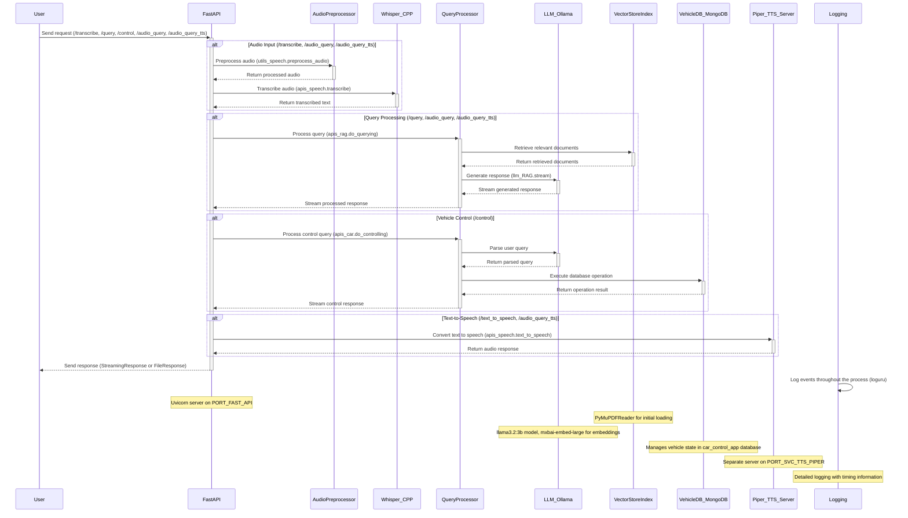

# API Flow

```mermaid
sequenceDiagram
    participant User
    participant FastAPI
    participant AudioPreprocessor
    participant Whisper_CPP
    participant QueryProcessor
    participant LLM_Ollama
    participant VectorStoreIndex
    participant VehicleDB_MongoDB
    participant Piper_TTS_Server
    participant Logging

    User->>+FastAPI: Send request (/transcribe, /query, /control, /audio_query, /audio_query_tts)

    alt Audio Input (/transcribe, /audio_query, /audio_query_tts)
        FastAPI->>+AudioPreprocessor: Preprocess audio (utils_speech.preprocess_audio)
        AudioPreprocessor-->>-FastAPI: Return processed audio
        FastAPI->>+Whisper_CPP: Transcribe audio (apis_speech.transcribe)
        Whisper_CPP-->>-FastAPI: Return transcribed text
    end

    alt Query Processing (/query, /audio_query, /audio_query_tts)
        FastAPI->>+QueryProcessor: Process query (apis_rag.do_querying)
        QueryProcessor->>+VectorStoreIndex: Retrieve relevant documents
        VectorStoreIndex-->>-QueryProcessor: Return retrieved documents
        QueryProcessor->>+LLM_Ollama: Generate response (llm_RAG.stream)
        LLM_Ollama-->>-QueryProcessor: Stream generated response
        QueryProcessor-->>-FastAPI: Stream processed response
    end

    alt Vehicle Control (/control)
        FastAPI->>+QueryProcessor: Process control query (apis_car.do_controlling)
        QueryProcessor->>+LLM_Ollama: Parse user query
        LLM_Ollama-->>-QueryProcessor: Return parsed query
        QueryProcessor->>+VehicleDB_MongoDB: Execute database operation
        VehicleDB_MongoDB-->>-QueryProcessor: Return operation result
        QueryProcessor-->>-FastAPI: Stream control response
    end

    alt Text-to-Speech (/text_to_speech, /audio_query_tts)
        FastAPI->>+Piper_TTS_Server: Convert text to speech (apis_speech.text_to_speech)
        Piper_TTS_Server-->>-FastAPI: Return audio response
    end

    FastAPI-->>-User: Send response (StreamingResponse or FileResponse)

    Logging->>Logging: Log events throughout the process (loguru)

    Note over FastAPI: Uvicorn server on PORT_FAST_API
    Note over VectorStoreIndex: PyMuPDFReader for initial loading
    Note over LLM_Ollama: llama3.2:3b model, mxbai-embed-large for embeddings
    Note over VehicleDB_MongoDB: Manages vehicle state in car_control_app database
    Note over Piper_TTS_Server: Separate server on PORT_SVC_TTS_PIPER
    Note over Logging: Detailed logging with timing information
```
