# Algorithms

[👈 Return to main](./../../README.md)

## Retrieval Augmented Generation

### Adaptive RAG

```mermaid
%%{init: {'theme': 'neutral', 'flowchart': {'curve': 'basis'}, 'themeVariables': { 'fontFamily': 'Arial', 'fontSize': '16px'}}}%%
flowchart
    subgraph QueryAnalysisAndAnswering["RAG + self-reflection"]
        subgraph QueryAnalysisBox["Query Analysis"]
            Question((❓Question))
            QueryAnalysis((("❓Query Analysis")))
            AddRoutes[/"Add more routes"/]
        end
        RetrieveNode((("1️⃣ Retrieve")))
        GradeNode((("2️⃣ Grade")))
        GenerateNode((("📝 Generate")))
        RewriteNode((("📝 Re-write question")))
        WebSearchNode((("🔍 Web search")))
        GenerateWebNode((("📝 Generate")))
        OptionalNode(("Optional"))

        Question --> QueryAnalysis
        QueryAnalysis --> AddRoutes
        QueryAnalysis -->|related to index| RetrieveNode
        QueryAnalysis -->|unrelated to index| WebSearchNode
        QueryAnalysis -.->|Optional| OptionalNode
        RetrieveNode --> GradeNode
        GradeNode --> DocsRelevant{Docs relevant?}
        DocsRelevant -->|Yes| GenerateNode
        DocsRelevant -->|No| RewriteNode
        RewriteNode --> RetrieveNode
        GenerateNode --> Hallucinations{Hallucinations?}
        Hallucinations -->|Yes| GenerateNode
        Hallucinations -->|No| AnswersQuestion{Answers question?}
        AnswersQuestion -->|Yes| Answer[Answer]
        AnswersQuestion -->|No| GenerateNode
        WebSearchNode --> GenerateWebNode
        GenerateWebNode --> AnswerWeb[Answer w/ web search]
        OptionalNode -.-> OptionalContinued[... Optional]
    end

    classDef default fill:#f9f9f9,stroke:#333,stroke-width:2px;
    classDef blueNode fill:#4a90e2,color:#fff;
    classDef greenNode fill:#50c878,color:#fff;
    classDef redNode fill:#ff6b6b,color:#fff;
    classDef grayNode fill:#a9a9a9,color:#fff;
    classDef decision fill:#ffd700,color:#333;

    class RetrieveNode,GradeNode,GenerateNode,RewriteNode blueNode;
    class WebSearchNode,GenerateWebNode greenNode;
    class QueryAnalysis redNode;
    class OptionalNode,OptionalContinued grayNode;
    class DocsRelevant,Hallucinations,AnswersQuestion decision;
```

### Agentic RAG

```mermaid
%%{init: {'theme': 'neutral', 'themeVariables': { 'fontSize': '16px', 'fontFamily': 'Arial' }}}%%
flowchart
    subgraph Agent Decision Flow
    A((🤖 Agent))
    B{Should Retrieve}
    C((🛠️ Tool))
    D{Check Relevance}
    E((💡 Generate))
    F[📄 Answer]
    G((✍️ Rewrite))
    H[End]

    A -->|"[function_call]"| B
    B -->|"Yes, Continue"| C
    B -->|No| H
    C -->|"[documents]"| D
    D -->|Yes| E
    D -->|No| G
    E --> F
    G -->|"Re-write"| A

    classDef circle fill:#3498db,stroke:#2980b9,color:#fff
    classDef diamond fill:#e67e22,stroke:#d35400,color:#fff
    classDef rect fill:#2ecc71,stroke:#27ae60,color:#fff
    class A,C,E,G circle
    class B,D diamond
    class F,H rect

    %% Additional labels
    A["🤖 Agent
    (Decides to execute
    function call)"]
    C["🛠️ Tool
    (Calls retrieval tool)"]

    end
```

### Corrective RAG (CRAG)

### Self-RAG

```mermaid
%%{init: {'theme': 'neutral', 'themeVariables': { 'fontSize': '16px', 'fontFamily': 'Arial' }}}%%
flowchart
    subgraph Question Answering Flow
    A(("Question"))
    B(("🔍 Retrieve"))
    C(("✅ Grade"))
    D{"Docs relevant?"}
    E(("🧠 Generate"))
    F{"Hallucinations?"}
    G{"Answers question?"}
    H["Answer"]
    I(("✏️ Re-write question"))

    A --> B
    B --> C
    C --> D
    D -->|Yes| E
    D -->|No| I
    E --> F
    F -->|No| G
    F -->|Yes| E
    G -->|Yes| H
    G -->|No| I
    I --> B

    classDef circleNode fill:#87CEFA,stroke:#0000CD,color:#0000CD
    classDef diamondNode fill:#F08080,stroke:#0000CD,color:#0000CD
    classDef rectNode fill:#FFFFFF,stroke:#0000CD,color:#0000CD
    class A,B,C,E,I circleNode
    class D,F,G diamondNode
    class H rectNode
    end
```

### Hybrid-RAG

```mermaid
%%{init: {'theme': 'neutral', 'flowchart': {'curve': 'basis'}, 'themeVariables': { 'fontFamily': 'Arial', 'fontSize': '38px'}}}%%
flowchart TB
    subgraph CombinedRAGArchitecture[" "]
        Question((❓Question))
        Agent((🤖 Agent))
        ShouldRetrieve{Should Retrieve?}
        QueryAnalysis((("❓Query Analysis")))
        AddRoutes[/"Add more routes"/]
        RetrieveNode((("1️⃣ Retrieve")))
        GradeNode((("2️⃣ Grade")))
        DocsRelevant{Docs relevant?}
        GenerateNode((("📝 Generate")))
        Hallucinations{Hallucinations?}
        AnswersQuestion{Answers question?}
        RewriteNode((("✏️ Re-write question")))
        WebSearchNode((("🔍 Web search")))
        GenerateWebNode((("📝 Generate Web")))
        Answer[Answer]
        OptionalNode(("Optional"))

        Question --> Agent
        Agent --> ShouldRetrieve
        ShouldRetrieve -->|Yes| QueryAnalysis
        ShouldRetrieve -->|No| Answer
        QueryAnalysis --> AddRoutes
        QueryAnalysis -->|Index-related| RetrieveNode
        QueryAnalysis -->|Unrelated to index| WebSearchNode
        QueryAnalysis -.->|Optional| OptionalNode
        RetrieveNode --> GradeNode
        GradeNode --> DocsRelevant
        DocsRelevant -->|Yes| GenerateNode
        DocsRelevant -->|No| RewriteNode
        GenerateNode --> Hallucinations
        Hallucinations -->|Yes| GenerateNode
        Hallucinations -->|No| AnswersQuestion
        AnswersQuestion -->|Yes| Answer
        AnswersQuestion -->|No| RewriteNode
        RewriteNode --> Agent
        WebSearchNode --> GenerateWebNode
        GenerateWebNode --> Answer
        OptionalNode -.-> OptionalContinued[... Optional]
    end

    classDef default fill:#f9f9f9,stroke:#333,stroke-width:2px;
    classDef blueNode fill:#4a90e2,color:#fff;
    classDef greenNode fill:#50c878,color:#fff;
    classDef redNode fill:#ff6b6b,color:#fff;
    classDef grayNode fill:#a9a9a9,color:#fff;
    classDef decision fill:#ffd700,color:#333;

    class RetrieveNode,GradeNode,GenerateNode,RewriteNode,GenerateWebNode blueNode;
    class WebSearchNode greenNode;
    class Agent,QueryAnalysis redNode;
    class OptionalNode,OptionalContinued grayNode;
    class DocsRelevant,Hallucinations,AnswersQuestion,ShouldRetrieve decision;
```

## Agent Architectures

### Multi-Agent Systems

#### Collaboration

```mermaid
graph  LR
    A[/"User"/]
    B((Researcher))
    C{Router}
    D((Chart Generator))
    E[Call_tool]

    A -->|"1. First go to researcher"| B
    B -->|Message| C
    C -.->|"If 'FINAL ANSWER'"| A
    C -->|Message| D
    C -.->|"If function is called"| E
    E -->|"If State['sender'] == 'Researcher'"| B
    E -->|"If State['sender'] == 'Chart Generator'"| D
    C -->|"If 'continue' and State['sender'] == 'Chart Generator'"| B
    C -.->|"If 'continue' and State['sender'] == 'researcher'"| D

    %% Node descriptions
    A[/"User
    Input: 'Generate a chart of
    average temperature in Alaska
    over the past decade'"/]
    B[("Researcher
    (Call a 'search' function
    OR FINISH)")]
    C{"Router
    (If statements
    based on agent
    output)"}
    D[("Chart Generator
    (Code Execution💻)")]
    E[Call_tool]

    %% Styling
    classDef user fill:#f9d71c,stroke:#333,stroke-width:2px;
    classDef researcher fill:#f9813a,stroke:#333,stroke-width:2px;
    classDef router fill:#e74c3c,stroke:#333,stroke-width:2px;
    classDef chartGen fill:#3498db,stroke:#333,stroke-width:2px;
    classDef callTool fill:#2ecc71,stroke:#333,stroke-width:2px;
    classDef default color:#333,stroke:#333,stroke-width:2px;
    class A user;
    class B researcher;
    class C router;
    class D chartGen;
    class E callTool;

    %% Link styling
    linkStyle default stroke:#333,stroke-width:2px;
```

#### Supervision

```mermaid
%%{init: {'theme': 'neutral', 'themeVariables': { 'fontSize': '16px', 'fontFamily': 'Arial' }}}%%
flowchart TD
    subgraph HierarchyDiagram[" "]
        User["User"]
        Supervisor["Supervisor"]
        Agent1["👤1️⃣"]
        Agent2["👤2️⃣"]
        Agent3["👤3️⃣"]

        User <--> Supervisor
        Agent1 --> Supervisor 
        Agent2 --> Supervisor
        Agent3 --> Supervisor
        Supervisor -.->|route| Agent1
        Supervisor -.->|route| Agent2
        Supervisor -.->|route| Agent3
    end

    classDef userClass fill:#87CEEB,stroke:#333,stroke-width:2px;
    classDef supervisorClass fill:#90EE90,stroke:#333,stroke-width:2px;
    classDef agentClass fill:#FFD700,stroke:#333,stroke-width:2px;

    class User userClass;
    class Supervisor supervisorClass;
    class Agent1,Agent2,Agent3 agentClass;

    linkStyle default stroke:#0000FF,stroke-width:2px;
```

#### Hierarchical Teams

```mermaid
%%{init: {'theme': 'neutral', 'themeVariables': { 'fontSize': '16px', 'fontFamily': 'Arial' }}}%%
graph TD
    subgraph HierarchyDiagram[" "]
        %% Define node styles
        classDef user fill:#e6f3ff,stroke:#4da6ff
        classDef supervisor fill:#e6f3ff,stroke:#4da6ff
        classDef research fill:#e6ffed,stroke:#00cc66
        classDef document fill:#fff5e6,stroke:#ffa64d
        classDef tool fill:#f2f2f2,stroke:#999999

        %% Main components
        User[User 👤]
        Supervisor[Supervisor 👨‍💼]
        ResearchTeam[Research Team 🔍]
        DocumentAuthoring[Document Authoring 📝]

        %% Tools
        Searcher((Searcher 🌐))
        WebScraper((Web Scraper 🕷️))
        Writer((Writer ✍️))
        NoteTaker((Note Taker 📓))
        ChartGenerator((Chart Generator 📊))

        %% Connections
        User <--> Supervisor
        
        Supervisor -.->|Route| ResearchTeam
        Supervisor -.->|Route| DocumentAuthoring
        ResearchTeam -.->|route| Searcher
        ResearchTeam -.->|route| WebScraper
        DocumentAuthoring -.->|route| Writer
        DocumentAuthoring -.->|route| NoteTaker
        DocumentAuthoring -.->|route| ChartGenerator

        ResearchTeam --> Supervisor 
        DocumentAuthoring  --> Supervisor

        Searcher --> ResearchTeam
        WebScraper --> ResearchTeam
        Writer --> DocumentAuthoring
        NoteTaker --> DocumentAuthoring
        ChartGenerator --> DocumentAuthoring
    end

    %% Apply styles
    class User,Supervisor user
    class ResearchTeam research
    class DocumentAuthoring document
    class Searcher,WebScraper,Writer,NoteTaker,ChartGenerator tool
```

### Planning Agents

#### Plan-and-Execute

```mermaid
%%{init: {'theme': 'neutral', 'themeVariables': { 'fontSize': '16px', 'fontFamily': 'Arial' }}}%%

flowchart
    subgraph HierarchyDiagram[" "]
        A((User 👤)) -->|"1️⃣. User Request"| B[Plan 🧠]
        B -->|"2️⃣. Generate Tasks"| C[Task List 📋]
        C -->|"3️⃣. Exec Tasks"| D[Single-Task Agent 🧠]
        D -->|"4️⃣. Update state"| E[Replan 🧠]
        E -.->|"5️⃣a. Respond to user"| A
        E -->|"5️⃣b. Re-plan tasks"| C
        D -->|"Loop to solve task 🛠️"| D
    end

    classDef user fill:#ADD8E6,stroke:#333,stroke-width:2px;
    classDef brain fill:#90EE90,stroke:#333,stroke-width:2px;
    classDef list fill:#FFFACD,stroke:#333,stroke-width:2px;

    class A user;
    class B,D,E brain;
    class C list;
```

#### Reasoning without Observation

```mermaid
%%{init: {'theme': 'neutral', 'themeVariables': { 'fontSize': '16px', 'fontFamily': 'Arial' }}}%%
flowchart
    subgraph ReWOO["ReWOO System"]
        User((👤 User))
        Planner[/🧠 Planner/]
        TaskList["Task List"]
        Worker[🔧 Worker]
        Solver[/🧠 Solver/]

        User -->|1️⃣ User Request| Planner
        Planner -->|2️⃣ Generate Tasks| TaskList
        TaskList -->|3️⃣| Worker
        Worker -->|4️⃣ Update state<br>with task results| Solver
        Solver -.->|5️⃣ Respond to user| User
        Worker -->|Loop to<br>solve task| Worker

        classDef user fill:#9370DB,stroke:#333,stroke-width:2px;
        classDef planner fill:#FF69B4,stroke:#333,stroke-width:2px;
        classDef tasklist fill:#20B2AA,stroke:#333,stroke-width:2px;
        classDef worker fill:#FFA500,stroke:#333,stroke-width:2px;
        classDef solver fill:#FF69B4,stroke:#333,stroke-width:2px;
        class User user;
        class Planner,Solver planner;
        class TaskList tasklist;
        class Worker worker;

        style ReWOO fill:#f0f0f0,stroke:#4682B4,stroke-width:2px;
    end
```

#### LLMCompiler

```mermaid
%%{init: {'theme': 'base', 'themeVariables': { 'primaryColor': 'lightgrey', 'primaryTextColor': 'navy', 'primaryBorderColor': 'darkgrey', 'lineColor': 'darkgrey', 'secondaryColor': 'white', 'tertiaryColor': 'white'}}}%%
flowchart
    subgraph LLMCompiler["LLMCompiler Framework"]
        UserInput["User Input:
        'How much does Microsoft's
        market cap need to increase
        to exceed Apple's market cap?'"]
        
        subgraph LLMPlanner["LLM Planner 🧠"]
            direction TB
            PlannerContent["DAG of Tasks
            1️⃣ = search(Microsoft Market Cap)
            2️⃣ = search(Apple Market Cap)
            3️⃣ = math(1️⃣ / 2️⃣)
            4️⃣ = llm(3️⃣)"]
        end
        
        TaskFetching["Task Fetching Unit 🔄
        Fetches Task
        Resolves Dependency"]
        
        subgraph Executor["Executor"]
            direction TB
            Tool1["Tool
            Memory"]
            Tool2["Tool
            Memory"]
            Tool3["Tool
            Memory"]
            Tool4["Tool
            Memory"]
        end
        
        Joiner["Joiner (replanner) 🧠"]
        
        subgraph Tools["Tools"]
            direction LR
            Search["🔍 search"]
            Math["🧮 math"]
            LLM["🤖 llm"]
        end
        
        UserInput --> LLMPlanner
        LLMPlanner --> TaskFetching
        TaskFetching <--> |"Fetches Task"| Executor
        Executor <--> Tools
        Executor --> |"3️⃣. Update state with task results"| Joiner
        Joiner -.-> |"4️⃣a. Respond to user"| UserInput
        Joiner -.-> |"4️⃣b. Re-plan more tasks"| TaskFetching
    end

    classDef default fill:white,stroke:darkgrey,stroke-width:2px,color:navy;
    class LLMCompiler,LLMPlanner,Executor,Tools fill:lightgrey,stroke:darkgrey,stroke-width:2px,color:navy;
```

### Reflection & Critique

#### Basic Reflection

```mermaid
%%{init: {'theme': 'base', 'themeVariables': { 'fontSize': '16px', 'fontFamily': 'Arial, sans-serif'}}}%%

flowchart
    subgraph BasicReflection["Basic Reflection"]
    User((User))
    Generate["Generate 🧠"]
    InitialResponse[/"Initial response"/]
    Reflect["Reflect 🧠"]
    Reflections[/"Reflections
    Critique: ~~~
    Merits: ~~~
    Recs: ~~~
    ..."/]
    Repeat((("Repeat
    N times")))

    User -->|"1️⃣ User Request"| Generate
    Generate -->|2️⃣| InitialResponse
    InitialResponse -->|3️⃣| Reflect
    Reflect -->|4️⃣| Reflections
    Reflections -->|5️⃣| Generate
    Generate -->|"🔚 Respond to user"| User

    InitialResponse -. "Repeat" .-> Repeat
    Repeat -. "Reflect" .-> Reflect
    end

    classDef default fill:#f0f0f0,stroke:#333,color:#333
    classDef user fill:#e6e6fa,stroke:#4b0082,color:#4b0082
    classDef brain fill:#ffb6c1,stroke:#8b0000,color:#8b0000
    classDef process fill:#e6f3ff,stroke:#00008b,color:#00008b
    classDef dashed fill:#e6ffe6,stroke:#006400,color:#006400,stroke-dasharray: 5 5
    classDef repeat fill:#f2f2f2,stroke:#2f4f4f,color:#2f4f4f
    classDef title fill:none,stroke:none,color:#333,font-weight:bold
    classDef edge stroke:#555,color:#555

    class User user
    class Generate,Reflect brain
    class InitialResponse,Reflections dashed
    class Repeat repeat
    class BasicReflection title
    class User,Generate,InitialResponse,Reflect,Reflections,Repeat edge

    style BasicReflection fill:#ffffff,stroke:#333,stroke-width:2px
```

#### Reflexion

```mermaid
%%{init: {'theme': 'base', 'themeVariables': { 'fontSize': '16px', 'fontFamily': 'Arial' }}}%%
flowchart
    subgraph Reflexion Actor
    User((👤))
    Responder[Responder 🧠]
    InitialResponse[/"Initial Response<br><small>Response:<br>Critique:<br>Search:</small>"/]
    ExecuteTools[Execute Tools 🔧]
    Revisor[Revisor 🧠]
    RevisedResponse[/"Revised Response<br><small>Response:<br>Critique:<br>Search:<br>Citations:</small>"/]
    RepeatNote["Repeat<br>N times"]
    
    User -->|1️⃣ User Request| Responder
    Responder -->|2️⃣| InitialResponse
    InitialResponse -->|2️⃣| ExecuteTools
    ExecuteTools -->|3️⃣| Revisor
    Revisor -->|4️⃣| RevisedResponse
    RevisedResponse --> ExecuteTools
    Revisor -->|End. Respond to user| User
    RepeatNote -.-> RevisedResponse
    RepeatNote -.-> ExecuteTools
    
    class User userStyle
    class Responder,Revisor brainStyle
    class InitialResponse,RevisedResponse responseStyle
    class ExecuteTools toolStyle
    class RepeatNote noteStyle
    end
    
    classDef default fill:#9370DB,stroke:#333,stroke-width:2px,color:#333
    classDef userStyle fill:#FFB347,stroke:#333,stroke-width:2px,color:#333
    classDef brainStyle fill:#20B2AA,stroke:#333,stroke-width:2px,color:#333
    classDef responseStyle fill:none,stroke:#333,stroke-width:2px,stroke-dasharray: 5 5,color:#333
    classDef toolStyle fill:#4682B4,stroke:#333,stroke-width:2px,color:#333
    classDef noteStyle fill:none,stroke:none,color:#333
```

#### Language Agent Tree Search

```mermaid
%%{init: {'theme': 'neutral', 'themeVariables': { 'fontSize': '16px', 'fontFamily': 'Arial' }}}%%
flowchart
    subgraph Language_Agent_Tree_Search["Language Agent Tree Search"]
        G1["Generate 🧠"] --> A1["Act"]
        G1 --> R1["Reflect 🧠"]
        R1 --> A2["Act 0.3"]
        R1 --> G2["Generate 🧠"]
        G2 --> A3["Act 0.3"]
        A3 -.-> E1["x"]
        A3 -.-> E2["x"]
        E2 -.-> S1["0.8"]
        E2 -.-> S2["0.4"]
        G2 --> R2["Reflect 🧠"]
        R2 --> A4["Act 0.6"]
        A4 -.-> S3["0.8"]
        A4 -.-> S4["0.4"]
        R2 --> G3["Generate 🧠"]
        G3 --> A5["Act 0.6"]
        A5 -.-> S5["0.8"]
        A5 -.-> S6["0.4"]
        S5 -.-> E3["x"]
        S5 -.-> E4["x"]
        G3 --> R3["Reflect 🧠"]
        R3 --> A6["Act 0.7"]
        A6 -.-> S7["0.9"]
        A6 -.-> S8["0.4"]
        S7 -.-> S9["0.2"]
        S7 --> S10["1"]
        
        Process["Repeat until solved:
        1. Select node
        2. Generate new candidates
        3. Act, reflect, and score
        4. Backpropagate (update parents)"]
    end
    
    classDef generate fill:#e6f3ff,stroke:#333,stroke-width:2px;
    classDef reflect fill:#e6f3ff,stroke:#333,stroke-width:2px;
    classDef act fill:#ffffcc,stroke:#333,stroke-width:2px,stroke-dasharray: 5 5;
    classDef score fill:#f0f0f0,stroke:#333,stroke-width:1px;
    classDef empty fill:#ffffff,stroke:#333,stroke-width:1px,stroke-dasharray: 5 5;
    classDef positiveScore fill:#90EE90,stroke:#333,stroke-width:1px;
    classDef negativeScore fill:#FFB6C1,stroke:#333,stroke-width:1px;
    classDef process fill:#f0f0f0,stroke:#333,stroke-width:2px;
    
    class G1,G2,G3 generate;
    class R1,R2,R3 reflect;
    class A1,A2,A3,A4,A5,A6 act;
    class E1,E2,E3,E4 empty;
    class S1,S3,S5,S7,S10 positiveScore;
    class S2,S4,S6,S8,S9 negativeScore;
    class Process process;
```

#### Self-Discover Agent

## Evaluation & Analysis

### Agent-based

### Embed AI

```mermaid
%%{init: {'theme': 'neutral', 'themeVariables': { 'fontSize': '40px', 'fontFamily': 'Arial' }}}%%
graph TD
    subgraph CarSystemDiagram[" "]
        %% Define node styles
        classDef user fill:#e6f3ff,stroke:#4da6ff,shape:circle
        classDef ui fill:#ffccff,stroke:#ff66ff,shape:rectangle
        classDef agent fill:#e6ffed,stroke:#00cc66,shape:rectangle
        classDef tool fill:#f2f2f2,stroke:#999999,shape:circle
        classDef hardware fill:#ffe6e6,stroke:#ff6666,shape:circle
        classDef process fill:#fff0e6,stroke:#ffa64d,shape:diamond
        classDef resource fill:#e6e6ff,stroke:#6666ff,shape:hexagon
        classDef security fill:#ff9999,stroke:#ff3333,shape:octagon
        classDef offline fill:#c2f0c2,stroke:#006600,stroke-width:4px

        %% Main components
        User((User 👤))
        UI[Multi-Modal UI 📱🎤👁️]
        MainAgent[Main LLM Agent 🤖]
        LM{{Language Model 🧠}}
        PersonalizationLayer{Personalization Layer 🎭}
        ContextAwareness{Contextual Awareness 🌍}
        SecurityLayer{Security Layer 🔒}
        ProactiveAssistance{Proactive Assistance 🔮}
        EmotionalIntelligence{Emotional Intelligence 😊😢😠}

        %% Connections for main components
        User <--> UI
        UI <--> SecurityLayer
        SecurityLayer <--> MainAgent
        MainAgent -.->|Use| LM
        MainAgent <--> PersonalizationLayer
        MainAgent <--> ContextAwareness
        MainAgent <--> ProactiveAssistance
        MainAgent <--> EmotionalIntelligence
        UI -.->|Input| EmotionalIntelligence
        ProactiveAssistance -.->|Suggestions| UI
        EmotionalIntelligence -.->|Emotional Context| PersonalizationLayer
        ProactiveAssistance <-.->|User Patterns| PersonalizationLayer
        ProactiveAssistance <-.->|Contextual Data| ContextAwareness

        %% Car Information Retrieval Agent System
        subgraph CarInfoAgentSystem[_]
            CarInfoAgent[Car Info Agent 🚗📚]
            subgraph KnowledgeBase[Knowledge Base 📚]
                VectorDB((Vector DB 🔍))
                GraphDB((Graph DB 🕸️))
                SQLDB((SQL DB 💾))
            end
            QueryConverter{Query Converter 🔄}
            PredictiveMaintenance{Predictive Maintenance 🔧}

            CarInfoAgent -.->|Query| KnowledgeBase
            CarInfoAgent -->|Process| QueryConverter
            QueryConverter -.->|Vector Query| VectorDB
            QueryConverter -.->|Cypher| GraphDB
            QueryConverter -.->|SQL| SQLDB
            CarInfoAgent <--> PredictiveMaintenance
        end

        %% General Q&A Agent System
        subgraph QAAgentSystem[_]
            QAAgent[Q&A Agent 💬]
            WeatherAPI((Weather API 🌤️))
            TrafficAPI((Traffic API 🚦))
            WebBrowser((Web Browser 🌐))
            PluginSystem{Plugin System 🔌}

            QAAgent -.->|Use| WeatherAPI
            QAAgent -.->|Use| TrafficAPI
            QAAgent -.->|Use| WebBrowser
            QAAgent <--> PluginSystem
        end

        %% Vehicle Control Agent System
        subgraph ControlAgentSystem[_]
            ControlAgent[Control Agent 🚗]
            NLToCommand{NL to Hardware Command 🔄}
            CarSystems[Car Systems 🚙]
            WindowControl((Window Control 🪟))
            ACControl((AC Control ❄️))
            GlassCleaner((Glass Cleaner 🧼))
            Navigation((Navigation 🗺️))
            Entertainment((Entertainment 🎵))
            ADAS((ADAS 🚦))
            EdgeComputing{Edge Computing ⚡}

            ControlAgent -->|Process| NLToCommand
            NLToCommand -.->|Execute| CarSystems
            CarSystems -.->|Include| WindowControl
            CarSystems -.->|Include| ACControl
            CarSystems -.->|Include| GlassCleaner
            CarSystems -.->|Include| Navigation
            CarSystems -.->|Include| Entertainment
            CarSystems -.->|Include| ADAS
            CarSystems -->|Status| ControlAgent
            ControlAgent <--> EdgeComputing
        end

        %% Connections for specialized agents
        MainAgent -.->|Route| CarInfoAgent
        MainAgent -.->|Route| QAAgent
        MainAgent -.->|Route| ControlAgent

        CarInfoAgent --> MainAgent
        QAAgent --> MainAgent
        ControlAgent --> MainAgent

        %% Shared resource usage for specialized agents
        CarInfoAgent -.->|Use| LM
        QAAgent -.->|Use| LM
        ControlAgent -.->|Use| LM

        %% Feedback Loop
        FeedbackSystem{Feedback & Learning System 📊}
        MainAgent <--> FeedbackSystem
        LM <-.->|Improve| FeedbackSystem

        %% Contextual Awareness connections
        ContextAwareness -.->|Provide Context| QAAgent
        ContextAwareness -.->|Provide Context| ControlAgent

        %% Predictive Maintenance connection
        PredictiveMaintenance -.->|Analyze Sensor Data| CarSystems

        %% Legend
        subgraph Legend[" "]
            User2((User))
            UI2[UI/Agent]
            Tool2((Tool))
            Hardware2((Hardware))
            Process2{Process}
            Resource2{{Resource}}
            Security2{Security}
            Offline2[Offline Capable]:::offline
        end

    end

    %% Apply styles
    class User,User2 user
    class UI,UI2 ui
    class MainAgent,CarInfoAgent,QAAgent,ControlAgent agent
    class VectorDB,GraphDB,SQLDB,WeatherAPI,TrafficAPI,WebBrowser,Navigation,Entertainment,ADAS,Tool2 tool
    class WindowControl,ACControl,GlassCleaner,CarSystems,Hardware2 hardware
    class NLToCommand,QueryConverter,PersonalizationLayer,ContextAwareness,PredictiveMaintenance,PluginSystem,EdgeComputing,FeedbackSystem,Process2,ProactiveAssistance,EmotionalIntelligence process
    class LM,KnowledgeBase,Resource2 resource
    class SecurityLayer,Security2 security
    class ControlAgent,CarSystems,EdgeComputing,Navigation,ADAS offline

    linkStyle default stroke:#333,stroke-width:3px

```