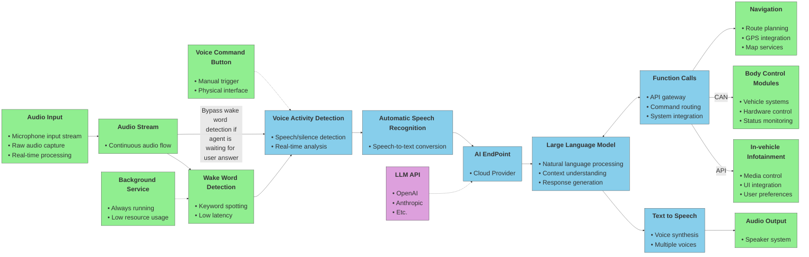
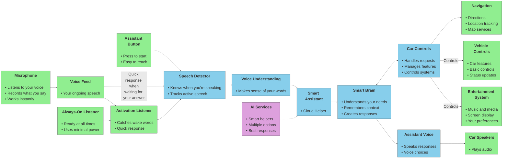
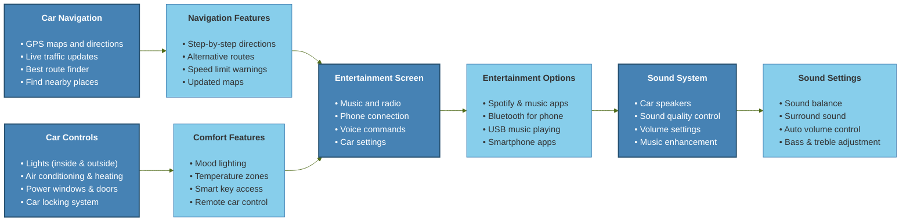

```mermaid
%%{init: {'theme': 'default', 'themeVariables': { 'fontSize': '30px', 'fontFamily': 'arial' }}}%%
flowchart LR
    %% Input Components
    AudioInput["`
        <b>Audio Input</b>
        <div style='text-align:left; white-space:nowrap;'>
        • Microphone input stream
        • Raw audio capture
        • Real-time processing
        </div>
    `"]:::green

    AudioStream["`
        <b>Audio Stream</b>
        <div style='text-align:left; white-space:nowrap;'>
        • Continuous audio flow
        </div>
    `"]:::green

    Background["`
        <b>Background Service</b>
        <div style='text-align:left; white-space:nowrap;'>
        • Always running
        • Low resource usage
        </div>
    `"]:::green

    VoiceBtn["`
        <b>Voice Command Button</b>
        <div style='text-align:left; white-space:nowrap;'>
        • Manual trigger
        • Physical interface
        </div>
    `"]:::green

    %% Core Processing Components
    WWD["`
        <b>Wake Word Detection</b>
        <div style='text-align:left; white-space:nowrap;'>
        • Keyword spotting
        • Low latency
        </div>
    `"]:::green

    VAD["`
        <b>Voice Activity Detection</b>
        <div style='text-align:left; white-space:nowrap;'>
        • Speech/silence detection
        • Real-time analysis
        </div>
    `"]:::blue

    ASR["`
        <b>Automatic Speech Recognition</b>
        <div style='text-align:left; white-space:nowrap;'>
        • Speech-to-text conversion
        </div>
    `"]:::blue

    %% AI Components
    AIEndPoint["`
        <b>AI EndPoint</b>
        <div style='text-align:left; white-space:nowrap;'>
        • Cloud Provider
        </div>
    `"]:::blue

    OpenAI["`
        <b>LLM API</b>
        <div style='text-align:left; white-space:nowrap;'>
        • OpenAI
        • Anthropic
        • Etc.
        </div>
    `"]:::purple

    LLM["`
        <b>Large Language Model</b>
        <div style='text-align:left; white-space:nowrap;'>
        • Natural language processing
        • Context understanding
        • Response generation
        </div>
    `"]:::blue

    %% Output Components
    TTS["`
        <b>Text to Speech</b>
        <div style='text-align:left; white-space:nowrap;'>
        • Voice synthesis
        • Multiple voices
        </div>
    `"]:::blue

    AudioOutput["`
        <b>Audio Output</b>
        <div style='text-align:left; white-space:nowrap;'>
        • Speaker system
        </div>
    `"]:::green

    %% Function Components
    FUNC["`
        <b>Function Calls</b>
        <div style='text-align:left; white-space:nowrap;'>
        • API gateway
        • Command routing
        • System integration
        </div>
    `"]:::blue

    IVI["`
        <b>In-vehicle Infotainment</b>
        <div style='text-align:left; white-space:nowrap;'>
        • Media control
        • UI integration
        • User preferences
        </div>
    `"]:::green

    BCM["`
        <b>Body Control Modules</b>
        <div style='text-align:left; white-space:nowrap;'>
        • Vehicle systems
        • Hardware control
        • Status monitoring
        </div>
    `"]:::green

    Navigation["`
        <b>Navigation</b>
        <div style='text-align:left; white-space:nowrap;'>
        • Route planning
        • GPS integration
        • Map services
        </div>
    `"]:::green

    %% Connections
    AudioInput --> AudioStream
    AudioStream --> WWD
    WWD --> VAD
    Background -.-> WWD
    VoiceBtn -.-> VAD
    VAD --> ASR
    ASR --> AIEndPoint
    OpenAI -.-> AIEndPoint
    AIEndPoint --> LLM
    LLM --> TTS
    TTS --> AudioOutput
    
    %% Function Connections
    LLM <--> FUNC
    FUNC -- API --> IVI
    FUNC -- CAN --> BCM
    FUNC --> Navigation

    %% Bypass Path
    AudioStream -- "Bypass wake word detection if<br/>agent is waiting for user answer" --> VAD

    %% Styling
    classDef green fill:#90EE90,stroke:#333,stroke-width:1px
    classDef blue fill:#87CEEB,stroke:#333,stroke-width:1px
    classDef purple fill:#DDA0DD,stroke:#333,stroke-width:1px
    classDef default fill:#fff,stroke:#333,stroke-width:1px
```

```mermaid
%%{init: {'theme': 'default', 'themeVariables': { 'fontSize': '30px', 'fontFamily': 'arial' }}}%%
flowchart LR
    %% Input Components
    AudioInput["`
        <b>Microphone</b>
        <div style='text-align:left; white-space:nowrap;'>
        • Listens to your voice
        • Records what you say
        • Works instantly
        </div>
    `"]:::green

    AudioStream["`
        <b>Voice Feed</b>
        <div style='text-align:left; white-space:nowrap;'>
        • Your ongoing speech
        </div>
    `"]:::green

    Background["`
        <b>Always-On Listener</b>
        <div style='text-align:left; white-space:nowrap;'>
        • Ready at all times
        • Uses minimal power
        </div>
    `"]:::green

    VoiceBtn["`
        <b>Assistant Button</b>
        <div style='text-align:left; white-space:nowrap;'>
        • Press to start
        • Easy to reach
        </div>
    `"]:::green

    %% Core Processing Components
    WWD["`
        <b>Activation Listener</b>
        <div style='text-align:left; white-space:nowrap;'>
        • Catches wake words
        • Quick response
        </div>
    `"]:::green

    VAD["`
        <b>Speech Detector</b>
        <div style='text-align:left; white-space:nowrap;'>
        • Knows when you're speaking
        • Tracks active speech
        </div>
    `"]:::blue

    ASR["`
        <b>Voice Understanding</b>
        <div style='text-align:left; white-space:nowrap;'>
        • Makes sense of your words
        </div>
    `"]:::blue

    %% AI Components
    AIEndPoint["`
        <b>Smart Assistant</b>
        <div style='text-align:left; white-space:nowrap;'>
        • Cloud Helper
        </div>
    `"]:::blue

    OpenAI["`
        <b>AI Services</b>
        <div style='text-align:left; white-space:nowrap;'>
        • Smart helpers
        • Multiple options
        • Best responses
        </div>
    `"]:::purple

    LLM["`
        <b>Smart Brain</b>
        <div style='text-align:left; white-space:nowrap;'>
        • Understands your needs
        • Remembers context
        • Creates responses
        </div>
    `"]:::blue

    %% Output Components
    TTS["`
        <b>Assistant Voice</b>
        <div style='text-align:left; white-space:nowrap;'>
        • Speaks responses
        • Voice choices
        </div>
    `"]:::blue

    AudioOutput["`
        <b>Car Speakers</b>
        <div style='text-align:left; white-space:nowrap;'>
        • Plays audio
        </div>
    `"]:::green

    %% Function Components
    FUNC["`
        <b>Car Controls</b>
        <div style='text-align:left; white-space:nowrap;'>
        • Handles requests
        • Manages features
        • Controls systems
        </div>
    `"]:::blue

    IVI["`
        <b>Entertainment System</b>
        <div style='text-align:left; white-space:nowrap;'>
        • Music and media
        • Screen display
        • Your preferences
        </div>
    `"]:::green

    BCM["`
        <b>Vehicle Controls</b>
        <div style='text-align:left; white-space:nowrap;'>
        • Car features
        • Basic controls
        • Status updates
        </div>
    `"]:::green

    Navigation["`
        <b>Navigation</b>
        <div style='text-align:left; white-space:nowrap;'>
        • Directions
        • Location tracking
        • Map services
        </div>
    `"]:::green

    %% Connections
    AudioInput --> AudioStream
    AudioStream --> WWD
    WWD --> VAD
    Background -.-> WWD
    VoiceBtn -.-> VAD
    VAD --> ASR
    ASR --> AIEndPoint
    OpenAI -.-> AIEndPoint
    AIEndPoint --> LLM
    LLM --> TTS
    TTS --> AudioOutput
    
    %% Function Connections
    LLM <--> FUNC
    FUNC -- Controls --> IVI
    FUNC -- Controls --> BCM
    FUNC --> Navigation

    %% Bypass Path
    AudioStream -- "Quick response when<br/>waiting for your answer" --> VAD

    %% Styling
    classDef green fill:#90EE90,stroke:#333,stroke-width:1px
    classDef blue fill:#87CEEB,stroke:#333,stroke-width:1px
    classDef purple fill:#DDA0DD,stroke:#333,stroke-width:1px
    classDef default fill:#fff,stroke:#333,stroke-width:1px
```

```mermaid
%%{init: {
    'theme': 'base',
    'themeVariables': {
        'primaryColor': '#4682B4',
        'primaryTextColor': '#fff',
        'primaryBorderColor': '#27506F',
        'lineColor': '#506b1a',
        'fontSize': '16px',
        'fontFamily': 'arial'
    }
}}%%

flowchart LR
    %% Navigation System
    NAV["`
        <b>Car Navigation</b>
        <div style='text-align:left; white-space:nowrap;'>
        • GPS maps and directions
        • Live traffic updates
        • Best route finder
        • Find nearby places
        </div>
    `"]

    %% Body Control Module
    BCM["`
        <b>Car Controls</b>
        <div style='text-align:left; white-space:nowrap;'>
        • Lights (inside & outside)
        • Air conditioning & heating
        • Power windows & doors
        • Car locking system
        </div>
    `"]

    %% In-Vehicle Infotainment
    IVI["`
        <b>Entertainment Screen</b>
        <div style='text-align:left; white-space:nowrap;'>
        • Music and radio
        • Phone connection
        • Voice commands
        • Car settings
        </div>
    `"]

    %% Audio Output System
    AO["`
        <b>Sound System</b>
        <div style='text-align:left; white-space:nowrap;'>
        • Car speakers
        • Sound quality control
        • Volume settings
        • Music enhancement
        </div>
    `"]

    %% Subsystems
    NAV_SUB["`
        <b>Navigation Features</b>
        <div style='text-align:left; white-space:nowrap;'>
        • Step-by-step directions
        • Alternative routes
        • Speed limit warnings
        • Updated maps
        </div>
    `"]

    BCM_SUB["`
        <b>Comfort Features</b>
        <div style='text-align:left; white-space:nowrap;'>
        • Mood lighting
        • Temperature zones
        • Smart key access
        • Remote car control
        </div>
    `"]

    IVI_SUB["`
        <b>Entertainment Options</b>
        <div style='text-align:left; white-space:nowrap;'>
        • Spotify & music apps
        • Bluetooth for phone
        • USB music playing
        • Smartphone apps
        </div>
    `"]

    AO_SUB["`
        <b>Sound Settings</b>
        <div style='text-align:left; white-space:nowrap;'>
        • Sound balance
        • Surround sound
        • Auto volume control
        • Bass & treble adjustment
        </div>
    `"]

    %% Connections with horizontal flow
    NAV --> NAV_SUB --> IVI
    BCM --> BCM_SUB --> IVI
    IVI --> IVI_SUB --> AO
    AO --> AO_SUB
    
    %% Styling
    classDef mainSystem fill:#4682B4,stroke:#27506F,stroke-width:2px,color:#fff
    classDef subSystem fill:#87CEEB,stroke:#4682B4,stroke-width:1px,color:#333
    
    class NAV,BCM,IVI,AO mainSystem
    class NAV_SUB,BCM_SUB,IVI_SUB,AO_SUB subSystem
```

...