# Face Recognition System Design Document

## 1. Overview
This document outlines a face recognition system with multi-face recognition capabilities, using Qdrant for vector storage. The system can detect, process, and identify multiple faces in a single image while maintaining high performance and accuracy.

## 2. System Architecture

### 2.1 High-Level Architecture
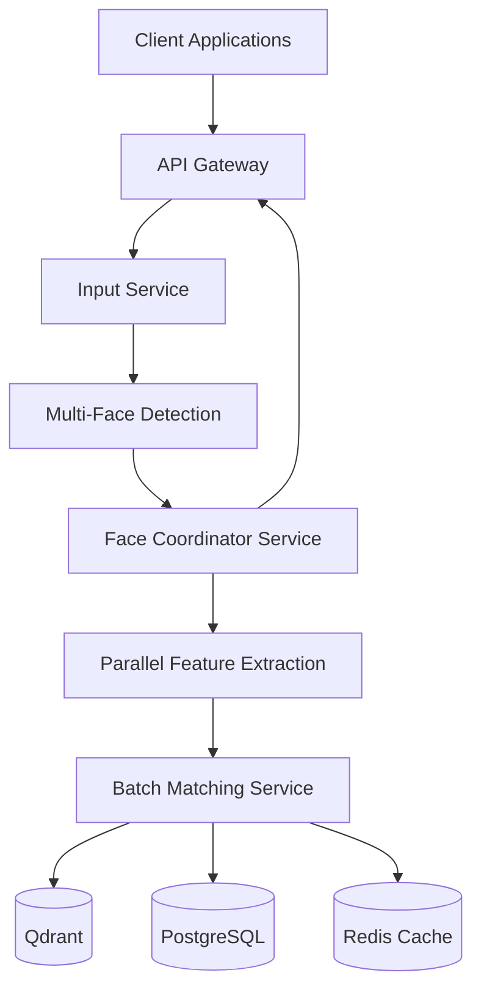

### 2.2 Multi-Face Processing Flow
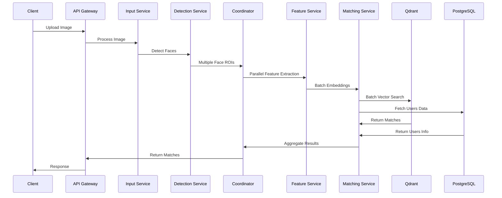

### 2.3 Database Schema

#### PostgreSQL Schema
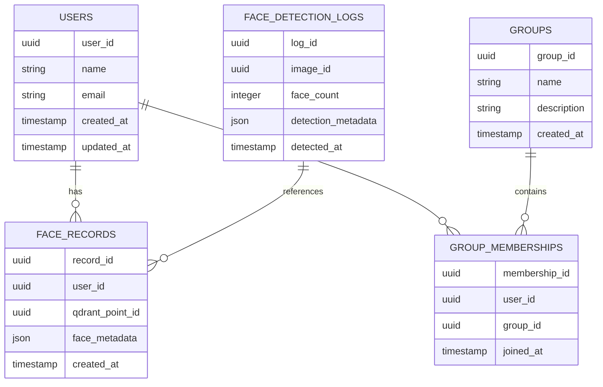

#### Qdrant Collection Structure
```json
{
    "name": "face_embeddings",
    "vectors": {
        "size": 128,
        "distance": "Cosine"
    },
    "payload_schema": {
        "user_id": "keyword",
        "record_id": "keyword",
        "face_position": "geo",
        "confidence_score": "float",
        "detection_timestamp": "datetime",
        "metadata": "json"
    },
    "indexes": [
        {
            "field_name": "user_id",
            "field_schema": "keyword",
            "index_type": "fast"
        },
        {
            "field_name": "confidence_score",
            "field_schema": "float",
            "index_type": "fast"
        }
    ]
}
```

## 3. Component Details

### 3.1 Input Service
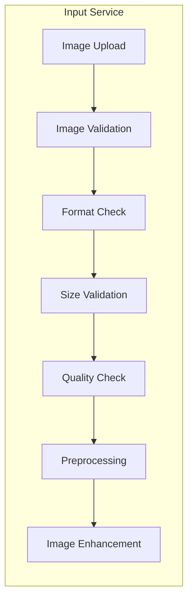

Specifications:
- Supported formats: JPEG, PNG, WebP
- Maximum image size: 12MB
- Minimum resolution: 640x480
- Maximum resolution: 4096x4096
- Automatic image enhancement
- EXIF data handling
- Rotation correction

### 3.2 Multi-Face Detection Service
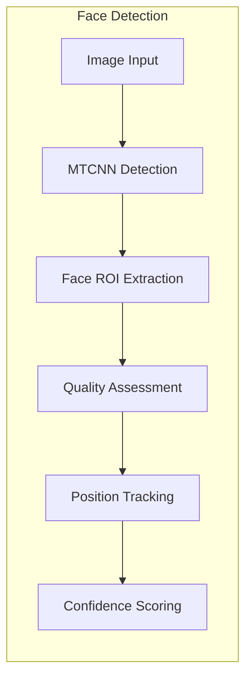

Features:
- MTCNN-based detection
- Multiple face ROI extraction
- Face quality scoring
- Position tracking
- Occlusion detection
- Pose estimation
- Confidence threshold filtering

### 3.3 Face Coordinator Service
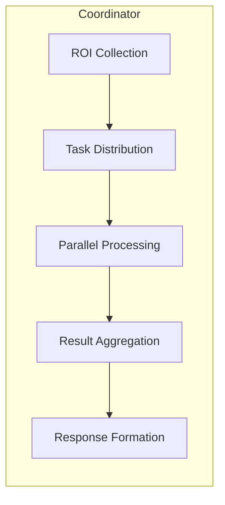

Responsibilities:
- ROI management
- Processing orchestration
- Resource allocation
- Result aggregation
- Error handling
- Performance optimization
- Load balancing

### 3.4 Parallel Feature Extraction Service
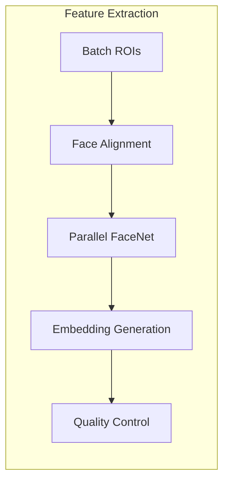

Specifications:
- Batch processing capability
- Parallel embedding generation
- Resource optimization
- Quality validation
- Error handling
- Performance monitoring
- Dynamic scaling

### 3.5 Batch Matching Service
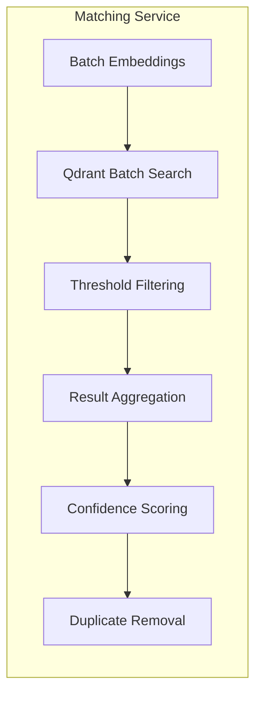

Features:
- Batch vector search
- Multi-threshold filtering
- Result deduplication
- Confidence scoring
- Performance optimization
- Cache utilization
- Error handling

## 4. API Endpoints

### 4.1 Multi-Face Registration
```http
POST /api/v2/register
Content-Type: multipart/form-data

Request:
{
    "image": File,
    "user_data": {
        "name": string,
        "group_id": string (optional),
        "metadata": object
    },
    "options": {
        "min_face_size": number,
        "confidence_threshold": number,
        "detect_all_faces": boolean
    }
}

Response:
{
    "success": boolean,
    "registered_faces": [
        {
            "face_id": string,
            "user_id": string,
            "position": {
                "x": number,
                "y": number,
                "width": number,
                "height": number
            },
            "confidence": number,
            "metadata": object
        }
    ],
    "errors": [
        {
            "code": string,
            "message": string,
            "face_index": number
        }
    ]
}
```

### 4.2 Multi-Face Recognition
```http
POST /api/v2/recognize
Content-Type: multipart/form-data

Request:
{
    "image": File,
    "options": {
        "min_face_size": number,
        "confidence_threshold": number,
        "max_faces": number,
        "include_metadata": boolean
    }
}

Response:
{
    "success": boolean,
    "faces": [
        {
            "face_id": string,
            "user": {
                "user_id": string,
                "name": string,
                "metadata": object
            },
            "position": {
                "x": number,
                "y": number,
                "width": number,
                "height": number
            },
            "confidence": number,
            "recognition_metadata": object
        }
    ],
    "image_metadata": {
        "processed_faces": number,
        "processing_time": number,
        "quality_score": number
    }
}
```

### 4.3 Batch Update
```http
PUT /api/v2/users/batch
Content-Type: multipart/form-data

Request:
{
    "updates": [
        {
            "user_id": string,
            "image": File,
            "metadata": object
        }
    ],
    "options": {
        "replace_existing": boolean,
        "min_quality_score": number
    }
}

Response:
{
    "success": boolean,
    "updated_users": [
        {
            "user_id": string,
            "face_count": number,
            "status": string
        }
    ],
    "errors": [
        {
            "user_id": string,
            "code": string,
            "message": string
        }
    ]
}
```

## 5. Qdrant Integration Details

### 5.1 Collection Configuration
```python
collection_config = {
    "name": "face_embeddings",
    "vectors": {
        "size": 128,
        "distance": "Cosine"
    },
    "optimizers_config": {
        "default_segment_number": 4,
        "indexing_threshold": 50000,
        "memmap_threshold": 100000
    },
    "quantization_config": {
        "scalar": {
            "type": "int8",
            "always_ram": True,
            "quantile": 0.99
        }
    },
    "hnsw_config": {
        "m": 16,
        "ef_construct": 100,
        "full_scan_threshold": 10000
    }
}
```

### 5.2 Batch Search Configuration
```python
batch_search_config = {
    "params": {
        "hnsw_ef": 128,
        "exact": False,
        "batch_size": 100
    },
    "filter": {
        "must": [
            {
                "key": "confidence_score",
                "range": {
                    "gte": 0.8
                }
            }
        ]
    }
}
```

## 6. Technical Requirements

### 6.1 Hardware Requirements
- CPU: 8 cores minimum (16 recommended)
- RAM: 32GB minimum
- GPU: NVIDIA GPU with 8GB VRAM
- Storage: 500GB NVMe SSD
- Network: 1Gbps minimum

### 6.2 Software Requirements
- Operating System: Ubuntu 20.04 LTS or later
- Python: 3.8 or later
- CUDA: 11.4 or later
- Docker: 20.10 or later
- Kubernetes: 1.22 or later

### 6.3 Performance Targets
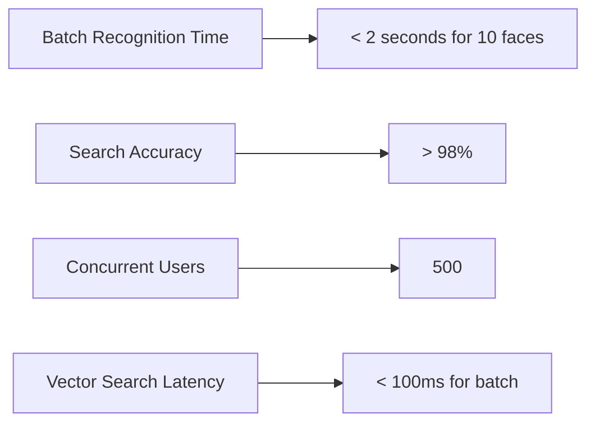

### 6.4 Scaling Requirements
- Horizontal scaling: Up to 10 nodes
- Vertical scaling: Up to 64GB RAM per node
- Storage scaling: Up to 2TB per cluster
- Concurrent processing: Up to 1000 faces/minute

## 7. Security Implementation

### 7.1 Authentication
- JWT-based authentication
- Role-based access control
- API key management
- Rate limiting per client
- IP whitelisting

### 7.2 Data Protection
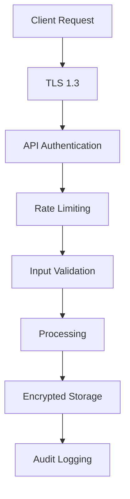

### 7.3 Privacy Measures
- Data encryption at rest
- Data encryption in transit
- Regular data purging
- Privacy policy enforcement
- GDPR compliance
- Audit logging

## 8. Monitoring and Maintenance

### 8.1 System Metrics
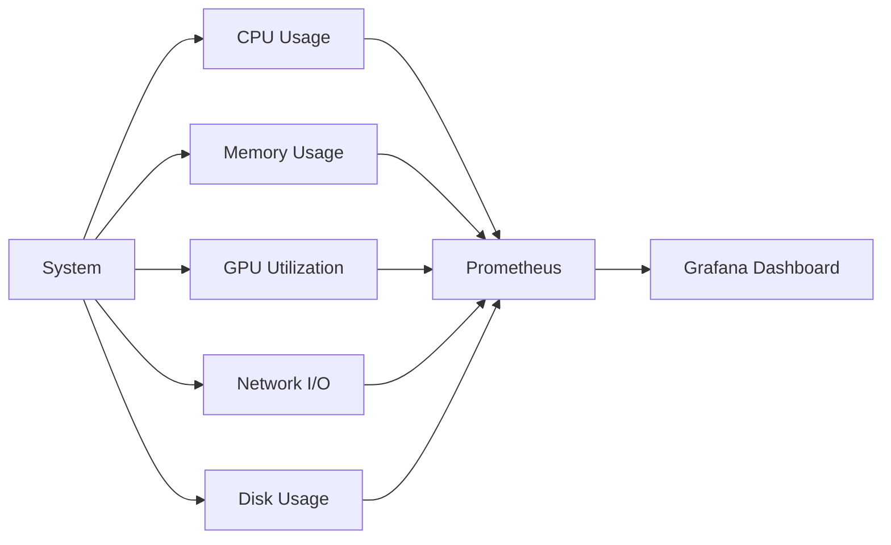

### 8.2 Application Metrics
- Recognition accuracy
- Processing time
- Face detection rate
- Error rates
- API latency
- Cache hit ratio
- Database performance

### 8.3 Alerting
- Resource utilization alerts
- Error rate thresholds
- Performance degradation
- Security incidents
- System health checks

## 9. Error Handling

### 9.1 Error Categories
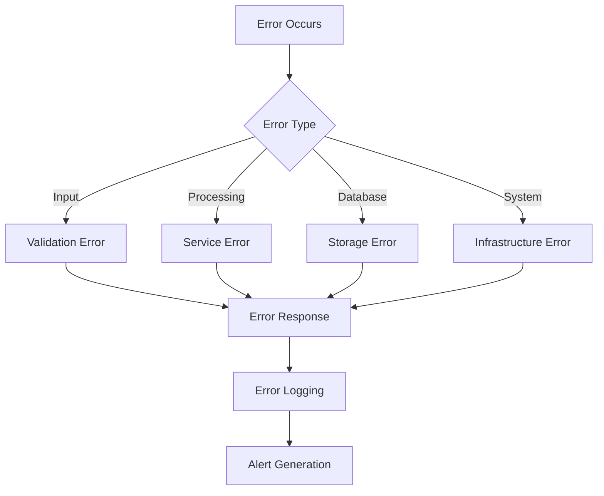

### 9.2 Recovery Strategies
- Automatic retries
- Circuit breakers
- Fallback mechanisms
- Data consistency checks
- Service health checks

## 10. Deployment Architecture

### 10.1 Container Architecture
```mermaid
flowchart TB
    subgraph Kubernetes Cluster
        direction LR
        
        subgraph Services
            API[API Gateway]
            Detect[Detection Service]
            Feature[Feature Service]
            Match[Matching Service]
        end
        
        subgraph Data Layer
            Qdrant[Qdrant Cluster]
            Postgres[PostgreSQL]
            Redis[Redis Cache]
        end
        
        subgraph Monitoring
            Prom[Prometheus]
            Graf[Grafana]
        end
        
        Services --> Data Layer
        Services --> Monitoring
    end
```

### 10.2 Scaling Strategy
- Horizontal pod autoscaling
- Node autoscaling
- Database replication
- Cache clustering
- Load balancing

## 11. Backup and Recovery

### 11.1 Backup Strategy
- Regular database backups
- Vector index snapshots
- Configuration backups
- Log archival
- Disaster recovery plan

### 11.2 Recovery Procedures
- Point-in-time recovery
- Service restoration
- Data consistency checks
- System health verification
- Performance validation