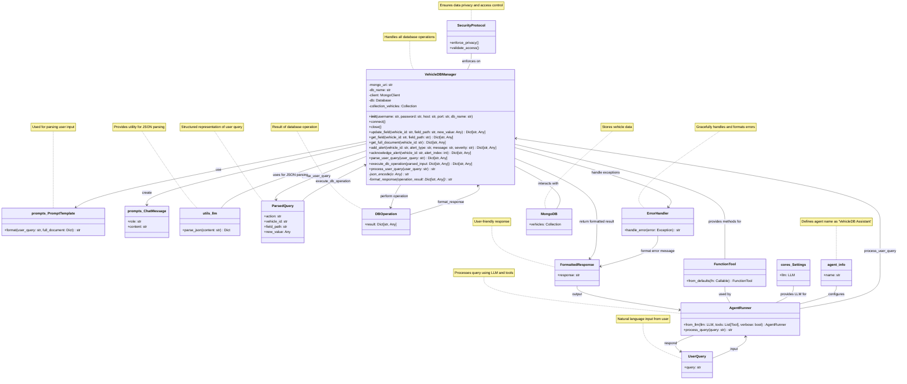
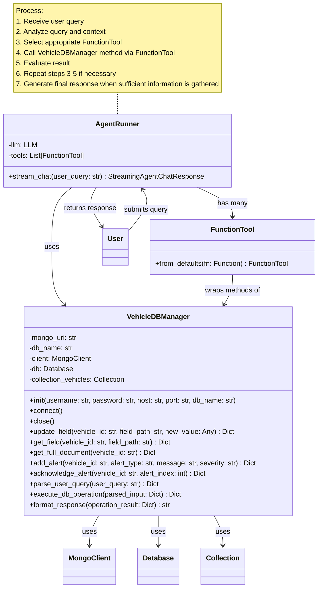

# Agents

```mermaid
    classDiagram
    class VehicleDBManager {
        -mongo_uri: str
        -db_name: str
        -client: MongoClient
        -db: Database
        -collection_vehicles: Collection
        +__init__(username: str, password: str, host: str, port: str, db_name: str)
        +connect()
        +close()
        +update_field(vehicle_id: str, field_path: str, new_value: Any) Dict[str, Any]
        +get_field(vehicle_id: str, field_path: str) Dict[str, Any]
        +get_full_document(vehicle_id: str) Dict[str, Any]
        +add_alert(vehicle_id: str, alert_type: str, message: str, severity: str) Dict[str, Any]
        +acknowledge_alert(vehicle_id: str, alert_index: int) Dict[str, Any]
        +parse_user_query(user_query: str) Dict[str, Any]
        +execute_db_operation(parsed_input: Dict[str, Any]) Dict[str, Any]
        +process_user_query(user_query: str) str
        -json_encode(o: Any)* str
        -format_response(operation_result: Dict[str, Any])* str
    }

    class AgentRunner {
        +from_llm(llm: LLM, tools: List[Tool], verbose: bool) AgentRunner
        +process_query(query: str) str
    }

    class FunctionTool {
        +from_defaults(fn: Callable) FunctionTool
    }

    class cores_Settings {
        +llm: LLM
    }

    class prompts_PromptTemplate {
        +format(user_query: str, full_document: Dict) str
    }

    class prompts_ChatMessage {
        +role: str
        +content: str
    }

    class utils_llm {
        +parse_json(content: str) Dict
    }

    class UserQuery {
        +query: str
    }

    class ParsedQuery {
        +action: str
        +vehicle_id: str
        +field_path: str
        +new_value: Any
    }

    class DBOperation {
        +result: Dict[str, Any]
    }

    class FormattedResponse {
        +response: str
    }

    class ErrorHandler {
        +handle_error(error: Exception) str
    }

    class MongoDB {
        +vehicles: Collection
    }

    class SecurityProtocol {
        +enforce_privacy()
        +validate_access()
    }

    class agent_info {
        +name: str
    }

    UserQuery --> AgentRunner : input
    AgentRunner --> VehicleDBManager : process_user_query
    VehicleDBManager --> prompts_PromptTemplate : use
    VehicleDBManager --> prompts_ChatMessage : create
    VehicleDBManager --> ParsedQuery : parse_user_query
    ParsedQuery --> VehicleDBManager : execute_db_operation
    VehicleDBManager --> DBOperation : perform operation
    DBOperation --> VehicleDBManager : format_response
    VehicleDBManager --> FormattedResponse : return formatted result
    FormattedResponse --> AgentRunner : output
    AgentRunner --> UserQuery : respond
    VehicleDBManager --> ErrorHandler : handle exceptions
    ErrorHandler --> FormattedResponse : format error message

    VehicleDBManager -- FunctionTool : provides methods for
    FunctionTool -- AgentRunner : used by
    cores_Settings -- AgentRunner : provides LLM for
    VehicleDBManager -- utils_llm : uses for JSON parsing
    VehicleDBManager -- MongoDB : interacts with
    SecurityProtocol -- VehicleDBManager : enforces on
    agent_info -- AgentRunner : configures

    note for UserQuery "Natural language input from user"
    note for ParsedQuery "Structured representation of user query"
    note for DBOperation "Result of database operation"
    note for FormattedResponse "User-friendly response"
    note for AgentRunner "Processes query using LLM and tools"
    note for VehicleDBManager "Handles all database operations"
    note for ErrorHandler "Gracefully handles and formats errors"
    note for prompts_PromptTemplate "Used for parsing user input"
    note for utils_llm "Provides utility for JSON parsing"
    note for MongoDB "Stores vehicle data"
    note for SecurityProtocol "Ensures data privacy and access control"
    note for agent_info "Defines agent name as 'VehicleDB Assistant'"
```

```mermaid
classDiagram
    class VehicleDBManager {
        -mongo_uri: str
        -db_name: str
        -client: MongoClient
        -db: Database
        -collection_vehicles: Collection
        +__init__(username: str, password: str, host: str, port: str, db_name: str)
        +connect()
        +close()
        +update_field(vehicle_id: str, field_path: str, new_value: Any) Dict
        +get_field(vehicle_id: str, field_path: str) Dict
        +get_full_document(vehicle_id: str) Dict
        +add_alert(vehicle_id: str, alert_type: str, message: str, severity: str) Dict
        +acknowledge_alert(vehicle_id: str, alert_index: int) Dict
        +parse_user_query(user_query: str) Dict
        +execute_db_operation(parsed_input: Dict) Dict
        +format_response(operation_result: Dict) str
    }
    
    class MongoClient {
    }
    
    class Database {
    }
    
    class Collection {
    }
    
    class AgentRunner {
        -llm: LLM
        -tools: List[FunctionTool]
        +stream_chat(user_query: str) StreamingAgentChatResponse
    }
    
    class FunctionTool {
        +from_defaults(fn: Function) FunctionTool
    }
    
    VehicleDBManager --> MongoClient : uses
    VehicleDBManager --> Database : uses
    VehicleDBManager --> Collection : uses
    
    AgentRunner --> VehicleDBManager : uses
    AgentRunner --> FunctionTool : has many
    FunctionTool --> VehicleDBManager : wraps methods of

    note for AgentRunner "Process:
    1. Receive user query
    2. Analyze query and context
    3. Select appropriate FunctionTool
    4. Call VehicleDBManager method via FunctionTool
    5. Evaluate result
    6. Repeat steps 3-5 if necessary
    7. Generate final response when sufficient information is gathered"

    User --> AgentRunner : submits query
    AgentRunner --> User : returns response
```