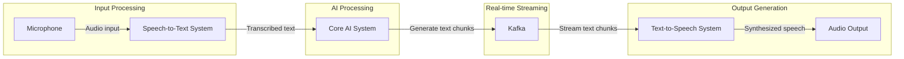

# AI-Powered Car Assistant App Documentation

## Table of Contents
1. Introduction
2. System Architecture and Functionality
3. Application Flow and User Interaction
4. Data Management
5. Features
6. Use Cases
7. Conclusion

## 1. Introduction

The AI-powered car assistant app is a cutting-edge artificial intelligence system designed to revolutionize the driving experience. It serves as an intelligent co-pilot, offering personalized assistance, enhancing safety, and optimizing vehicle performance across various driving scenarios. The app utilizes advanced Large Language Models (LLMs) to provide a sophisticated, context-aware interaction experience, seamlessly integrating with vehicle systems and external data sources to create a comprehensive and intuitive driving companion.

*Note on text formatting:*
- **Bold text** indicates system components and key technical elements.
- *Italic text* represents input/output processes and user interactions within the system.
- <u>Underlined text</u> denotes data types, storage methods, and data management processes.

## 2. System Architecture and Functionality

The app's architecture is built on a foundation of advanced AI algorithms and deep integration with vehicle systems, designed to process information, make predictions, and provide real-time assistance to the driver.

### 2.1 System Components and Processes

#### 2.1.1 Input Processing
- **Speech recognition module**: Converts *user speech* into *text* for natural, hands-free interaction.
- **Touch input processing**: Handles *input* from the vehicle's infotainment system.

#### 2.1.2 Core AI Engine
- **Large Language Models (LLMs)**: The heart of the system, responsible for:
  - Understanding context
  - Query classification (car usage, car part control, or other assistive tasks)
  - Natural language processing
  - Generating appropriate *responses*
  - Translating *user input* into specific *commands* for car function control
  - Making decisions based on user data and learned patterns

- **Machine Learning Module**: Enhances the system's ability to learn and adapt, including:
  - **User Behavior Analysis Engine**: Analyzes patterns in user interactions, preferences, and habits.
  - **Predictive Models**:
    - **Route Prediction**: Learns and predicts frequently traveled routes.
    - **Energy Consumption Prediction**: Estimates energy needs based on driving patterns and routes.
    - **User Preference Prediction**: Anticipates user preferences for various settings.
  - **Anomaly Detection System**: Identifies unusual patterns that may indicate safety concerns or vehicle issues.
  - **Drowsiness Detection**: Monitors driver alertness and detects signs of fatigue.
  - **Transfer Learning Module**: Applies knowledge learned from general data to specific user contexts.

#### 2.1.3 Integration Layer
- **Vehicle systems integration**: Interfaces with various car systems and sensors
  - **Core vehicle systems control** (e.g., climate, entertainment)
  - **Energy management system**
  - **Safety systems integration** (e.g., ADAS)
- **External systems integration**: 
  - **Google Maps API** for navigation services
  - **Third-party APIs** for traffic and weather information
  - Other external services and APIs as needed

#### 2.1.4 Output Processing
- **Text-to-speech conversion**: Transforms system *responses* into *audio output*
- **Visual display management**: Handles information *presentation* on the infotainment system

## 3. Application Flow and User Interaction

This section describes how information and processes move through the system, from user input to system response, illustrating the app's operation in real-time.

### 3.1 Basic Information Flow
1. *User Input*: The flow begins when the user interacts with the app, either through *voice commands* or *touch input* on the infotainment system.

2. *Input Processing*: 
   - For *voice input*, the **speech recognition module** converts speech to text.
   - *Touch inputs* are processed directly.

3. *Core AI Processing*:
   - The **LLM** interprets the user's intent and classifies the query.
   - The system decides which components need to be involved to fulfill the request.

4. *Data Retrieval and Integration*:
   - Relevant data is fetched from <u>local storage</u>, <u>cloud storage</u>, or external sources as needed.
   - The system integrates information from various vehicle systems if required.

5. *Response Generation*:
   - The **AI engine** generates an appropriate *response* or *action plan*.
   - This may involve simple information retrieval, complex problem-solving, or triggering specific vehicle functions.

6. *Output Delivery*:
   - The *response* is converted to speech if necessary.
   - Visual information is prepared for *display* on the infotainment system.
   - The system executes any required *actions* (e.g., adjusting climate control).

7. *User Feedback*:
   - The system observes the user's reaction to the *response*.
   - This feedback is used to refine future interactions.

### 3.2 Continuous Learning Loop
Parallel to the basic flow, a continuous learning process occurs:
1. The **Machine Learning Module** analyzes each interaction.
2. User behaviors and preferences are updated in the user profile.
3. The system adjusts its models to improve future performance.

### 3.3 Proactive Assistance Flow
The app also operates proactively:
1. Continuous Monitoring: The system constantly monitors vehicle status, user patterns, and environmental data.
2. Predictive Analysis: Based on this data, the **AI** predicts potential user needs or vehicle issues.
3. Proactive Suggestions: The system initiates interaction with the user, offering suggestions or alerts without explicit user input.

### 3.4 User Interface and Interaction Modes
The app features a multi-modal interface designed for seamless interaction:

- *Voice-activated controls*: Primary mode for hands-free operation while driving
- *Visual display*: Utilizes the vehicle's infotainment system for information presentation
- *Touch interface*: Available for situations where voice commands are not preferred
- *Haptic feedback*: Provides tactile responses for certain functions

The user interface adapts to user preferences and context, prioritizing safety and ease of use. It presents information clearly and concisely, with the option for more detailed interactions when the vehicle is stationary.

### 3.5 User Interface Flow
1. *Input Reception*: The UI receives user input through voice, touch, or automated system prompts.
2. *Input Visualization*: For touch inputs, the UI provides visual feedback. For voice inputs, it may display a listening indicator.
3. *Processing Indication*: The UI shows that the system is processing the request (e.g., a loading animation).
4. *Response Presentation*: The UI presents the system's response through audio output and/or visual display.
5. *Interaction Confirmation*: The UI confirms successful actions or provides error messages as needed.
6. *Continuous Adaptation*: The UI adjusts based on user preferences, context, and system learning over time.

### 3.6 Offline Functionality
The app is designed to maintain core functionalities even when network connectivity is limited or unavailable:
1. *Local Data Access*: The system utilizes <u>local storage</u> to access essential information.
2. *Offline Navigation*: Pre-downloaded maps and cached route information allow for basic navigation.
3. *Limited Voice Control*: Basic voice commands for in-car functions remain operational.
4. *Data Queuing*: Any data that needs to be synced is queued and uploaded once connectivity is restored.

## 4. Data Management

The app's robust data management system is crucial for its operation, ensuring efficient storage, retrieval, and processing of various types of data while maintaining user privacy and system security.

### 4.1 Data Types, Sources, and Database Solutions

- <u>User Data</u>: Personal information, preferences, interaction history
  - Database: **Document-oriented NoSQL database** (e.g., MongoDB)
  - Rationale: Flexible schema for varied user data, good for frequent reads and writes

- <u>Vehicle Data</u>: Status information, performance metrics, maintenance data
  - Database: **Time-series database** (e.g., InfluxDB)
  - Rationale: Optimized for time-stamped data, efficient for real-time analytics and historical queries

- <u>Environmental Data</u>: Weather conditions, traffic information, road conditions
  - Database: **Combination of Time-series database and Spatial database** (e.g., InfluxDB with PostGIS extension)
  - Rationale: Handles time-stamped data with geospatial components

- <u>External Data</u>: Maps, points of interest, service station information
  - Database: **Spatial database** (e.g., PostGIS)
  - Rationale: Optimized for storing and querying location-based data

- <u>Vehicle Knowledge Base and Operational Data</u>: Comprehensive information about vehicle specifications, operational patterns, and technical documentation
  - Database: **Vector database** (e.g., Qdrant)
  - Rationale:
    - Efficient for storing and querying high-dimensional vector data
    - Enables semantic search and similarity-based retrieval
    - Facilitates fast and accurate retrieval of relevant vehicle information, usage patterns, and technical content
    - Supports advanced natural language processing tasks and semantic understanding of vehicle-related queries

- <u>Vehicle Control Command Repository</u>: Structured data for vehicle component control and system operations
  - Database: **Relational database (SQL)** (e.g., PostgreSQL, MySQL)
  - Rationale:
    - Ideal for structured data with fixed schemas and relationships
    - Ensures data integrity and consistency for critical vehicle control commands
    - Supports complex queries and efficient retrieval of command information
    - Provides ACID compliance for reliable transaction processing

### 4.2 Data Storage and Retrieval
- <u>Local Storage</u>: For immediate access to frequently used data and offline functionality
  - Database: **Embedded database** (e.g., SQLite)
  - Rationale: Lightweight, requires no separate server process, suitable for mobile/embedded systems

- <u>Cloud Storage</u>: For backup, long-term storage, and cross-device synchronization
  - Database: **Distributed NoSQL database** (e.g., Apache Cassandra)
  - Rationale: Highly scalable, designed for high availability and fault tolerance

- <u>Caching Mechanisms</u>: To optimize data access and reduce latency
  - Database: **In-memory database** (e.g., Redis)
  - Rationale: Extremely fast data access, suitable for caching frequently accessed data

### 4.3 Data Processing and Analysis
- <u>Real-time Processing</u>: For immediate response to user queries and vehicle status changes
  - Utilizes in-memory, time-series, vector, and relational databases for speed

- <u>Batch Processing</u>: For long-term trend analysis and system improvements
  - Database: **Data Warehouse** (e.g., Amazon Redshift)
  - Rationale: Optimized for complex queries on large datasets

- <u>Edge Computing</u>: For processing sensitive or time-critical data directly on the vehicle's hardware
  - Database: **Embedded database** (e.g., SQLite) or **Lightweight Time-series database** (e.g., EdgeDB)
  - Rationale: Minimizes latency, operates with limited resources

### 4.4 Data Security and Privacy
- <u>Encryption</u>: Both at rest and in transit, implemented across all database solutions
- <u>Access Control</u>: Role-based access to different types of data, utilizing database-specific mechanisms
- <u>Anonymization and Pseudonymization</u>: Implemented at the application level for aggregate analysis
- <u>Compliance</u>: Adherence to relevant data protection regulations (e.g., GDPR, CCPA) through database features and application-level controls
- <u>User Consent Management</u>: Granular control for users to manage their data sharing preferences, with clear explanations of how data is used

### 4.5 Data Synchronization and Integration
- <u>Vehicle-to-Cloud Sync</u>: Regular updates using local embedded, cloud-based distributed, vector, and relational databases
- <u>Cross-Device Sync</u>: Leverages cloud storage and distributed databases for data consistency
- <u>Third-party Data Integration</u>: Utilizes API gateways and ETL processes to integrate with various database types and external services

### 4.6 Data Lifecycle Management
- <u>Data Collection</u>: Automated gathering of relevant data points across all databases
- <u>Data Retention</u>: Implemented through database-specific retention policies and archiving mechanisms
- <u>Data Archiving</u>: Utilizes **Data Warehouse** or **Cold Storage** solutions (e.g., Amazon S3 Glacier) for long-term storage
- <u>Data Deletion</u>: Secure removal across all database solutions with proper audit trails

## 5. Features

Leveraging the robust architecture, application flow, and data management systems, the app offers a wide array of features designed to enhance the driving experience:

### 5.1 Intelligent Personal Assistant
- Conversational AI powered by **LLMs** for natural interactions
- Proactive assistance based on user behavior analysis and predictive models
- Contextual awareness for relevant and timely suggestions

### 5.2 Vehicle Control and Management
- Voice-activated control of core vehicle systems
- Real-time monitoring and reporting of vehicle status
- Predictive maintenance alerts based on anomaly detection
- Intelligent energy management for both traditional and electric vehicles

### 5.3 Navigation and Trip Planning
- AI-powered route optimization using **Google Maps**, considering traffic, weather, and user preferences
- Predictive navigation based on learned travel patterns
- Intelligent point of interest suggestions

### 5.4 Safety and Driver Assistance
- Integration with vehicle safety systems and **ADAS**
- Driver drowsiness detection and proactive rest suggestions
- Real-time safety alerts and guidance
- Predictive maintenance notifications based on vehicle sensor data and usage patterns

### 5.5 Energy Management
- Intelligent energy consumption prediction for both traditional and electric vehicles
- For electric vehicles:
  - Real-time range estimation based on driving style, route, and environmental conditions
  - Smart charging recommendations considering electricity rates and user schedule
  - Optimal route planning to incorporate charging stops on long trips

### 5.6 Personalization and Adaptive Learning
- Continuous learning from user interactions to improve system performance
- Personalized comfort settings, entertainment suggestions, and information delivery
- Privacy-preserving learning across multiple users

## 6. Use Cases

The app's features and interface come together to assist in various real-world scenarios, showcasing its versatility:

### 6.1 Daily Commutes
- Optimizes routes based on real-time traffic and learned patterns
- Manages energy consumption efficiently
- Provides timely information about weather, road conditions, and estimated arrival times

### 6.2 Long-distance Trips
- Offers comprehensive trip planning, including rest stops and points of interest
- Suggests optimal charging or refueling stops for electric and traditional vehicles
- Manages entertainment options for passengers
- Provides real-time updates on route changes and estimated arrival times

### 6.3 Unfamiliar Environments
- Offers detailed guidance for rental cars or when driving in new locations
- Provides local information, including parking options, local customs, and regulations
- Assists with language translation for international travel

### 6.4 Emergency Situations
- Rapid response to low-fuel/battery situations with immediate routing to nearest suitable station
- Quick access to emergency services and roadside assistance
- Real-time guidance for handling vehicle malfunctions or accidents

### 6.5 Lifestyle Integration
- Seamless connection with user's calendar for automatic trip planning and reminders
- Integration with smart home systems for pre-arrival home preparation (e.g., adjusting thermostat, opening garage)
- Synchronization with user's preferences for entertainment, climate control, and seating positions

### 6.6 Proactive Assistance
- Detects upcoming appointments in the user's calendar and suggests appropriate departure times based on current traffic conditions
- Recommends maintenance checks or service appointments based on vehicle usage and performance data
- Alerts users to potential issues before they become critical, such as low tire pressure or engine irregularities

### 6.7 Eco-friendly Driving
- Provides real-time feedback on driving efficiency
- Suggests optimal speed and acceleration patterns for fuel/energy conservation
- Gamifies eco-friendly driving to encourage sustainable practices

## 7. Diagrams

## 8. Conclusion

The AI-powered car assistant app represents a significant advancement in automotive technology, offering a personalized, safe, and efficient driving experience. Its sophisticated architecture, centered around advanced **AI** and **machine learning** capabilities, enables deep understanding of user needs and generation of context-aware assistance.

Key strengths of the system include:

1. **Comprehensive Integration**: By seamlessly integrating with vehicle systems and external data sources like **Google Maps** and weather APIs, the app serves as an intelligent co-pilot, enhancing every aspect of the journey from navigation and vehicle control to safety and entertainment.

2. **Adaptive Learning**: The app's ability to learn and adapt ensures that it continues to improve and personalize its service over time, providing an increasingly tailored experience for each user.

3. **Robust Data Management**: The sophisticated <u>data management system</u> underpinning the app ensures that user data is handled securely and efficiently, enabling powerful features while maintaining privacy and compliance with regulations.

4. **Intuitive User Interface**: The multi-modal user interface, deeply integrated into the application flow, provides an intuitive and responsive user experience, adapting to different contexts and user preferences.

5. **Proactive Assistance**: By anticipating user needs and potential issues, the app goes beyond reactive responses, offering timely suggestions and alerts that enhance safety and convenience.

6. **Versatility**: The wide range of use cases demonstrates the app's ability to assist in various scenarios, from daily commutes to long-distance trips and emergency situations.

As automotive technology continues to evolve, this AI assistant sets a new standard for in-vehicle intelligence, promising to transform the relationship between drivers and their vehicles. It not only makes driving more convenient and enjoyable but also contributes to improved safety and efficiency on the roads.

Looking ahead, potential areas for future development could include:
- Enhanced integration with smart city infrastructure for improved traffic management and parking assistance
- Expanded capabilities for autonomous driving scenarios, acting as an interface between passengers and the self-driving system
- Deeper personalization through advanced AI models, potentially incorporating emotion recognition for better understanding of driver state
- Improved collaborative features for shared mobility solutions, facilitating seamless ride-sharing and car-pooling experiences
- Integration with emerging technologies such as augmented reality displays for enhanced navigation and safety features
- Advanced predictive maintenance capabilities, potentially incorporating IoT sensors for real-time component health monitoring

The AI-powered car assistant app represents a significant step towards the future of mobility, where vehicles are not just modes of transportation, but intelligent partners in our daily lives. By continuously evolving and adapting to user needs and technological advancements, this system has the potential to revolutionize the automotive industry and redefine the concept of personal transportation.

As we move forward, it will be crucial to maintain a balance between technological innovation and user privacy, ensuring that the benefits of this advanced system are realized while respecting individual rights and societal norms. With ongoing development and responsible implementation, the AI-powered car assistant app promises to make our journeys safer, more efficient, and more enjoyable, paving the way for a new era of intelligent mobility.