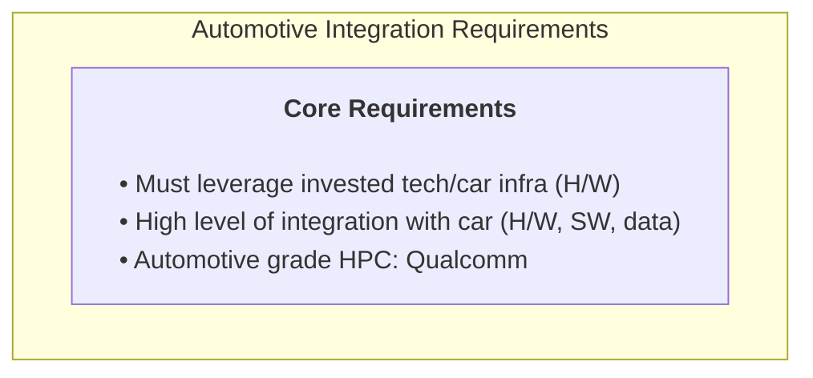
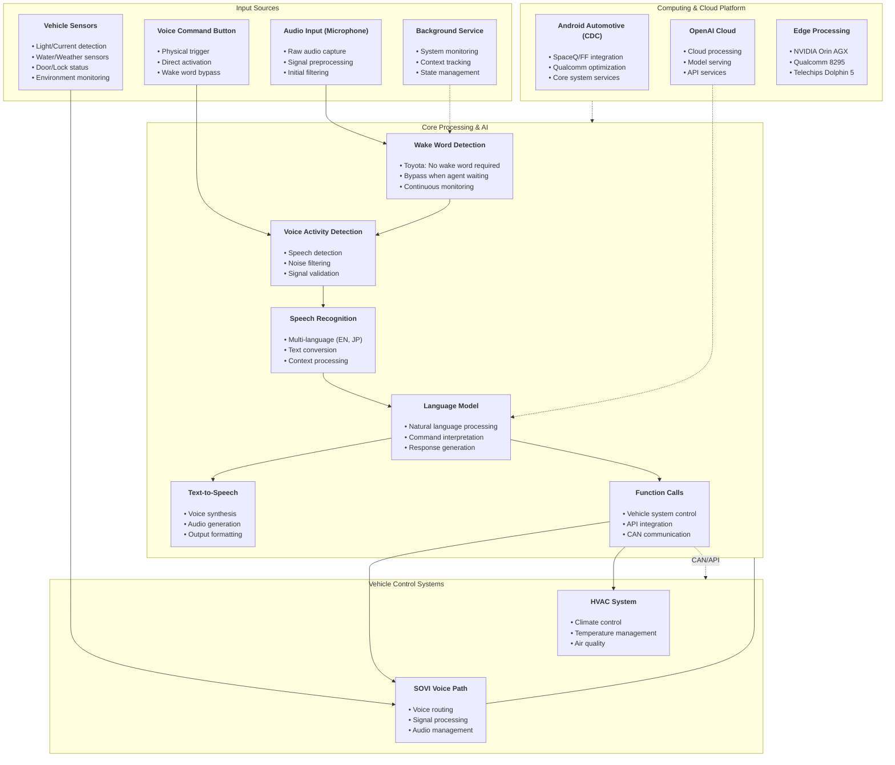
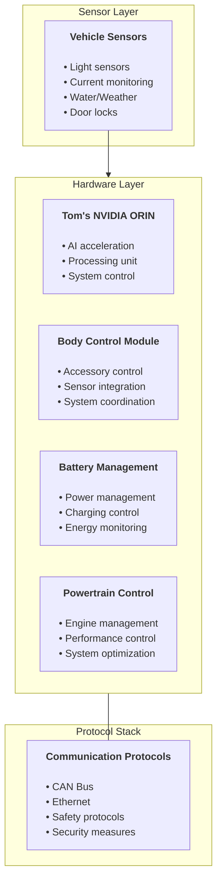
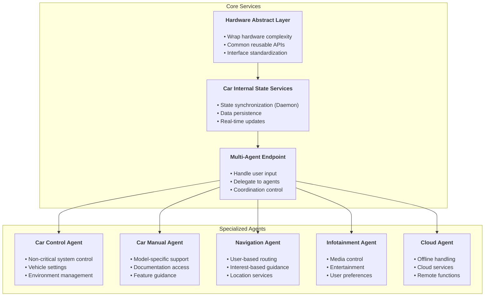

# Automotive In-car Agents System Documentation

## 1. System Overview

### 1.1 Core Requirements



### 1.2 Application Categories
1. Navigation
2. Driving: ADAS/AD
3. Communication
4. Entertainment
5. Parking
6. Diagnostics/Maintenance/OTA
7. EV-specific
8. Mobility needs/Fleet management
9. Remote control
10. V2X
11. In-Cabin monitoring

## 2. System Architecture

### 2.1 Complete System Pipeline



### 2.2 Hardware Integration



### 2.3 Multi-Agent System



## 3. Implementation Details

### 3.1 Agent Candidates
1. Try Iy (AI-First)
   - Multi-command capability
   - LLM integration
   - CAN interface

2. Digital Mirror (Mazda Requirement)
   - Real-time monitoring
   - Visual feedback
   - State display

3. Predictive Fault Diagnostics (Drivers)
   - Early warning
   - Maintenance prediction
   - User alerts

4. Fault Diagnosis (Technicians)
   - Detailed diagnostics
   - Service tools
   - Professional support

5. In-cabin Monitoring
   - Providers: VinAI, Next, Xperi, LG, comma.ai
   - Environment monitoring
   - State detection

### 3.2 Example Scenarios

1. Weather Response:
   ```
   Scenario: "It is raining, do you want me to..."
   - Detect weather conditions
   - Suggest appropriate actions
   - Adjust vehicle systems
   ```

2. Mood Detection:
   ```
   Scenario: "I see you are in a bad mood due to traffic, 
             do you want me to play the newest playlist from Bruno Mars"
   - Monitor driver state
   - Detect traffic conditions
   - Provide entertainment suggestions
   ```

### 3.3 Key Features
1. Dynamic Agent Installation
   - App-like installation
   - Runtime configuration
   - Flexible deployment

2. Collaborative Operation
   - Independent or team-based
   - Task-specific cooperation
   - Seamless integration

3. Multi-language Support
   - English processing
   - Japanese processing
   - Natural language understanding

4. System Integration
   - High hardware integration
   - Software coordination
   - Data management