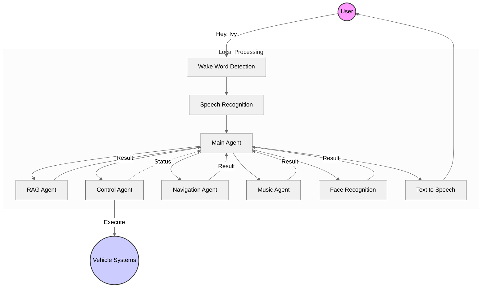
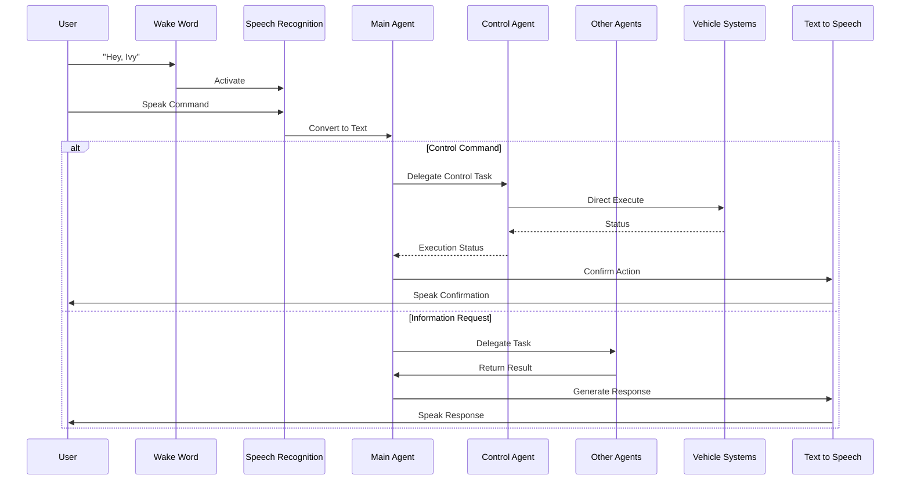

# IvyEdge: Your Intelligent Vehicle Companion

Transform your driving experience with IvyEdge, a AI assistant designed specifically for your vehicle. With completely hands-free operation and powerful local AI processing, IvyEdge aims to bring intelligent assistance to every journey while keeping your focus on the road.

## Core Features

### Voice-to-Voice/Action System
IvyEdge features an advanced dual-response system:
- **Voice-to-Voice**: Natural conversations for information, guidance, and feedback
- **Voice-to-Action**: Direct execution of vehicle commands through voice input
- Seamless switching between voice responses and physical actions
- Context-aware response selection for optimal user experience
- Intelligent action confirmation through voice feedback

By reducing manual interaction, IvyEdge can significantly decrease distracted driving incidents while improving overall customer satisfaction compared to traditional vehicle interfaces.

### Enhanced Safety Through Hands-Free Interaction
IvyEdge prioritizes your safety by providing complete hands-free control of your vehicle's features:
- Keep your hands on the wheel and eyes on the road while managing vehicle functions
- Eliminate distracting touchscreen interactions while driving
- Access all vehicle features through natural voice commands
- Maintain optimal driving position while controlling vehicle systems

The focus on safety can potentially reduce accident rates, creating opportunities for insurance premium discounts while positioning vehicle manufacturers as leaders in safety innovation.

### Intuitive Voice Interaction
Experience natural communication with your vehicle through advanced voice recognition technology:
- Effortless activation with customized wake word detection ("Hey, Ivy")
- Accurate speech recognition for natural conversations
- Crystal-clear text-to-speech responses
- Contextual understanding of your commands and preferences
- Intelligent switching between voice responses and vehicle actions

High voice command accuracy in diverse driving conditions helps reduce user frustration and potentially lowers support requirements compared to existing vehicle interfaces.

### Face Recognition System
Elevate personalization and security with facial recognition technology:
- Instant driver identification upon vehicle entry
- Automatic profile loading with personalized settings
- Enhanced security with driver authentication
- Facial expression monitoring for driver alertness
- Fatigue detection with intelligent safety alerts
- Multi-user recognition for seamless profile switching

This technology delivers faster vehicle setup times, enhances theft prevention, and generates valuable driver behavior data that could reduce fleet management costs while creating potential revenue streams through future insurance partnerships.

## Multi-Agent System
IvyEdge employs a network of specialized AI agents, each powered by optimized local models:

**RAG Agent (Retrieval-Augmented Generation)**
- Access vehicle documentation instantly through intelligent retrieval
- Get step-by-step maintenance guidance with contextual understanding
- Understand vehicle features and functionality through deep knowledge integration
- Troubleshoot common issues with expert-level assistance
- Voice feedback with detailed explanations

This approach can reduce dealership service visits for minor issues, lower documentation-related support inquiries, and enhance user confidence in vehicle operation.

**Control Agent**
- Direct execution of vehicle system commands
- Real-time control of vehicle functions
- Immediate response to control requests
- Built-in safety checks and validations
- Automatic status feedback

By increasing feature discovery and usage, the Control Agent extends the lifecycle value of premium vehicle features while creating opportunities for feature subscription models in the future.

**Navigation Agent**
- Find optimal routes to destinations without touching the screen
- Locate nearby services and amenities through voice requests
- Receive real-time routing assistance while keeping hands on the wheel
- Automatic route adjustment with voice notifications
- Access turn-by-turn directions through clear voice guidance

The Navigation Agent improves destination arrival time accuracy and enhances driver satisfaction with routing, while enabling potential partnership opportunities with businesses for premium placement in nearby service recommendations.

**Music Agent**
- Voice-controlled music playback from multiple streaming services
- Mood-based playlist generation to match your driving experience
- Hands-free browsing of music libraries and recommendations
- Contextual understanding of music preferences and history
- Intelligent volume and equalizer adjustments based on driving conditions
- Seamless integration with popular music streaming platforms

This feature can increase in-vehicle music consumption, potentially creating new revenue streams through future streaming service partnerships while enhancing the overall driving experience.

## Technical Excellence

### Advanced Local AI
IvyEdge leverages cutting-edge local AI technology for superior performance:
- State-of-the-art Large Language Models (LLMs) running entirely on your vehicle
- Specialized neural networks optimized for automotive use
- Advanced wake word detection and speech recognition models
- Real-time processing without cloud dependence
- Enhanced privacy with all data processed locally

Local processing delivers lower operational costs compared to cloud-dependent systems, reduces connectivity-related service disruptions, and offers a competitive advantage with privacy-conscious consumers in increasingly regulated markets.

### System Architecture

### Interaction Flow

### Performance Optimization
- Low-latency response times for immediate assistance
- Energy-efficient design for minimal power consumption
- Optimized models for smooth operation
- Balanced resource utilization
- Seamless multi-tasking capabilities
- Complete offline functionality
- Secure, private operation
- No data transmission to external servers

The system is engineered to reduce hardware requirements compared to competing systems, with potential to extend vehicle battery life during operation and minimize future warranty claims related to system performance.

### Vehicle Integration
- Seamless integration with vehicle systems
- Professional installation and calibration
- Regular updates for enhanced functionality
- Compatible with major vehicle brands
- Deep integration with vehicle sensors and controls

IvyEdge minimizes integration costs through standardized protocols, potentially accelerating time-to-market for new vehicle models, and creating opportunities for additional revenue through future certified installation partner programs.

## Market Differentiation & ROI

### Competitive Advantage
- Unique combination of safety, convenience, and intelligence
- Superior offline functionality compared to cloud-dependent alternatives
- Enhanced privacy protection with fully local processing
- Cross-brand compatibility creating broader market opportunity
- Continuous improvement through regular local model updates

These advantages position IvyEdge to enhance customer retention rates, potentially command a price premium over competing solutions, and foster brand loyalty among users.

### Return on Investment
- Reduces dealership support costs per vehicle annually
- Increases vehicle resale value
- Creates subscription revenue opportunities
- Generates valuable usage data for product improvement and new feature development
- Establishes ecosystem for third-party integrations and revenue sharing

IvyEdge aims to provide significant ROI potential for manufacturers, reduce total cost of ownership for consumers over time, and create opportunities for recurring revenue streams for automotive partners.

Transform your driving experience with IvyEdge - where intelligence meets the road. Experience the future of hands-free vehicle assistance with our sophisticated, efficient, and reliable AI companion.