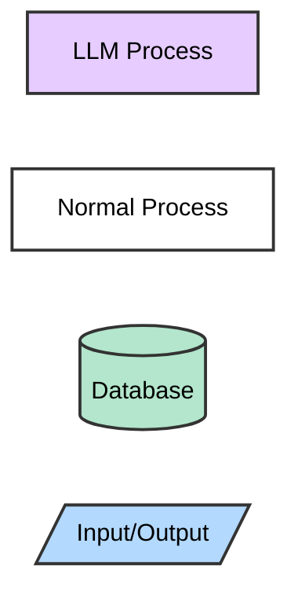
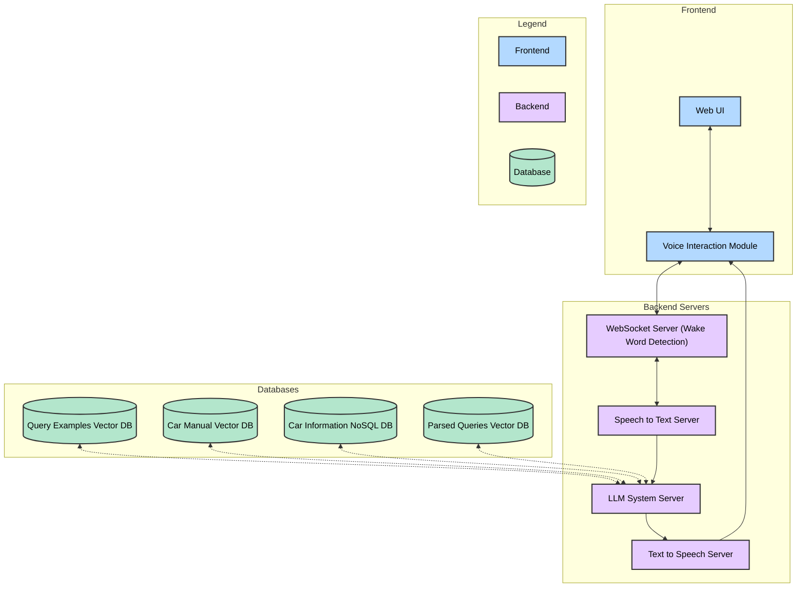
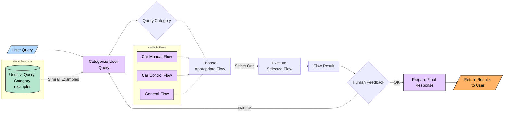
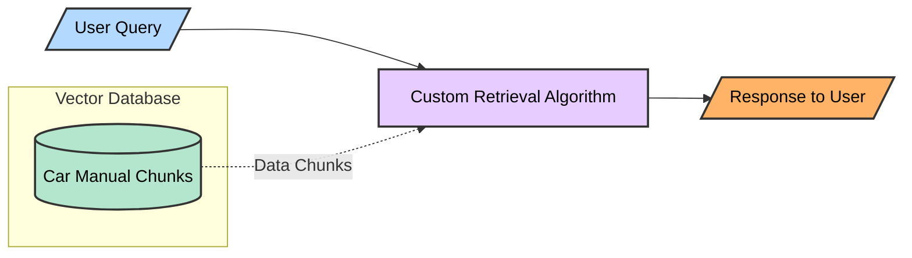
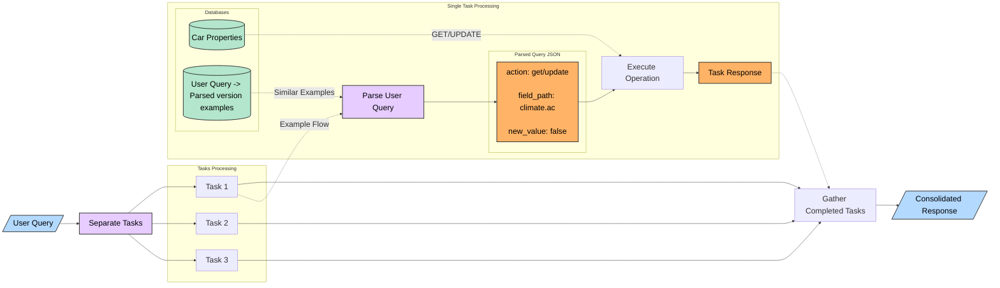
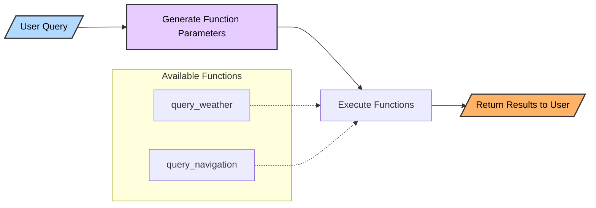
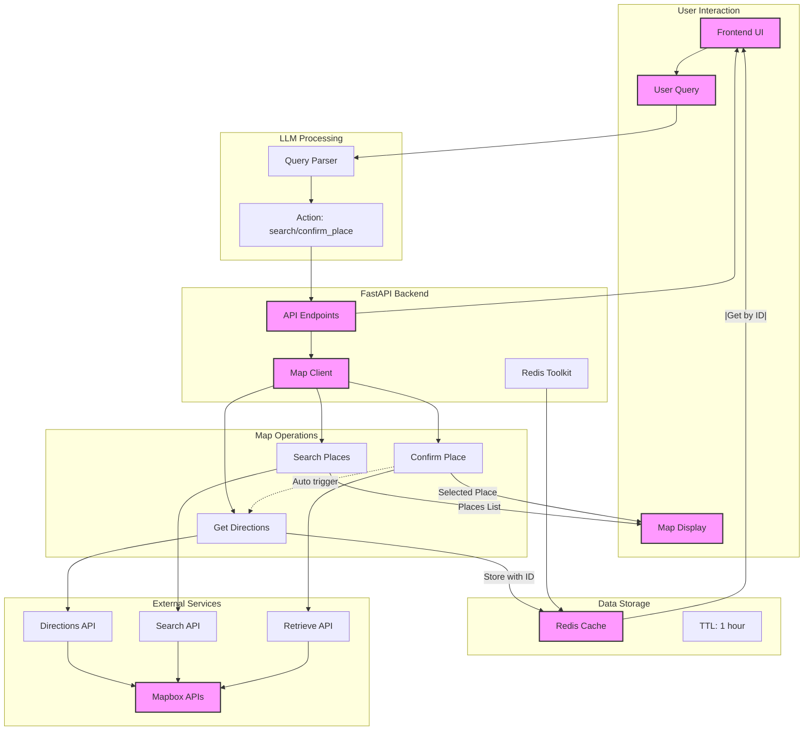

# Diagrams

[← Back to Main Documentation](../../../../README.md)

Please install [this](https://marketplace.visualstudio.com/items?itemName=bierner.markdown-mermaid) if you cannot see the diagrams.

## Legend

## Architecture

## Main

```mermaid
flowchart LR
    classDef default font-size:25px;
    classDef subgraphStyle font-size:25px,text-align:center;
    %% Add default styling for all nodes
    linkStyle default font-size:25px;

    %% Style definitions with black text and larger font
    classDef llmProcess fill:#e6ccff,stroke:#333,stroke-width:2px,color:black;
    classDef normalProcess fill:#ffffff,stroke:#333,stroke-width:2px,color:black;
    classDef database fill:#b3e6cc,stroke:#333,stroke-width:2px,color:black;
    classDef input fill:#b3d9ff,stroke:#333,stroke-width:2px,color:black;
    classDef output fill:#ffb366,stroke:#333,stroke-width:2px,color:black;


    UI["UI"]:::input
    AudioInput["Real Time Audio Input"]
    WakeSystem["WakeWord Detection System (WebSocket Server)"]
    WakeWord{"Wake Word Detected?"}
    Record["Record User Voice"]
    STT["Speech to Text"]
    Transcription["Transcribed Text"]:::output
    LLM["LLM System"]:::llmProcess
    LLMOutput["LLM Output Text"]:::output
    TTS["Text to Speech"]
    AudioResponse[/"Audio Response"/]:::output

    UI --> AudioInput
    AudioInput --> WakeSystem
    WakeSystem --> WakeWord
    WakeWord -->|Yes| Record
    WakeWord -->|No| WakeSystem
    Record --> STT
    STT --> Transcription
    Transcription --> LLM
    LLM --> LLMOutput
    LLMOutput --> TTS
    TTS --> AudioResponse
```

## LLM System Flow

### RAG

### Control

### General

### Map

