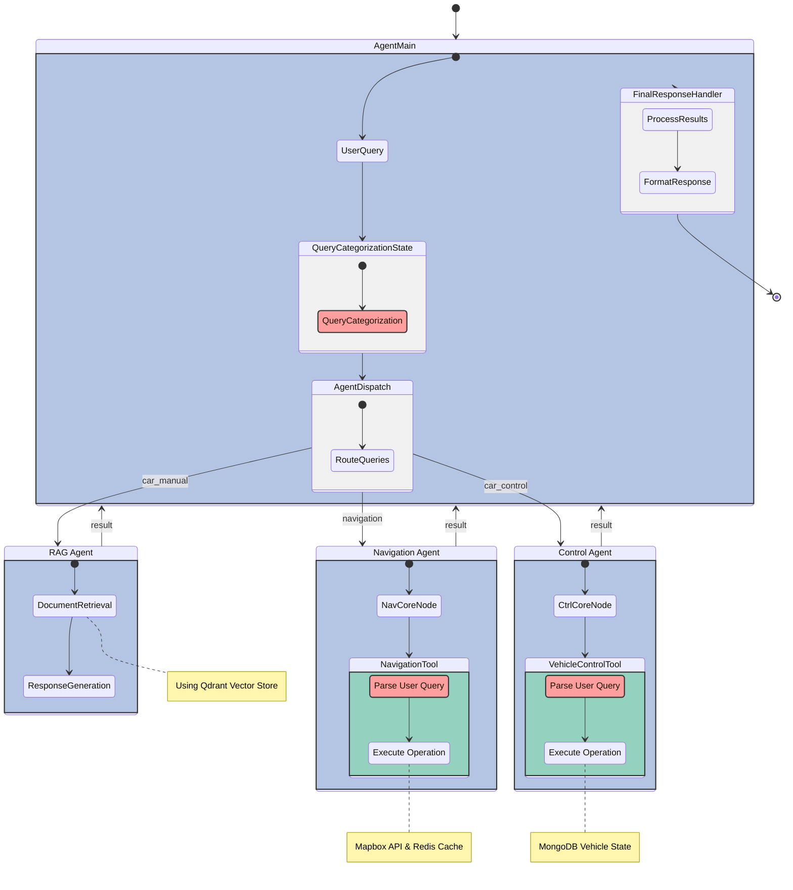

# Diagrams

## Multi-agents

```mermaid
stateDiagram-v2
    %% Style definitions for different components
    classDef llmOperation fill:#FF9E9E,stroke:#333,stroke-width:2px
    classDef toolOperation fill:#94D1BE,stroke:#333,stroke-width:2px
    classDef agentContainer fill:#B4C5E4,stroke:#333,stroke-width:2px
    
    %% Main entry
    [*] --> AgentMain

    %% AgentMain state
    state AgentMain {
        [*] --> UserQuery
        UserQuery --> QueryCategorizationState
        
        state QueryCategorizationState {
            [*] --> QueryCategorization
        }
        
        QueryCategorizationState --> AgentDispatch
        
        state AgentDispatch {
            [*] --> RouteQueries
        }

        state FinalResponseHandler {
            ProcessResults --> FormatResponse
        }
    }

    %% RAG Agent
    state "RAG Agent" as RAGAgent {
        [*] --> DocumentRetrieval
        DocumentRetrieval --> ResponseGeneration
        note right of DocumentRetrieval: Using Qdrant Vector Store
    }

    %% Navigation Agent
    state "Navigation Agent" as NavAgent {
        [*] --> NavCoreNode
        
        state NavigationTool {
            state "Parse User Query" as NavParseQuery
            state "Execute Operation" as NavExecute
            NavParseQuery --> NavExecute
            note right of NavExecute: Mapbox API & Redis Cache
        }
        
        NavCoreNode --> NavigationTool
    }

    %% Control Agent
    state "Control Agent" as ControlAgent {
        [*] --> CtrlCoreNode
        
        state VehicleControlTool {
            state "Parse User Query" as CtrlParseQuery
            state "Execute Operation" as CtrlExecute
            CtrlParseQuery --> CtrlExecute
            note right of CtrlExecute: MongoDB Vehicle State
        }
        
        CtrlCoreNode --> VehicleControlTool
    }

    %% Main routing
    AgentDispatch --> RAGAgent: car_manual
    AgentDispatch --> NavAgent: navigation
    AgentDispatch --> ControlAgent: car_control

    %% Return flows
    RAGAgent --> AgentMain: result
    NavAgent --> AgentMain: result
    ControlAgent --> AgentMain: result

    %% Final output
    AgentMain --> FinalResponseHandler
    FinalResponseHandler --> [*]

    %% Apply LLM operation styling
    class QueryCategorization llmOperation
    class NavParseQuery llmOperation
    class CtrlParseQuery llmOperation

    %% Apply Tool operation styling
    class NavigationTool toolOperation
    class VehicleControlTool toolOperation

    %% Apply Agent container styling
    class AgentMain agentContainer
    class RAGAgent agentContainer
    class NavAgent agentContainer
    class ControlAgent agentContainer
```

