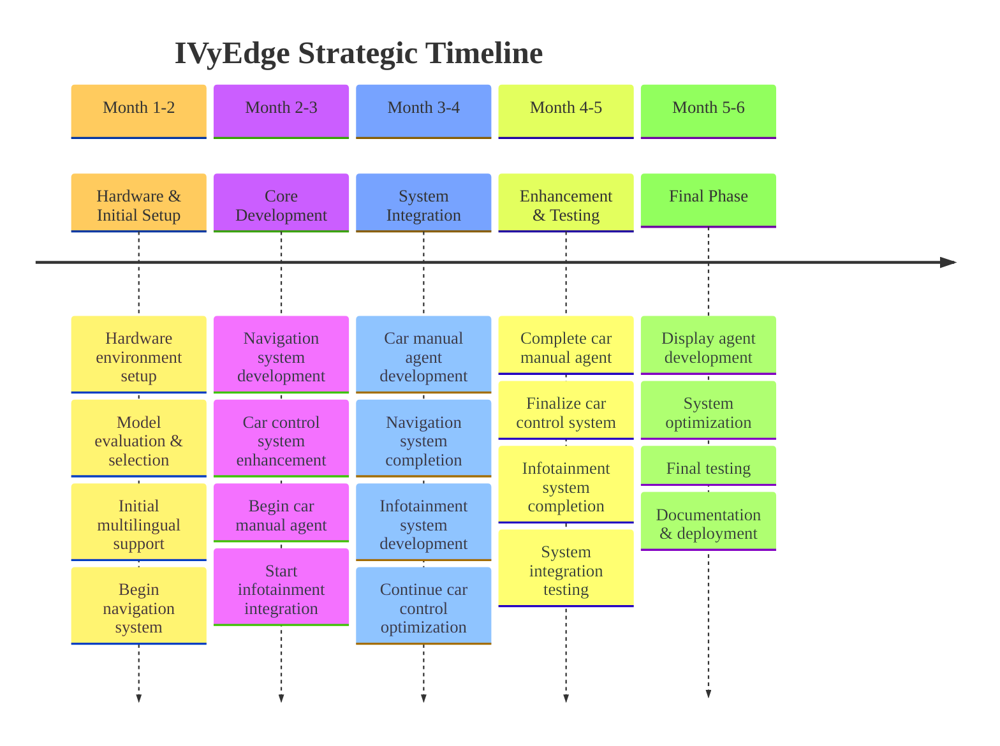

```mermaid
%%{init: {
  'theme': 'base',
  'themeVariables': {
    'taskBkgColor': '#7BB2E5',
    'taskTextColor': '#000000',
    'taskBorderColor': '#534fbc',
    'sectionBkgColor': '#f4f4f4',
    'activeTaskBkgColor': '#B784ED',
    'activeTaskBorderColor': '#534fbc',
    'activeTaskTextColor': '#000000',
    'critBkgColor': '#FFE44D',
    'critBorderColor': '#534fbc',
    'critTextColor': '#000000',
    'fontSize': '16px',
    'headerFontSize': '20px'
  }
}}%%
gantt
    title FPT's Proposal Schedule
    dateFormat MM
    axisFormat Month %m
    
    section AIC
    Hardware Setting            :active, aic1, 01, 02
    Multilingual Support        :active, aic2, 01, 03
    Car Manual Agent           :active, aic3, 03, 05
    
    section AIC + FA
    Navigation Agent           :crit, aicfa1, 02, 05
    Car Control Agent          :crit, aicfa2, 01, 06
    Infotainment Agent        :crit, aicfa3, 03, 06
    
    section FA
    Display Agent             :fa1, 02, 07
```

```mermaid
%%{init: {
    'theme': 'base', 
    'themeVariables': { 
        'fontSize': '24px',
        'fontFamily': 'trebuchet ms',
        'timelineTitleTextAlignment': 'left'
    },
    'timeline': {
        'padding': 50,
        'titleTopMargin': 25
    }
}}%%
timeline
    title IVyEdge Strategic Timeline
    section Month 1-2
        Hardware & Initial Setup : Hardware environment setup : Model evaluation & selection : Initial multilingual support : Begin navigation system
    section Month 2-3
        Core Development : Navigation system development : Car control system enhancement : Begin car manual agent : Start infotainment integration
    section Month 3-4
        System Integration : Car manual agent development : Navigation system completion : Infotainment system development : Continue car control optimization
    section Month 4-5
        Enhancement & Testing : Complete car manual agent : Finalize car control system : Infotainment system completion : System integration testing
    section Month 5-6
        Final Phase : Display agent development : System optimization : Final testing : Documentation & deployment
```

