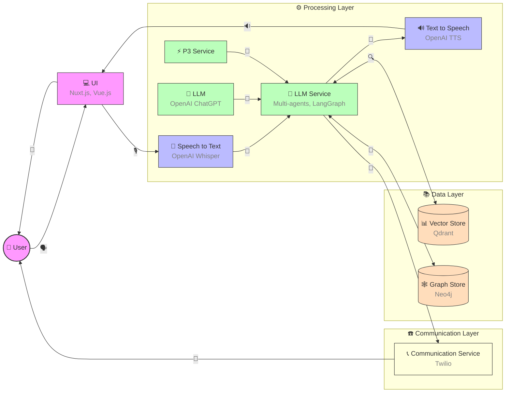

```mermaid
flowchart LR
    User((👤 User))
    UI["💻 UI<br><font color='gray' size='smaller'>Nuxt.js, Vue.js</font>"]
    STT["🎤 Speech to Text<br><font color='gray' size='smaller'>OpenAI Whisper</font>"]
    LLM_Service["🧠 LLM Service<br><font color='gray' size='smaller'>Multi-agents, LangGraph</font>"]
    GPT["🤖 LLM<br><font color='gray' size='smaller'>OpenAI ChatGPT</font>"]
    P3["⚡ P3 Service"]
    TTS["🔊 Text to Speech<br><font color='gray' size='smaller'>OpenAI TTS</font>"]
    Twilio["📞 Communication Service<br><font color='gray' size='smaller'>Twilio</font>"]
    VS[(📊 Vector Store<br><font color='gray' size='smaller'>Qdrant</font>)]
    GS[(🕸️ Graph Store<br><font color='gray' size='smaller'>Neo4j</font>)]
    
    User -->|🗣️| UI
    UI -->|🎙️| STT
    STT -->|📝| LLM_Service
    GPT -->|🔌| LLM_Service
    P3 -->|🔌| LLM_Service
    LLM_Service -->|📄| TTS
    TTS -->|🔉| UI
    UI -->|🎵| User
    
    %% Twilio integration
    LLM_Service -->|📄| Twilio
    Twilio -->|📱| User
    
    LLM_Service <-->|🔍| VS
    LLM_Service <-->|💾| GS
    
    subgraph "📚 Data Layer"
        VS
        GS
    end
    
    subgraph "⚙️ Processing Layer"
        STT
        GPT
        P3
        LLM_Service
        TTS
    end
    
    subgraph "☎️ Communication Layer"
        Twilio
    end
    
    %% UI Layer - Purple theme
    style User fill:#f9f,stroke:#333,stroke-width:2px
    style UI fill:#f9f,stroke:#333,stroke-width:1px
    
    %% Speech Processing - Blue theme
    style STT fill:#bbf,stroke:#333,stroke-width:1px
    style TTS fill:#bbf,stroke:#333,stroke-width:1px
    
    %% LLM Processing - Green theme
    style LLM_Service fill:#bfb,stroke:#333,stroke-width:1px
    style GPT fill:#bfb,stroke:#333,stroke-width:1px
    style P3 fill:#bfb,stroke:#333,stroke-width:1px
    
    %% Storage - Orange theme
    style VS fill:#fdb,stroke:#333,stroke-width:1px
    style GS fill:#fdb,stroke:#333,stroke-width:1px
    
    %% Communication - Yellow theme
    style Twilio fill:#ffd,stroke:#333,stroke-width:1px
```