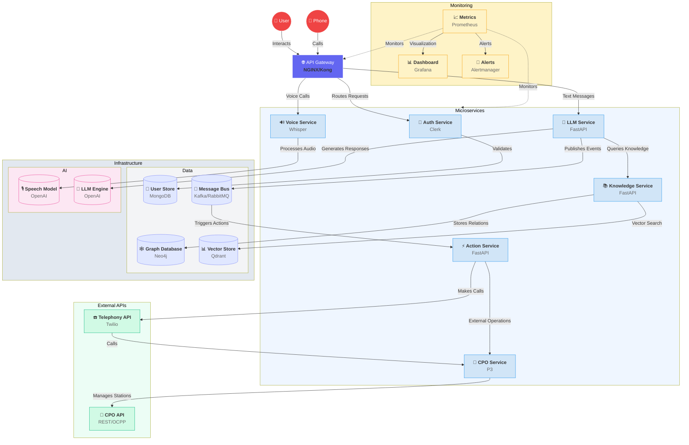

```mermaid
graph TD
    %% External entities
    User((👤 User)) -->|Interacts| APIGateway[🌐 API Gateway<br><font color='#333333' size='smaller'><b>NGINX/Kong</b></font>]
    Phone((📱 Phone)) -->|Calls| APIGateway
    
    %% Core gateway
    APIGateway -->|Routes Requests| AuthService[🔑 <b>Auth Service</b><br><font color='#666666' size='smaller'>Clerk</font>]
    APIGateway -->|Voice Calls| VoiceService[🔊 <b>Voice Service</b><br><font color='#666666' size='smaller'>Whisper</font>]
    APIGateway -->|Text Messages| LLMService[🧠 <b>LLM Service</b><br><font color='#666666' size='smaller'>FastAPI</font>]
    
    %% Service connections
    AuthService -->|Validates| MongoDB1[(💾 <b>User Store</b><br><font color='#666666' size='smaller'>MongoDB</font>)]
    VoiceService -->|Processes Audio| OpenLLM1[(🎙️ <b>Speech Model</b><br><font color='#666666' size='smaller'>OpenAI</font>)]
    
    %% Intelligence services
    LLMService -->|Generates Responses| OpenLLM2[(🤖 <b>LLM Engine</b><br><font color='#666666' size='smaller'>OpenAI</font>)]
    LLMService -->|Queries Knowledge| KnowledgeService[📚 <b>Knowledge Service</b><br><font color='#666666' size='smaller'>FastAPI</font>]
    LLMService -->|Publishes Events| EventBus[(📨 <b>Message Bus</b><br><font color='#666666' size='smaller'>Kafka/RabbitMQ</font>)]
    
    %% Data & Integration
    KnowledgeService -->|Stores Relations| GraphDB[(🕸️ <b>Graph Database</b><br><font color='#666666' size='smaller'>Neo4j</font>)]
    KnowledgeService -->|Vector Search| VectorDB[(📊 <b>Vector Store</b><br><font color='#666666' size='smaller'>Qdrant</font>)]
    
    %% Action service
    EventBus -->|Triggers Actions| ActionService[⚡ <b>Action Service</b><br><font color='#666666' size='smaller'>FastAPI</font>]
    ActionService -->|External Operations| CPOService[🔌 <b>CPO Service</b><br><font color='#666666' size='smaller'>P3</font>]
    CPOService -->|Manages Stations| CPOAPI[🚙 <b>CPO API</b><br><font color='#666666' size='smaller'>REST/OCPP</font>]
    
    %% New connection: Action Service to Telephony API, Telephony API to P3
    ActionService -->|Makes Calls| TwilioAPI[☎️ <b>Telephony API</b><br><font color='#666666' size='smaller'>Twilio</font>]
    TwilioAPI -->|Calls| CPOService
    
    %% Observability
    Prometheus[📈 <b>Metrics</b><br><font color='#666666' size='smaller'>Prometheus</font>] -.->|Monitors| APIGateway
    Prometheus -.->|Monitors| Services
    Prometheus -->|Visualization| Grafana[📊 <b>Dashboard</b><br><font color='#666666' size='smaller'>Grafana</font>]
    Prometheus -->|Alerts| Alertmanager[🚨 <b>Alerts</b><br><font color='#666666' size='smaller'>Alertmanager</font>]
    
    %% Service groups
    subgraph Services[Microservices]
        AuthService
        VoiceService
        LLMService
        KnowledgeService
        ActionService
        CPOService
    end
    
    subgraph Infrastructure[Infrastructure]
        subgraph DataLayer[Data]
            MongoDB1
            GraphDB
            VectorDB
            EventBus
        end

        subgraph AILayer[AI]
            OpenLLM1
            OpenLLM2
        end
    end
    
    subgraph Monitoring[Monitoring]
        Prometheus
        Grafana
        Alertmanager
    end
    
    subgraph ExternalAPIs[External APIs]
        TwilioAPI
        CPOAPI
    end
    
    %% Styling
    classDef gateway fill:#6366F1,stroke:#fff,stroke-width:1px,color:#fff
    classDef service fill:#D1E5F7,stroke:#2496ED,stroke-width:1px,color:#333
    classDef database fill:#E0E7FF,stroke:#818CF8,stroke-width:1px,color:#333
    classDef models fill:#FCE7F3,stroke:#EC4899,stroke-width:1px,color:#333
    classDef monitoring fill:#FEF3C7,stroke:#F59E0B,stroke-width:1px,color:#333
    classDef user fill:#EF4444,stroke:#fff,stroke-width:1px,color:#fff
    classDef external fill:#D1FAE5,stroke:#10B981,stroke-width:1px,color:#333
    
    class APIGateway gateway
    class AuthService,VoiceService,LLMService,KnowledgeService,ActionService,CPOService service
    class MongoDB1,GraphDB,VectorDB,EventBus database
    class OpenLLM1,OpenLLM2 models
    class Prometheus,Grafana,Alertmanager monitoring
    class User,Phone user
    class TwilioAPI,CPOAPI external
    
    %% Brighter backgrounds for subgraphs
    style DataLayer fill:#F3F4F6,color:#000
    style AILayer fill:#FCE7F3,color:#000
    style Infrastructure fill:#E2E8F0,color:#000
    style Services fill:#EFF6FF,color:#000
    style Monitoring fill:#FEF3C7,color:#000
    style ExternalAPIs fill:#ECFDF5,color:#000
```