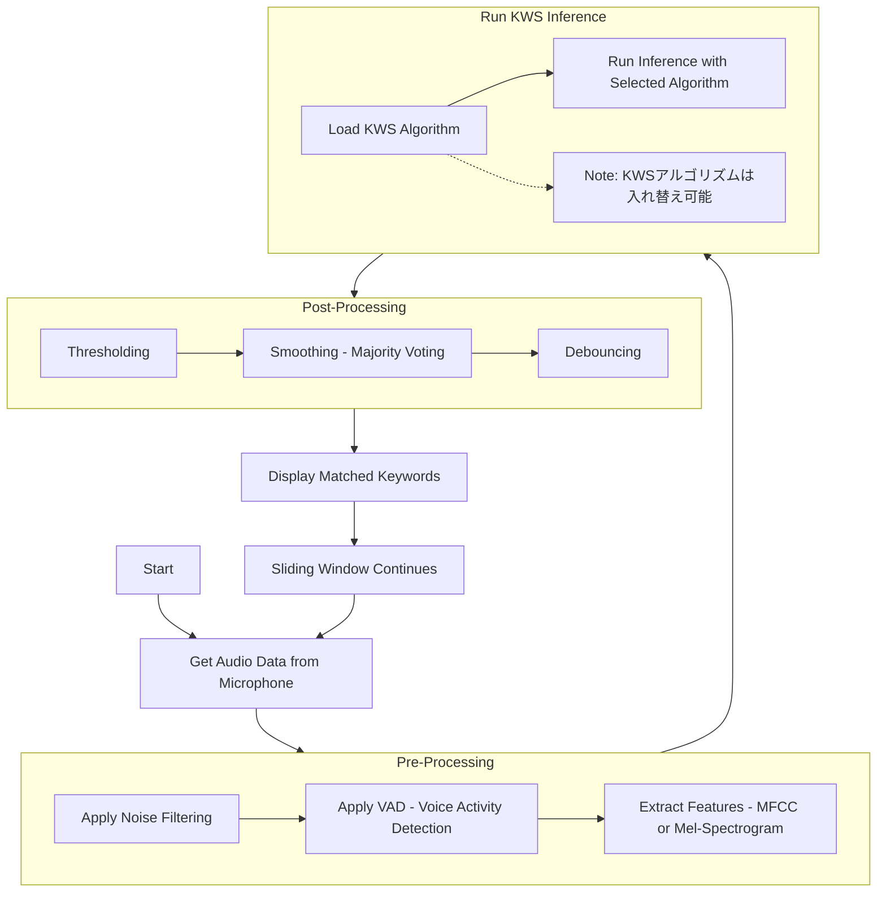
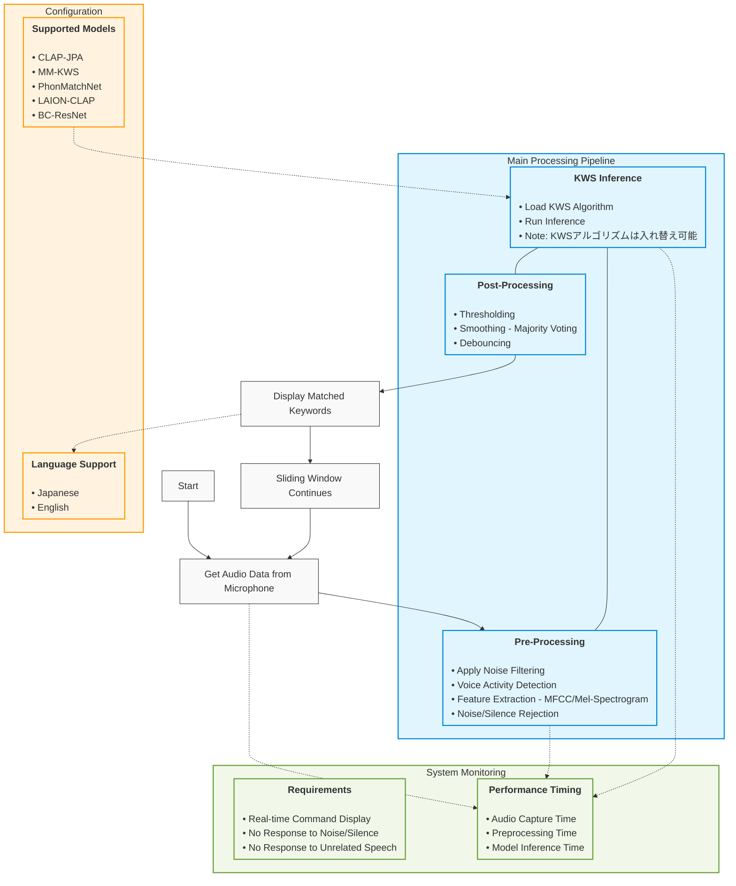

| Group | Item | Content |
|-------|------|----------|
| Demo Program Requirements | Demo Program Specifications | 1. Display recognized audio commands in real-time.  2. Show inference time for the following steps: - Audio capture from microphone - Preprocessing - Model inference  3. Ensure no response to noise, silence, or unrelated speech. |
| Language Support in Demo | Language Support in Demo | Support for multiple languages, including Japanese and English. |
| Overview | Output Format | Recognized commands (text or label). |
| | Project Objective | Execute a keyword spotting model on Jetson Orin AGX to recognize specific commands (words, 2-3 phrases). |
| | Model Base | Use one of CLAP-JPA, MM-KWS, PhonMatchNet, LAION-CLAP, or BC-ResNet. Consider switching if issues arise. |
| | Dataset | Use datasets that allow commercial use. Non-commercial datasets can be used if they significantly affect accuracy, but a comparison is required. |

