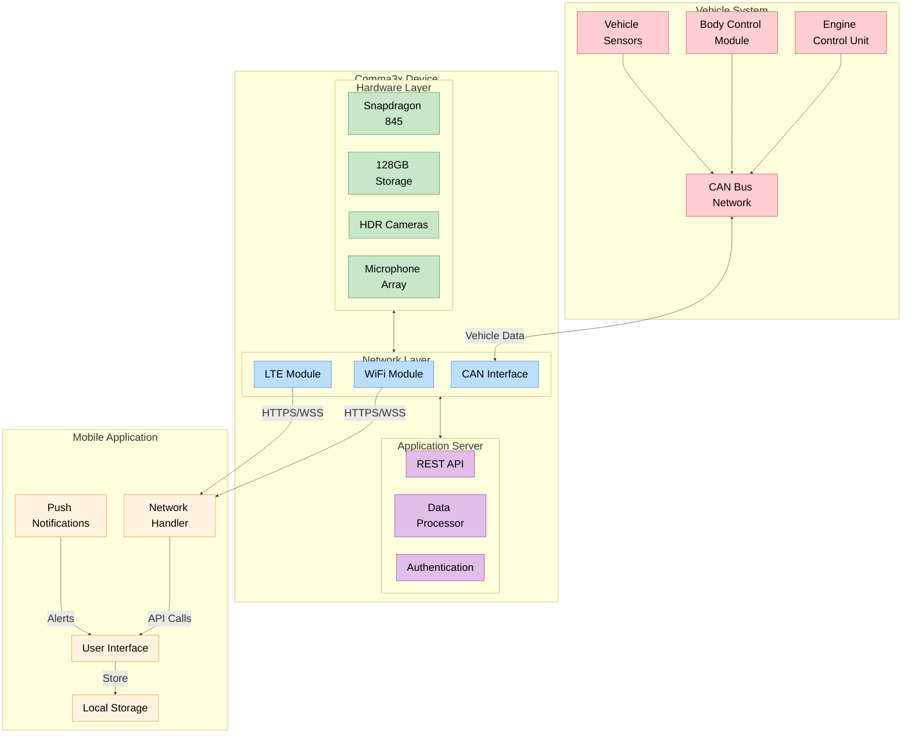

```mermaid
%%{init: {'theme': 'default', 'themeVariables': { 'fontSize': '30px', 'fontFamily': 'arial' }}}%%
flowchart TD
    %% Vehicle Systems
    subgraph VehicleSystem["Vehicle System"]
        direction TB
        ECU["Engine Control Unit"]
        BCM["Body Control Module"]
        Sensors["Vehicle Sensors"]
        CANBus["CAN Bus Network"]
        
        ECU & BCM & Sensors --> CANBus
    end

    %% Comma3x Device
    subgraph Comma3x["Comma3x Device"]
        direction TB
        
        subgraph Hardware["Hardware Layer"]
            CPU["Snapdragon 845"]
            Storage["128GB Storage"]
            Cameras["HDR Cameras"]
            Mic["Microphone Array"]
        end
        
        subgraph Network["Network Layer"]
            WiFi["WiFi Module"]
            LTE["LTE Module"]
            CAN["CAN Interface"]
        end
        
        subgraph AppServer["Application Server"]
            API["REST API"]
            DataProcessor["Data Processor"]
            Auth["Authentication"]
            %% Cache["Data Cache"]
        end

        %% Internal connections
        Hardware <--> Network
        Network <--> AppServer
    end

    %% Mobile Application
    subgraph MobileApp["Mobile Application"]
        direction TB
        UI["User Interface"]
        LocalStorage["Local Storage"]
        NetworkHandler["Network Handler"]
        Push["Push Notifications"]
    end

    %% External Connections
    CANBus <-->|"Vehicle Data"| CAN
    WiFi & LTE -->|"HTTPS/WSS"| NetworkHandler
    NetworkHandler -->|"API Calls"| UI
    UI -->|"Store"| LocalStorage
    Push -->|"Alerts"| UI

    %% Style Definitions
    classDef vehicle fill:#ffcdd2,stroke:#c62828,color:#000
    classDef hardware fill:#c8e6c9,stroke:#2e7d32,color:#000
    classDef network fill:#bbdefb,stroke:#1976d2,color:#000
    classDef server fill:#e1bee7,stroke:#7b1fa2,color:#000
    classDef mobile fill:#fff3e0,stroke:#f57c00,color:#000

    %% Apply styles
    class ECU,BCM,Sensors,CANBus vehicle
    class CPU,Storage,Cameras,Mic hardware
    class WiFi,LTE,CAN network
    class API,DataProcessor,Auth,Cache server
    class UI,LocalStorage,NetworkHandler,Push mobile
```