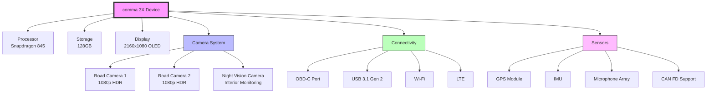
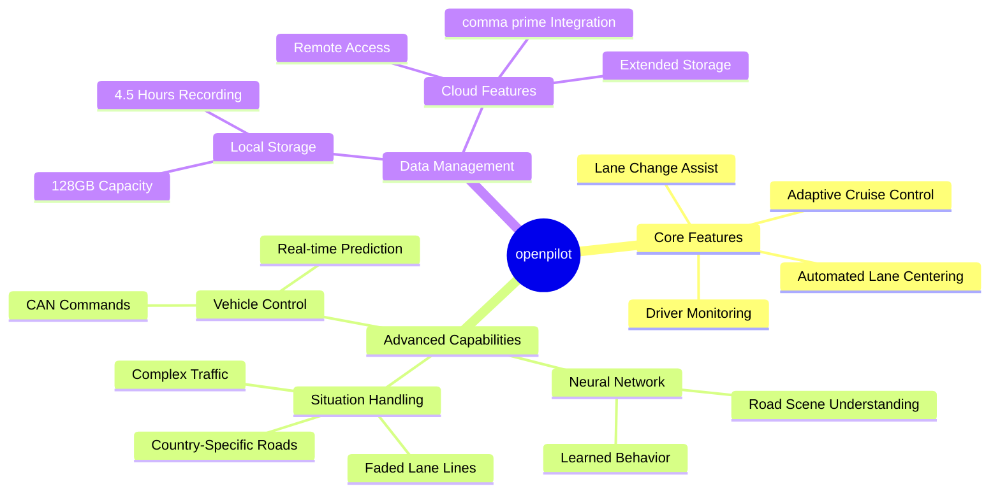
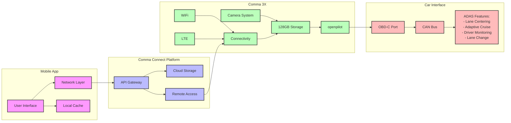
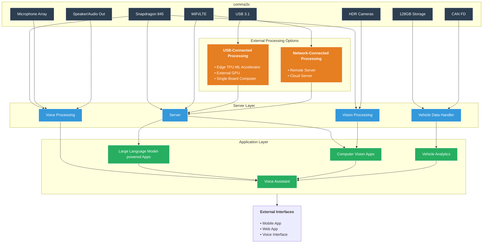

# comma 3X Technical Documentation

## Product Overview
The comma 3X is a purpose-built hardware device designed to run openpilot, an open-source advanced driver assistance system. With its advanced hardware capabilities and comprehensive sensor suite, it delivers enhanced driving assistance features across a wide range of compatible vehicles.

### Market Position
- Top-rated ADAS system (Consumer Reports)
- 92% customer retention rate
- 100+ million miles driven
- 56% engagement rate during drives
- 10,000+ active users worldwide
- 450+ active contributors

### Pricing and Package
- Base Unit: $1150
- Monthly Payment Option: $104/month through Affirm
- Vehicle Harness: $99 (not required when upgrading from previous comma device)
- Shipping: Free UPS ground shipping (US), $30 flat rate international
- Optional UPS 2-day Air upgrade: $25

### Package Contents
- comma 3X device
- 1.5ft right-angle OBD-C cable
- Two standard mounts (8-degree mounts for specific vehicles)
- Alcohol wipe for installation

## Technical Specifications

### Core Hardware
- Processor: Qualcomm Snapdragon 845
- Storage: 128GB built-in storage (~4.5 hours of footage)
- Display: 2160x1080 OLED display

### Camera System
- Configuration: Triple HDR camera setup
  - Two dedicated road-monitoring cameras
  - One specialized night-vision camera for interior monitoring
- Resolution: 3x 1080p cameras
- Dynamic Range: 140 dB for exceptional light handling
- Coverage: 
  - Dual-cam system for 360° vision
  - Narrow cam optimized for distant object detection
- Night Vision: IR LED array for interior monitoring

### Connectivity and Sensors
- Vehicle Interface: OBD-C port (USB-C with CAN capabilities)
- Additional Port: USB 3.1 Gen 2
- Wireless: LTE and Wi-Fi support
- GPS: High-precision GPS module
- Motion Detection: Integrated IMU (Inertial Measurement Unit)
- Audio: Built-in microphone array
- CAN Support: Native CAN FD support without additional hardware

## Software Integration

### Operating System
- Ships without pre-installed software
- Compatible with openpilot and community-supported forks
- Requires separate software installation post-hardware setup

### Core Features
- Automated Lane Centering (ALC)
- Adaptive Cruise Control (ACC)
- Driver Monitoring System
- Lane Change Assist

### Advanced Capabilities
- State-of-the-art neural network for road scene understanding
- Learned behavior from millions of miles of driving data
- Advanced handling of nuanced situations:
  - Faded lane lines
  - Various country-specific road conditions
  - Complex traffic scenarios
- Real-time road scene prediction
- Automated vehicle control through CAN commands

## Vehicle Compatibility and Installation

### Vehicle Support
- Compatible with 275+ vehicle models
- Major supported manufacturers:
  - Toyota
  - Hyundai
  - Honda
  - Many other brands
- Plug-and-play integration
- No permanent modifications required

### Installation Process
- Installation time: 15-30 minutes average
- Mount positioning: Centered on windshield below trim
- Installation steps:
  1. Clean windshield with included alcohol wipe
  2. Ensure mount top is visible from driver's seat
  3. Apply mount with 3M tape
  4. Press firmly from center to edges to prevent bubbles
  5. Allow 48-hour curing time before device installation

## Data Management and Services

### Local Storage
- 128GB onboard storage
- Approximately 4.5 hours of continuous recording
- Local drive footage review capability

### Cloud Integration
- One free month of comma prime included
- Optional comma prime subscription for extended storage
- Cloud video storage (1-year with subscription)
- Remote access through comma connect platform
- Prime features:
  - Optional for core functionality
  - Can be activated/cancelled anytime
  - Provides extended cloud storage
  - Access to additional features

## Legal and Insurance

### Warranty Information
- 1-year limited hardware warranty
- Covers manufacturing defects
- Protected under Magnuson-Moss Warranty Act
- International considerations:
  - No return shipping labels for international devices
  - Customer responsible for return shipping costs

### Insurance Considerations
- Compatible with most insurance providers
- Growing recognition of ADAS safety benefits
- No known cases of coverage rejection
- Recommended to contact insurance provider directly

### Installation Compliance
- Subject to state and local laws
- User responsible for legal compliance
- Must not obstruct driver's view
- No permanent vehicle modifications required

## Community and Development

### Community Integration
- Open source development model
- 450+ active contributors
- Collaborative development through GitHub
- Community features:
  - Pull request system
  - Issue tracking
  - Bug reporting
  - New vehicle support
  - Custom fork development
- Strong emphasis on code quality and safety

## Support and Returns

### Return Policy
- 30-day money-back trial
- Full refund available within trial period
- Return shipping covered in US ($9.99 deduction if using provided label)
- International returns:
  - Customer responsible for shipping costs
  - Tracking and insurance recommended
  - Must initiate within 30 days of delivery

---

## Diagrams

### Specs

```mermaid
graph TD
    %% Main Device
    device["`
        <i class='fa fa-microchip'></i> <b>Comma 3X Core</b>
        <div style='text-align:left; white-space:nowrap;'>
        • Snapdragon 845 Processor
        • 128GB Built-in Storage
        • 2160x1080 OLED Display
        </div>
    `"]

    %% Vision System
    vision["`
        <i class='fa fa-camera'></i> <b>Vision System</b>
        <div style='text-align:left; white-space:nowrap;'>
        • 2x Road Monitoring Cameras
        • Night Vision Interior Camera
        • 1080p Resolution
        • 140dB Dynamic Range
        </div>
    `"]

    %% Connectivity
    connectivity["`
        <i class='fa fa-plug'></i> <b>Connectivity & I/O</b>
        <div style='text-align:left; white-space:nowrap;'>
        • OBD-C Port with CAN
        • USB 3.1 Gen 2 Port
        • LTE & Wi-Fi Support
        • Native CAN FD Integration
        </div>
    `"]

    %% Sensors
    sensors["`
        <i class='fa fa-compass'></i> <b>Sensor Suite</b>
        <div style='text-align:left; white-space:nowrap;'>
        • High-precision GPS Module
        • Inertial Measurement Unit
        • Microphone Array
        • Motion Detection
        </div>
    `"]

    %% ADAS Features
    adas["`
        <i class='fa fa-car'></i> <b>ADAS Capabilities</b>
        <div style='text-align:left; white-space:nowrap;'>
        • Automated Lane Centering
        • Adaptive Cruise Control
        • Driver Monitoring System
        • Lane Change Assist
        </div>
    `"]

    %% AI System
    ai["`
        <i class='fa fa-brain'></i> <b>AI Features</b>
        <div style='text-align:left; white-space:nowrap;'>
        • Neural Network Processing
        • Real-time Scene Prediction
        • Learned Driving Behaviors
        • Complex Scenario Handling
        </div>
    `"]

    %% Data Management
    data["`
        <i class='fa fa-database'></i> <b>Data Management</b>
        <div style='text-align:left; white-space:nowrap;'>
        • 4.5h Continuous Recording
        • Local Footage Review
        • Cloud Storage (with Prime)
        • Remote Access Capability
        </div>
    `"]

    %% Relationships with arrow styling
    device --> |Hardware| vision
    device --> |Interface| connectivity
    device --> |Input| sensors
    device --> |Features| adas
    device --> |Intelligence| ai
    device --> |Storage| data

    %% Styling
    classDef default fill:#f9f9f9,stroke:#333,stroke-width:1px
    classDef core fill:#f9f,stroke:#333,stroke-width:2px,color:#333
    classDef vision fill:#bfb,stroke:#333,color:#333
    classDef io fill:#fbb,stroke:#333,color:#333
    classDef sensor fill:#bbf,stroke:#333,color:#333
    classDef software fill:#fbf,stroke:#333,color:#333
    classDef data fill:#bff,stroke:#333,color:#333

    class device core
    class vision vision
    class connectivity io
    class sensors sensor
    class adas,ai software
    class data data

    %% Link styling
    linkStyle default stroke:#333,stroke-width:2px;
```



### Components



### Connectivity

```mermaid

```

### Data Flow

```mermaid
sequenceDiagram
    participant V as Vehicle
    participant C3X as comma 3X
    participant Buffer as Buffer Memory
    participant Storage as Local Storage
    participant Cloud as Cloud Services
    participant App as Mobile App

    Note over V,App: Real-time Data Flow
    
    par Vehicle Data Collection
        V->>C3X: CAN FD Data Stream
        V->>C3X: Sensor Data
        V->>C3X: ECU Status
    end

    C3X->>Buffer: Raw Data Storage
    
    par Real-time Processing
        C3X->>C3X: Scene Prediction
        C3X->>C3X: Command Generation
        C3X->>C3X: Status Analysis
    end

    C3X->>Storage: Processed Data Storage
    
    par Multi-channel Distribution
        C3X->>Cloud: Upload via WiFi/LTE
        C3X->>App: Real-time Updates
    end
    
    Note over V,App: Command Flow
    
    App->>Cloud: Issue Command
    Cloud->>C3X: Forward Command
    C3X->>Buffer: Command Validation
    C3X->>V: Execute Command
    V-->>C3X: Command Status
    
    Note over V,App: Storage Management
    
    loop Every 5 minutes
        C3X->>Storage: Check Storage Space
        alt Storage > 90%
            Storage->>Cloud: Backup Oldest Data
            Storage->>Storage: Clear Backed Up Data
        end
    end
    
    Note over V,App: Error Handling
    
    alt Connection Lost
        C3X->>Buffer: Store Data
        C3X->>C3X: Switch to LTE
        C3X->>Cloud: Retry Connection
    end
```

### Features





### Custom App



---

I want to create diagram to show that I (developer) can ultilize comma3x for further develop custom app and deploy on it, for example voice assistant. I write write code and deploy a server inside comma3x for user can interact through voice and for mobile app can interact through APIs